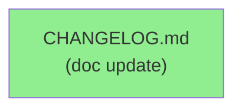
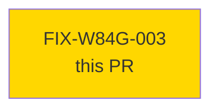
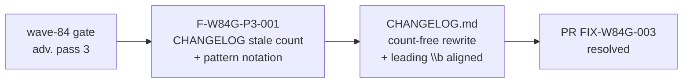

## Finding: F-W84G-P3-001 — CHANGELOG entry count-free + pattern notation alignment

**Mode:** maintenance (doc-only fix)
**Branch:** `fix/w84g-changelog-currency`
**Files changed:** `CHANGELOG.md` only — no `src/`, `Cargo.toml`, or `bin/` changes.
The `changelog-gate` CI job does **not** fire for doc-only changes; this PR is exempt.

---

### What this fixes

Wave-84 gate adversarial review (pass 3) raised finding **F-W84G-P3-001** against the
STORY-176 `[Unreleased]` CHANGELOG entry:

1. **Count-free self-test summary** — The previous entry read:
   > "Self-test: 91 passed, 0 failed (`bin/test_check_green_doc_tense.py`)."
   This hard-codes a test count that re-stales on every new test addition. PR #429
   already bumped the count to 93, making the `[Unreleased]` entry immediately stale.
   The entry is rewritten to describe the result invariant instead of the count:
   > "`bin/test_check_green_doc_tense.py` (all known-bad patterns flagged, all
   > known-good allowlist forms not)."
   This phrasing is permanently accurate regardless of how many test cases are added.

2. **Pattern notation alignment (patterns 26 and 28)** — The CHANGELOG documented
   the regex patterns without their leading `\b` word-boundary anchor:
   - Pattern 26 was written as `` `skeleton compiles?\b` `` — the shipped code uses
     `` `\bskeleton compiles?\b` `` (leading anchor excludes "exoskeleton", "microskeleton").
   - Pattern 28 was written as `` `(are|is) (currently) compile-only` `` — the shipped
     code uses `` `\b(are|is) (currently) compile-only` ``.
   Both entries now match the actual regex literals in `bin/check-green-doc-tense`.

No behavioral changes. No tests added or modified. No src/bin/Cargo.toml touched.

---

### Architecture Changes

No architectural changes. `CHANGELOG.md` documentation update only.

### Story Dependencies

No upstream PR dependencies. Standalone doc fix.

## Spec Traceability

Finding F-W84G-P3-001 from wave-84 gate adversarial pass 3. No BC/AC chain — this is
a doc-currency fix, not a new behavioral contract.

---

## Demo Evidence

N/A — CHANGELOG-only doc fix. No executable behavior changed; no demo recording required
per wave-84 gate dispatch (AUTHORIZE_MERGE=NO, demo evidence not applicable for doc fixes).

---

## Test Evidence

CHANGELOG-only change. No tests added, modified, or removed.
All existing CI checks (test, clippy, fmt, changelog-gate, action-pin-gate,
semantic-PR) are expected to pass unchanged.

### Security Review

N/A — documentation change only. No code paths, no data handling, no dependencies.

### Holdout Evaluation

N/A — evaluated at wave gate (wave-84 gate pass 3 finding triage).

### Adversarial Review

Finding F-W84G-P3-001 originated from wave-84 gate pass 3 adversarial review.
This PR is the resolution. No further adversarial pass required for a doc-only fix.

### Risk Assessment

- **Blast radius:** Zero — `CHANGELOG.md` is not parsed or executed.
- **User impact:** None.
- **Risk level:** LOW.

### Pre-Merge Checklist

- [ ] All CI status checks passing
- [x] No src/bin/Cargo.toml changes (changelog-gate exempt)
- [x] No security findings (doc-only)
- [x] Finding F-W84G-P3-001 addressed: count-free + pattern notation aligned
- [ ] Human merge authorization (AUTHORIZE_MERGE=NO per DF-MERGE-AUTH-CLASSIFIER-001)
