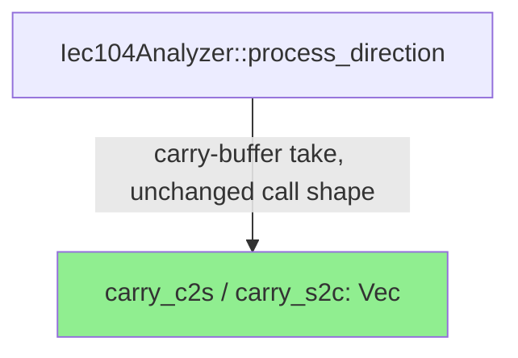
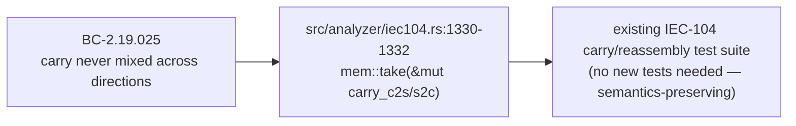

## Fix: clippy::drain_collect gate-fix (develop-baseline CI)

**Finding:** CI gate breakage — `clippy::drain_collect` now fires as a `-D warnings`
error under the rolled `dtolnay/rust-toolchain@stable` (rustc/clippy 1.98.1). This
lint was not previously active/deny-level under the older resolved stable toolchain.
It blocked CI on **every** PR into `develop`, including STORY-182 PR #460.

**Type:** develop-baseline CI gate-fix (not a story; no `FIX-P[phase]-NNN` id —
CI-toolchain-drift class, precedent PR #439 for the same class of gate break).

**Severity:** HIGH (blocks all PRs into develop) / trivial code risk (mechanical,
semantics-preserving change).

### What Changed

In `src/analyzer/iec104.rs` (IEC-104 carry-buffer handling, BC-2.19.025 invariant 1),
replaced:

```rust
state.carry_c2s.drain(..).collect()
state.carry_s2c.drain(..).collect()
```

with:

```rust
std::mem::take(&mut state.carry_c2s)
std::mem::take(&mut state.carry_s2c)
```

This is exactly clippy's own suggested fix for `clippy::drain_collect`: draining an
entire `Vec` and collecting into a same-typed `Vec` is equivalent to taking the buffer
and leaving an empty `Vec` in its place, but `mem::take` avoids the drain/collect
allocation-and-iteration overhead. No behavioral change: both forms leave
`state.carry_c2s` / `state.carry_s2c` empty afterward and produce a `Vec<u8>` with the
prior contents. Added the corresponding `[Unreleased]` CHANGELOG entry
(CHANGELOG.md obligation, AC-158-001 / PG-W71-CHANGELOG, since `src/` is touched).

Diff is 2 files: `src/analyzer/iec104.rs` (2 lines changed) and `CHANGELOG.md`
(7 lines added).

### Architecture Changes

No architectural change. This is a mechanical, local substitution within a single
existing function (IEC-104 carry-buffer assembly, `src/analyzer/iec104.rs`); no
component, module boundary, or dependency graph is affected.



### Story Dependencies

N/A — this is a develop-baseline CI gate-fix, not a story. It has no `depends_on`
entry and blocks nothing except CI itself; it does not sit in any story's
dependency graph. Precedent: PR #439 (same gate-fix class, no story linkage).

### Spec Traceability

N/A — no behavioral contract changed. The touched code implements BC-2.19.025
(carry-buffer invariant: carries are never mixed across directions) and
BC-2.19.026 (frame-walk postconditions); this fix does not alter either contract's
behavior, only the internal Rust idiom used to empty-and-take the buffer.



### Demo Evidence

N/A — internal, non-behavior-changing refactor (transparent fix per
`fix-pr-delivery` skill's demo-conditional rule: only behavior-changing fixes
require a demo). No output, CLI flag, API response, or user-observable behavior
changes.

### Why

CI's `dtolnay/rust-toolchain@stable` action tracks the rolling stable channel (per
CLAUDE.md's documented exemption from SHA-pinning — the action's purpose is to track
the current stable channel). The channel has rolled to rustc/clippy 1.98.1, which
promotes `clippy::drain_collect` to a warning that `-D warnings` (CI's `RUSTFLAGS`)
turns into a hard error. This is the same class of gate break fixed by precedent PR
#439 (`test(wave-85): update ITI diverse e2e expectations for timed-command detection
(gate fix)`) — an unpinned-toolchain drift, not a code regression. Fixing it here
restores green CI for all in-flight and future PRs into `develop`.

## Test Evidence

Verified locally under the rolled toolchain (rustc/clippy 1.98.1) prior to opening
this PR:
- [x] `cargo clippy --all-targets -- -D warnings` — clean (0 warnings/errors)
- [x] `cargo test --all-targets` — all tests green (no regressions; behavior-preserving
      change, no new tests required)
- [x] `cargo fmt --check` — clean
- [ ] Demo recorded — not applicable (internal refactor, not user-observable behavior
      per fix-pr-delivery's "transparent fixes" rule)

CI status on this PR's own HEAD will be confirmed live (step 6 of the PR lifecycle)
and is not asserted here beyond the orchestrator-verified local run above.

### Risk Assessment

- **Blast radius:** `src/analyzer/iec104.rs` only, within the IEC-104 carry-buffer
  assembly path (BC-2.19.025 / BC-2.19.026, ADR-013 Decision 3). No public API,
  no protocol-parsing logic, no dependency changes.
- **Behavioral risk:** None expected — `mem::take` and `drain(..).collect()` are
  semantically identical for a `Vec<T>` source into a `Vec<T>` destination.
- **Risk level:** LOW.

### Pre-Merge Checklist

- [x] CHANGELOG `[Unreleased]` entry added (src/ touched → AC-158-001 obligation)
- [ ] CI green on this PR's HEAD (pending — see CI status in PR)
- [ ] pr-reviewer fresh-eyes APPROVE (pending)
- [ ] security-reviewer classification (pending — expected trivial/no new surface)
- [ ] Human merge authorization (per DF-MERGE-AUTH-CLASSIFIER-001 — human executes
      merges for this wave's work; pr-manager will HALT to human once green+reviewed)
