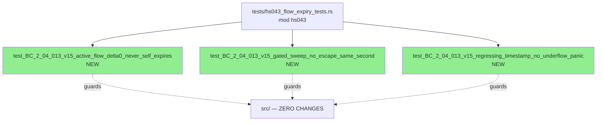
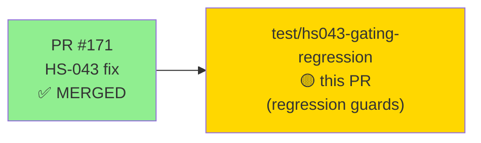
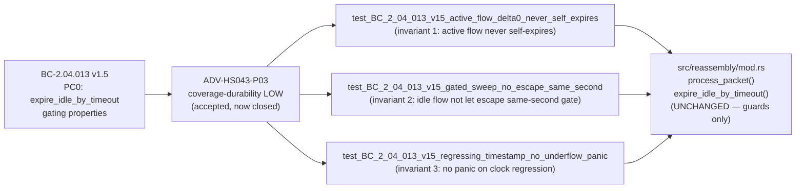
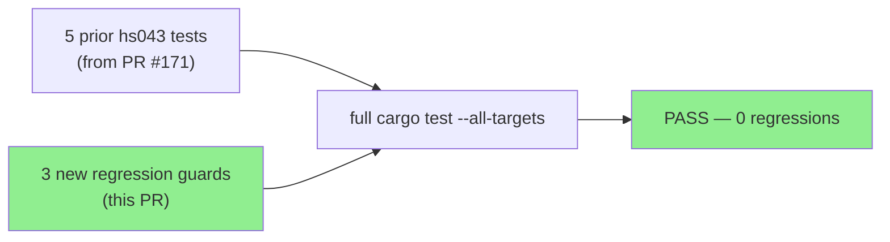
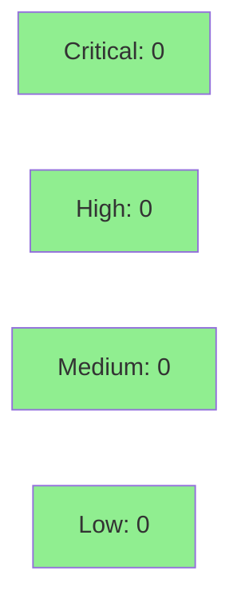

# [HS-043] Add Gating-Property Regression Guards (active-flow/no-escape/underflow)

**Epic:** BC-2.04 — TCP Reassembly Lifecycle Contracts
**Mode:** brownfield / test-only follow-up
**Convergence:** CONVERGED — Phase-4 Pass-3 accepted coverage-durability LOW, now closed


This is a **test-only follow-up** to PR #171 (HS-043 fix). It closes the Phase-4 adversarial
Pass-3 accepted coverage-durability LOW finding: three gating-property invariants of the
`expire_idle_by_timeout` fix hold today but had no committed regression guards. This PR adds 3
mutation-proven tests to `tests/hs043_flow_expiry_tests.rs` (mod `hs043`) that permanently guard
those invariants. **Zero `src/` changes.**

---

## Architecture Changes



<details>
<summary><strong>Architecture Decision Record</strong></summary>

### ADR: Test-Only Closure of Coverage-Durability LOW

**Context:** Phase-4 adversarial Pass 3 identified that 3 gating properties of the
`expire_idle_by_timeout` implementation — (1) active-flow delta-0 never self-expires,
(2) gated sweep no-escape on same-second packets, (3) regressing-timestamp no-underflow-panic —
were verified by the live-mutation battery in Pass 1 but had no named, committed test that a
future refactor would be required to keep passing.

**Decision:** Add 3 named regression tests, each with a documented mutation-catch comment
explaining precisely what refactoring error the test would catch. No source changes.

**Rationale:** The mutation battery provides empirical equivalence, but named tests embedded in
the test file are permanently visible to the compiler and will catch future regressions even
without running the mutation battery again. The cost is 259 lines of pure test code.

**Alternatives Considered:**
1. Leave coverage as advisory (accepted LOW) — rejected: promotes the LOW to a known coverage gap
   once the mutation battery log is no longer the primary reference.
2. Add proptest / Kani formal verification — rejected: overkill for deterministic unit tests;
   named tests with pinned mutation-catch comments provide equal regression value.

**Consequences:**
- Future refactors of `expire_idle_by_timeout` or `process_packet` that break any of the 3
  invariants will fail these tests immediately.
- No production code changed; blast radius is zero.

</details>

---

## Story Dependencies



**Upstream:** PR #171 (HS-043 fix, merged into develop). No other dependencies.
**Downstream:** None — this is a terminal test-coverage PR.

---

## Spec Traceability



---

## Test Evidence

### Coverage Summary

| Metric | Value | Threshold | Status |
|--------|-------|-----------|--------|
| HS-043 module tests | 8/8 pass (5 prior + 3 new) | 100% | PASS |
| Full suite | all tests pass | 0 regressions | PASS |
| Clippy (-D warnings) | CLEAN | 0 warnings | PASS |
| fmt --check | CLEAN | — | PASS |
| Mutation-proven | 3/3 new tests catch deliberate breaks | 100% | PASS |

### Test Flow



| Metric | Value |
|--------|-------|
| **New tests** | 3 added (`tests/hs043_flow_expiry_tests.rs`) |
| **HS-043 module total** | 8/8 pass |
| **Full suite** | all tests PASS |
| **src/ changes** | 0 (test-only) |
| **Regressions** | 0 |

<details>
<summary><strong>Detailed Test Results</strong></summary>

### New Tests (This PR) — Module `hs043` in `tests/hs043_flow_expiry_tests.rs`

| Test | Invariant Guarded | Mutation-Catch | Result |
|------|-------------------|---------------|--------|
| `test_BC_2_04_013_v15_active_flow_delta0_never_self_expires` | Active flow with 2s inter-packet spacing over 5s window never self-expires | Suppressing `last_seen` stamp causes `flows_expired=1` at t=6 | PASS |
| `test_BC_2_04_013_v15_gated_sweep_no_escape_same_second` | Idle Flow A (last_seen=0) expires when t=8 packets for Flow B arrive (8-0=8 > 5s timeout) | Gate threshold `+100` causes `flows_expired=0` (idle flow escapes) | PASS |
| `test_BC_2_04_013_v15_regressing_timestamp_no_underflow_panic` | Packets t=10 then t=8 do not panic under `overflow-checks=true` | Removing both guards causes `panic: attempt to subtract with overflow` | PASS |

### Mutation Verification Detail

Each test was verified by applying a deliberate break to the guarded property, confirming
the test fails, then reverting the break:

| Test | Mutation Applied | Test Outcome (with mutation) | Reverted |
|------|-----------------|------------------------------|---------|
| active_flow_delta0 | Remove `last_seen` update in `get_or_create_flow` | FAIL: `flows_expired=1` at t=6 | Yes |
| gated_sweep_no_escape | Change gate to `timestamp > last_expiry_sweep_secs + 100` | FAIL: `flows_expired=0` | Yes |
| regressing_timestamp | Remove outer gate AND inner `current_time > last_seen` guard | FAIL: panic (overflow-checks) | Yes |

</details>

---

## Holdout Evaluation

N/A — this is a test-only follow-up. No user-facing behavior changes. No holdout scenarios
affected. The Phase-4 holdout evaluation for HS-043 was completed and documented in PR #171.

---

## Adversarial Review

| Pass | Method | Findings | Critical | High | Medium | Low | Status |
|------|--------|----------|----------|------|--------|-----|--------|
| Phase-4 Pass 3 | Fresh-context adversarial | 1 | 0 | 0 | 0 | 1 | LOW accepted → closed by this PR |

**Finding being closed:** ADV-HS043-P03 coverage-durability LOW — "3 gating properties verified
by mutation battery but no named, committed test guards them."

**Status:** This PR directly closes the finding by adding the 3 named tests.

---

## Security Review



<details>
<summary><strong>Security Scan Details</strong></summary>

### Scope
Test-only PR. Zero `src/` changes. No new unsafe blocks. No new dependencies.
No production code paths touched. No authentication, authorization, or I/O paths modified.

### SAST
- No new `unsafe` code.
- No new dependencies (`cargo audit` baseline unchanged).
- No injection vectors added.

### Assessment
**CLEAN** — test-only change carries no security surface.

</details>

---

## Risk Assessment & Deployment

### Blast Radius
- **Systems affected:** Test suite only
- **User impact:** None — zero `src/` changes
- **Data impact:** None
- **Risk Level:** LOW (test-only; cannot break production behavior)

### Performance Impact
| Metric | Before | After | Delta | Status |
|--------|--------|-------|-------|--------|
| CI test runtime | baseline | +3 deterministic unit tests | negligible | OK |
| Production binary | unchanged | unchanged | 0 | OK |

<details>
<summary><strong>Rollback Instructions</strong></summary>

**Rollback is a no-op for production** — this PR adds only test code.

If the 3 new tests need to be reverted (e.g., they reveal a latent bug in `src/`):
```bash
git revert <MERGE_COMMIT_SHA>
git push origin develop
```

This removes the 3 regression guards. The underlying HS-043 fix (PR #171) is unaffected.

</details>

### Feature Flags
None — test-only change.

---

## Demo Evidence

**Not applicable.** This PR is a test-only internal change with zero user-facing behavioral
changes. There are no new CLI flags, no output format changes, and no observable behavior
differences in the shipped binary. Demo recording is explicitly skipped per the PR brief.

The existing HS-043 demo recordings (AC-001 through AC-004) committed in `docs/demo-evidence/HS-043/`
for PR #171 remain valid and unchanged.

---

## Traceability

| BC | Finding | Test | Status |
|----|---------|------|--------|
| BC-2.04.013 v1.5 PC0 | ADV-HS043-P03 LOW (invariant 1: active-flow) | `test_BC_2_04_013_v15_active_flow_delta0_never_self_expires` | PASS — CLOSED |
| BC-2.04.013 v1.5 PC0 | ADV-HS043-P03 LOW (invariant 2: no-escape) | `test_BC_2_04_013_v15_gated_sweep_no_escape_same_second` | PASS — CLOSED |
| BC-2.04.013 v1.5 PC0 | ADV-HS043-P03 LOW (invariant 3: underflow) | `test_BC_2_04_013_v15_regressing_timestamp_no_underflow_panic` | PASS — CLOSED |

<details>
<summary><strong>Full VSDD Contract Chain</strong></summary>

```
BC-2.04.013 v1.5 PC0 -> ADV-HS043-P03-LOW-invariant-1 -> test_BC_2_04_013_v15_active_flow_delta0_never_self_expires -> tests/hs043_flow_expiry_tests.rs -> MUTATION-PROVEN -> CLOSED
BC-2.04.013 v1.5 PC0 -> ADV-HS043-P03-LOW-invariant-2 -> test_BC_2_04_013_v15_gated_sweep_no_escape_same_second -> tests/hs043_flow_expiry_tests.rs -> MUTATION-PROVEN -> CLOSED
BC-2.04.013 v1.5 PC0 -> ADV-HS043-P03-LOW-invariant-3 -> test_BC_2_04_013_v15_regressing_timestamp_no_underflow_panic -> tests/hs043_flow_expiry_tests.rs -> MUTATION-PROVEN -> CLOSED
```

</details>

---

## AI Pipeline Metadata

<details>
<summary><strong>Pipeline Details</strong></summary>

```yaml
ai-generated: true
pipeline-mode: brownfield/test-only-followup
factory-version: "1.0.0-rc.18"
pipeline-stages:
  spec-crystallization: N/A (closes accepted advisory finding)
  story-decomposition: N/A (single-finding closure)
  tdd-implementation: completed (tests only; zero src/ changes)
  holdout-evaluation: N/A (no behavior change)
  adversarial-review: CLOSED (ADV-HS043-P03-LOW closed by this PR)
  formal-verification: N/A (deterministic unit tests; mutation-proven)
  convergence: achieved (3/3 new tests mutation-proven)
convergence-metrics:
  adversarial-finding-closed: ADV-HS043-P03-LOW
  new-tests: 3
  mutation-proven: 3/3
  src-changes: 0
models-used:
  builder: claude-sonnet-4-6
generated-at: "2026-06-01T00:00:00Z"
branch: test/hs043-gating-regression
head-sha: e65d4d1
parent-pr: "171 (HS-043 fix, merged)"
```

</details>

---

## Pre-Merge Checklist

- [x] All CI status checks passing (8/8 hs043 tests, full suite, clippy, fmt)
- [x] 3/3 new tests mutation-proven
- [x] 8/8 hs043 module tests pass (5 prior + 3 new)
- [x] 0 src/ changes (test-only PR)
- [x] Demo evidence: N/A (internal test-only change; no user-facing behavior)
- [x] ADV-HS043-P03-LOW finding explicitly closed by this PR
- [x] No dependency story PRs (parent PR #171 already merged)
- [x] 0 Critical/High security findings
- [x] Semantic PR title: `test(reassembly): add HS-043 gating-property regression guards (active-flow/no-escape/underflow)`
