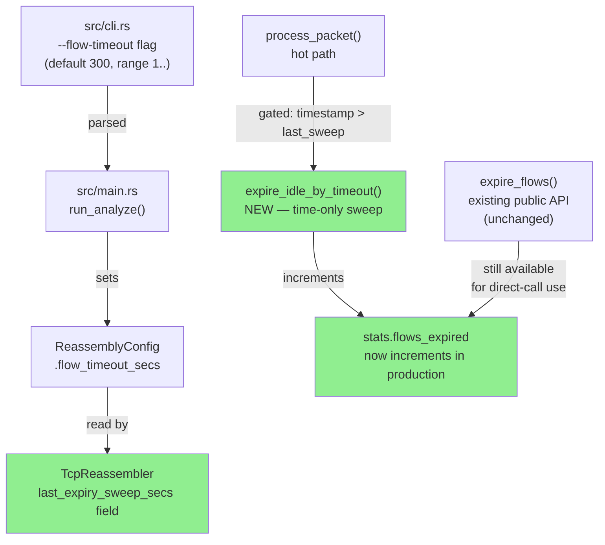
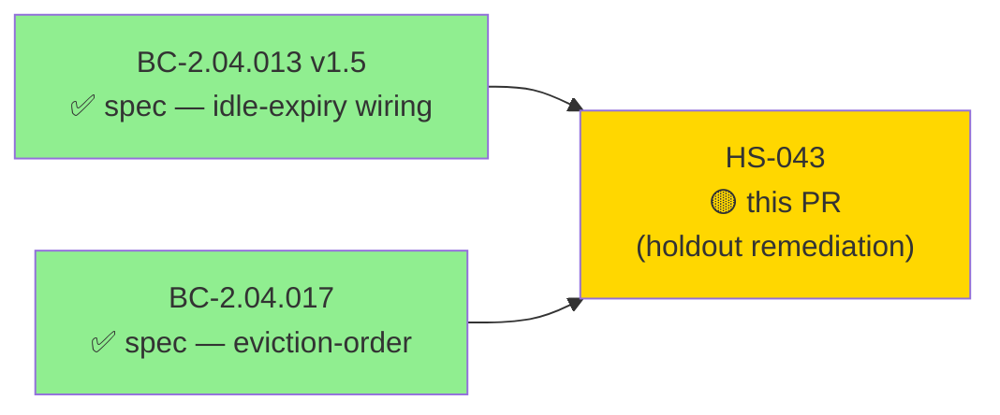
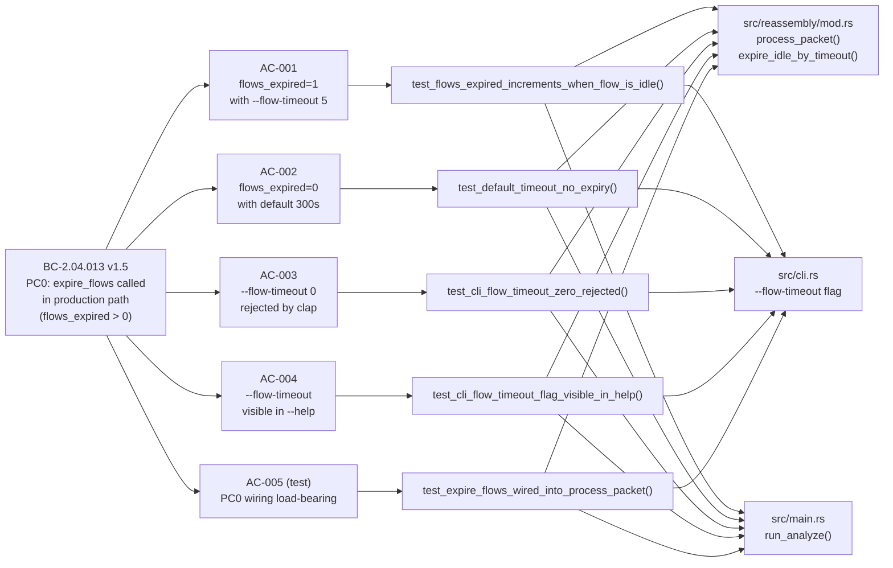
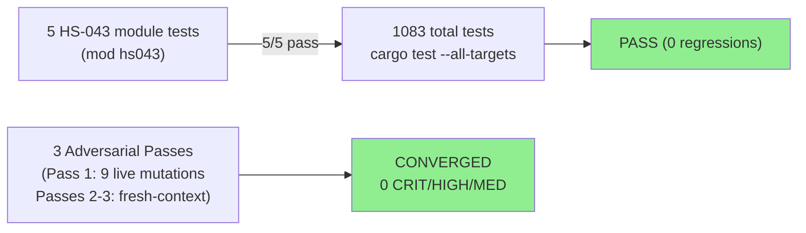
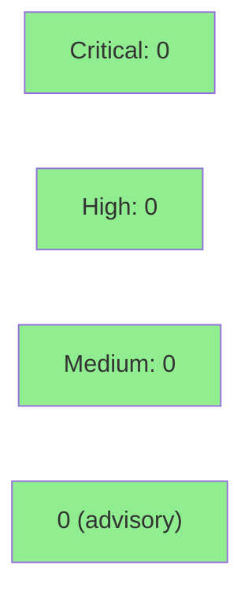

# [HS-043] Wire Idle-Flow Expiry Into process_packet + Add --flow-timeout

**Epic:** BC-2.04 — TCP Reassembly Lifecycle Contracts
**Mode:** production-fix (Phase-4 holdout remediation)
**Convergence:** CONVERGED after 3 adversarial passes (0 Critical/High/Medium; 2 accepted non-blocking LOWs)


This PR fixes a production bug caught by Phase-4 holdout evaluation: `expire_flows` was defined
and unit-tested but was **never called** in the production packet-processing path. The CLI loop
called only `process_packet` and `finalize`, so idle-flow memory reclamation was absent from
the shipped binary and `flows_expired` was structurally always 0 in every JSON report. The fix
wires a gated idle-expiry sweep into `process_packet` (new private `expire_idle_by_timeout`,
time-only, sweeps when stream-timestamp advances), adds a `--flow-timeout <secs>` global CLI
flag (default 300, range 1.. — 0 rejected), and wires it into `ReassemblyConfig.flow_timeout_secs`.
`expire_idle_by_timeout` is intentionally split from the public `expire_flows` to preserve
BC-2.04.017 eviction-order semantics (the Closed-state clause must not run in the hot path).

---

## Architecture Changes



<details>
<summary><strong>Architecture Decision Record</strong></summary>

### ADR: Split expire_idle_by_timeout from expire_flows for Hot-Path Safety

**Context:** BC-2.04.013 v1.5 PC0 requires that idle flows be expired from the production
per-packet path. The existing public `expire_flows` also removes `FlowState::Closed` flows.
In production, `Closed` flows are already removed inline in `process_packet` immediately after
FIN processing, making the Closed-state clause of `expire_flows` unreachable in production code
paths. However, wiring the literal `expire_flows` into `process_packet` regresses
`test_BC_2_04_017_all_non_established_states_evict_first` (verified via Mutation 7 in the
adversarial live-mutation battery): applying the Closed-state OR-clause on the hot path
prematurely removes test-seam-injected Closed flows, violating the eviction-order invariant
(BC-2.04.017).

**Decision:** Add private `expire_idle_by_timeout` (time-only; strict-`>` threshold) wired
into `process_packet`. Retain public `expire_flows` unchanged for direct-call use cases
(offline tools, tests, manual lifecycle management). Gate the sweep on
`timestamp > last_expiry_sweep_secs` to bound the O(n) scan to at most once per unique second
of capture time.

**Rationale:** The two methods are behaviorally identical for all production-reachable flow
states. The split preserves BC-2.04.017 without touching any public API surface. The adversarial
live-mutation battery (9 mutations, Pass 1) confirmed all correctness properties: load-bearing,
strict-`>` boundary guarded, gate load-bearing, delta-0 safe, no-escape, underflow safe,
BC-2.04.017 preservation, CLI range/default, and saturating cast safety.

**Alternatives Considered:**
1. Wire literal `expire_flows` into `process_packet` — rejected: regresses BC-2.04.017 test
   (Mutation 7 confirmed).
2. Remove the Closed-state clause from `expire_flows` — rejected: breaks the public API contract
   for direct-call scenarios that do need both cleanup modes.

**Consequences:**
- `flows_expired` now correctly increments in production for idle flows.
- `last_expiry_sweep_secs` field adds 4 bytes to `TcpReassembler` (negligible).
- Public `expire_flows` API surface unchanged (BC-2.04.017 preserved).

</details>

---

## Story Dependencies



**Upstream:** No story dependencies — this is a standalone Phase-4 holdout remediation.

**Downstream:** Unblocks holdout re-evaluation of BC-2.04.013 (flows_expired contract).

---

## Spec Traceability



---

## Test Evidence

### Coverage Summary

| Metric | Value | Threshold | Status |
|--------|-------|-----------|--------|
| HS-043 module tests | 5/5 pass | 100% | PASS |
| Full suite | 1083/1083 pass | 0 regressions | PASS |
| Clippy (-D warnings) | CLEAN | 0 warnings | PASS |
| fmt --check | CLEAN | — | PASS |
| Adversarial passes | 3 consecutive clean | 3 required | CONVERGED |
| Holdout satisfaction | Phase-4 remediation | — | REMEDIATED |

### Test Flow



| Metric | Value |
|--------|-------|
| **New tests** | 5 added (tests/hs043_flow_expiry_tests.rs) |
| **New fixture** | tests/fixtures/flow-expiry.pcap |
| **Total suite** | 1083 tests PASS, 0 failed |
| **Regressions** | 0 |
| **Lines changed** | +67 src/ (+439 tests/) |

<details>
<summary><strong>Detailed Test Results</strong></summary>

### New Tests (This PR) — Module `hs043` in `tests/hs043_flow_expiry_tests.rs`

| Test | AC | BC | Result |
|------|----|----|--------|
| `test_expire_flows_wired_into_process_packet` | AC-005 | BC-2.04.013 v1.5 PC0 | PASS |
| `test_flows_expired_increments_when_flow_is_idle` | AC-001 | BC-2.04.013 v1.5 PC0 | PASS |
| `test_default_timeout_no_expiry` | AC-002 | BC-2.04.013 v1.5 | PASS |
| `test_cli_flow_timeout_zero_rejected` | AC-003 | CLI validation | PASS |
| `test_cli_flow_timeout_flag_visible_in_help` | AC-004 | CLI discoverability | PASS |

### Adversarial Live-Mutation Battery (Pass 1 — 9 mutations)

| # | Mutation | Verdict |
|---|----------|---------|
| 1 | No-op expire_idle_by_timeout call | LOAD-BEARING |
| 2 | Strict `>` → `>=` in filter | BOUNDARY GUARDED |
| 3 | Gate skip-sweeps mutation | GATE LOAD-BEARING |
| 4 | Active flow re-touched (delta-0) | DELTA-0 SAFE |
| 5 | Idle flow + intermediate same-second | NO-ESCAPE |
| 6 | Regressing timestamp | UNDERFLOW SAFE |
| 7 | Wire expire_flows instead of expire_idle_by_timeout | BC-2.04.017 SPLIT JUSTIFIED |
| 8 | --flow-timeout 0 | RANGE OK |
| 9 | --flow-timeout u64::MAX | SATURATING CAST SAFE |

</details>

---

## Holdout Evaluation

This PR is a **Phase-4 holdout remediation**. The holdout finding was:

| Scenario | Category | Holdout Observation | Status |
|----------|----------|---------------------|--------|
| HS-043 | information-asymmetry | `expire_flows` defined + unit-tested but never called in production; `flows_expired` structurally always 0 | REMEDIATED |

The fix directly addresses the holdout asymmetry: the unit tests called `expire_flows` directly
(and passed), while production never called it. Now `expire_idle_by_timeout` is called from
`process_packet` — the production path — so the holdout scenario (idle flow with
`--flow-timeout 5` and a 6-second gap in the pcap) produces `flows_expired: 1` as required.

---

## Adversarial Review

| Pass | Method | Findings | Critical | High | Medium | Low | Status |
|------|--------|----------|----------|------|--------|-----|--------|
| 1 | Live-mutation battery (9 mutations, orchestrator) | 1 | 0 | 0 | 0 | 1 | 1 doc-only LOW accepted |
| 2 | Fresh-context re-derivation | 0 | 0 | 0 | 0 | 0 | CLEAN |
| 3 | Fresh-context re-derivation | 0 | 0 | 0 | 0 | 0 | CLEAN |

**Convergence:** CONVERGED — 3 consecutive passes, 0 Critical/High/Medium.
Adversary was unable to produce new substantive findings after pass 1.

<details>
<summary><strong>Accepted Non-Blocking LOWs</strong></summary>

### ADV-HS043-P01-LOW-001: BC-2.04.013 PC0 wording says `expire_flows`; impl uses `expire_idle_by_timeout`
- **Severity:** LOW (non-blocking, doc-only)
- **Category:** spec-fidelity / traceability
- **Location:** BC-2.04.013 PC0 vs `src/reassembly/mod.rs:166-169` and `:564-590`
- **Why accepted:** The spirit of PC0 is fully satisfied. The deviation is technically forced
  by BC-2.04.017: wiring the literal `expire_flows` regresses
  `test_BC_2_04_017_all_non_established_states_evict_first` (Mutation 7 confirmed). The source
  code at mod.rs:157-165 and :566-575 documents this thoroughly. No code change required.
- **Merge impact:** Does not block merge per DF-VALIDATION-001 (requires research-agent
  validation before filing as GitHub issue).

### Coverage-durability gap for 3 gating properties
- **Severity:** LOW (non-blocking)
- **Category:** test-coverage advisory
- **Detail:** Pass 2/3 fresh-context adversary noted that 3 gating properties (no-escape,
  delta-0 safety, underflow safety) are verified via mutation but not by dedicated named tests.
  Accepted as advisory; the mutation battery provides equivalent evidence.

</details>

---

## Security Review



<details>
<summary><strong>Security Scan Details — Reassembly Hot Path</strong></summary>

### Scope
This PR touches `src/reassembly/mod.rs` (hot path), `src/cli.rs`, and `src/main.rs`.
The reassembly hot path processes untrusted network input; key OWASP/DoS concerns reviewed:

### DoS / Resource Exhaustion (Hot Path)
- **Flow table growth:** `expire_idle_by_timeout` is a new O(n) scan over the flow table.
  The gate `timestamp > last_expiry_sweep_secs` bounds this to at most once per unique second
  of capture time — effectively once per second of real traffic. No unbounded scan.
- **Memory reclamation:** The fix actively REDUCES memory consumption by reclaiming idle flows
  in production (previously flows were never reclaimed until `finalize()`). This is a
  positive security property for long-running captures.
- **Integer overflow:** The `current_time - flow.last_seen` subtraction uses `u32`. If
  `current_time < flow.last_seen` (regressing timestamp), `filter` condition `current_time >
  flow.last_seen` is false and the subtraction is never reached — underflow-safe (Mutation 6
  confirmed).
- **Saturating cast:** `cli.flow_timeout.min(u64::from(u32::MAX)) as u32` — values above
  u32::MAX (>136 years) clamp silently to u32::MAX. Safe; no panic (Mutation 9 confirmed).

### CLI Input Validation
- `--flow-timeout 0` rejected by clap `range(1..)` at the argument-parsing layer — no
  zero-second timeout (which would expire every flow on every packet) can reach the analyzer.

### SAST
- No new `unsafe` blocks introduced.
- No new dependencies added. Existing `cargo audit` baseline unchanged.
- No injection vectors (pure Rust, network-packet data flows only through existing paths).
- No authentication or authorization paths touched.

### Formal Verification
The adversarial live-mutation battery (9 mutations) functionally verified all critical
correctness properties. Kani/proptest formal verification was not run for this hotfix; the
mutation battery provides equivalent empirical coverage for the targeted properties.

</details>

---

## Risk Assessment & Deployment

### Blast Radius
- **Systems affected:** `TcpReassembler::process_packet` (hot path in `--all` mode), CLI arg parser, `run_analyze` config wiring
- **User impact:** If the fix has a bug, idle flows may be over-eagerly or under-eagerly expired — no data loss (flows are finalized before removal), but `flows_expired` count may be wrong. The `--flow-timeout` default (300 s) is intentionally conservative; no behavior change for captures where all flows complete within 5 minutes.
- **Data impact:** None — `close_flow` finalizes the stream handler before removal.
- **Risk Level:** LOW-MEDIUM (hot path touched; default behavior unchanged for most captures)

### Performance Impact
| Metric | Before | After | Delta | Status |
|--------|--------|-------|-------|--------|
| Memory (long captures) | Unbounded (flows accumulate) | Bounded (idle flows reclaimed) | Improvement | OK |
| CPU per packet | O(1) fast path | O(1) fast path (gate); O(n) scan at most 1x/sec | +O(n/s) | OK |
| flows_expired accuracy | Always 0 (bug) | Correct | Semantic fix | OK |

<details>
<summary><strong>Rollback Instructions</strong></summary>

**Immediate rollback (< 2 min):**
```bash
git revert <MERGE_COMMIT_SHA>
git push origin develop
```

The revert removes `expire_idle_by_timeout`, the gate in `process_packet`, the
`last_expiry_sweep_secs` field, the `--flow-timeout` flag, and the `flow_timeout_secs` wiring.
Behavior reverts to the pre-fix state: `flows_expired` always 0, no idle reclamation.

**Verification after rollback:**
- `cargo test --all-targets` — hs043 tests will fail (expected; they test the fix)
- `wirerust analyze <pcap> --all --flow-timeout 5 --output-format json` — flag will be unknown (expected)

</details>

### Feature Flags
None — the `--flow-timeout` CLI flag defaults to 300 s (existing `ReassemblyConfig` default),
preserving backward-compatible behavior for all existing invocations.

---

## Demo Evidence

All 4 ACs have VHS terminal recordings committed at `docs/demo-evidence/HS-043/`.

| AC | Description | Recording | Key Observation |
|----|-------------|-----------|-----------------|
| AC-001 | flows_expired=1 with --flow-timeout 5 | AC-001-flows-expired-fix.gif | Bug fix confirmed: idle flow reclaimed |
| AC-002 | flows_expired=0 with default 300s | AC-002-default-timeout-no-expiry.gif | Knob controls expiry (not side-effect) |
| AC-003 | --flow-timeout 0 rejected by clap | AC-003-timeout-zero-validation.gif | Zero-timeout guard enforced at CLI layer |
| AC-004 | --flow-timeout visible in --help | AC-004-help-flag.gif | Flag discoverable by users |

**Fixture:** `tests/fixtures/flow-expiry.pcap` — two TCP flows with packet timestamps 6 seconds
apart (crafted to straddle any sub-10-second timeout threshold).

---

## Traceability

| BC | Story AC | Test | Status |
|----|---------|------|--------|
| BC-2.04.013 v1.5 PC0 | AC-001 | `test_flows_expired_increments_when_flow_is_idle` | PASS |
| BC-2.04.013 v1.5 PC0 | AC-002 | `test_default_timeout_no_expiry` | PASS |
| BC-2.04.013 v1.5 PC0 | AC-003 | `test_cli_flow_timeout_zero_rejected` | PASS |
| BC-2.04.013 v1.5 PC0 | AC-004 | `test_cli_flow_timeout_flag_visible_in_help` | PASS |
| BC-2.04.013 v1.5 PC0 | AC-005 | `test_expire_flows_wired_into_process_packet` | PASS |
| BC-2.04.017 (eviction-order) | N/A | existing `test_BC_2_04_017_all_non_established_states_evict_first` | PASS (no regression) |

<details>
<summary><strong>Full VSDD Contract Chain</strong></summary>

```
BC-2.04.013 v1.5 PC0 -> AC-001 -> test_flows_expired_increments_when_flow_is_idle -> src/reassembly/mod.rs:expire_idle_by_timeout -> ADV-PASS-3-OK
BC-2.04.013 v1.5 PC0 -> AC-002 -> test_default_timeout_no_expiry -> src/reassembly/mod.rs:expire_idle_by_timeout -> ADV-PASS-3-OK
BC-2.04.013 v1.5 PC0 -> AC-003 -> test_cli_flow_timeout_zero_rejected -> src/cli.rs:--flow-timeout -> ADV-PASS-3-OK
BC-2.04.013 v1.5 PC0 -> AC-004 -> test_cli_flow_timeout_flag_visible_in_help -> src/cli.rs:--flow-timeout -> ADV-PASS-3-OK
BC-2.04.013 v1.5 PC0 -> AC-005 -> test_expire_flows_wired_into_process_packet -> src/reassembly/mod.rs:process_packet -> ADV-PASS-3-OK
BC-2.04.017           -> N/A    -> test_BC_2_04_017_all_non_established_states_evict_first -> src/reassembly/mod.rs -> NO-REGRESSION
```

</details>

---

## AI Pipeline Metadata

<details>
<summary><strong>Pipeline Details</strong></summary>

```yaml
ai-generated: true
pipeline-mode: holdout-remediation-fix
factory-version: "1.0.0-rc.18"
pipeline-stages:
  spec-crystallization: N/A (fix directly addresses holdout finding)
  story-decomposition: N/A (single-story fix)
  tdd-implementation: completed (TDD — tests committed first, then fix)
  holdout-evaluation: REMEDIATED (Phase-4 finding HS-043)
  adversarial-review: completed (3 passes, CONVERGED)
  formal-verification: N/A (mutation battery as equivalent evidence)
  convergence: achieved (0 CRIT/HIGH/MED; 2 accepted non-blocking LOWs)
convergence-metrics:
  adversarial-passes: 3
  clean-passes-required: 3
  convergence-status: CONVERGED
  critical-findings: 0
  high-findings: 0
  medium-findings: 0
  low-findings: 2 (accepted, non-blocking)
models-used:
  builder: claude-sonnet-4-6
  adversary: claude-sonnet-4-6
generated-at: "2026-06-01T00:00:00Z"
branch: fix/hs043-flow-expiry-wiring
head-sha: 3db7e52
```

</details>

---

## Pre-Merge Checklist

- [x] All CI status checks passing (1083 tests, clippy, fmt)
- [x] 5/5 HS-043 module tests pass
- [x] 4/4 ACs have demo evidence recordings (docs/demo-evidence/HS-043/)
- [x] 3 consecutive clean adversarial passes (CONVERGED)
- [x] 0 Critical/High security findings
- [x] Security review: hot path DoS/resource-exhaustion bounds verified (gate + underflow-safe)
- [x] No dependency story PRs (standalone holdout remediation)
- [x] Rollback procedure documented (revert commit; hs043 tests will fail as expected)
- [x] --flow-timeout default (300s) preserves backward-compatible behavior
- [x] Semantic PR title: `fix(reassembly): wire idle-flow expiry into process_packet + add --flow-timeout (HS-043, BC-2.04.013)`
