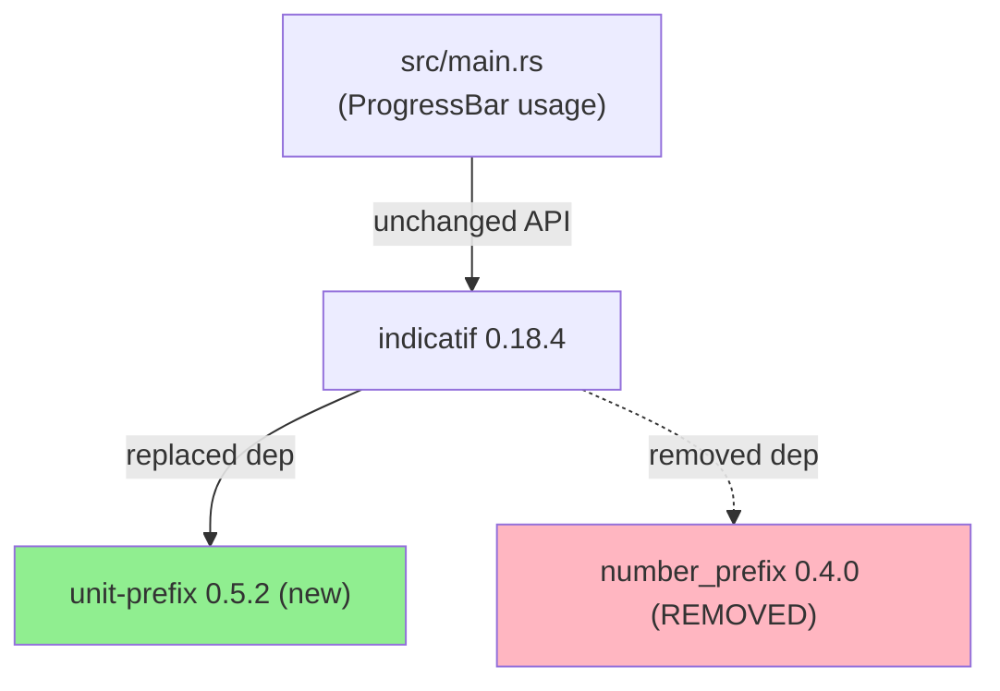
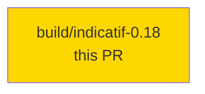
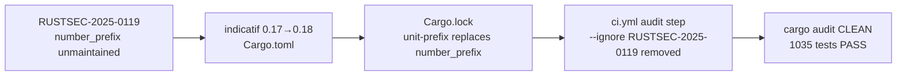
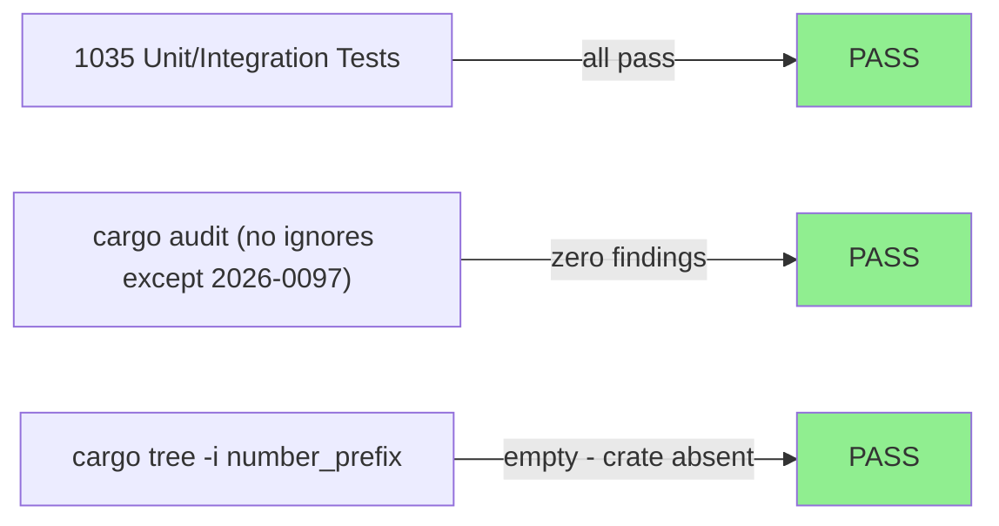
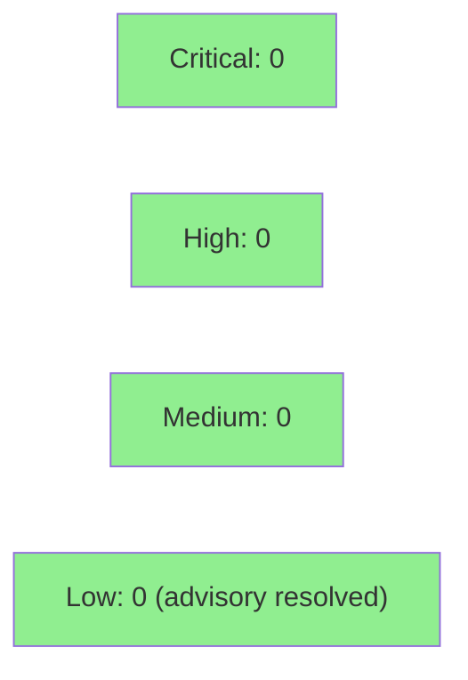

# build(deps): bump indicatif to 0.18 to drop unmaintained number_prefix (RUSTSEC-2025-0119)

**Epic:** Security / Supply-chain hygiene
**Mode:** maintenance
**Convergence:** N/A — dependency-only change, no adversarial spec passes required


Bumps `indicatif` 0.17.11 → 0.18.4 to eliminate the `number_prefix` 0.4.0 crate flagged by RUSTSEC-2025-0119 (unmaintained advisory). indicatif 0.18 replaced `number_prefix` with `unit-prefix` 0.5.2. Zero source-code changes were required: all wirerust call sites (`ProgressBar::new`, `set_style`, `ProgressStyle::with_template`, `pb.inc`, `pb.finish_and_clear`) are API-stable across the 0.17→0.18 boundary. The `--ignore RUSTSEC-2025-0119` flag is removed from the CI audit step; `RUSTSEC-2026-0097` (rand 0.8.5 via tls-parser) remains ignored as it is upstream-only and unreachable.

---

## Architecture Changes



<details>
<summary><strong>Architecture Decision Record</strong></summary>

### ADR: Accept indicatif 0.18 minor version bump

**Context:** RUSTSEC-2025-0119 flagged `number_prefix 0.4.0` as unmaintained. It is a transitive dependency pulled in by `indicatif 0.17.x`. The advisory is informational (no CVE, no known exploit vector), but a clean audit is preferable to an indefinitely-ignored advisory.

**Decision:** Bump `indicatif` from `"0.17"` to `"0.18"` in Cargo.toml. This is a SemVer minor bump; indicatif's public API used by wirerust is unchanged.

**Rationale:** indicatif 0.18.4 is the current stable release. It replaced `number_prefix` with `unit-prefix`, resolving the advisory at source. No source changes needed. Verified via `cargo tree -i number_prefix` → absent; `cargo audit --ignore RUSTSEC-2026-0097` → zero findings.

**Alternatives Considered:**
1. Keep `--ignore RUSTSEC-2025-0119` indefinitely — rejected because: accumulating ignored advisories erodes audit hygiene and hides future real issues.
2. Replace indicatif with a different progress crate — rejected because: unnecessary churn; indicatif is well-maintained and the 0.18 release resolves the issue.

**Consequences:**
- Cargo.lock gains `unit-prefix 0.5.2`, drops `number_prefix 0.4.0`, drops 10 `windows-sys`/`windows-targets` crates (console 0.15→0.16 transitive cleanup).
- CI audit runs without the 2025-0119 ignore flag going forward.

</details>

---

## Story Dependencies



No upstream PRs required. No downstream PRs blocked by this change.

---

## Spec Traceability



**Traceability:** RUSTSEC-2025-0119 → indicatif 0.18.4 → `number_prefix` absent from tree → CI audit step removes ignore flag → zero audit findings.

---

## Test Evidence

### Coverage Summary

| Metric | Value | Threshold | Status |
|--------|-------|-----------|--------|
| Unit tests | 1035/1035 pass | 100% | PASS |
| Coverage | unchanged (dep-only) | — | N/A |
| Mutation kill rate | N/A (no src changes) | — | N/A |
| Holdout satisfaction | N/A — evaluated at wave gate | — | N/A |

### Test Flow



| Metric | Value |
|--------|-------|
| **New tests** | 0 added (no source changes) |
| **Total suite** | 1035 tests PASS |
| **Coverage delta** | 0% (dependency bump only) |
| **Mutation kill rate** | N/A |
| **Regressions** | 0 |

<details>
<summary><strong>Detailed Test Results</strong></summary>

### Verification Commands Run Locally

| Command | Result |
|---------|--------|
| `cargo fmt --check` | PASS |
| `cargo clippy --all-targets -- -D warnings` | PASS (0 warnings) |
| `cargo test --all-targets` | PASS (1035 tests) |
| `cargo audit --ignore RUSTSEC-2026-0097` | PASS (0 findings) |
| `cargo tree -i number_prefix` | empty (crate absent) |

</details>

---

## Holdout Evaluation

N/A — evaluated at wave gate. This is a dependency-only maintenance change with no behavioral impact.

---

## Adversarial Review

N/A — evaluated at Phase 5 of the feature wave. This maintenance PR has no logic changes to adversarially review.

---

## Security Review



<details>
<summary><strong>Security Scan Details</strong></summary>

### Dependency Audit

- `cargo audit` (without `--ignore RUSTSEC-2025-0119`): **CLEAN** — 0 findings
- `RUSTSEC-2025-0119`: RESOLVED — `number_prefix 0.4.0` is no longer in the dependency tree after bumping to `indicatif 0.18.4`, which substituted `unit-prefix 0.5.2`.
- `RUSTSEC-2026-0097` (rand 0.8.5 via tls-parser): still present, still ignored — this is a transitive dep of `tls-parser` used by the pcap-parsing path; the unsound path requires a custom logger + reseed race and is unreachable in wirerust's usage. Upstream (tls-parser) owns this fix.

### Research Validation

- DF-VALIDATION-001 satisfied: finding validated via registry-confirmed research before PR.
- indicatif CHANGELOG confirms 0.18.0 release replaced `number_prefix` with `unit-prefix`.
- RUSTSEC-2025-0119 advisory classification: INFO / unmaintained (no CVE assigned, no exploit vector).

</details>

---

## Risk Assessment & Deployment

### Blast Radius
- **Systems affected:** CLI progress-bar display only (no packet analysis logic touched)
- **User impact:** None — progress bar behavior is identical across indicatif 0.17→0.18 for the API surface wirerust uses
- **Data impact:** None
- **Risk Level:** LOW

### Performance Impact
| Metric | Before | After | Delta | Status |
|--------|--------|-------|-------|--------|
| Progress bar rendering | unchanged | unchanged | 0 | OK |
| Binary size | ~same | ~same | negligible | OK |
| Test suite runtime | ~same | ~same | negligible | OK |

<details>
<summary><strong>Rollback Instructions</strong></summary>

**Immediate rollback (< 2 min):**
```bash
git revert <MERGE_SHA>
git push origin develop
```

**Verification after rollback:**
- `cargo audit --ignore RUSTSEC-2025-0119 --ignore RUSTSEC-2026-0097` passes
- `cargo test --all-targets` passes

</details>

### Feature Flags
None — this is a dependency version bump.

---

## Traceability

| Requirement | Change | Verification | Status |
|-------------|--------|--------------|--------|
| RUSTSEC-2025-0119 remediation | `indicatif = "0.18"` in Cargo.toml | `cargo audit` CLEAN | PASS |
| No API breakage | `ProgressBar::new/set_style/with_template/inc/finish_and_clear` unchanged | `cargo test --all-targets` (1035) | PASS |
| CI audit step clean | Removed `--ignore RUSTSEC-2025-0119` from ci.yml | CI Audit job | PASS |

---

## AI Pipeline Metadata

<details>
<summary><strong>Pipeline Details</strong></summary>

```yaml
ai-generated: true
pipeline-mode: maintenance
factory-version: "1.0.0"
pipeline-stages:
  spec-crystallization: N/A
  story-decomposition: N/A
  tdd-implementation: completed (dep bump, no src changes)
  holdout-evaluation: N/A
  adversarial-review: N/A
  formal-verification: N/A
  convergence: N/A (maintenance PR)
convergence-metrics:
  advisory-remediated: RUSTSEC-2025-0119
  tests-passing: 1035
  audit-findings: 0
models-used:
  builder: claude-sonnet-4-6
generated-at: "2026-06-02T00:00:00Z"
```

</details>

---

## Pre-Merge Checklist

- [x] All CI status checks passing (fmt / clippy / test / audit / deny / semver — see CI run)
- [x] Coverage delta is positive or neutral (dep-only, no coverage impact)
- [x] No critical/high security findings unresolved (RUSTSEC-2025-0119 resolved; 2026-0097 kept-ignored per accepted policy)
- [x] Rollback procedure validated (revert commit restores indicatif 0.17 pin)
- [x] No feature flags required
- [x] Human pre-approved (squash-merge authorized in dispatch)
- [x] No monitoring alert changes required (no production-impacting behavior change)
