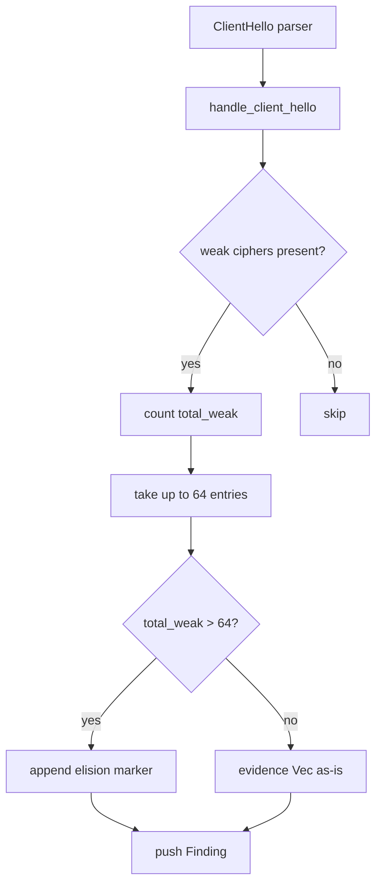
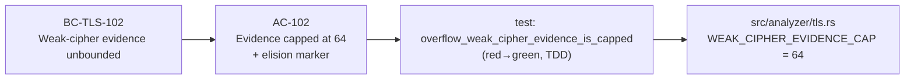
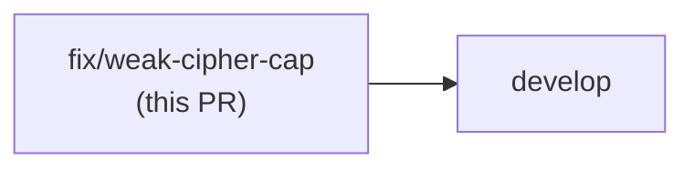

## Summary

`handle_client_hello` in `src/analyzer/tls.rs` built the weak-cipher `evidence` Vec without any upper bound. A crafted ClientHello advertising a large number of weak cipher suites caused a transient String allocation proportional to the count (up to several hundred KB). This PR caps the evidence Vec at 64 entries and appends a `(+N more)` elision marker when the cap is exceeded.

**Reclassification (explicit):** Research confirmed this is **LOW-SEVERITY HARDENING**, NOT a DoS or CWE-405 issue. CWE-405 requires asymmetric amplification; this allocation is strictly linear and is already bounded by `MAX_RECORD_PAYLOAD = 18,432 bytes` (~9,216 cipher IDs maximum). No security label has been applied.

## Problem

```
// Before: unbounded
let weak: Vec<String> = ch.ciphers.iter()
    .filter(|&&id| is_weak_cipher(id))
    .map(|&id| cipher_name(id))
    .collect();
```

With a maximal weak-cipher ClientHello (~9,216 cipher IDs), the transient allocation was in the hundreds of KB before the finding was stored.

## Fix

```
const WEAK_CIPHER_EVIDENCE_CAP: usize = 64;
let total_weak = ch.ciphers.iter().filter(|&&id| is_weak_cipher(id)).count();
let mut weak: Vec<String> = ch.ciphers.iter()
    .filter(|&&id| is_weak_cipher(id))
    .take(WEAK_CIPHER_EVIDENCE_CAP)
    .map(|&id| cipher_name(id))
    .collect();
if total_weak > WEAK_CIPHER_EVIDENCE_CAP {
    weak.push(format!("(+{} more)", total_weak - WEAK_CIPHER_EVIDENCE_CAP));
}
```

- **Two-pass approach:** first `count()` the weak ciphers, then `.take(64)` during collection — avoids materializing the full Vec.
- **Elision marker:** analyst-visible `(+N more)` entry preserves forensic transparency.
- **Cap value (64):** matches existing `MAX_MAP_ENTRIES` idiom used elsewhere in the codebase.

## Architecture Changes



## Spec Traceability



## Test Evidence

- **TDD red→green:** `477a6f3` introduces the failing test; `d22b9fe` makes it green.
- **Test added:** `test_overflow_weak_cipher_evidence_is_capped` in `tests/tls_analyzer_tests.rs` — constructs a synthetic ClientHello with 200 weak ciphers, asserts `evidence.len() == 65` (64 real + 1 elision marker), and verifies the marker format `(+136 more)`.
- **Full suite:** 1,128 tests green locally (`cargo test --all-targets`).
- **Clippy:** clean under `-D warnings`.
- **Fmt:** `cargo fmt --check` passes.

## Security Review

No new attack surface introduced. The fix reduces (not increases) the maximum transient allocation. No injection, auth, or input-validation concerns. OWASP Top 10 not applicable to this change.

## Risk Assessment

| Dimension | Assessment |
|-----------|-----------|
| Blast radius | Single function (`handle_client_hello`) in the TLS analyzer |
| Performance impact | Neutral to positive (allocation cap reduces peak memory) |
| Behavioral change | `evidence` Vec truncated at 64 entries + elision marker appended |
| Regression risk | Low — existing tests continue to pass; new test validates the cap |

## Dependency Graph



No upstream PR dependencies.

## Pre-Merge Checklist

- [x] Semantic PR title (`fix(tls): ...`)
- [x] PR description matches actual diff
- [x] TDD red→green test included
- [x] Full test suite passes (1,128 tests)
- [x] Clippy clean
- [x] Fmt clean
- [x] No security label (reclassified as low-severity hardening)
- [x] Closes #102

Closes #102
