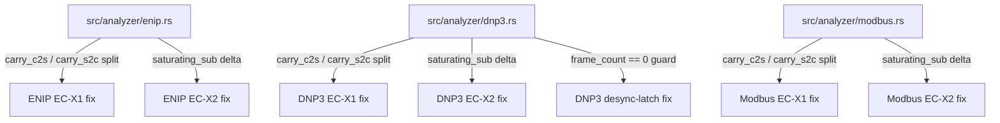
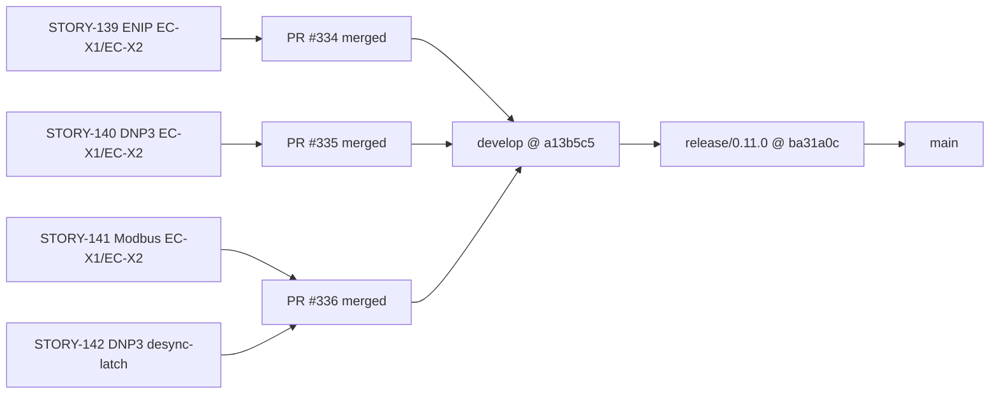
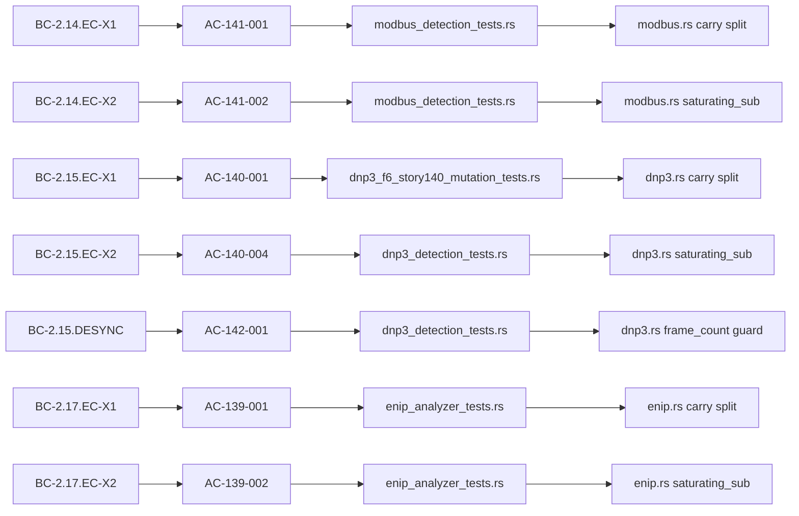

## Summary

Release v0.11.0 — ships seven bug fixes across the ENIP, DNP3, and Modbus analyzers (EC-X1/EC-X2 carry-buffer direction split and `saturating_sub` clock-backwards fix applied to all three protocols, plus the DNP3 desync-latch `frame_count == 0` guard). All fixes landed on `develop` via PRs #334 (ENIP), #335 (DNP3), and #336 (Modbus + DNP3 desync-latch). This PR is the gitflow release merge from `release/0.11.0` → `main`.

---

## What Changed

### Fixed — EC-X1 (per-direction carry buffer split)

All three ICS analyzers previously used a **single shared carry buffer** for both TCP directions (client→server and server→client). A response packet's trailing bytes could be spliced into the next request's reassembly window (cross-direction carry-buffer contamination). Each carry buffer is now split into two independent fields keyed by direction (`carry_c2s` / `carry_s2c`).

| Protocol | Story | PR | Behavioral Contract |
|----------|-------|----|---------------------|
| ENIP     | STORY-139 | #334 | BC-2.17.EC-X1 |
| DNP3     | STORY-140 | #335 | BC-2.15.EC-X1 |
| Modbus   | STORY-141 | #336 | BC-2.14.EC-X1 |

### Fixed — EC-X2 (`saturating_sub` for clock-backwards window reset)

A non-monotonic timestamp (packet re-ordering or NTP step) caused the time-delta computation in the window-reset path to underflow via wrapping subtraction on an unsigned value. The subtraction now uses `saturating_sub`, keeping window-reset logic correct when clocks move backwards.

| Protocol | Story | PR | Behavioral Contract |
|----------|-------|----|---------------------|
| ENIP     | STORY-139 | #334 | BC-2.17.EC-X2 |
| DNP3     | STORY-140 | #335 | BC-2.15.EC-X2 |
| Modbus   | STORY-141 | #336 | BC-2.14.EC-X2 |

### Fixed — DNP3 desync-latch complete-predicate

The DNP3 desync-latch complete-predicate fired unconditionally, which could produce a spurious desync event on the very first frame of a session before any real desync had occurred. The predicate is now gated on `frame_count == 0` so it only triggers after at least one valid frame has been observed.

| Protocol | Story | PR | Behavioral Contract |
|----------|-------|----|---------------------|
| DNP3     | STORY-142 | #336 | BC-2.15.DESYNC |

---

## Architecture Changes

---

## Story Dependencies

---

## Spec Traceability

---

## Test Evidence

- All tests pass on `develop` @ a13b5c5 (CI run 28335634278, green)
- `release/0.11.0` adds only CHANGELOG + Cargo.toml version bump on top — no logic changes
- Test files modified/added: `enip_analyzer_tests.rs` (+9229 lines), `dnp3_f6_story140_mutation_tests.rs` (+1667), `modbus_detection_tests.rs` (+1539), `enip_e2e_real_pcaps_tests.rs` (+803), `dnp3_f6_story140_group_a_survivors.rs` (+866), plus updates to existing dnp3/modbus/dispatcher test suites

---

## Demo Evidence

Per-AC VHS recordings are in `docs/demo-evidence/`:
- `STORY-139/evidence-report.md` — ENIP EC-X1/EC-X2 (AC-139-001 through AC-139-004)
- `STORY-140/evidence-report.md` — DNP3 EC-X1/EC-X2 + desync-latch (AC-140-001, 004, 005, 008)

---

## Security Review

No new attack surface introduced. All changes are defensive: replacing wrapping arithmetic with saturating arithmetic, and splitting shared mutable buffers into direction-keyed fields. No new public API surface, no new deserialization paths, no new network-facing code.

---

## Risk Assessment

- **Blast radius:** Contained to the three ICS analyzer structs. No changes to the CLI, dispatcher, pcap reader, or reporting pipeline.
- **Performance impact:** Negligible. `saturating_sub` compiles to the same instruction count as wrapping sub on x86-64. The carry buffer split doubles the struct field count for the affected analyzers (2 fields → 4 fields per analyzer), which is a trivially small allocation increase.
- **Behavioral change:** Bug-fixes only. Sessions that previously had no cross-direction contamination produce identical output. Sessions that had contamination now produce correct output (previously incorrect behavior is fixed).

---

## AI Pipeline Metadata

- Pipeline mode: Feature (gitflow release)
- Stories: STORY-139, STORY-140, STORY-141, STORY-142
- Prior CI run on develop: 28335634278 (green)

---

## Pre-Merge Checklist

- [x] CHANGELOG entry written (v0.11.0 section in CHANGELOG.md)
- [x] Cargo.toml version bumped 0.10.0 → 0.11.0
- [x] Cargo.lock updated
- [x] All upstream PRs merged (#334, #335, #336)
- [x] CI green on develop @ a13b5c5
- [ ] CI green on release/0.11.0 PR (awaiting CI run)
- [x] PR title follows semantic PR convention: `chore: release v0.11.0`
- [x] Base branch: main
- [x] Merge strategy: squash
