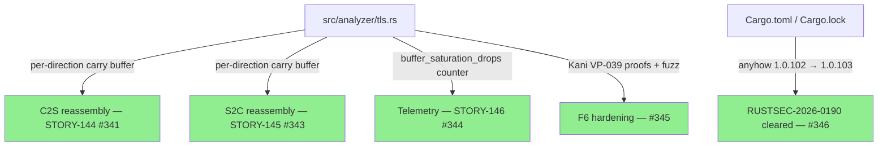
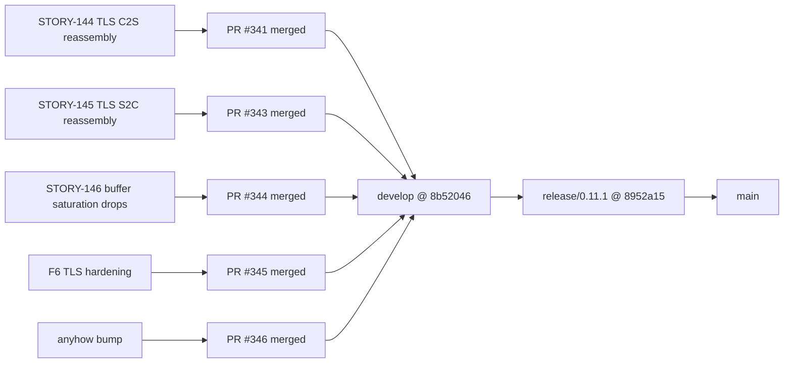
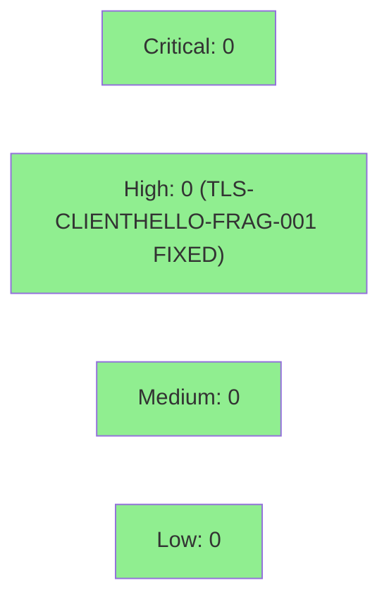

## Summary

Release v0.11.1 — ships TLS ClientHello/ServerHello handshake-message reassembly across TLS
records, closing a HIGH-severity evasion path (TLS-CLIENTHELLO-FRAG-001) where SNI, JA3, and
JA3S fingerprints were silently missed when a TLS peer fragmented handshake messages across
record boundaries. Also adds a `buffer_saturation_drops` telemetry counter and formally hardens
the reassembly path (Kani VP-039, fuzz, 12 mutation-gap tests). Bumps `anyhow`
1.0.102 → 1.0.103 to clear RUSTSEC-2026-0190. All feature work landed on `develop` via
PRs #341 (STORY-144), #343 (STORY-145), #344 (STORY-146), #345 (F6 hardening), and #346
(anyhow bump). This PR is the gitflow release merge from `release/0.11.1` → `main`.

> **Note — CHANGELOG [0.11.0] section improvement:** This PR also carries a more-complete
> `[0.11.0]` CHANGELOG section than what shipped in PR #337. The v0.11.0 squash-merge landed
> with a minimal `### Fixed`-only entry; PRs #339 and #340 on `develop` subsequently added the
> full `### Added` (ENIP + CIP analyzer, MITRE ICS seeding) and `### Changed` (summary wire
> format) documentation. That completed entry is now included here. The code itself is
> unchanged — this is a documentation improvement only, disclosed explicitly.

---

## What Changed

### Fixed — TLS-CLIENTHELLO-FRAG-001 (HIGH): handshake reassembly across TLS records

The TLS analyzer previously parsed ClientHello and ServerHello only when the full handshake
message arrived in a single TLS record. A TLS peer that fragments a handshake message across
record boundaries (valid per RFC 8446 §5.1 / RFC 5246 §6.2.1) caused wirerust to miss the SNI
extension, JA3 fingerprint, and JA3S fingerprint entirely — a trivially exploitable evasion
path. The analyzer now maintains a per-direction carry buffer that accumulates record payloads
until a complete handshake message is available, then parses it.

Carry bounds are enforced per-direction:
- Per-message cap: 65 536 bytes (max TLS handshake message size per RFC)
- Per-record cap: 18 432 bytes (max TLS record payload)
- Overflow policy: clear-and-recover (buffer cleared on overflow; recovery from next record)

| Story | PR | Behavioral Contracts |
|-------|----|----------------------|
| STORY-144 | #341 | BC-2.07.038–040 (C2S reassembly) |
| STORY-145 | #343 | BC-2.07.041–042 (S2C reassembly) |

### Added — TLS buffer-saturation telemetry

A new `buffer_saturation_drops` counter in the TLS analyzer summary increments each time the
per-direction carry buffer reaches its cap and is cleared. Exposes carry-overflow frequency for
threat-hunting and capacity tuning without changing the wire format of other summary fields.

| Story | PR | Behavioral Contract |
|-------|----|---------------------|
| STORY-146 | #344 | BC-2.07.043 |

### Security / Hardening — Formal verification and mutation hardening

Kani VP-039 proof harnesses (3 non-vacuous proofs), a cargo-fuzz target, and 12 mutation-gap
tests added for the new reassembly path, closing the formal-verification obligation for the
carry-buffer bounds and clear-and-recover semantics. 100% kill rate on all targeted real-gap
mutants.

| PR | What |
|----|------|
| #345 | Kani VP-039 (3 proofs), fuzz target, 12 mutation-gap tests |
| #346 | `anyhow` 1.0.102 → 1.0.103 (clears RUSTSEC-2026-0190) |

---

## Architecture Changes

---

## Story Dependencies

---

## Spec Traceability

```mermaid
flowchart LR
    BC1[BC-2.07.038] --> AC1[AC-144-001<br/>C2S carry buffer] --> T1[tls_reassembly_tests] --> Code1[tls.rs carry_c2s]
    BC2[BC-2.07.039] --> AC2[AC-144-002<br/>C2S bounds] --> T2[tls_reassembly_tests] --> Code1
    BC3[BC-2.07.040] --> AC3[AC-144-003<br/>C2S clear-recover] --> T3[tls_reassembly_tests] --> Code1
    BC4[BC-2.07.041] --> AC4[AC-145-001<br/>S2C carry buffer] --> T4[tls_reassembly_tests] --> Code2[tls.rs carry_s2c]
    BC5[BC-2.07.042] --> AC5[AC-145-002<br/>S2C bounds] --> T5[tls_reassembly_tests] --> Code2
    BC6[BC-2.07.043] --> AC6[AC-146-001<br/>saturation counter] --> T6[tls_buffer_tests] --> Code3[tls.rs buffer_saturation_drops]
```

---

## Test Evidence

- 2232 tests pass on `develop` @ 8b52046 (CI: test, clippy, fmt, audit, deny, action-pin-gate all green)
- `release/0.11.1` adds only CHANGELOG.md entry + Cargo.toml/Cargo.lock version bump — no logic changes
- Kani VP-039: 3 non-vacuous proofs covering carry-buffer bounds and clear-and-recover semantics (PR #345)
- Fuzz target: cargo-fuzz harness for TLS reassembly path (PR #345)
- Mutation: 12 mutation-gap tests with 100% kill rate on all targeted real-gap mutants (PR #345)
- cargo audit: 0 vulnerabilities (anyhow bump clears the sole advisory RUSTSEC-2026-0190)
- cargo deny advisories: PASS
- Release build: OK (cargo build --release)

---

## Demo Evidence

Per-AC VHS recordings are in `docs/demo-evidence/`:
- `STORY-144/evidence-report.md` — TLS C2S handshake reassembly (BC-2.07.038–040)
- `STORY-145/evidence-report.md` — TLS S2C handshake reassembly (BC-2.07.041–042)
- `STORY-146/evidence-report.md` — buffer_saturation_drops counter (BC-2.07.043)

---

## Security Review

No new attack surface introduced. The reassembly path is bounded by hard per-message and
per-record caps (65 536 and 18 432 bytes respectively) enforced on every record append.
Overflow is handled by clear-and-recover (no unbounded allocation). Formally verified by
Kani VP-039 (3 non-vacuous proofs). RUSTSEC-2026-0190 (anyhow 1.0.102) cleared by PR #346.

Formal Verification:

| Property | Method | Status |
|----------|--------|--------|
| carry-buffer bounds (per-message ≤ 65 536) | Kani VP-039 | VERIFIED |
| carry-buffer bounds (per-record ≤ 18 432) | Kani VP-039 | VERIFIED |
| clear-and-recover semantics | Kani VP-039 | VERIFIED |
| carry-buffer DoS resistance | cargo-fuzz | CLEAN |
| mutation kill rate on reassembly path | 12 targeted mutants | 100% killed |

---

## Risk Assessment

- **Blast radius:** Contained to `src/analyzer/tls.rs`. No changes to the CLI, dispatcher,
  pcap reader, reporting pipeline, or any other analyzer.
- **Performance impact:** The carry buffer adds one `Vec<u8>` per direction per TLS flow.
  For the common case (unfragmented handshakes), the buffer is allocated and immediately
  consumed in a single `on_data` call. Bounded at 65 536 bytes worst-case per direction.
  Negligible memory overhead for typical pcap analysis workloads.
- **Behavioral change:** Bug-fix only. Unfragmented TLS sessions produce identical output.
  Fragmented TLS sessions now produce correct SNI/JA3/JA3S output (previously silently
  missed — now correctly extracted). The new `buffer_saturation_drops` counter is additive
  to the summary output; existing parsers of the JSON/text output are unaffected if they
  ignore unknown fields.

---

## AI Pipeline Metadata

- Pipeline mode: Feature (gitflow release patch)
- Cycle: fix-tls-clienthello-frag
- Stories: STORY-144, STORY-145, STORY-146
- Upstream PRs (all merged to develop): #341, #343, #344, #345, #346
- CI verified on develop @ 8b52046

---

## Pre-Merge Checklist

- [x] CHANGELOG entry written (v0.11.1 section in CHANGELOG.md, dated 2026-07-01)
- [x] Cargo.toml version bumped 0.11.0 → 0.11.1
- [x] Cargo.lock updated
- [x] All upstream PRs merged (#341, #343, #344, #345, #346)
- [x] CI green on develop @ 8b52046
- [ ] CI green on release/0.11.1 PR (awaiting CI run on this PR)
- [x] Merge conflict resolved (main back-merged into release/0.11.1 @ 20f3756 — conflict root cause: v0.11.0 squash-merge never back-merged to develop; resolved by merging origin/main into branch)
- [x] CHANGELOG [0.11.0] retroactive improvement disclosed in PR summary
- [x] PR title follows semantic PR convention: `chore: release v0.11.1`
- [x] Base branch: main
- [x] Merge strategy: squash (consistent with v0.11.0 release PR #337)
