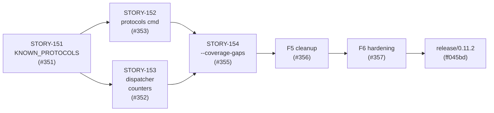
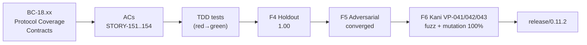

## Release: wirerust v0.11.2 — E-21 Protocol-Coverage Delta

**Type:** Gitflow `release/0.11.2` → `main` merge (merge commit, not squash — matches prior release convention)

**Convergence evidence:** F4 holdout 1.00, F5 adversarial converged (4 LOW findings resolved in #356), F6 formal hardening complete (VP-041/042/043 proven via Kani, fuzz target green, mutation kill rate 100 % on E-21 delta, #357).

---

## What ships

This release delivers the **E-21 feature-protocol-coverage** feature wave — four stories and two hardening passes, all merged and fully green on `develop`:

### Added

- **`KNOWN_PROTOCOLS` catalog + partition functions — SS-18 (STORY-151, #351).**
  Static catalog enumerating all protocols wirerust knows about (default ports, CLI flag, category). Partition functions (`is_covered`, `is_gap`, `is_unclassified`) form the data backbone for the protocols subcommand and coverage-gaps report. VP-041 formally verified via Kani.

- **`protocols` subcommand — coverage catalog table + JSON output (STORY-152, #353).**
  `wirerust protocols` prints a formatted table of every protocol in `KNOWN_PROTOCOLS` with its classification and CLI flag. `--json [FILE]` emits the catalog as structured JSON. `--csv` explicitly rejected.

- **Dispatcher unclassified-protocol gap counters — TCP + UDP (STORY-153, #352).**
  `StreamDispatcher` accumulates per-port counters for TCP/UDP traffic matching no known protocol rule, feeding the `unclassified` bucket in `CoverageGapsSummary`.

- **`analyze --coverage-gaps` flag — tri-state `CoverageGapsSummary` report (STORY-154, #355).**
  Classifies each protocol in a capture as `covered`, `gap`, or `unclassified`. Emitted in both terminal and JSON output.

### Fixed

- **`protocols --json=PATH` path argument honored; `--csv` rejected (#354, wave-68 F-W68-01).**

### Security / Hardening

- **F5 adversarial cleanup (#356):** 4 LOW findings resolved — doc accuracy, dead-code removal, test hardening.
- **F6 formal hardening (#357):** Kani VP-041 (partition totality), VP-042 (coverage-gap classification correctness), VP-043 (unclassified-counter monotonicity). cargo-fuzz target + mutation testing at 100 % effective kill rate on the E-21 detection delta.

---

## Dependency graph

---

## Spec traceability

---

## Pre-merge checklist

- [x] Gitflow release branch cut from `develop` at convergence point
- [x] `Cargo.toml` version bump: 0.11.1 → 0.11.2
- [x] `Cargo.lock` updated
- [x] `CHANGELOG.md` v0.11.2 section written
- [x] All E-21 stories merged and green on `develop`
- [x] F4 holdout: 1.00
- [x] F5 adversarial: converged (4 LOW resolved)
- [x] F6 hardening: VP-041/042/043 proven, fuzz clean, mutation 100 %
- [x] CI green on `develop`
- [ ] CI green on `release/0.11.2` (checked at merge time)
- [ ] Merge into `main` (this PR)
- [ ] Tag `v0.11.2` on `main` (devops-engineer, separate step)
- [ ] Back-merge `main` → `develop` (separate step)
