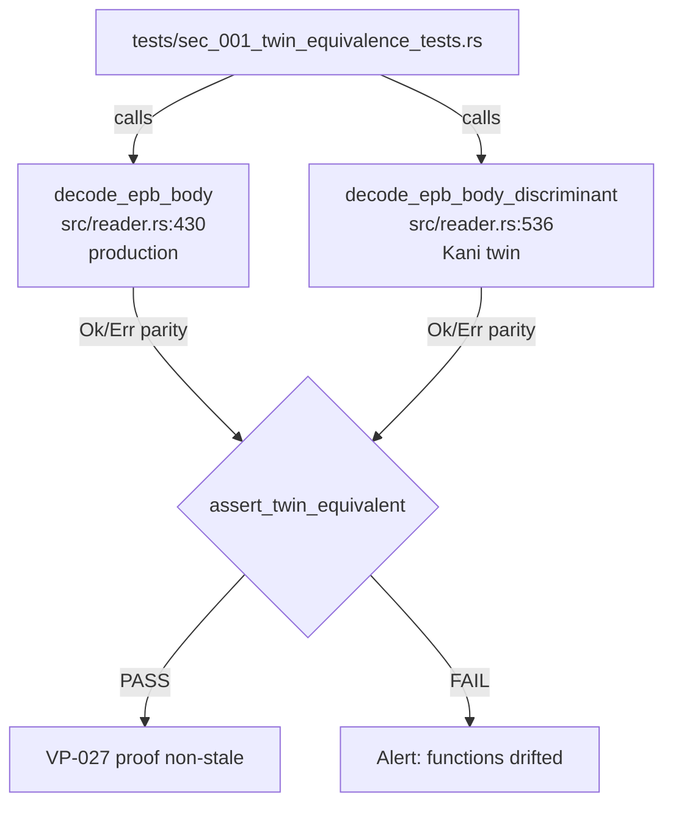
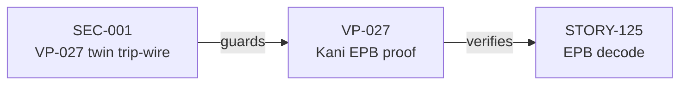
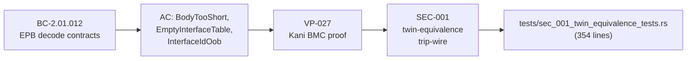

## Summary

Adds `tests/sec_001_twin_equivalence_tests.rs` — the SEC-001 mechanical trip-wire that guards VP-027's Kani formal proof against silent staleness. Zero production-code change: `src/reader.rs` is byte-for-byte identical to `develop` HEAD (`3fc0e67`).

## Why This PR Exists

`decode_epb_body` (production EPB parser, `src/reader.rs:430`) and `decode_epb_body_discriminant` (Kani BMC twin, `src/reader.rs:536`) are two independent function bodies — no shared core. They were verified line-for-line faithful at creation time, but nothing mechanically prevents them from drifting as the codebase evolves. If they drift, the VP-027 formal proof silently stops guarding the production function.

SEC-001 closes this gap with a proptest + deterministic-anchor suite that asserts both functions always agree on:
- **(a) Ok/Err parity** — both succeed or both fail for any input
- **(b) Error-class parity** — when both err, the production `E-INP-NNN` code matches the twin's `EpbDecodeError` discriminant
- **(c) Field parity** — when both succeed, `timestamp_secs`, `timestamp_usecs`, and `data` are identical

## Architecture Changes



## Story Dependencies



## Spec Traceability



## What Changed

| File | Change | Nature |
|------|--------|--------|
| `tests/sec_001_twin_equivalence_tests.rs` | +354 lines | **Test-only — new file** |
| `src/reader.rs` | no diff | Production code **unchanged** |

`git diff develop...HEAD -- src/reader.rs` produces no output — byte-for-byte identical.

## Test Evidence

### Proptest

- `proptest_SEC_001_twin_equivalence_random_inputs` — **2000 random cases** covering:
  - Body lengths 0–64 bytes (spans below, at, and above the 20-byte EPB minimum)
  - Interface table sizes 0–3 entries
  - LE and BE endianness
  - Targeted `interface_id` overrides: `0`, `1`, `2`, `u32::MAX`
  - Ok/Err parity, error-class parity, and field parity assertions

### Deterministic Unit Anchors (6 cases)

| Test | Scenario | Expected |
|------|----------|----------|
| `test_SEC_001_body_too_short` | 19-byte body (one short of minimum), both endiannesses | Both → `E-INP-008` / `BodyTooShort` |
| `test_SEC_001_empty_body` | 0-byte body | Both → `E-INP-008` / `BodyTooShort` |
| `test_SEC_001_empty_interface_table` | Valid-length body, empty interface slice | Both → `E-INP-009` / `EmptyInterfaceTable` |
| `test_SEC_001_interface_id_oob` | `interface_id=1` with 1-entry table; `interface_id=0xFFFF` | Both → `E-INP-010` / `InterfaceIdOob` |
| `test_SEC_001_valid_epb_happy_path` | Valid 24-byte EPB, `captured_len=4` | Both → `Ok`, identical timestamp + data |
| `test_SEC_001_captured_len_exceeds_body` | PC6a: `captured_len=1`, 0 bytes available after header | Both → `E-INP-008` / `BodyTooShort` |

### Non-Vacuity Confirmation (mutation-test)

Step-3 mutation: changed `EmptyInterfaceTable => "E-INP-009"` to `InterfaceIdOob => "E-INP-009"` in the discriminant twin. Result: `test_SEC_001_empty_interface_table` **FAILED** immediately, and `proptest_SEC_001_twin_equivalence_random_inputs` **FAILED** on the first empty-table case. Mutation was reverted before commit. This confirms the trip-wire is not trivially satisfied — it actually catches desync.

### Full Suite Result

```
cargo test --all-targets   →  0 failures
cargo clippy --all-targets -- -D warnings  →  0 warnings
cargo fmt --check  →  clean
```

## Discriminant ↔ E-INP-code Mapping (verified against `src/reader.rs`)

| `EpbDecodeError` discriminant | Production error contains | `src/reader.rs` site |
|-------------------------------|---------------------------|----------------------|
| `BodyTooShort` | `"E-INP-008"` | `:430` minimum-length gate, PC6a captured_len, PC6b padding overrun |
| `EmptyInterfaceTable` | `"E-INP-009"` | `:430` empty-table check |
| `InterfaceIdOob` | `"E-INP-010"` | `:430` OOB check |

## Security Review

**Security review not required for this PR.** This is a test-only addition with zero production-code change. The new file exercises no external input-handling paths, introduces no new parsing logic, and adds no dependencies. There is no attack surface change — the test file is compiled only under `#[cfg(test)]`. OWASP, injection, and auth reviews are not applicable to test-only additions.

## Holdout Evaluation

N/A — evaluated at wave gate. This is a guard/trip-wire addition, not a behavioral feature.

## Adversarial Review

N/A — evaluated at Phase 5. This PR is a test-only addition closing a VP-027 non-staleness gap; it was mutation-confirmed non-vacuous prior to submission.

## Risk Assessment

| Dimension | Assessment |
|-----------|------------|
| Blast radius | None — test-only, no production code path |
| Performance impact | None — `cargo test` only; `proptest` 2000 cases adds ~1-2s to test run |
| Rollback | Trivial — delete one file |
| Dependency change | None — uses existing `proptest` dev-dependency already in `Cargo.toml` |

## AI Pipeline Metadata

| Field | Value |
|-------|-------|
| Pipeline mode | Feature/fix (test-only) |
| Model | claude-sonnet-4-6 |
| Delivery pattern | SEC-001 direct fix — no story decomposition |

## Pre-Merge Checklist

- [x] `src/reader.rs` byte-for-byte unchanged vs `develop` (verified via `git diff develop...HEAD -- src/reader.rs`)
- [x] `cargo test --all-targets` → 0 failures
- [x] `cargo clippy --all-targets -- -D warnings` → 0 warnings
- [x] `cargo fmt --check` → clean
- [x] Mutation non-vacuity confirmed (desync detected, mutation reverted)
- [x] Discriminant ↔ E-INP-code mapping verified against `src/reader.rs`
- [x] Proptest: 2000 random cases pass
- [x] 6 deterministic unit anchors all pass
- [x] No new production dependencies
- [ ] CI green (pending PR creation)
- [ ] Code review disposition complete
