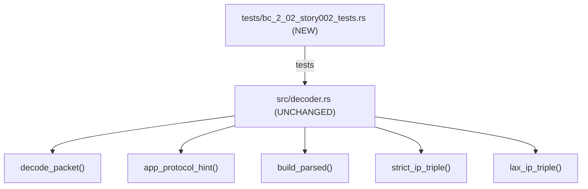
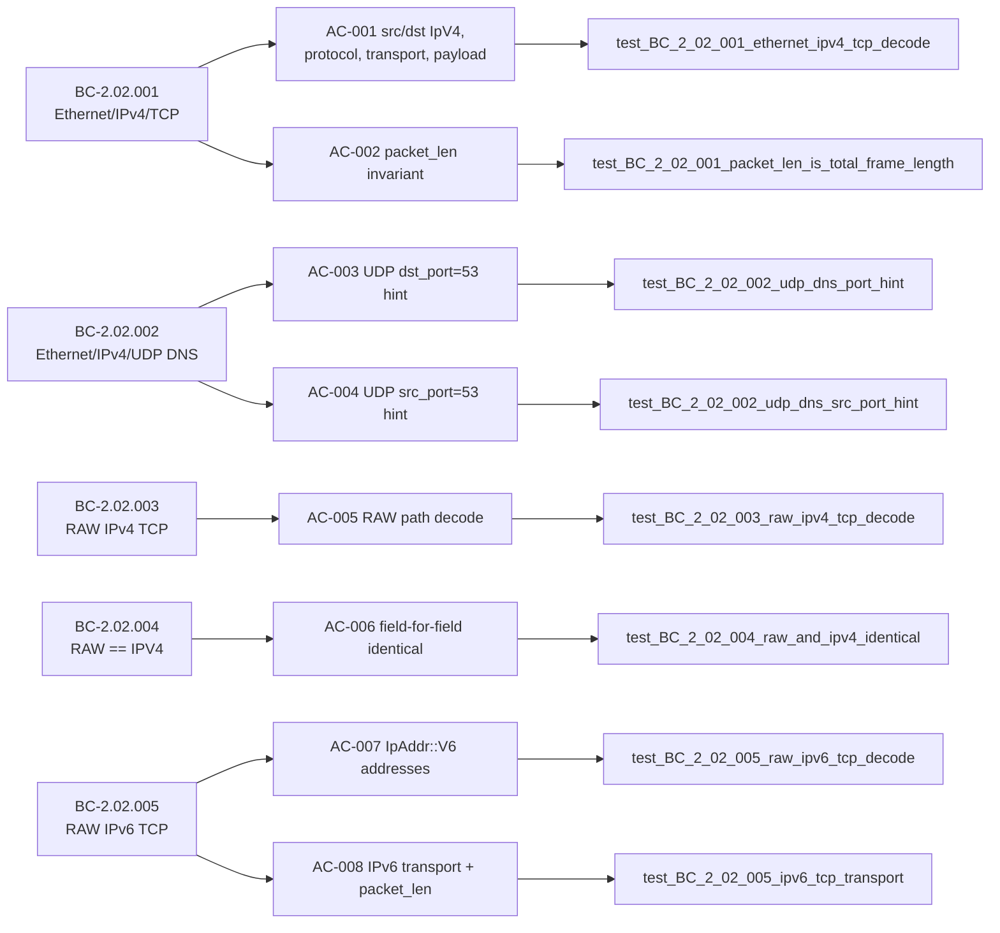

## Summary

Formalizes behavioral contracts BC-2.02.001 through BC-2.02.005 for wirerust's packet decoder as BC-anchored regression tests under the `brownfield-formalization` strategy. The decoder already satisfies all five BCs; these 24 tests make compliance explicit and regression-proof. **No `src/` files are modified** — the only diff is a new test file.

- **Story:** STORY-002 v1.6 — Packet Decoding: Ethernet, RAW/IPV4, IPv6 Link-Layer Paths
- **Strategy:** brownfield-formalization (implementation pre-exists; tests are new)
- **Adversarial convergence:** 9 passes, 3 consecutive clean (passes 7, 8, 9)

---

## Architecture Changes

No source code changes. New integration-test file only.



---

## Story Dependencies


STORY-001 merged at commit b7424b7 (#106). STORY-002 depends on STORY-001. No other dependencies.

---

## Spec Traceability



### Full test inventory (24 tests in `tests/bc_2_02_story002_tests.rs`)

| Test | AC / EC | BC clause |
|------|---------|-----------|
| `test_BC_2_02_001_ethernet_ipv4_tcp_decode` | AC-001 | BC-2.02.001 PC2,3,4,5 |
| `test_BC_2_02_001_packet_len_is_total_frame_length` | AC-002 | BC-2.02.001 PC6 + INV1 |
| `test_BC_2_02_002_udp_dns_port_hint` | AC-003 | BC-2.02.002 PC2,3,4,6 |
| `test_BC_2_02_002_udp_dns_src_port_hint` | AC-004 | BC-2.02.002 PC2,6 |
| `test_BC_2_02_003_raw_ipv4_tcp_decode` | AC-005 | BC-2.02.003 PC2,3,4 |
| `test_BC_2_02_004_raw_and_ipv4_identical` | AC-006 | BC-2.02.004 PC2,3 |
| `test_BC_2_02_005_raw_ipv6_tcp_decode` | AC-007 | BC-2.02.005 PC2,3 |
| `test_BC_2_02_005_ipv6_tcp_transport` | AC-008 | BC-2.02.005 PC4,5,6 |
| `test_BC_2_02_001_proptest_packet_len_equals_data_len` | Task 8 | BC-2.02.001 INV1 + BC-2.02.005 PC6 |
| `test_BC_2_02_001_ec001_tcp_syn_only_flags` | EC-001 | BC-2.02.001 EC-001 |
| `test_BC_2_02_001_ec003_tcp_pure_ack_empty_payload` | EC-002 | BC-2.02.001 EC-003 |
| `test_BC_2_02_002_ec003_udp_port_80_http_hint` | EC-003 | BC-2.02.002 EC-005 |
| `test_BC_2_02_002_ec004_udp_unknown_port_no_hint` | EC-004 | BC-2.02.002 EC-003 |
| `test_BC_2_02_004_ec005_ipv4_datalink_identical_to_raw` | EC-005 | BC-2.02.004 PC3 |
| `test_BC_2_02_005_ec006_ipv6_loopback_decoded_normally` | EC-006 | BC-2.02.005 EC-004 |
| `test_BC_2_02_005_ec007_ipv6_extension_headers_tcp_surfaced` | EC-007 | BC-2.02.005 EC-005 |
| `test_BC_2_02_002_app_protocol_hint_full_port_table` | Task 7 | BC-2.02.002 (7-port table) |
| `test_BC_2_02_005_ec002_raw_ipv6_udp_dns_hint` | m1 EC-002 | BC-2.02.005 PC2,3,6 + PC-UDP |
| `test_BC_2_02_005_ec003_raw_ipv6_icmpv6_protocol_icmp` | m1 EC-003 | BC-2.02.005 EC-003 |
| `test_BC_2_02_001_ec002_tcp_syn_ack_flags` | m2 EC-002 | BC-2.02.001 INV2 |
| `test_BC_2_02_001_tcp_rst_flag_positively_asserted` | m2 INV2 | BC-2.02.001 INV2 |
| `test_BC_2_02_001_tcp_fin_flag_positively_asserted` | m2 INV2 | BC-2.02.001 INV2 |
| `test_BC_2_02_005_invariant1_lax_path_recovers_ipv6_addresses` | m3 INV1 | BC-2.02.005 INV1 |
| `test_BC_2_02_004_raw_and_ipv4_both_err_on_garbage` | m3 PC1 | BC-2.02.004 PC1 |

---

## Test Evidence

| Metric | Value |
|--------|-------|
| Test file | `tests/bc_2_02_story002_tests.rs` |
| Total tests | 24 (8 AC-anchored, 1 proptest, 8 EC, 7 supplemental m1/m2/m3) |
| Pass / Fail | 24 / 0 |
| Proptest cases | 1000 (3 link paths × payload sizes 0..=255) |
| Clippy | Clean (RUSTFLAGS=-Dwarnings) |
| fmt | Clean (rustfmt.toml edition 2024, max_width=100) |
| Coverage scope | BC-2.02.001 PC2,3,4,5,6,INV1,INV2; BC-2.02.002 PC2,3,4,6,INV2; BC-2.02.003 PC2,3,4; BC-2.02.004 PC1,2,3; BC-2.02.005 PC2,3,4,5,6,INV1 |

---

## Demo Evidence

Demo evidence was recorded locally for all 8 ACs (24 tests) at:

```
.factory/cycles/v0.1.0-greenfield-spec/STORY-002/demos/
```

This path is under `.factory/` which is gitignored on develop. The evidence is intentionally not committed per the task brief. The local recordings confirm 8/8 ACs pass on the feature branch.

---

## Holdout Evaluation

N/A — evaluated at wave gate.

---

## Adversarial Review

**Convergence achieved.** 9 adversarial passes, 3 consecutive clean passes (passes 7, 8, 9).

| Pass | Findings | Blocking | Fixed | Status |
|------|----------|----------|-------|--------|
| 1..6 | Multiple | Multiple | All | Fixed iteratively |
| 7 | 0 | 0 | — | CLEAN |
| 8 | 0 | 0 | — | CLEAN |
| 9 | 0 | 0 | — | CLEAN |

Story spec was updated through v1.6 with comprehensive AC-trace audits (adversarial fixes across passes 3–6 included widened AC traces, corrected architecture mapping spans, and added lax_ip_triple coverage).

---

## Security Review

No new production code. The added test file uses only:
- `std::net::{IpAddr, Ipv4Addr, Ipv6Addr}` (stdlib)
- `pcap_file::DataLink` (external crate, no new version)
- `proptest::prelude::*` (test framework, already in dev-dependencies)
- `wirerust::decoder::{Protocol, TransportInfo, decode_packet}` (existing internal API)

No I/O, no network calls, no unsafe blocks, no new dependencies. Security risk: None.

---

## Risk Assessment

| Dimension | Assessment |
|-----------|-----------|
| Blast radius | Minimal — test-only file, zero src/ changes |
| Performance impact | None — no changes to hot path |
| Rollback | `git revert <commit>` removes the test file; no state to unwind |
| Dependency risk | None — no new Cargo.toml entries |

---

## AI Pipeline Metadata

| Field | Value |
|-------|-------|
| Pipeline mode | VSDD factory brownfield-formalization |
| Story cycle | v0.1.0-greenfield-spec |
| Wave | 2 |
| Story version | v1.6 |
| Adversarial passes | 9 (3 consecutive clean: 7/8/9) |

---

## Pre-Merge Checklist

- [x] PR description matches actual diff
- [x] All 8 ACs covered by named tests
- [x] Traceability chain complete: BC → AC → Test → Code
- [x] `cargo test --all-targets` passes (24/24 new tests + full suite)
- [x] `cargo clippy --all-targets -- -D warnings` clean
- [x] `cargo fmt --check` clean
- [x] Rebased onto origin/develop (at commit 8b514c0)
- [x] .factory/ content not included in diff
- [x] No src/ modifications
- [x] Semantic PR title uses `test:` type (CI-enforced)
- [x] Dependency (STORY-001, PR #106) already merged
