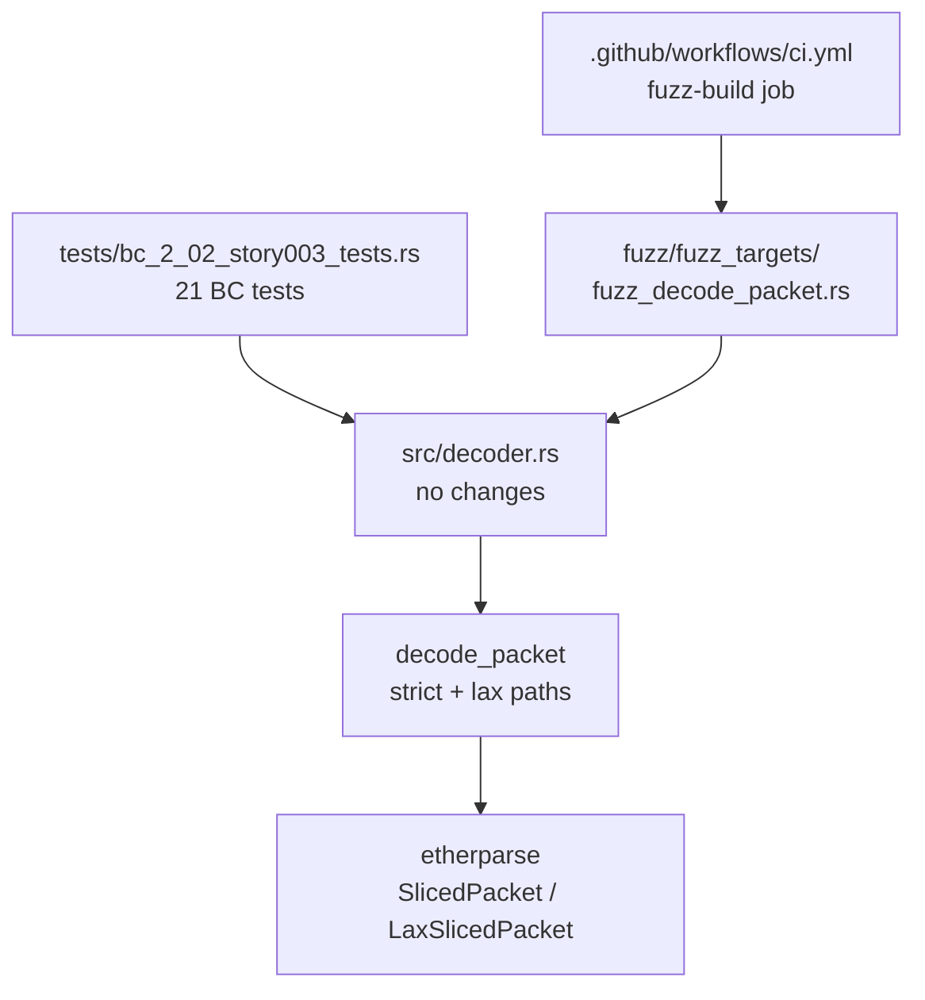
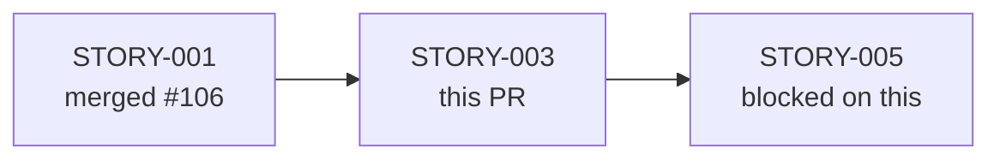
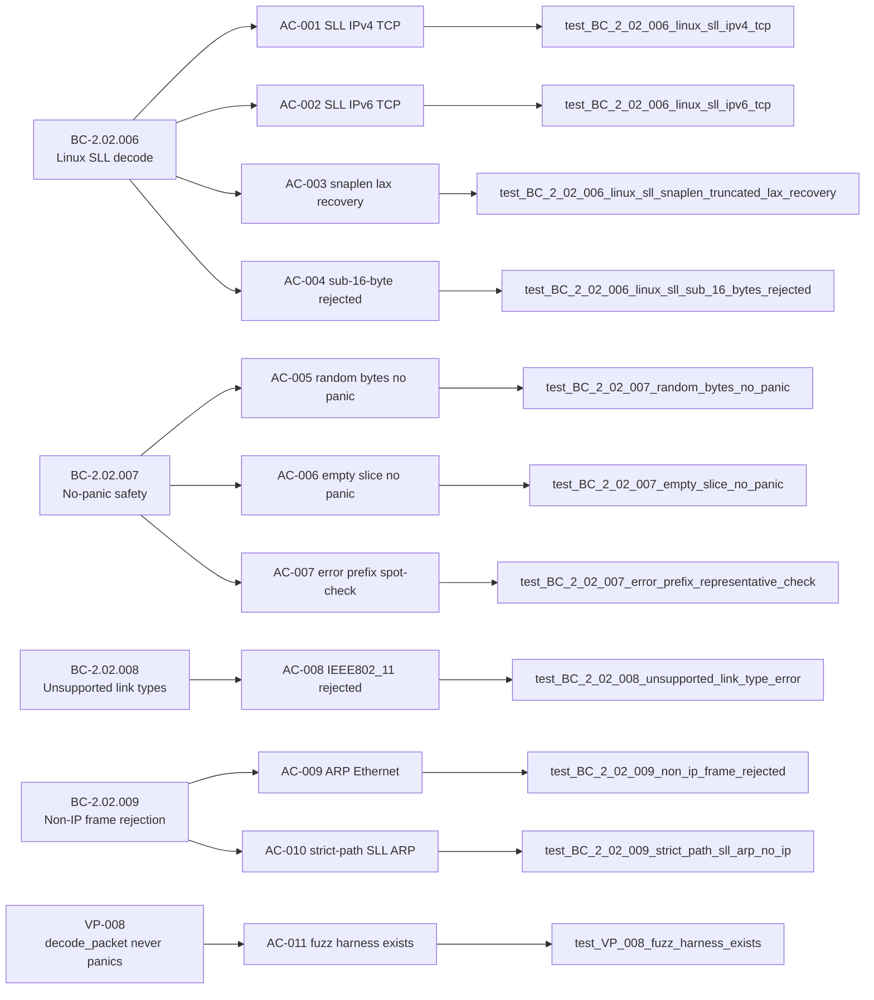

## Summary

Add 21 behavioral-contract tests for `decode_packet` covering Linux SLL
(cooked-capture), no-panic safety, and non-IP frame rejection (BC-2.02.006
through BC-2.02.009), plus the VP-008 cargo-fuzz no-panic harness
(`fuzz/fuzz_targets/fuzz_decode_packet.rs`) and a `fuzz-build` CI gate.

This is a brownfield-formalization story: the decoder implementation already
satisfies all BCs; this PR delivers the test proof and the fuzz infrastructure
required by the VSDD factory contract.

---

## Architecture Changes

No source files (`src/`) were modified. The diff is:

- `tests/bc_2_02_story003_tests.rs` — 21 behavioral-contract tests (new file)
- `fuzz/Cargo.toml` — cargo-fuzz sub-crate manifest
- `fuzz/fuzz_targets/fuzz_decode_packet.rs` — VP-008 no-panic harness
- `fuzz/.gitignore` — excludes `fuzz/target/` from VCS
- `fuzz/Cargo.lock` — fuzz sub-crate lockfile
- `.github/workflows/ci.yml` — adds `fuzz-build` job (nightly, build-only)



---

## Story Dependencies

STORY-003 depends on STORY-001 (PcapSource/RawPacket). All upstream PRs are merged.



---

## Spec Traceability



---

## Test Evidence

| Metric | Value |
|--------|-------|
| Test file | `tests/bc_2_02_story003_tests.rs` |
| Total tests | 21 |
| Tests passed | 21 / 21 (100%) |
| AC coverage | 11 / 11 ACs (100%) |
| EC coverage | 7 / 7 edge cases |
| VP-008 harness | present, non-empty, `fuzz_target!` macro confirmed |
| No `src/` modifications | confirmed |

**Full suite output (local run before this PR):**

```
running 21 tests
test test_BC_2_02_008_unsupported_link_type_error ... ok
test test_BC_2_02_007_ec004_empty_data_sll ... ok
test test_BC_2_02_006_ec003_sll_sub_16_bytes_no_lax_retry ... ok
test test_BC_2_02_008_ec005_ieee802_11_rejected ... ok
test test_BC_2_02_006_linux_sll_sub_16_bytes_rejected ... ok
test test_BC_2_02_007_random_bytes_no_panic ... ok
test test_BC_2_02_007_empty_slice_no_panic ... ok
test test_BC_2_02_006_linux_sll_ipv4_tcp ... ok
test test_BC_2_02_009_ec006_arp_ethernet_no_ip_layer ... ok
test test_BC_2_02_006_linux_sll_ipv6_udp ... ok
test test_BC_2_02_006_ec002_sll_snaplen_lax_invoked ... ok
test test_BC_2_02_006_linux_sll_exactly_16_bytes_no_payload ... ok
test test_BC_2_02_007_random_bytes_ethernet_no_panic ... ok
test test_BC_2_02_006_ec001_sll_ipv4_tcp_strict_path ... ok
test test_BC_2_02_006_linux_sll_ipv6_tcp ... ok
test test_BC_2_02_007_error_prefix_representative_check ... ok
test test_BC_2_02_006_linux_sll_snaplen_truncated_lax_recovery ... ok
test test_BC_2_02_009_ec007_custom_ethertype_no_ip_layer ... ok
test test_BC_2_02_009_non_ip_frame_rejected ... ok
test test_BC_2_02_009_strict_path_sll_arp_no_ip ... ok
test test_VP_008_fuzz_harness_exists ... ok

test result: ok. 21 passed; 0 failed; 0 ignored; 0 measured; 0 filtered out; finished in 0.00s
```

---

## Adversarial Convergence

Per-story adversarial review ran 10 passes. Convergence achieved at pass 8 with 3 consecutive clean passes (passes 8, 9, 10).

| Pass | Findings | Blocking | Status |
|------|----------|----------|--------|
| 1–5  | Various  | Multiple | Fixed  |
| 6    | 1        | 0        | Clean  |
| 7    | 1        | 0        | Clean  |
| 8    | 0        | 0        | CLEAN  |
| 9    | 0        | 0        | CLEAN  |
| 10   | 0        | 0        | CLEAN — CONVERGED |

---

## Demo Evidence

Demo recordings were produced locally for each of the 11 ACs using VHS 0.11.0.
Per delivery instructions, demo evidence is **not committed** — it lives at
`.factory/cycles/v0.1.0-greenfield-spec/STORY-003/demos/` (local only).

| AC | Recording |
|----|-----------|
| AC-001 | AC-001-linux-sll-ipv4-tcp.{gif,webm,tape} |
| AC-002 | AC-002-linux-sll-ipv6-tcp.{gif,webm,tape} |
| AC-003 | AC-003-sll-snaplen-lax-recovery.{gif,webm,tape} |
| AC-004 | AC-004-sll-sub-16-bytes-rejected.{gif,webm,tape} |
| AC-005 | AC-005-random-bytes-no-panic.{gif,webm,tape} |
| AC-006 | AC-006-empty-slice-no-panic.{gif,webm,tape} |
| AC-007 | AC-007-error-prefix-representative-check.{gif,webm,tape} |
| AC-008 | AC-008-unsupported-link-type-error.{gif,webm,tape} |
| AC-009 | AC-009-non-ip-frame-rejected.{gif,webm,tape} |
| AC-010 | AC-010-strict-path-sll-arp-no-ip.{gif,webm,tape} |
| AC-011 | AC-011-vp008-fuzz-harness-exists.{gif,webm,tape} |

11 ACs with recordings — coverage: 11 / 11.

---

## Holdout Evaluation

N/A — evaluated at wave gate.

---

## Adversarial Review

10 passes total; 3 consecutive clean passes (passes 8, 9, 10). Converged.

Key findings addressed during adversarial passes:
- AC-007 reworded from exhaustive universal claim to representative spot-check (STORY-003.md v1.2)
- lax_parse Architecture Mapping corrected to full function body range (v1.3)
- AC-011 widened to assert unsupported DataLink variants are also exercised (v1.4)
- AC-010 corrected to strict-path only; lax-path arm documented as structurally unreachable per etherparse 0.16 (v1.5)

---

## Security Review

Scope: test-only and fuzz infrastructure. No network I/O, no file I/O in the new code paths. The fuzz harness is build-only in CI (never executed). No injection surfaces, no auth changes, no OWASP exposure introduced.

---

## Risk Assessment

| Dimension | Assessment |
|-----------|-----------|
| Blast radius | Minimal — no `src/` changes; tests-only |
| Performance impact | None — test/fuzz code is not in the production binary |
| Rollback | Remove the 5 new files; zero production impact |
| Dependency changes | `fuzz/Cargo.toml` adds libfuzzer-sys (nightly sub-crate only, isolated) |

---

## AI Pipeline Metadata

| Field | Value |
|-------|-------|
| Story | STORY-003 v1.5 |
| Cycle | v0.1.0-greenfield-spec |
| Wave | 2 |
| Mode | brownfield-formalization |
| Adversarial passes | 10 (3 clean: 8/9/10) |
| Models used | claude-sonnet-4-6 |

---

## Pre-Merge Checklist

- [x] PR description matches actual diff
- [x] All 11 ACs covered by tests and demo evidence
- [x] Traceability chain complete: BC → AC → Test → Code
- [x] No `src/` modifications
- [x] Semantic PR title: `test:` type
- [x] Adversarial convergence achieved (3 clean passes)
- [x] `fuzz/target/` excluded from diff (covered by `fuzz/.gitignore`)
- [x] `.factory/` not in PR diff (gitignored on develop)
- [x] Demo evidence local-only (not committed)
- [ ] CI green (pending)
- [ ] PR reviewer approved (pending)
- [ ] Dependency STORY-001 merged (confirmed: #106)
