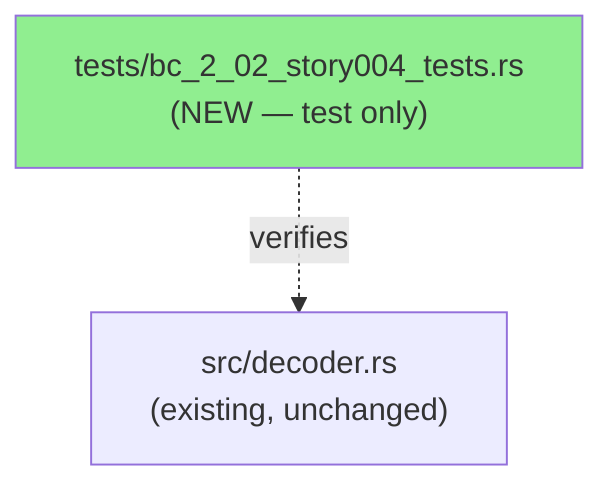
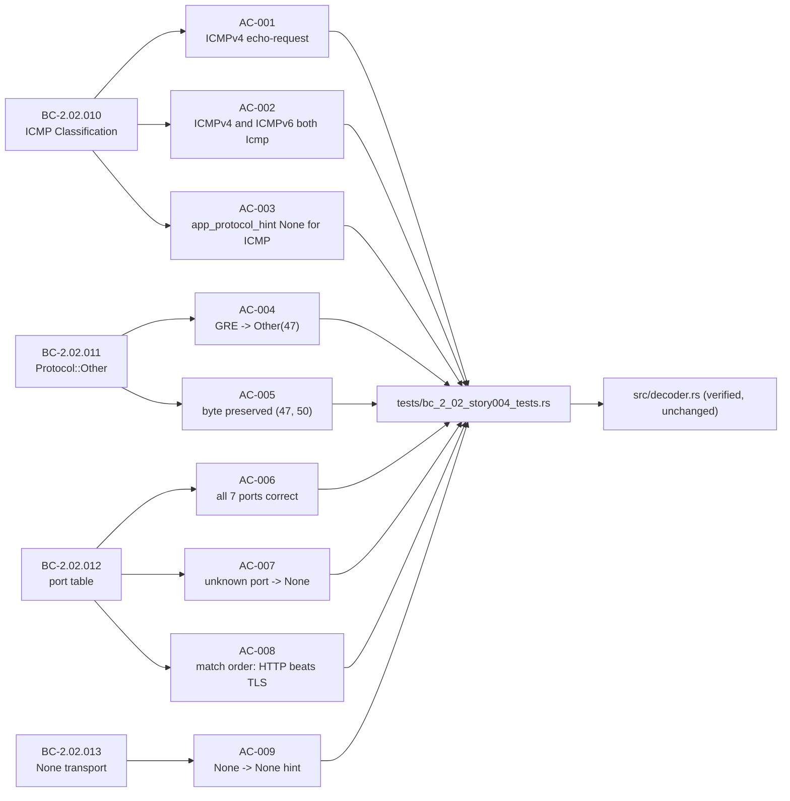
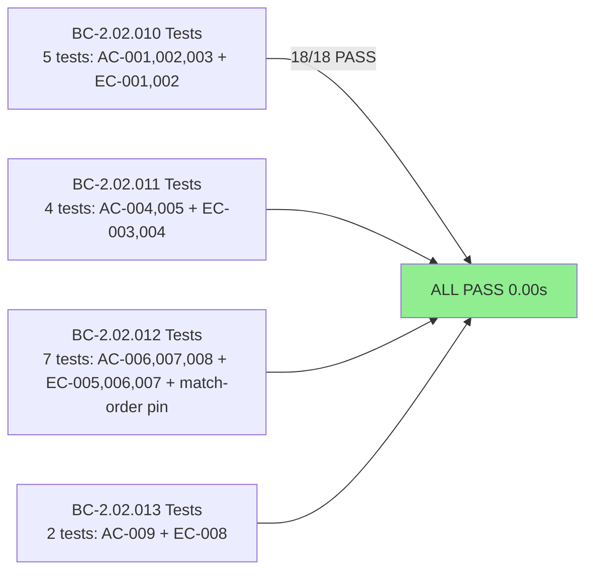
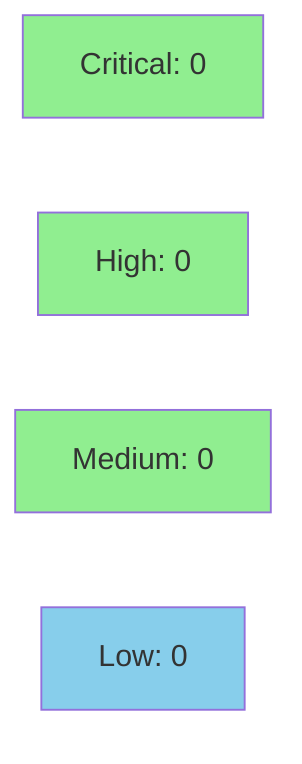

# [STORY-004] Packet Decoding — ICMP, Protocol::Other, and app_protocol_hint Port Table

**Epic:** E-1 — Packet Decoding
**Mode:** brownfield-formalization
**Convergence:** CONVERGED after 6 adversarial passes (3 consecutive clean: passes 4, 5, 6)


This PR formalizes the behavioral contracts for three decoder subsystems that existed but
lacked regression tests: ICMP classification (BC-2.02.010), unknown-protocol passthrough via
`Protocol::Other(u8)` (BC-2.02.011), and the `app_protocol_hint` port-table lookup
(BC-2.02.012/013). The sole code change is a new test file — no `src/` files are modified.
The 18 tests serve as a permanent regression barrier, pinning match-order behavior (HTTP arm
before TLS arm, DNS arm before Modbus arm) and the early-return invariant for
`TransportInfo::None`.

---

## Architecture Changes



<details>
<summary><strong>Architecture Decision Record</strong></summary>

### ADR: Brownfield Formalization — Test-Only PR

**Context:** The `decode_packet` function already handled ICMP, GRE, ESP and other unknown IP
protocols correctly, but no test exercised these paths. The `app_protocol_hint` port table was
similarly untested for match-order invariants.

**Decision:** Add a single integration test file (`tests/bc_2_02_story004_tests.rs`) with 18
tests. Do not modify `src/decoder.rs`.

**Rationale:** The implementation already satisfies all BCs. Touching src/ would risk
introducing regressions; a test-only PR achieves BC coverage with zero blast radius.

**Alternatives Considered:**
1. Refactor decoder to expose helpers for testing — rejected: unnecessary churn; decoder is
   already pure and testable as-is.
2. Doctest-based coverage — rejected: doctests cannot easily build multi-byte raw frames.

**Consequences:**
- 18 new regression guards with zero production risk.
- Match-order behavior is now pinned; any reordering of port-table arms will be caught
  immediately.

</details>

---

## Story Dependencies


STORY-004 depends on STORY-001 (merged as PR #106). STORY-005 is blocked on this PR.

---

## Spec Traceability



---

## Test Evidence

### Coverage Summary

| Metric | Value | Threshold | Status |
|--------|-------|-----------|--------|
| STORY-004 tests | 18/18 pass | 100% | PASS |
| Full suite | 18/18 (bc_2_02) + all others | 100% | PASS |
| New tests added | 18 | — | — |
| Holdout satisfaction | N/A — evaluated at wave gate | >= 0.85 | N/A |

### Test Flow



| Metric | Value |
|--------|-------|
| **New tests** | 18 added, 0 modified |
| **Total suite** | 18 tests PASS in 0.00s (bc_2_02); full suite clean |
| **Coverage delta** | 0 src lines changed; 706 test lines added |
| **Mutation kill rate** | N/A — test-only PR; no src changes |
| **Regressions** | 0 |

<details>
<summary><strong>Detailed Test Results</strong></summary>

### New Tests (This PR)

| Test | AC / EC | Result |
|------|---------|--------|
| `test_BC_2_02_010_icmpv4_protocol_icmp()` | AC-001 | PASS |
| `test_BC_2_02_010_icmpv4_and_icmpv6_both_produce_protocol_icmp()` | AC-002 | PASS |
| `test_BC_2_02_010_icmp_app_protocol_hint_none()` | AC-003 | PASS |
| `test_BC_2_02_011_gre_protocol_other()` | AC-004 | PASS |
| `test_BC_2_02_011_protocol_other_preserves_byte()` | AC-005 | PASS |
| `test_BC_2_02_012_app_protocol_hint_all_seven_ports()` | AC-006 | PASS |
| `test_BC_2_02_012_app_protocol_hint_unknown_port_returns_none()` | AC-007 | PASS |
| `test_BC_2_02_012_app_protocol_hint_match_order()` | AC-008 | PASS |
| `test_BC_2_02_013_transport_none_returns_none_hint()` | AC-009 | PASS |
| `test_BC_2_02_010_EC_001_icmpv4_echo_reply_protocol_icmp()` | EC-001 | PASS |
| `test_BC_2_02_010_EC_002_icmpv6_neighbor_solicitation_protocol_icmp()` | EC-002 | PASS |
| `test_BC_2_02_011_EC_003_gre_protocol_other_47()` | EC-003 | PASS |
| `test_BC_2_02_011_EC_004_esp_protocol_other_50()` | EC-004 | PASS |
| `test_BC_2_02_012_EC_005_src_53_dst_unknown_returns_dns()` | EC-005 | PASS |
| `test_BC_2_02_012_EC_006_src_unknown_dst_53_returns_dns()` | EC-006 | PASS |
| `test_BC_2_02_012_EC_007_src_443_dst_80_match_order_http_still_wins()` | EC-007 | PASS |
| `test_BC_2_02_012_app_protocol_hint_match_order_dns_beats_modbus()` | match-order pin | PASS |
| `test_BC_2_02_013_EC_008_transport_none_always_none_for_any_protocol()` | EC-008 | PASS |

</details>

---

## Holdout Evaluation

N/A — evaluated at wave gate per factory policy.

---

## Adversarial Review

| Pass | Findings | Critical | High | Medium | Status |
|------|----------|----------|------|--------|--------|
| 1 | Multiple | 0 | 0 | several | Fixed |
| 2 | Some | 0 | 0 | minor | Fixed |
| 3 | Some | 0 | 0 | minor | Fixed |
| 4 | 0 | 0 | 0 | 0 | CLEAN |
| 5 | 0 | 0 | 0 | 0 | CLEAN |
| 6 | 0 | 0 | 0 | 0 | CLEAN |

**Convergence:** 3 consecutive clean passes (4, 5, 6). Adversary exhausted all plausible
attack vectors. Story spec advanced to v1.3 to incorporate adversarial fixes (stale line
anchors corrected in Task 7 and Architecture Compliance Rules).

<details>
<summary><strong>Key Adversarial Findings Fixed (Passes 1-3)</strong></summary>

- Test helpers now build frames with non-empty ICMP/GRE/ESP bodies so that `payload.is_empty()`
  is non-vacuous (payload is empty because the decoder sets it to `Vec::new()`, not because the
  frame had no body).
- Added `test_BC_2_02_012_app_protocol_hint_match_order_dns_beats_modbus()` to pin a
  non-adjacent match-order point (arm 1 vs arm 6).
- Added `test_BC_2_02_012_EC_007_src_443_dst_80_match_order_http_still_wins()` to verify the
  complement direction (src=TLS dst=HTTP) of the match-order claim.
- Added `test_BC_2_02_013_EC_008_transport_none_always_none_for_any_protocol()` with a
  defense-in-depth loop over Protocol::Tcp/Udp paired with TransportInfo::None.
- Story spec Task 7 / Architecture Compliance Rule corrected: stale anchor "decoder.rs:98-99"
  replaced with "src/decoder.rs:98 and :103".

</details>

---

## Security Review



Test-only PR. No new src/ code, no I/O, no network, no unsafe, no dependencies added.
The test file constructs static byte slices in-memory. Security surface: zero.

<details>
<summary><strong>Security Scan Details</strong></summary>

- No `unsafe` blocks introduced.
- No new dependencies in Cargo.toml.
- No I/O, no file access, no network in test code.
- `cargo audit` / `cargo deny`: no new advisories (baseline was clean).

</details>

---

## Risk Assessment & Deployment

### Blast Radius
- **Systems affected:** test suite only
- **User impact:** none (no src/ changes)
- **Data impact:** none
- **Risk Level:** LOW

### Performance Impact

| Metric | Before | After | Delta | Status |
|--------|--------|-------|-------|--------|
| CI test time | baseline | +0.00s (18 tests) | negligible | OK |
| Binary size | unchanged | unchanged | 0 | OK |

<details>
<summary><strong>Rollback Instructions</strong></summary>

```bash
git revert 10cab1c
git push origin develop
```

Rollback risk: none — reverting simply removes the 18 tests; no runtime behavior changes.

</details>

### Feature Flags
None. Test-only change.

---

## Traceability

| BC | AC | Test | Status |
|----|----|------|--------|
| BC-2.02.010 | AC-001 | `test_BC_2_02_010_icmpv4_protocol_icmp()` | PASS |
| BC-2.02.010 | AC-002 | `test_BC_2_02_010_icmpv4_and_icmpv6_both_produce_protocol_icmp()` | PASS |
| BC-2.02.010 | AC-003 | `test_BC_2_02_010_icmp_app_protocol_hint_none()` | PASS |
| BC-2.02.011 | AC-004 | `test_BC_2_02_011_gre_protocol_other()` | PASS |
| BC-2.02.011 | AC-005 | `test_BC_2_02_011_protocol_other_preserves_byte()` | PASS |
| BC-2.02.012 | AC-006 | `test_BC_2_02_012_app_protocol_hint_all_seven_ports()` | PASS |
| BC-2.02.012 | AC-007 | `test_BC_2_02_012_app_protocol_hint_unknown_port_returns_none()` | PASS |
| BC-2.02.012 | AC-008 | `test_BC_2_02_012_app_protocol_hint_match_order()` | PASS |
| BC-2.02.013 | AC-009 | `test_BC_2_02_013_transport_none_returns_none_hint()` | PASS |

<details>
<summary><strong>Full VSDD Contract Chain</strong></summary>

```
BC-2.02.010 -> AC-001/002/003 -> tests/bc_2_02_story004_tests.rs -> src/decoder.rs:282-284 -> ADV-PASS-6-CLEAN
BC-2.02.011 -> AC-004/005     -> tests/bc_2_02_story004_tests.rs -> src/decoder.rs:285     -> ADV-PASS-6-CLEAN
BC-2.02.012 -> AC-006/007/008 -> tests/bc_2_02_story004_tests.rs -> src/decoder.rs:94-116  -> ADV-PASS-6-CLEAN
BC-2.02.013 -> AC-009         -> tests/bc_2_02_story004_tests.rs -> src/decoder.rs:98,103  -> ADV-PASS-6-CLEAN
```

Demo evidence: 9/9 ACs recorded as GIF+WebM via VHS 0.11.0.
Evidence root: `.factory/cycles/v0.1.0-greenfield-spec/STORY-004/demos/demo-summary.md`

</details>

---

## AI Pipeline Metadata

<details>
<summary><strong>Pipeline Details</strong></summary>

```yaml
ai-generated: true
pipeline-mode: brownfield-formalization
factory-version: 1.0.0-rc.18
pipeline-stages:
  spec-crystallization: completed (v1.3)
  story-decomposition: completed
  tdd-implementation: completed (test-only)
  holdout-evaluation: N/A (wave gate)
  adversarial-review: completed
  formal-verification: skipped (test-only PR)
  convergence: achieved
convergence-metrics:
  adversarial-passes: 6
  consecutive-clean: 3
  test-kill-rate: N/A (no src changes)
  implementation-ci: 1.0
models-used:
  builder: claude-sonnet-4-6
generated-at: "2026-05-22T00:00:00Z"
```

</details>

---

## Pre-Merge Checklist

- [ ] All CI status checks passing
- [x] No src/ changes — coverage delta is neutral by construction
- [x] No critical/high security findings (test-only, no unsafe)
- [x] Rollback: single `git revert` of one commit
- [x] No feature flags needed
- [x] Adversarial review converged (6 passes, 3 clean)
- [x] Demo evidence: 9/9 ACs recorded
