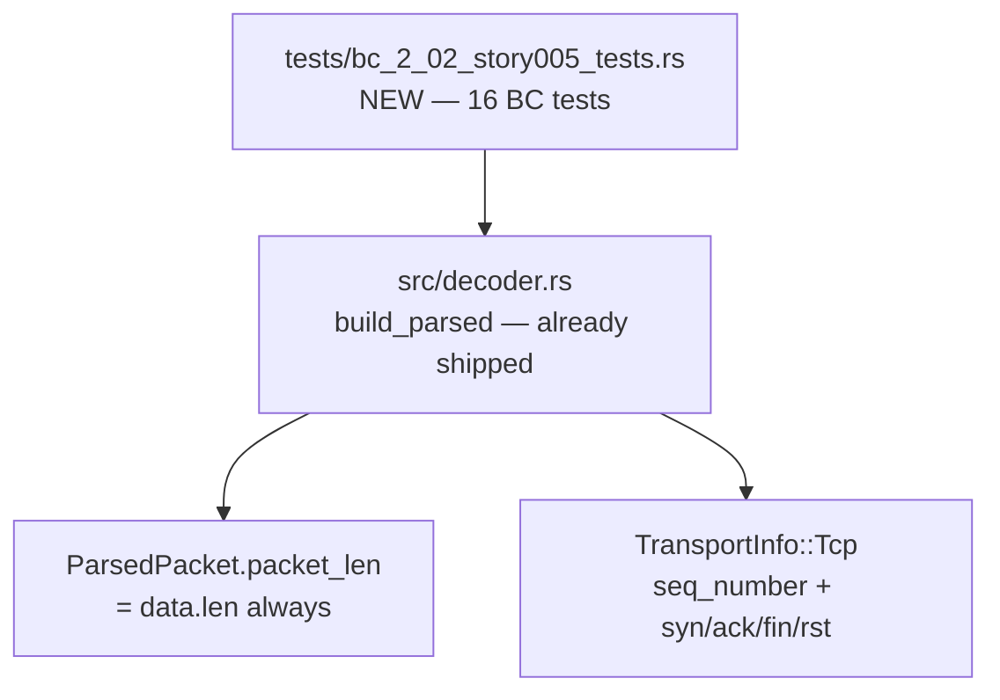
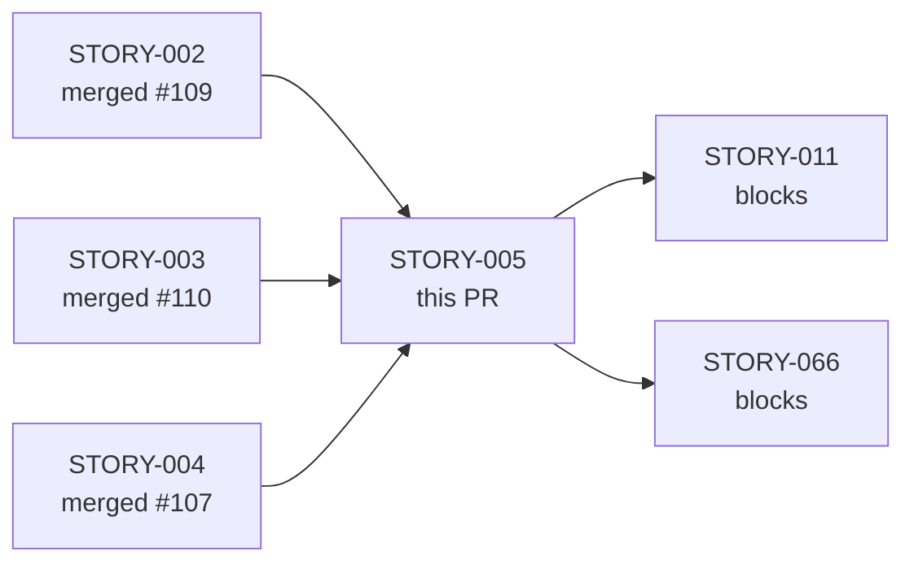
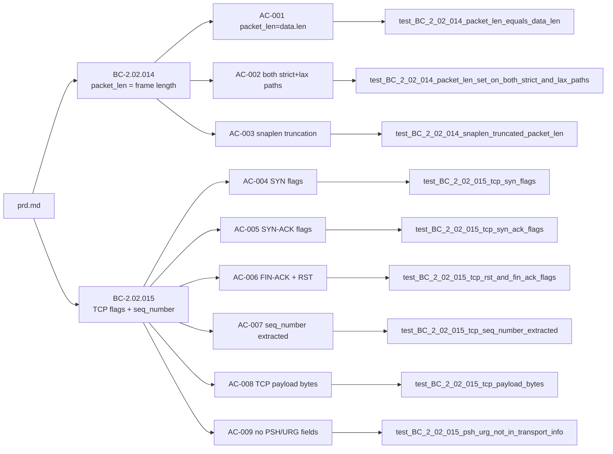

## Summary

Brownfield-formalization of `packet_len` semantics and TCP flag/sequence extraction for the
`wirerust` decoder (STORY-005, Wave 3). Production code in `src/decoder.rs` already shipped;
this PR adds **16 behavioral-contract tests** in `tests/bc_2_02_story005_tests.rs` that
formally specify and lock the contracts from BC-2.02.014 and BC-2.02.015.

No `src/` changes. Test-only PR.

---

## Architecture Changes

_No source changes. Only `tests/bc_2_02_story005_tests.rs` is added._

---

## Story Dependencies

All upstream dependencies (STORY-002, STORY-003, STORY-004) are merged.

---

## Spec Traceability

---

## Test Evidence

| Metric | Value |
|--------|-------|
| New tests | 16 (9 AC tests + 7 EC tests) |
| ACs covered | AC-001 through AC-009 (100%) |
| ECs covered | EC-001 through EC-007 (100%) |
| Test file | `tests/bc_2_02_story005_tests.rs` |
| BCs formalized | BC-2.02.014, BC-2.02.015 |
| Pre-PR local run | All 16 pass (`cargo test --all-targets`) |
| Coverage approach | Brownfield-formalization — production code unchanged |
| Mutation kill rate | N/A (structural/behavioral contract tests, not property-based) |

### AC → Test Mapping

| AC | Test Function | Status |
|----|---------------|--------|
| AC-001 | `test_BC_2_02_014_packet_len_equals_data_len` | Pass |
| AC-002 | `test_BC_2_02_014_packet_len_set_on_both_strict_and_lax_paths` | Pass |
| AC-003 | `test_BC_2_02_014_snaplen_truncated_packet_len` | Pass |
| AC-004 | `test_BC_2_02_015_tcp_syn_flags` | Pass |
| AC-005 | `test_BC_2_02_015_tcp_syn_ack_flags` | Pass |
| AC-006 | `test_BC_2_02_015_tcp_rst_and_fin_ack_flags` | Pass |
| AC-007 | `test_BC_2_02_015_tcp_seq_number_extracted` | Pass |
| AC-008 | `test_BC_2_02_015_tcp_payload_bytes` | Pass |
| AC-009 | `test_BC_2_02_015_psh_urg_not_in_transport_info` | Pass |

### EC → Test Mapping

| EC | Test Function | Status |
|----|---------------|--------|
| EC-001 | `test_BC_2_02_014_ec001_1500_byte_frame_packet_len` | Pass |
| EC-002 | `test_BC_2_02_014_ec002_54_byte_pure_ack` | Pass |
| EC-003 | `test_BC_2_02_014_ec003_snaplen_truncated_at_100` | Pass |
| EC-004 | `test_BC_2_02_015_ec004_seq_number_max_u32` | Pass |
| EC-005 | `test_BC_2_02_015_ec005_all_four_flags_set` | Pass |
| EC-006 | `test_BC_2_02_015_ec006_no_flags_set` | Pass |
| EC-007 | `test_BC_2_02_014_ec007_60_byte_padded_frame` | Pass |

---

## Adversarial Convergence

Per-story fresh-context adversarial review completed before PR creation.

| Pass | Verdict | Notes |
|------|---------|-------|
| Pass 1 | REQUEST_CHANGES | F-1..F-7, N-1 found |
| Pass 2 | REQUEST_CHANGES | F-1, F-3, F-4, F-5, F-6, F-7 remediated |
| Pass 3 | REQUEST_CHANGES | F-2 payload-extraction gap, F-3 AC-002 overclaim |
| Pass 4 | REQUEST_CHANGES | Full AC trace-annotation self-audit |
| Pass 5 | REQUEST_CHANGES | N-4 stale comment, AC-006 ordering |
| Pass 6 | CLEAN | Frozen artifact BC-5.39.001 |
| Pass 7 | CLEAN | Second independent clean pass |
| Pass 8 | CLEAN | Third consecutive clean pass — convergence confirmed |

Final 3 passes (6, 7, 8) all returned VERDICT: CLEAN on the frozen artifact (BC-5.39.001).

---

## Holdout Evaluation

N/A — evaluated at wave gate.

---

## Security Review

Test-only PR. No new production code paths introduced. No user-facing input handling,
authentication changes, or data-flow modifications. The test file builds synthetic
in-memory byte slices — no file I/O, no network I/O, no unsafe code.

Security classification: **LOW** — test-only, no attack surface expansion.

---

## Risk Assessment

| Dimension | Assessment |
|-----------|-----------|
| Blast radius | Minimal — test file only, no src/ changes |
| Performance impact | None — CI tests do not run under perf constraints |
| Rollback cost | Delete test file — zero production impact |
| Dependency risk | None — etherparse already in Cargo.lock |

---

## AI Pipeline Metadata

| Field | Value |
|-------|-------|
| Pipeline mode | Phase 3 Wave 3 brownfield-formalization |
| Story | STORY-005 v1.6 |
| Implementation strategy | brownfield-formalization (tests-only) |
| Adversarial passes | 8 passes; 3 consecutive CLEAN before freeze |

---

## Pre-Merge Checklist

- [x] PR description matches actual diff (test file only)
- [x] All 9 ACs covered by passing tests
- [x] All 7 ECs covered by passing tests
- [x] Traceability chain complete: BC → AC → Test → Code
- [x] All adversarial review findings resolved (3 consecutive CLEAN passes)
- [x] Rebase onto develop@991e821 complete (no conflicts)
- [x] No demo files (.tape/.gif/.webm) in branch diff
- [x] No .factory/ artifacts in branch diff
- [x] PR title is semantic (type: `test`)
- [ ] CI checks passing (pending)
- [ ] PR reviewer approval (pending)
- [ ] Squash-merge into develop
