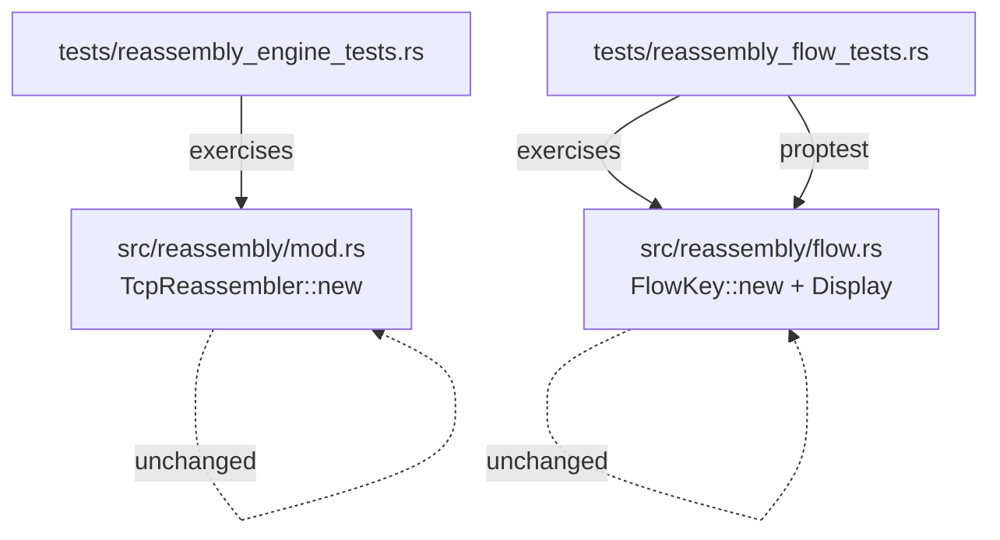
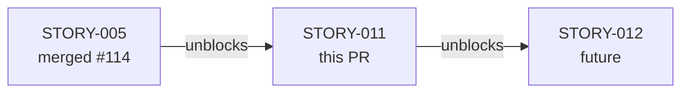
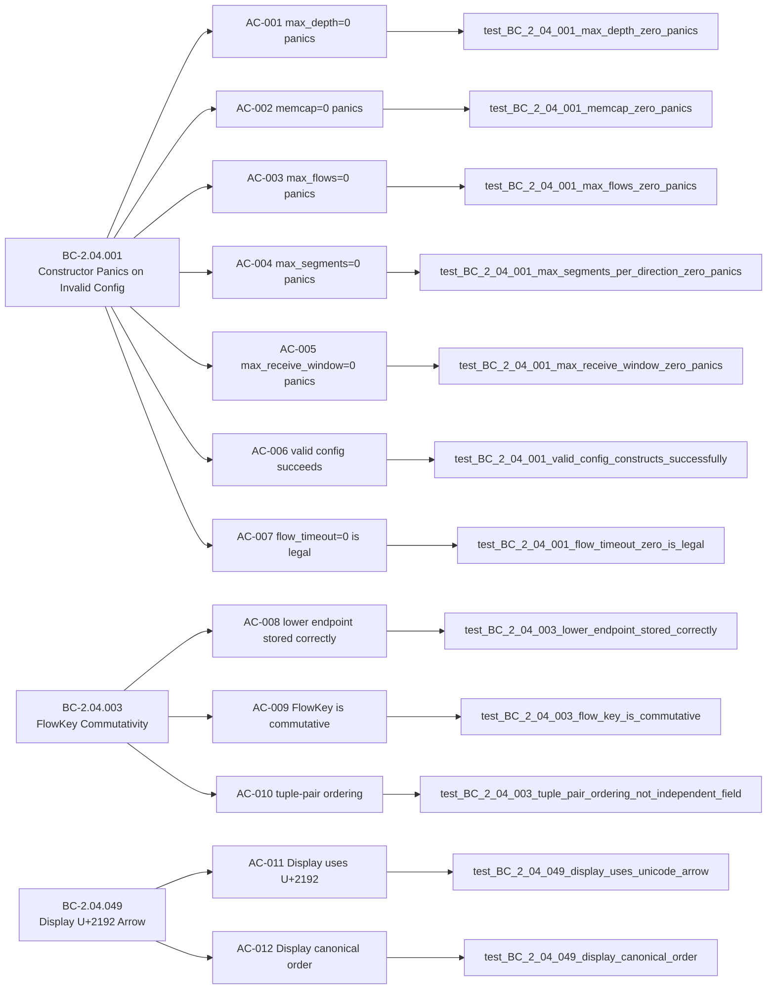

## Summary

This PR formalizes the behavioral contracts for `TcpReassembler` constructor validation and `FlowKey` canonicalization (STORY-011, Phase 3 Wave 4). The implementation (`src/reassembly/`) was already shipped; this story adds the missing behavioral-contract test coverage required by the spec.

**Implementation strategy:** `brownfield-formalization` — zero src/ changes; tests only.

**Adversarial convergence:** 3 consecutive clean fresh-context passes (BC-5.39.001). COMPLETE.

## Architecture Changes

No source changes in this PR. Tests only.

## Story Dependencies

STORY-005 merged as PR #114. No other blocking dependencies.

## Spec Traceability

### BC → AC → Test Chain

| BC | AC | Test | File |
|----|-----|------|------|
| BC-2.04.001 | AC-001 | `test_BC_2_04_001_max_depth_zero_panics` | reassembly_engine_tests.rs |
| BC-2.04.001 | AC-002 | `test_BC_2_04_001_memcap_zero_panics` | reassembly_engine_tests.rs |
| BC-2.04.001 | AC-003 | `test_BC_2_04_001_max_flows_zero_panics` | reassembly_engine_tests.rs |
| BC-2.04.001 | AC-004 | `test_BC_2_04_001_max_segments_per_direction_zero_panics` | reassembly_engine_tests.rs |
| BC-2.04.001 | AC-005 | `test_BC_2_04_001_max_receive_window_zero_panics` | reassembly_engine_tests.rs |
| BC-2.04.001 | AC-006 | `test_BC_2_04_001_valid_config_constructs_successfully` | reassembly_engine_tests.rs |
| BC-2.04.001 | AC-007 | `test_BC_2_04_001_flow_timeout_zero_is_legal` | reassembly_engine_tests.rs |
| BC-2.04.003 | AC-008 | `test_BC_2_04_003_lower_endpoint_stored_correctly` | reassembly_flow_tests.rs |
| BC-2.04.003 | AC-009 | `test_BC_2_04_003_flow_key_is_commutative` | reassembly_flow_tests.rs |
| BC-2.04.003 | AC-010 | `test_BC_2_04_003_tuple_pair_ordering_not_independent_field` | reassembly_flow_tests.rs |
| BC-2.04.049 | AC-011 | `test_BC_2_04_049_display_uses_unicode_arrow` | reassembly_flow_tests.rs |
| BC-2.04.049 | AC-012 | `test_BC_2_04_049_display_canonical_order` | reassembly_flow_tests.rs |

### Edge Case Coverage

| EC | Scenario | Test |
|----|----------|------|
| EC-008 | Same IP, different ports — lower port wins | `test_BC_2_04_003_ec008_same_ip_different_ports_lower_port_wins` |
| EC-009 | IPv4 < IPv6 in IpAddr PartialOrd | `test_BC_2_04_003_ec009_ipv4_lower_than_ipv6` |
| EC-010 | IPv6 display — no RFC-3986 brackets | `test_BC_2_04_049_ec010_display_ipv6_no_rfc3986_brackets` |

### Property-Based Test

| Test | Library | Covers |
|------|---------|--------|
| `test_BC_2_04_003_proptest_flowkey_commutativity` | proptest | AC-009 commutativity for arbitrary IPv4 endpoints |

## Test Evidence

- **Files modified:** `tests/reassembly_engine_tests.rs` (+160 lines), `tests/reassembly_flow_tests.rs` (+476 lines)
- **New tests:** 16 deterministic behavioral-contract tests + 1 proptest property test = 17 total
- **Test breakdown:**
  - 7 constructor validation tests (BC-2.04.001, AC-001..AC-007)
  - 9 FlowKey / Display tests (BC-2.04.003 + BC-2.04.049, AC-008..AC-012 + EC-008..EC-010)
  - 1 proptest commutativity property (BC-2.04.003, AC-009)
- **TDD gate:** RED GATE commit `d23a686` (stub suite failing) → GREEN commit `3a5dd07` (all passing) → coverage-gap closure `9caf67c` (M-2/M-3 FlowKey ordering)
- **Purity verification:** `FlowKey::new` is pure-core (deterministic, no I/O); `TcpReassembler::new` is effectful-shell (panics on invalid config)
- **No src/ changes:** `cargo diff --stat` shows only test files modified

## Holdout Evaluation

N/A — evaluated at wave gate.

## Adversarial Review

Per-story adversarial convergence: **COMPLETE** — 3 consecutive clean fresh-context passes (BC-5.39.001). No open findings.

## Security Review

Test-only PR; no new src/ code introduced. No attack surface changes. Security review: **PASS — no findings** (test additions, no production code changes).

## Risk Assessment

- **Blast radius:** Minimal — test files only. No production code modified.
- **Performance impact:** None — test additions do not affect runtime.
- **Regression risk:** Low — brownfield formalization; tests verify existing behavior that was already passing.

## AI Pipeline Metadata

- **Pipeline mode:** brownfield-formalization (TDD strict)
- **Models used:** claude-sonnet-4-6
- **Story points:** 5
- **Wave:** 4 (Phase 3)

## Pre-Merge Checklist

- [x] PR description populated with full traceability
- [x] Demo evidence: N/A — brownfield-formalization test-only PR (no user-facing behavior added)
- [x] All 12 ACs covered by named tests
- [x] 3 edge cases covered (EC-008, EC-009, EC-010)
- [x] 1 proptest property test for commutativity
- [x] No src/ changes in diff
- [x] No demo files (.tape/.gif/.webm) in diff
- [x] No .factory/ artifacts in diff
- [x] proptest-regressions file excluded from PR (untracked, gitignored)
- [x] Semantic PR title: `test: formalize TcpReassembler constructor validation and FlowKey canonicalization (STORY-011)`
- [x] Targets develop branch
- [x] Adversarial convergence: 3 clean passes
- [ ] CI passing
- [ ] pr-reviewer approval
- [ ] Squash merge executed
