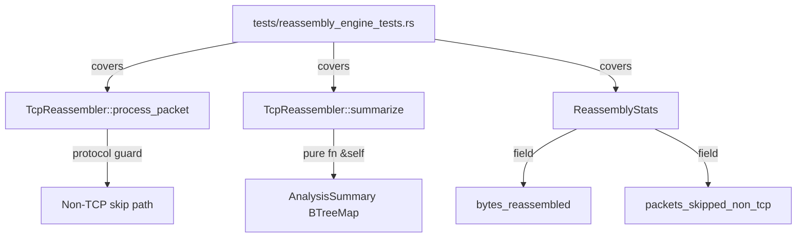
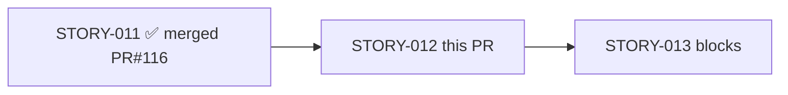
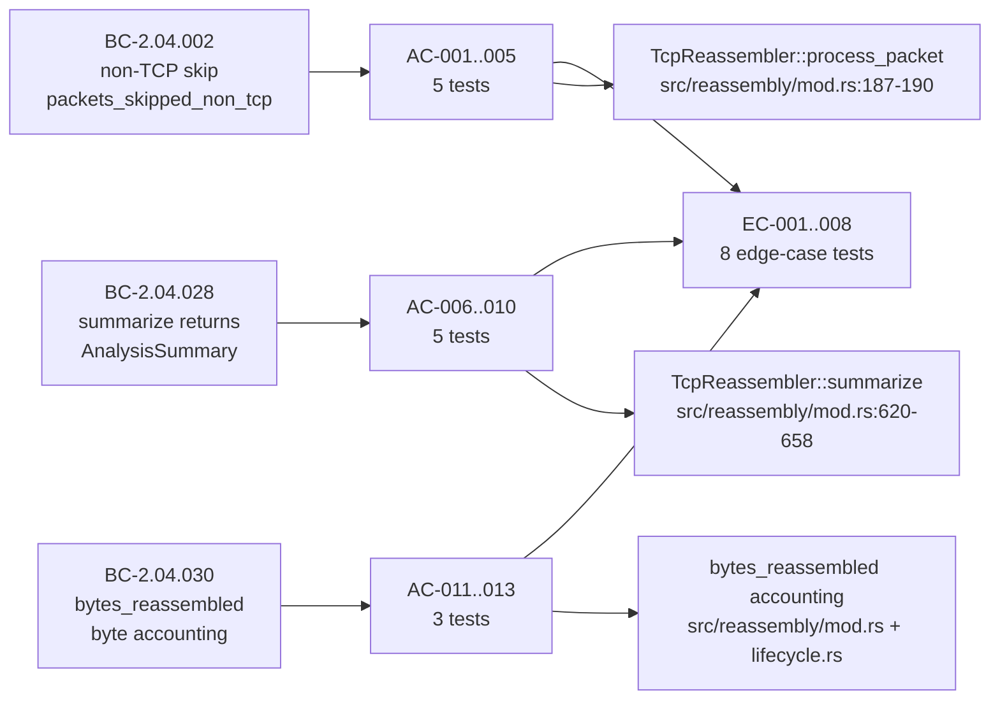

## Summary

Brownfield-formalization of STORY-012: Non-TCP Packet Filter, Statistics Summary, and
`bytes_reassembled` Accounting. Adds 21 behavioral-contract tests (13 AC + 8 EC) to
`tests/reassembly_engine_tests.rs` that encode and permanently lock the existing runtime
behavior of the TCP reassembly engine across three behavioral contracts
(BC-2.04.002 / BC-2.04.028 / BC-2.04.030). No `src/` changes — all production logic
was already correct; this PR installs the regression harness.

## Architecture Changes

No `src/` files modified. Only `tests/reassembly_engine_tests.rs` changes (+1273 lines).

## Story Dependencies

Upstream dependency STORY-011 (PR #116, merge commit c844b3b) is already merged into
`develop`. No other Wave 5 stories exist, so no additional dependency gates apply.

## Spec Traceability

### BC → AC → Test Traceability Table

| BC | AC/EC | Test Function | Scope |
|----|-------|---------------|-------|
| BC-2.04.002 | AC-001 | `test_BC_2_04_002_non_tcp_increments_packets_processed` | packets_processed++ on non-TCP |
| BC-2.04.002 | AC-002 | `test_BC_2_04_002_non_tcp_increments_skipped_counter` | packets_skipped_non_tcp++ |
| BC-2.04.002 | AC-003 | `test_BC_2_04_002_non_tcp_does_not_increment_tcp_counter` | packets_tcp unchanged |
| BC-2.04.002 | AC-004 | `test_BC_2_04_002_non_tcp_creates_no_flow_no_callbacks` | no flow, no handler calls |
| BC-2.04.002 | AC-005 | `test_BC_2_04_002_mixed_protocol_counter_arithmetic` | N+M invariant |
| BC-2.04.028 | AC-006 | `test_BC_2_04_028_summarize_analyzer_name` | analyzer_name == "TCP Reassembly" |
| BC-2.04.028 | AC-007 | `test_BC_2_04_028_summarize_packets_analyzed_equals_tcp_count` | packets_analyzed == packets_tcp |
| BC-2.04.028 | AC-008 | `test_BC_2_04_028_summarize_exact_key_set` | exact BTreeMap key set (17 keys) |
| BC-2.04.028 | AC-009 | `test_BC_2_04_028_flows_completed_derived_correctly` | flows_completed == flows_fin+flows_rst |
| BC-2.04.028 | AC-010 | `test_BC_2_04_028_detail_is_btreemap_ordered` | BTreeMap alphabetical ordering |
| BC-2.04.030 | AC-011 | `test_BC_2_04_030_bytes_reassembled_matches_handler_total` | bytes_reassembled == sum(on_data.len()) |
| BC-2.04.030 | AC-012 | `test_BC_2_04_030_bytes_reassembled_is_monotonic` | monotonically non-decreasing |
| BC-2.04.030 | AC-013 | `test_BC_2_04_030_duplicates_not_counted_in_bytes_reassembled` | dedup/OOW not counted |
| BC-2.04.002 | EC-001 | `test_ec_001_udp_packet_skipped` | UDP Protocol skip |
| BC-2.04.002 | EC-002 | `test_ec_002_icmp_packet_skipped` | ICMP Protocol skip |
| BC-2.04.002 | EC-003 | `test_ec_003_other_protocol_skipped` | Protocol::Other(n) skip |
| BC-2.04.002 | EC-004 | `test_ec_004_all_non_tcp_flows_empty` | all-non-TCP: flows and findings empty |
| BC-2.04.028 | EC-005 | `test_ec_005_summarize_before_any_packets` | summarize() pre-packet: all counters zero |
| BC-2.04.028 | EC-006 | `test_ec_006_summarize_after_finalize_accurate` | finalize() does not reset stats |
| BC-2.04.028 | EC-007 | `test_ec_007_non_tcp_excluded_from_packets_analyzed` | packets_analyzed == packets_tcp only |
| BC-2.04.030 | EC-008 | `test_ec_008_bytes_reassembled_only_after_flush` | out-of-order: only counts post-flush |

## Test Evidence

| Metric | Value |
|--------|-------|
| New tests added | 21 (13 AC + 8 EC) |
| Behavioral contracts covered | 3 (BC-2.04.002, BC-2.04.028, BC-2.04.030) |
| Acceptance criteria | 13/13 covered |
| Edge cases | 8/8 covered |
| `src/` changes | 0 — brownfield-formalization |
| All tests pass (`cargo test --all-targets`) | YES (verified on branch) |
| Clippy clean (`--all-targets -D warnings`) | YES |
| `cargo fmt --check` | YES |

Test functions pass against the existing production code, confirming the brownfield-formalization
strategy: the implementation was already correct; these tests permanently encode that correctness.

## Demo Evidence

Demo evidence was recorded locally during per-story adversarial convergence and is
intentionally gitignored per project policy (`demo_recordings: local-only-gitignored`
in STATE.md). No demo artifacts appear in this PR diff. The PR diff contains exactly one
file: `tests/reassembly_engine_tests.rs`.

## Holdout Evaluation

N/A — evaluated at wave gate (Phase 4 not yet started for this project).

## Adversarial Review

Per-story adversarial convergence: **COMPLETE — 3/3 consecutive CLEAN fresh-context passes
(BC-5.39.001 satisfied)**.

| Pass | Date | Verdict | Findings |
|------|------|---------|---------|
| Pass 8 (1/3) | 2026-05-21 | CONVERGED | 0 blocking (0C/0H/0M/3L/1N) — CLEAN PASS 1/3 |
| Pass 9 (2/3) | 2026-05-21 | CONVERGED | 0 blocking (0C/0H/0M/1L/1N) — CLEAN PASS 2/3 |
| Pass 10 (3/3) | 2026-05-21 | CONVERGED | 0 blocking (0C/0H/0M/1L/2N) — CLEAN PASS 3/3; GATE SATISFIED |

Gate: SATISFIED. Zero blocking findings across all three consecutive passes.

## Security Review

Static analysis: no new `unsafe` blocks introduced. No network I/O, no file I/O, no
authentication surface, no deserialization of untrusted input. This PR adds only test
functions that exercise the existing reassembly engine. OWASP Top 10 and injection vectors
are not applicable — pure test code with no external surface.

**Security verdict: PASS — no security concerns in test-only diff.**

## Risk Assessment

| Dimension | Assessment |
|-----------|-----------|
| Blast radius | Minimal — test-only change, no src/ modification |
| Performance impact | None — test code does not run in production |
| Behavioral change | None — brownfield-formalization, src/ unchanged |
| Rollback risk | None — deleting the test file fully reverses the change |
| Dependencies | None — no new Cargo dependencies |

## AI Pipeline Metadata

| Field | Value |
|-------|-------|
| Pipeline mode | brownfield-formalization |
| Story | STORY-012 |
| Wave | 5 |
| Strategy | brownfield-confirm (zero src/ changes) |
| Per-story adversarial convergence | 3/3 CLEAN (10 total passes) |
| Models used | claude-sonnet-4-6 |
| Branch | feature/story-012-nontcp-stats |
| Base branch | develop (f628c33) |

## Pre-Merge Checklist

- [x] PR description matches actual diff (exactly 1 file: `tests/reassembly_engine_tests.rs`)
- [x] All 13 ACs covered by named test functions
- [x] All 8 ECs covered by named test functions
- [x] Traceability chain complete: BC → AC → Test → Demo (local-only, gitignored)
- [x] No demo files (.gif/.webm/.tape) in PR diff
- [x] No `.factory/` artifacts in PR diff (gitignored)
- [x] No `src/` changes (brownfield-formalization)
- [x] Dependency STORY-011 (PR #116) already merged
- [x] Semantic PR title uses `test:` type (CI-enforced)
- [x] Per-story adversarial convergence: 3/3 CLEAN
- [x] Security review: PASS (no unsafe, no external surface)
- [ ] CI checks passing (pending)
- [ ] Squash-merged with branch cleanup (pending)
