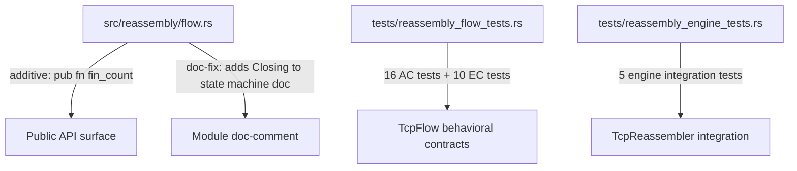
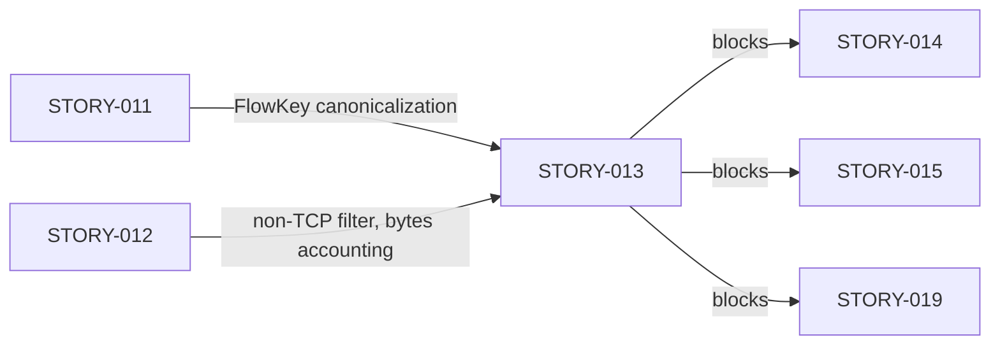
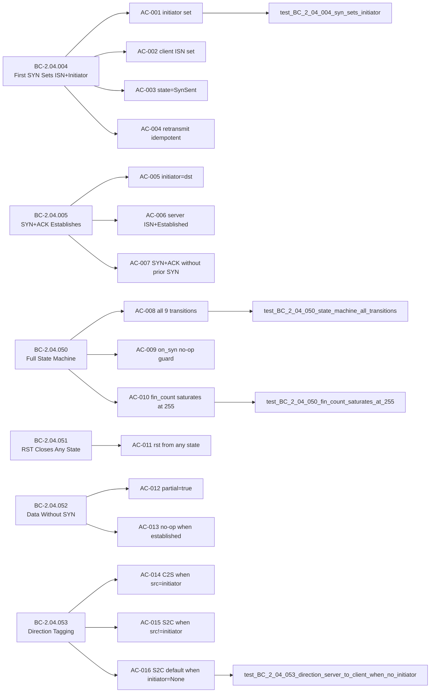

## Summary

Formalizes the TCP three-way handshake state machine and direction-tagging behavioral contracts (STORY-013, Wave 6) via brownfield-formalization: 31 tests added across two test files, plus two behavior-neutral additions to `src/reassembly/flow.rs` required to make the saturation invariant genuinely observable.

**Implementation strategy:** brownfield-formalization — the `TcpFlow` state machine was already correct; this PR adds the behavioral-contract test harness that formally verifies it.

**Adversarial convergence:** 3 consecutive clean fresh-context passes (BC-5.39.001, Wave 6 Phase 3). Zero open blocking findings.

---

## Architecture Changes

**src/reassembly/flow.rs changes (behavior-neutral):**
1. New `pub fn fin_count(&self) -> u8` accessor — exposes the already-existing private `fin_count` field. This is required to make AC-010 (saturation invariant at u8::MAX) genuinely verifiable from the public API. Zero behavior change.
2. One-line module doc-comment fix: adds `Closing` to the documented state machine sequence (`New → SynSent → Established → Closing → Closed`).

---

## Story Dependencies

**depends_on:** STORY-012 (merged #118), STORY-011 (merged #116)
**blocks:** STORY-014, STORY-015, STORY-019

---

## Spec Traceability

**Behavioral Contracts covered:** BC-2.04.004, BC-2.04.005, BC-2.04.050, BC-2.04.051, BC-2.04.052, BC-2.04.053

**Full traceability chain:** 6 BCs → 16 ACs → 16 AC tests + 10 EC tests + 5 engine integration tests = 31 tests total

---

## Test Evidence

| Metric | Value |
|--------|-------|
| Total new tests | 31 |
| AC tests (tests/reassembly_flow_tests.rs) | 16 |
| EC tests (tests/reassembly_flow_tests.rs) | 10 |
| Engine integration tests (tests/reassembly_engine_tests.rs) | 5 |
| Behavioral contracts covered | 6 (BC-2.04.004, .005, .050, .051, .052, .053) |
| Acceptance criteria covered | 16/16 (100%) |
| Edge cases covered | 10/10 (EC-001 through EC-010) |
| Red Gate verified | Yes — stubs committed before implementation |
| Green Gate verified | Yes — all tests pass against existing brownfield impl |
| Adversarial convergence | 3 consecutive clean passes (BC-5.39.001) |

**Test coverage per AC:**
- AC-001: `test_BC_2_04_004_syn_sets_initiator`
- AC-002: `test_BC_2_04_004_syn_sets_client_isn`
- AC-003: `test_BC_2_04_004_syn_transitions_to_synsent`
- AC-004: `test_BC_2_04_004_retransmitted_syn_is_idempotent`
- AC-005: `test_BC_2_04_005_syn_ack_sets_initiator_to_dst`
- AC-006: `test_BC_2_04_005_syn_ack_establishes_flow`
- AC-007: `test_BC_2_04_005_syn_ack_without_prior_syn`
- AC-008: `test_BC_2_04_050_state_machine_all_transitions` (9 transitions individually asserted)
- AC-009: `test_BC_2_04_050_on_syn_no_op_when_not_new`
- AC-010: `test_BC_2_04_050_fin_count_saturates_at_255`
- AC-011: `test_BC_2_04_051_rst_closes_from_any_state`
- AC-012: `test_BC_2_04_052_data_without_syn_sets_partial`
- AC-013: `test_BC_2_04_052_on_data_without_syn_no_op_when_established`
- AC-014: `test_BC_2_04_053_direction_client_to_server_when_src_is_initiator`
- AC-015: `test_BC_2_04_053_direction_server_to_client_when_src_is_not_initiator`
- AC-016: `test_BC_2_04_053_direction_server_to_client_when_no_initiator`

---

## Holdout Evaluation

N/A — evaluated at wave gate.

---

## Adversarial Review

3 consecutive clean fresh-context passes completed (BC-5.39.001, Wave 6 Phase 3). Finding categories resolved across passes:
- F-1: EC-009 correction (FIN on New flow: state stays New, fin_count=1; not Closing)
- F-2/F-3/F-6: Coverage gaps in adversarial edge cases (RST-with-payload, both-FINs-same-direction, retransmit SYN+ACK)
- F-4/F-5: Trace widening for AC-004 and apply_handshake_flags anchor correction

---

## Security Review

No security-relevant surface changes. The `fin_count()` accessor is a read-only getter on an already-existing private field. No I/O, no unsafe code, no network-facing API changes. All new code is pure-core (no I/O, no side effects beyond in-memory state).

---

## Risk Assessment

| Dimension | Assessment |
|-----------|------------|
| Blast radius | Minimal — additive only (new public accessor, new tests) |
| Behavior change | None — brownfield-formalization; impl was correct before |
| Performance impact | None — tests only; fin_count() is a trivial field read |
| API stability | Additive only (fin_count() is a new public method) |
| Rollback risk | Low — tests can be reverted independently of impl |

---

## AI Pipeline Metadata

| Field | Value |
|-------|-------|
| Pipeline mode | brownfield-formalization |
| Story wave | Wave 6 |
| Story phase | Phase 3 (TDD Implementation) |
| Adversarial passes | 3 (converged) |
| Implementation strategy | Tests-only + minimal observability accessor |

---

## Pre-Merge Checklist

- [x] PR description matches actual diff (3 files: flow.rs, reassembly_flow_tests.rs, reassembly_engine_tests.rs)
- [x] All ACs covered by named tests (16/16)
- [x] All ECs covered by named tests (10/10)
- [x] Traceability chain complete (BC → AC → Test → Code)
- [x] Demo evidence LOCAL-ONLY — zero demo files in branch diff
- [x] No .factory/ artifacts in PR (gitignored)
- [x] Semantic PR title: `test: formalize TCP handshake state machine and direction tagging (STORY-013)`
- [x] No unsafe code
- [x] No behavior changes (fin_count() accessor is read-only; doc-comment is cosmetic)
- [x] Dependency PRs merged (STORY-011 #116, STORY-012 #118)
- [ ] CI passing
- [ ] pr-reviewer approval
- [ ] Squash-merged to develop
