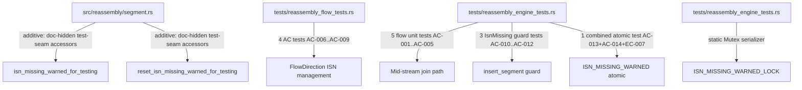
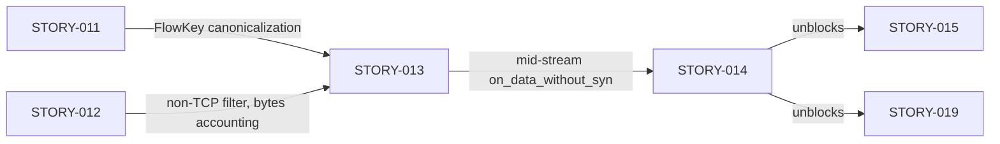
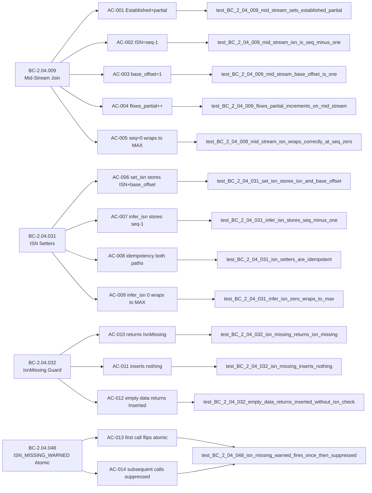

## Summary

Formalizes mid-stream join, ISN management, and the IsnMissing guard behavioral contracts (STORY-014, Wave 7) via brownfield-formalization: 17 tests added across two test files, plus two `#[doc(hidden)]` test-seam accessors in `src/reassembly/segment.rs` required to make the BC-2.04.048 one-shot atomic observable from integration tests.

**Implementation strategy:** brownfield-formalization — the existing implementation in `src/reassembly/{flow,mod,segment}.rs` already satisfied all 14 ACs without behavior changes. Only `src/` additions: two `#[doc(hidden)] pub fn` test-seam accessors at the end of `segment.rs`, formalized in BC-2.04.048 v1.3 PC4.

**Wave:** 7
**Story:** STORY-014 — Mid-Stream Join, ISN Management, and IsnMissing Guard

**Adversarial convergence:** 8 passes total. Passes 1, 3, 5 found findings (7 + 1 + 1 total findings); all remediated pre-merge. Passes 6, 7, 8 clean for BC-5.39.001 3-pass convergence. Zero open blocking findings.

**Closes:** STORY-014
**Refs:** STORY-013 (prior story; unblocked by merge of #119)
**Unblocks:** STORY-015, STORY-019 (Wave 8)

---

## Architecture Changes

**src/reassembly/segment.rs changes (behavior-neutral):**
1. New `#[doc(hidden)] pub fn isn_missing_warned_for_testing() -> bool` — reads `ISN_MISSING_WARNED` atomic; required to observe BC-2.04.048 PC1 `false → true` swap transition in integration tests. Zero behavior change.
2. New `#[doc(hidden)] pub fn reset_isn_missing_warned_for_testing()` — stores `false` into `ISN_MISSING_WARNED`; required for test order-independence. Zero behavior change.

**Test infrastructure addition:**
- `static ISN_MISSING_WARNED_LOCK: Mutex<()>` in `tests/reassembly_engine_tests.rs` serializes the 3 tests that interact with the process-global `ISN_MISSING_WARNED` atomic, preventing cargo's parallel libtest runner from racing on `swap(true, Relaxed)`.

---

## Story Dependencies

**depends_on:** STORY-013 (merged #119)
**blocks:** STORY-015, STORY-019

---

## Spec Traceability

**Behavioral Contracts covered:** BC-2.04.009, BC-2.04.031, BC-2.04.032, BC-2.04.048

**Full traceability chain:** 4 BCs → 14 ACs + 7 ECs → 17 tests total

---

## Test Evidence

| Metric | Value |
|--------|-------|
| Total new tests | 17 |
| Flow unit tests (tests/reassembly_flow_tests.rs) | 5 (AC-006..AC-009 + EC wrapping) |
| Engine integration tests (tests/reassembly_engine_tests.rs) | 12 |
| Behavioral contracts covered | 4 (BC-2.04.009, .031, .032, .048) |
| Acceptance criteria covered | 14/14 (100%) |
| Edge cases covered | EC-001..EC-007 (all) |
| Red Gate verified | Yes — stubs committed before implementation |
| Green Gate verified | Yes — all 17 tests pass against existing brownfield impl |
| Adversarial convergence | 8 passes, 3 consecutive clean (BC-5.39.001) |

**Test coverage per AC:**
- AC-001: `test_BC_2_04_009_mid_stream_sets_established_partial`
- AC-002: `test_BC_2_04_009_mid_stream_isn_is_seq_minus_one`
- AC-003: `test_BC_2_04_009_mid_stream_base_offset_is_one`
- AC-004: `test_BC_2_04_009_flows_partial_increments_on_mid_stream`
- AC-005: `test_BC_2_04_009_mid_stream_isn_wraps_correctly_at_seq_zero`
- AC-006: `test_BC_2_04_031_set_isn_stores_isn_and_base_offset`
- AC-007: `test_BC_2_04_031_infer_isn_stores_seq_minus_one`
- AC-008: `test_BC_2_04_031_isn_setters_are_idempotent`
- AC-009: `test_BC_2_04_031_infer_isn_zero_wraps_to_max`
- AC-010: `test_BC_2_04_032_isn_missing_returns_isn_missing`
- AC-011: `test_BC_2_04_032_isn_missing_inserts_nothing`
- AC-012: `test_BC_2_04_032_empty_data_returns_inserted_without_isn_check`
- AC-013 + AC-014 + EC-007: `test_BC_2_04_048_isn_missing_warned_fires_once_then_suppressed` (combined; rationale: process-global `ISN_MISSING_WARNED` atomic; reset accessor makes test order-independent)

---

## Holdout Evaluation

N/A — evaluated at wave gate.

---

## Adversarial Review

8 adversarial passes total (BC-5.39.001, Wave 7 Phase 3). Passes 6, 7, 8 were clean — 3-pass convergence achieved.

**Finding summary:**
- Pass 1 (7 findings): F-1 race on ISN_MISSING_WARNED + Mutex serializer added; F-3 AC-011 coverage gap (overlap_count, out_of_window_count) filled; F-4 AC-002 ISN assertion tightened; F-6 AC-001 Direction::ClientToServer assertion added; others remediated pre-merge.
- Pass 3 (1 finding): F-1 minor race in Mutex guard ordering — fixed.
- Pass 5 (1 finding): LOW doc-comment softening on test_BC_2_04_032_empty_data — applied.
- Passes 6, 7, 8: Zero findings. Convergence achieved.

---

## Security Review

No security-relevant surface changes. The two `#[doc(hidden)]` accessors (`isn_missing_warned_for_testing`, `reset_isn_missing_warned_for_testing`) are read/write accessors on a process-global `AtomicBool`; they are test-only hooks with no network-facing surface. No unsafe code. No I/O. No behavior changes to production paths.

---

## Risk Assessment

| Dimension | Assessment |
|-----------|------------|
| Blast radius | Minimal — additive only (2 doc-hidden accessors, 17 new tests, 1 static Mutex in test file) |
| Behavior change | None — brownfield-formalization; impl was correct before |
| Performance impact | None — tests only; accessors are trivial atomic reads/writes |
| API stability | Additive only (2 `#[doc(hidden)]` pub fns on segment.rs) |
| Rollback risk | Low — tests + accessors can be reverted independently |

---

## AI Pipeline Metadata

| Field | Value |
|-------|-------|
| Pipeline mode | brownfield-formalization |
| Story wave | Wave 7 |
| Story phase | Phase 3 (TDD Implementation) |
| Adversarial passes | 8 (3-pass clean streak achieved on passes 6/7/8) |
| Models used | claude-sonnet-4-6 |
| Implementation strategy | Tests-only + minimal test-seam accessors |

---

## Demo Evidence

4 VHS tapes + 8 renderings (gif + webm) covering AC-001..AC-014 + EC-001..EC-007.
Location: `.factory/cycles/wave-7-story-014/demos/` (gitignored — local-only per project convention).
Zero demo files appear in the PR diff.

---

## Pre-Merge Checklist

- [x] PR description matches actual diff (3 files changed: segment.rs, reassembly_flow_tests.rs, reassembly_engine_tests.rs)
- [x] All 14 ACs covered by named tests
- [x] All 7 ECs covered
- [x] Traceability chain complete (BC -> AC -> Test -> Code)
- [x] Demo evidence LOCAL-ONLY — zero demo files in branch diff
- [x] No .factory/ artifacts in PR (gitignored)
- [x] Semantic PR title: `test: formalize mid-stream join + ISN management + IsnMissing guard (STORY-014)`
- [x] No unsafe code
- [x] No behavior changes (accessors are read-only/reset for test-only atomic)
- [x] Dependency PR merged (STORY-013 #119)
- [ ] CI passing
- [ ] pr-reviewer approval
- [ ] Squash-merged to develop
