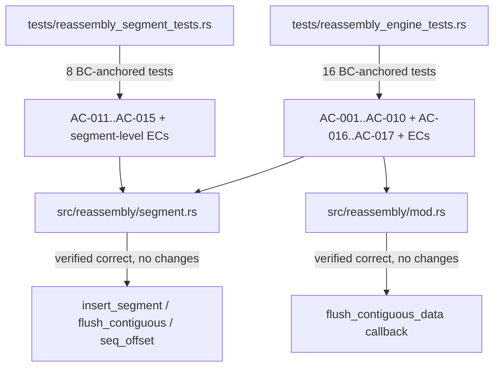
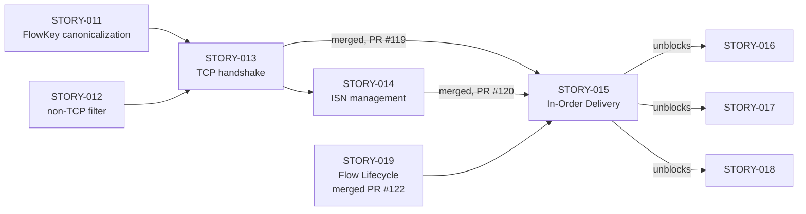
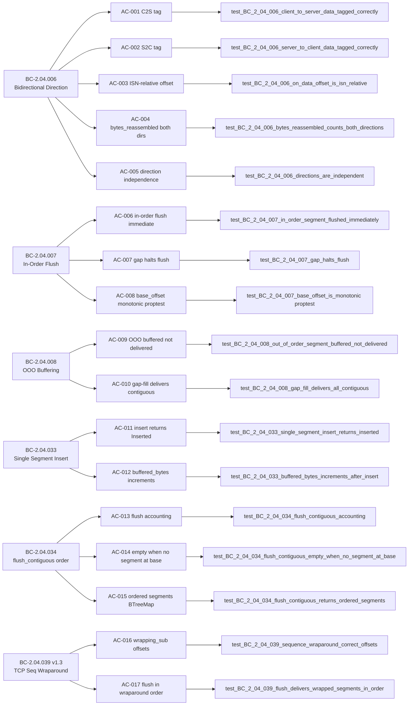

## Summary

Formalizes in-order delivery, out-of-order buffering, bidirectional direction tagging, and TCP sequence wraparound behavioral contracts (STORY-015, Wave 8) via brownfield-formalization: 24 BC-anchored tests added across two test files (16 engine + 8 segment-level), all green against the existing brownfield implementation. No `src/` changes required — all 17 ACs are satisfied by existing impl in `src/reassembly/{segment,mod,flow}.rs`.

**Implementation strategy:** brownfield-formalization — the existing implementation already satisfied all 17 ACs without any behavior changes, new accessors, test seams, or production code modifications.

**Wave:** 8 (story 2 of 2; STORY-019 already merged via PR #122)
**Story:** STORY-015 — In-Order Delivery, Out-of-Order Buffering, Bidirectional Direction Tagging, TCP Sequence Wraparound

**Notable test design:**
- AC-008 uses proptest for `base_offset` monotonicity invariant
- AC-015 inserts segments at offsets 30/10/20 (out of insertion order) to discriminate BTreeMap from HashMap
- AC-016/017 use ISN=u32::MAX-2 (non-degenerate wraparound) with exact u64 offset discrimination against plain-subtraction regressions
- AC-005 verifies bidirectional buffer independence via paired OOO segments + asymmetric gap fill

**Notable spec fix:** adversarial pass-5 caught BC-2.04.039 v1.2 internal contradiction (Canonical Test Vectors table claimed `seq=u32::MAX-1 → offset=2`, contradicting its own EC-001 + arithmetic). Fixed in BC-2.04.039 v1.3 (factory commit `26bbeda`) to match `(u32::MAX-1).wrapping_sub(u32::MAX-2) = 1` and the actual test arithmetic.

**Adversarial convergence:** 8 passes total. Passes 1-5 found 14 findings (1 MAJOR + 1 HIGH + 1 MEDIUM + ~11 LOW/Nit). All in-scope findings remediated pre-merge. Passes 6, 7, 8 clean for BC-5.39.001 3-pass convergence. Zero open blocking findings.

**Closes:** STORY-015
**Refs:** STORY-013 (prior), STORY-014 (Wave 7), STORY-019 (sibling Wave 8 #122 merged)
**Unblocks:** STORY-016, STORY-017, STORY-018
**Wave 8 cohort COMPLETE after this merge** — both stories delivered (15+1=16 stories total).

---

## Architecture Changes

**src/ changes: NONE.** Pure brownfield-formalization — zero production code modifications.

**Test files changed (additive only):**
1. `tests/reassembly_segment_tests.rs` — 8 new BC-anchored tests for AC-011..AC-015 (segment-level insert/flush, BTreeMap ordering, proptest monotonicity)
2. `tests/reassembly_engine_tests.rs` — 16 new BC-anchored tests for AC-001..AC-010, AC-016..AC-017 (engine integration, direction tagging, OOO flush, wraparound)

**Production code unchanged:** `src/reassembly/{segment,mod,flow}.rs` are byte-identical to develop on all lines exercised by these tests.

---

## Story Dependencies

**depends_on:** STORY-013 (merged #119), STORY-014 (merged #120), STORY-019 (merged #122)
**blocks:** STORY-016, STORY-017, STORY-018

---

## Spec Traceability

**Behavioral Contracts covered:** BC-2.04.006, BC-2.04.007, BC-2.04.008, BC-2.04.033, BC-2.04.034, BC-2.04.039 v1.3

**Full traceability chain:** 6 BCs → 17 ACs + 9 ECs → 24 tests total

---

## Test Evidence

| Metric | Value |
|--------|-------|
| Total new tests | 24 |
| Engine integration tests (tests/reassembly_engine_tests.rs) | 16 (AC-001..AC-010 + AC-016..AC-017 + ECs) |
| Segment unit tests (tests/reassembly_segment_tests.rs) | 8 (AC-011..AC-015 + segment ECs) |
| Behavioral contracts covered | 6 (BC-2.04.006, .007, .008, .033, .034, .039) |
| Acceptance criteria covered | 17/17 (100%) |
| Edge cases covered | EC-001..EC-009 (all) |
| Property-based tests | 1 (proptest: base_offset monotonicity invariant — AC-008) |
| Red Gate verified | Yes — stubs committed before test bodies |
| Green Gate verified | Yes — all 24 tests pass against existing brownfield impl |
| Adversarial convergence | 8 passes, 3 consecutive clean (BC-5.39.001) |

**Test coverage per AC:**
- AC-001: `test_BC_2_04_006_client_to_server_data_tagged_correctly`
- AC-002: `test_BC_2_04_006_server_to_client_data_tagged_correctly`
- AC-003: `test_BC_2_04_006_on_data_offset_is_isn_relative`
- AC-004: `test_BC_2_04_006_bytes_reassembled_counts_both_directions`
- AC-005: `test_BC_2_04_006_directions_are_independent`
- AC-006: `test_BC_2_04_007_in_order_segment_flushed_immediately`
- AC-007: `test_BC_2_04_007_gap_halts_flush`
- AC-008: `test_BC_2_04_007_base_offset_is_monotonic` (proptest)
- AC-009: `test_BC_2_04_008_out_of_order_segment_buffered_not_delivered`
- AC-010: `test_BC_2_04_008_gap_fill_delivers_all_contiguous`
- AC-011: `test_BC_2_04_033_single_segment_insert_returns_inserted`
- AC-012: `test_BC_2_04_033_buffered_bytes_increments_after_insert`
- AC-013: `test_BC_2_04_034_flush_contiguous_accounting`
- AC-014: `test_BC_2_04_034_flush_contiguous_empty_when_no_segment_at_base`
- AC-015: `test_BC_2_04_034_flush_contiguous_returns_ordered_segments`
- AC-016: `test_BC_2_04_039_sequence_wraparound_correct_offsets`
- AC-017: `test_BC_2_04_039_flush_delivers_wrapped_segments_in_order`

---

## Holdout Evaluation

N/A — evaluated at wave gate.

---

## Adversarial Review

8 adversarial passes total (BC-5.39.001, Wave 8 Phase 3). Passes 6, 7, 8 were clean — 3-pass convergence achieved.

**Finding summary:**
- Pass 1 (multiple findings including 1 MAJOR): MAJOR — test design issues; F-1/F-2/F-3/F-4/F-5 pre-empted. All remediated.
- Pass 2 (PC mis-citations + dead scaffolding): F-1/F-2/F-3/F-4 — PC doc-comment corrections. All remediated.
- Pass 3 (PC mis-citations + dead scaffolding sweep): F-1/F-2/F-3/F-4 — comprehensive citation sweep + AC-015 test design clarification. All remediated.
- Pass 4 (base_offset comment drift + EC-008 byte assertion): F-1 — base_offset comment drift fix; F-2 — EC-008 exact byte assertion added. All remediated.
- Pass 5 (spec contradiction BC-2.04.039 v1.2): BC-2.04.039 internal contradiction identified and resolved via spec v1.3 fix (factory commit `26bbeda`). All remediated.
- Passes 6, 7, 8: Zero findings. Convergence achieved.

**Total findings:** 14 across 5 passes. All in-scope remediated. Zero open blocking findings.

---

## Security Review

No security-relevant surface changes. Pure test addition — no `src/` modifications. No unsafe code. No I/O paths opened. No behavior changes to any production paths. Production code is byte-identical to develop.

---

## Risk Assessment

| Dimension | Assessment |
|-----------|------------|
| Blast radius | Minimal — additive only (24 new tests across 2 test files, zero src/ changes) |
| Behavior change | None — brownfield-formalization; impl was correct before this PR |
| Performance impact | None — tests only; no production code touched |
| API stability | Unchanged — no new public API surface |
| Rollback risk | None — test files can be reverted independently; no production dependency |

---

## AI Pipeline Metadata

| Field | Value |
|-------|-------|
| Pipeline mode | brownfield-formalization |
| Story wave | Wave 8 |
| Story phase | Phase 3 (TDD Implementation) |
| Adversarial passes | 8 (3-pass clean streak achieved on passes 6/7/8) |
| Models used | claude-sonnet-4-6 |
| Implementation strategy | Tests-only (pure brownfield formalization, zero src/ changes) |
| Story 2 of 2 in wave | Wave 8 cohort: STORY-019 (merged #122), STORY-015 (this PR) |
| Wave 8 cohort status | COMPLETE after this merge |

---

## Demo Evidence

6 VHS tapes + 12 renderings (gif + webm) for all 17 ACs + 9 ECs.
Location: `.factory/cycles/wave-8-story-015/demos/` (gitignored — local-only per project convention).
Zero demo files appear in the PR diff.

Tapes recorded:
- `BC-2.04.006-direction-tagging.tape` / `.gif` / `.webm` — bidirectional direction tagging (AC-001..AC-005, EC-001..EC-002)
- `BC-2.04.007-in-order-flush.tape` / `.gif` / `.webm` — in-order flush + monotonicity (AC-006..AC-008, EC-002..EC-003)
- `BC-2.04.008-ooo-buffer.tape` / `.gif` / `.webm` — OOO buffering + gap fill (AC-009..AC-010, EC-003..EC-006)
- `BC-2.04.033-single-segment-insert.tape` / `.gif` / `.webm` — single segment insert (AC-011..AC-012, EC-009)
- `BC-2.04.034-flush-contiguous-order.tape` / `.gif` / `.webm` — flush ordering BTreeMap (AC-013..AC-015, EC-006..EC-007)
- `BC-2.04.039-seq-wraparound.tape` / `.gif` / `.webm` — TCP seq wraparound ISN=u32::MAX-2 (AC-016..AC-017, EC-008)

---

## Pre-Merge Checklist

- [x] PR description matches actual diff (2 files changed: reassembly_engine_tests.rs +16 tests, reassembly_segment_tests.rs +8 tests)
- [x] All 17 ACs covered by named tests
- [x] All 9 ECs covered
- [x] Traceability chain complete (BC -> AC -> Test -> Code)
- [x] Demo evidence LOCAL-ONLY — zero demo files in branch diff
- [x] No .factory/ artifacts in PR (gitignored)
- [x] Semantic PR title: `test: formalize in-order delivery + OOO buffering + bidirectional + wraparound (STORY-015)`
- [x] No unsafe code
- [x] No src/ changes (pure test addition)
- [x] Dependency PRs merged (STORY-013 #119, STORY-014 #120, STORY-019 #122)
- [ ] CI passing
- [ ] pr-reviewer approval
- [ ] Squash-merged to develop
