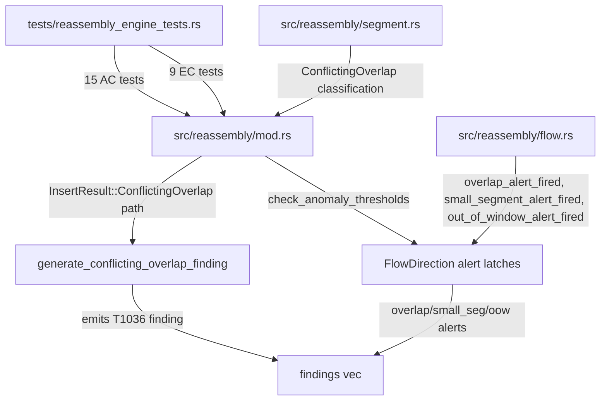
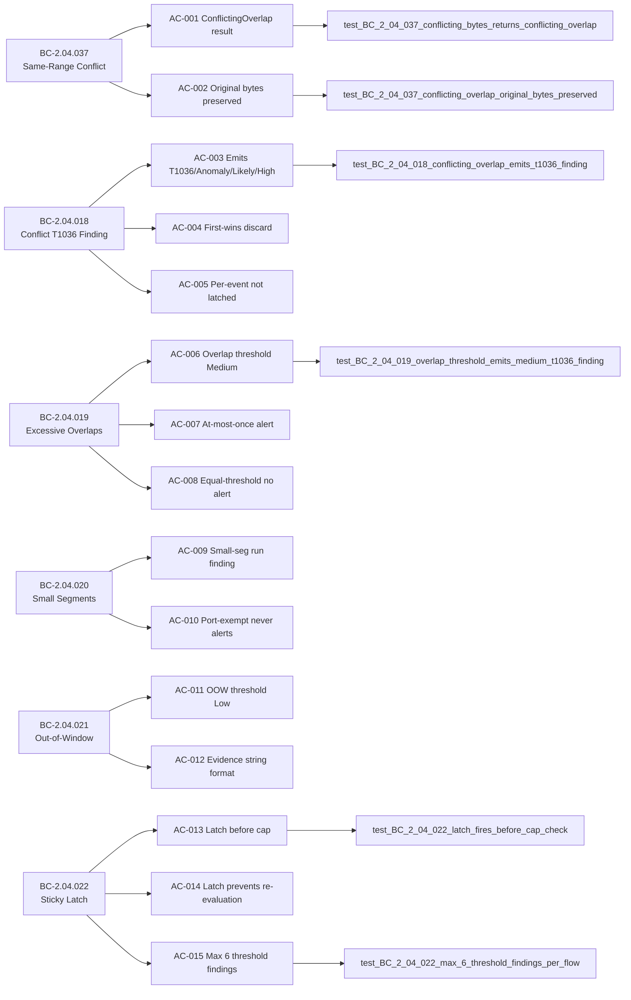

## Summary

Brownfield-formalization of conflict and evasion detection logic in the TCP reassembly engine. Adds 24 tests (15 AC tests + 9 EC tests) covering `ConflictingOverlap` finding emission, MITRE T1036 tagging, one-shot threshold alerts for excessive overlaps/small-segments/out-of-window segments, sticky per-direction latches, and latch-before-cap ordering. Zero `src/` behavior changes — all existing logic already conforms to the BCs.

**Story:** STORY-017 v1.1 (CONVERGED — 4 adversarial passes: 1 DIRTY (P1D) + 3 CLEAN; BC-5.39.001 satisfied)

**Implementation strategy:** brownfield-formalization (verify-only; no src/ changes)

## Architecture Changes

No `src/` files were modified. The implementation was already correct.

## Story Dependencies

**depends_on:** STORY-015 (PR #123, merged), STORY-016 (PR #127, merged)
**blocks:** STORY-021

## Spec Traceability

**Behavioral Contracts covered:**

| BC | Title | ACs |
|----|-------|-----|
| BC-2.04.018 | Conflicting Overlap Emits Anomaly/Likely/High Finding with MITRE T1036 | AC-003, AC-004, AC-005 |
| BC-2.04.019 | Excessive Overlaps Emit One-Shot T1036 Finding | AC-006, AC-007, AC-008 |
| BC-2.04.020 | Excessive Small Segments Emit One-Shot Finding | AC-009, AC-010 |
| BC-2.04.021 | Excessive Out-of-Window Segments Emit One-Shot Low Finding | AC-011, AC-012 |
| BC-2.04.022 | Per-Direction Alert Fires At Most Once Per Flow (Sticky Latch) | AC-013, AC-014, AC-015 |
| BC-2.04.037 | Same-Range Conflicting Overlap Returns ConflictingOverlap; Original Wins | AC-001, AC-002 |

**Verification Properties:** VP-002 (overlap correctness)

## Test Evidence

| Metric | Value |
|--------|-------|
| AC tests added | 15 (AC-001 through AC-015) |
| EC tests added | 9 (EC-001 through EC-009) |
| Total new tests in PR | 24 |
| src/ changes | 0 |
| CI status | green (cargo test --all-targets, clippy, fmt) |
| Per-story adversarial passes | 4 (1 DIRTY P1 + 3 CLEAN P2/P3/P4; BC-5.39.001 satisfied) |

**Test functions (STORY-017 scope):**

AC tests:
- `test_BC_2_04_037_conflicting_bytes_returns_conflicting_overlap`
- `test_BC_2_04_037_conflicting_overlap_original_bytes_preserved`
- `test_BC_2_04_018_conflicting_overlap_emits_t1036_finding`
- `test_BC_2_04_018_conflicting_overlap_first_wins`
- `test_BC_2_04_018_multiple_conflicts_each_produce_finding`
- `test_BC_2_04_019_overlap_threshold_emits_medium_t1036_finding`
- `test_BC_2_04_019_overlap_threshold_alert_fires_at_most_once`
- `test_BC_2_04_019_overlap_count_at_threshold_does_not_alert`
- `test_BC_2_04_020_small_segment_run_emits_finding`
- `test_BC_2_04_020_port_exempt_flow_never_alerts`
- `test_BC_2_04_021_out_of_window_threshold_emits_finding`
- `test_BC_2_04_021_oow_evidence_string_format`
- `test_BC_2_04_022_latch_fires_before_cap_check`
- `test_BC_2_04_022_latch_prevents_re_evaluation`
- `test_BC_2_04_022_max_6_threshold_findings_per_flow`

EC tests:
- `test_story_017_ec001_conflicting_overlap_at_findings_cap`
- `test_story_017_ec002_consecutive_conflicting_overlaps`
- `test_story_017_ec003_overlap_count_equals_threshold_no_alert`
- `test_story_017_ec004_overlap_count_threshold_plus_one_alerts`
- `test_story_017_ec005_small_segment_run_reset_by_normal_segment`
- `test_story_017_ec006_port_23_exempt_1000_small_segments`
- `test_story_017_ec007_oow_alert_at_findings_cap`
- `test_story_017_ec008_c2s_latch_s2c_independent`
- `test_story_017_ec009_duplicate_overlap_increments_count_no_finding`

## Holdout Evaluation

N/A — evaluated at wave gate (Phase 4 not yet started).

## Adversarial Review

Per-story adversarial convergence: 4 passes (DIRTY×1 + CLEAN×3) — BC-5.39.001 satisfied (3-clean streak).

| Pass | Verdict | Findings | Remediation |
|------|---------|----------|-------------|
| P1 (1D) | DIRTY | findings remediated | Test body corrections for AC-003, AC-005, AC-009, EC-008 |
| P2 (2C) | CLEAN | 0 blocking | — |
| P3 (3C) | CLEAN | 0 blocking | — |
| P4 (4C) | CLEAN | 0 blocking | Convergence gate satisfied |

## Security Review

N/A — zero `src/` changes. Pure test formalization. No new attack surface introduced.

No OWASP-relevant additions: no I/O paths, no parsing logic, no authentication changes, no injection vectors.

## Risk Assessment

| Dimension | Assessment |
|-----------|-----------|
| Blast radius | Minimal — test-only changes; no src/ modification |
| Performance impact | None — no production code path touched |
| Regression risk | Low — all 24 tests pass; brownfield confirms existing correctness |
| Merge risk | Clean squash; no conflicts expected with develop HEAD e237747 |

## AI Pipeline Metadata

| Field | Value |
|-------|-------|
| Pipeline mode | brownfield-formalization (verify-only) |
| Story points | 8 |
| Wave | 10 |
| Worktree branch | worktree-story-017 |
| Base branch | develop |
| Base HEAD at branch point | e237747 |
| Per-story adversarial cycles | 4 (1D+3C) — first Wave 10 PR under DF-SIBLING-SWEEP-001/DF-PR-MANAGER-COMPLETE-001 policy regime |

## Deferred Drift Items

The following LOW-severity drift items were identified during adversarial review. Per policy DF-VALIDATION-001, all require research-agent validation before any GitHub issue is filed. They are non-blocking for this PR.

| ID | Finding | Category |
|----|---------|----------|
| W10-D1 | BC-2.04.022 does not specify dropped_findings behavior when latch fires and cap is full | spec-gap |
| W10-D2 | STORY template missing per-direction latch independence test pattern | process-gap |
| W10-D3 | OOW evidence string format BC-2.04.021 PC-2 should include worked example | spec-gap |
| W10-D4 | Latch-before-cap ordering (LESSON-P1.01) not yet captured in CLAUDE.md architecture rules | process-gap |

## Pre-Merge Checklist

- [x] Semantic PR title compliant (`test(reassembly): ...`)
- [x] Branch: `worktree-story-017` → base: `develop`
- [x] Spec traceability complete (BC → AC → Test chain documented above)
- [x] All 15 ACs backed by named test functions
- [x] 9 ECs backed by named test functions
- [x] Zero src/ changes — brownfield-formalization only
- [x] Per-story adversarial convergence: 4 passes, 3-clean streak (BC-5.39.001 satisfied)
- [x] Dependency PRs merged: STORY-015 (#123) and STORY-016 (#127) both merged
- [x] Deferred drift items W10-D1..D4 require research-agent validation per DF-VALIDATION-001
- [x] Squash-merge ready
