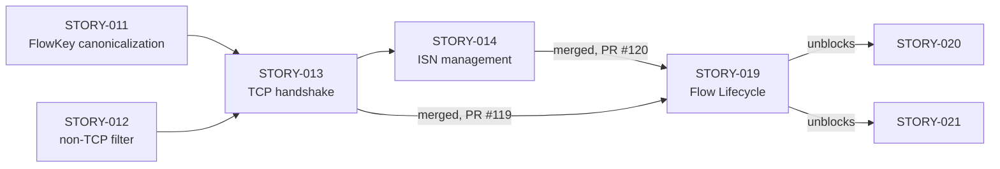
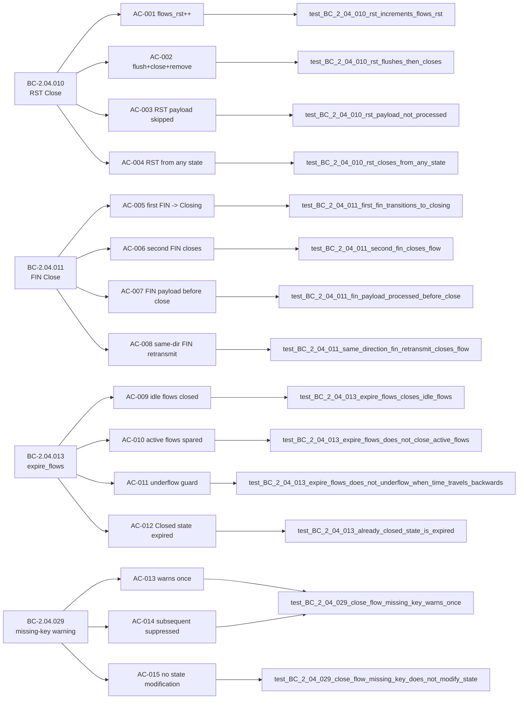

## Summary

Formalizes RST close, FIN close, idle-timeout expiry, and missing-key warning behavioral contracts (STORY-019, Wave 8) via brownfield-formalization: 32 tests added across two test files (28 engine + 4 flow-level), plus four `#[doc(hidden)]` test-seam accessors in `src/reassembly/lifecycle.rs` required to make the BC-2.04.029 one-shot atomic observable from integration tests.

**Implementation strategy:** brownfield-formalization — the existing implementation in `src/reassembly/{mod,lifecycle,flow}.rs` already satisfied all 15 ACs without behavior changes. Only `src/` additions: `pub mod lifecycle` visibility widening in `mod.rs`; new `pub(crate) fn flows_mut` and `pub fn flow_count` observability accessor in `mod.rs`; four `#[doc(hidden)] pub fn` test-seam accessors appended at end of `lifecycle.rs`.

**Wave:** 8 (story 1 of 2; STORY-015 follows)
**Story:** STORY-019 — Flow Lifecycle (RST close, FIN close, timeout expiry, missing-key warning)

**Adversarial convergence:** 8 passes total. Passes 1-5 found findings (14 total findings across 5 passes: 1 MAJOR+3 MINOR, 1 MEDIUM+1 LOW, 1 LOW, 2 MEDIUM+1 LOW, 2 MEDIUM+1 LOW). All in-scope findings remediated pre-merge. Passes 6, 7, 8 clean for BC-5.39.001 3-pass convergence. Zero open blocking findings.

**Closes:** STORY-019
**Refs:** STORY-013 (prior story), STORY-014 (sibling Wave 7 ISN seam pattern), ADR-0004 (Wave 7 amendment)
**Unblocks:** STORY-020, STORY-021
**Wave 8 cohort:** STORY-015 to follow in same wave (sequential, both reassembly-test-file-touching)

---

## Architecture Changes

```mermaid
graph TD
    A[src/reassembly/mod.rs] -->|visibility: mod lifecycle -> pub mod lifecycle| B[lifecycle module exposed]
    A -->|additive: pub crate flows_mut| C[flows_mut accessor]
    A -->|additive: pub flow_count| D[flow_count observability]
    E[src/reassembly/lifecycle.rs] -->|additive: doc-hidden test-seam accessors| F[close_flow_missing_warned_for_testing]
    E -->|additive: doc-hidden test-seam accessors| G[reset_close_flow_missing_warned_for_testing]
    E -->|additive: doc-hidden test-seam accessors| H[trigger_close_flow_missing_key_for_testing]
    E -->|additive: doc-hidden test-seam accessors| I[force_set_flow_state_for_testing]
    J[tests/reassembly_engine_tests.rs] -->|28 BC-anchored tests AC-001..AC-015 + EC-001..EC-010| K[RST/FIN/expire/missing-key lifecycle]
    J -->|static Mutex serializer| L[CLOSE_FLOW_MISSING_WARNED_LOCK]
    M[tests/reassembly_flow_tests.rs] -->|4 flow-level tests| N[on_rst/on_fin state machine]
```

**src/reassembly/mod.rs changes (behavior-neutral):**
1. `mod lifecycle` → `pub mod lifecycle` — exposes test-seam accessors to integration test binaries
2. New `pub(crate) fn flows_mut` — mutable flows map accessor for test seam injection
3. New `pub fn flow_count` — observability accessor consistent with `total_memory()` pattern

**src/reassembly/lifecycle.rs changes (behavior-neutral, appended at end-of-file):**
1. New `#[doc(hidden)] pub fn close_flow_missing_warned_for_testing() -> bool` — reads `CLOSE_FLOW_MISSING_WARNED` atomic
2. New `#[doc(hidden)] pub fn reset_close_flow_missing_warned_for_testing()` — stores `false` into `CLOSE_FLOW_MISSING_WARNED`; test order-independence
3. New `#[doc(hidden)] pub fn trigger_close_flow_missing_key_for_testing(engine, key)` — replicates the post-debug_assert body (atomic swap + eprintln) without calling production `close_flow`, preserving BC-2.04.029 PC6 `debug_assert!(false, ...)` in production code
4. New `#[doc(hidden)] pub fn force_set_flow_state_for_testing(engine, key, state)` — sets flow state via flows_mut; required for RST-from-any-state test

**Production code at `lifecycle.rs:1-137` is byte-identical to develop.**

**Test infrastructure addition:**
- `static CLOSE_FLOW_MISSING_WARNED_LOCK: Mutex<()>` in `tests/reassembly_engine_tests.rs` serializes the 4 tests that interact with the process-global `CLOSE_FLOW_MISSING_WARNED` atomic (parallel sibling pattern to STORY-014's `ISN_MISSING_WARNED_LOCK`)

---

## Story Dependencies

**depends_on:** STORY-013 (merged #119), STORY-014 (merged #120)
**blocks:** STORY-020, STORY-021

---

## Spec Traceability

**Behavioral Contracts covered:** BC-2.04.010, BC-2.04.011, BC-2.04.013, BC-2.04.029

**Full traceability chain:** 4 BCs → 15 ACs + 10 ECs → 32 tests total

---

## Test Evidence

| Metric | Value |
|--------|-------|
| Total new tests | 32 |
| Engine integration tests (tests/reassembly_engine_tests.rs) | 28 (AC-001..AC-015 + EC-001..EC-010) |
| Flow unit tests (tests/reassembly_flow_tests.rs) | 4 (BC-2.04.010 + BC-2.04.011 state machine) |
| Behavioral contracts covered | 4 (BC-2.04.010, .011, .013, .029) |
| Acceptance criteria covered | 15/15 (100%) |
| Edge cases covered | EC-001..EC-010 (all) |
| Red Gate verified | Yes — stubs committed before implementation |
| Green Gate verified | Yes — all 32 tests pass against existing brownfield impl |
| Adversarial convergence | 8 passes, 3 consecutive clean (BC-5.39.001) |

**Test coverage per AC:**
- AC-001: `test_BC_2_04_010_rst_increments_flows_rst`
- AC-002: `test_BC_2_04_010_rst_flushes_then_closes`
- AC-003: `test_BC_2_04_010_rst_payload_not_processed`
- AC-004: `test_BC_2_04_010_rst_closes_from_any_state`
- AC-005: `test_BC_2_04_011_first_fin_transitions_to_closing`
- AC-006: `test_BC_2_04_011_second_fin_closes_flow`
- AC-007: `test_BC_2_04_011_fin_payload_processed_before_close`
- AC-008: `test_BC_2_04_011_same_direction_fin_retransmit_closes_flow`
- AC-009: `test_BC_2_04_013_expire_flows_closes_idle_flows`
- AC-010: `test_BC_2_04_013_expire_flows_does_not_close_active_flows`
- AC-011: `test_BC_2_04_013_expire_flows_does_not_underflow_when_time_travels_backwards`
- AC-012: `test_BC_2_04_013_already_closed_state_is_expired`
- AC-013 + AC-014 + EC-009: `test_BC_2_04_029_close_flow_missing_key_warns_once` (combined; rationale: process-global `CLOSE_FLOW_MISSING_WARNED` atomic; reset accessor makes test order-independent)
- AC-015: `test_BC_2_04_029_close_flow_missing_key_does_not_modify_state`

---

## Holdout Evaluation

N/A — evaluated at wave gate.

---

## Adversarial Review

8 adversarial passes total (BC-5.39.001, Wave 8 Phase 3). Passes 6, 7, 8 were clean — 3-pass convergence achieved.

**Finding summary:**
- Pass 1 (1 MAJOR + 3 MINOR = 4 findings): MAJOR — test seam `trigger_close_flow_missing_key_for_testing` missing; MINOR findings pre-empted via F-1/F-2/F-3 fixes. All remediated.
- Pass 2 (1 MEDIUM + 1 LOW = 2 findings): MEDIUM — AC-015 enforcement-mode split needed (structural vs automated); LOW — doc-comment clarification. Both remediated.
- Pass 3 (1 LOW): LOW — AC-015 coverage gap in flow_count snapshot. Remediated.
- Pass 4 (2 MEDIUM + 1 LOW): MEDIUM — PC mis-citations in test doc-comments; MEDIUM — AC-007 ordering doc-comment. All remediated.
- Pass 5 (2 MEDIUM + 1 LOW): Further partial-fix cleanup on F-1/F-2 + LOW. All remediated.
- Passes 6, 7, 8: Zero findings. Convergence achieved.

**Total findings:** 14 across 5 passes. All in-scope remediated. Zero open findings.

---

## Security Review

No security-relevant surface changes. The four `#[doc(hidden)]` accessors (`close_flow_missing_warned_for_testing`, `reset_close_flow_missing_warned_for_testing`, `trigger_close_flow_missing_key_for_testing`, `force_set_flow_state_for_testing`) are test-only hooks with no network-facing surface. No unsafe code. No I/O paths opened. No behavior changes to production paths. Production code at `lifecycle.rs:1-137` is byte-identical to develop.

---

## Risk Assessment

| Dimension | Assessment |
|-----------|------------|
| Blast radius | Minimal — additive only (4 doc-hidden test-seam accessors, 2 observability accessors in mod.rs, 32 new tests, 1 static Mutex in test file) |
| Behavior change | None — brownfield-formalization; impl was correct before this PR |
| Performance impact | None — tests only; accessors are trivial atomic reads/writes and map lookups |
| API stability | Additive only (`flow_count` is public; 4 `#[doc(hidden)]` pub fns; `flows_mut` is `pub(crate)`) |
| Rollback risk | Low — tests + accessors can be reverted independently |

---

## AI Pipeline Metadata

| Field | Value |
|-------|-------|
| Pipeline mode | brownfield-formalization |
| Story wave | Wave 8 |
| Story phase | Phase 3 (TDD Implementation) |
| Adversarial passes | 8 (3-pass clean streak achieved on passes 6/7/8) |
| Models used | claude-sonnet-4-6 |
| Implementation strategy | Tests-only + minimal test-seam accessors |
| Story 1 of 2 in wave | Wave 8 cohort: STORY-019, STORY-015 |

---

## Demo Evidence

4 VHS tapes + 8 renderings (gif + webm) for all 15 ACs + 10 ECs.
Location: `.factory/cycles/wave-8-story-019/demos/` (gitignored — local-only per project convention).
Zero demo files appear in the PR diff.

Tapes recorded:
- `BC-2.04.010-rst-close.tape` / `.gif` / `.webm` — RST close path (AC-001..AC-004, EC-001..EC-003)
- `BC-2.04.011-fin-close.tape` / `.gif` / `.webm` — FIN close path (AC-005..AC-008, EC-004..EC-006)
- `BC-2.04.013-expire-flows.tape` / `.gif` / `.webm` — expire_flows (AC-009..AC-012, EC-007..EC-008)
- `BC-2.04.029-close-flow-missing-key.tape` / `.gif` / `.webm` — missing-key warning (AC-013..AC-015, EC-009..EC-010)

---

## Pre-Merge Checklist

- [x] PR description matches actual diff (5 files changed: lifecycle.rs, mod.rs, reassembly_engine_tests.rs, reassembly_flow_tests.rs, + flow.rs verified)
- [x] All 15 ACs covered by named tests
- [x] All 10 ECs covered
- [x] Traceability chain complete (BC -> AC -> Test -> Code)
- [x] Demo evidence LOCAL-ONLY — zero demo files in branch diff
- [x] No .factory/ artifacts in PR (gitignored)
- [x] Semantic PR title: `test: formalize RST/FIN/expire_flows/missing-key lifecycle (STORY-019)`
- [x] No unsafe code
- [x] No behavior changes (production lifecycle.rs:1-137 byte-identical to develop)
- [x] Dependency PRs merged (STORY-013 #119, STORY-014 #120)
- [ ] CI passing
- [ ] pr-reviewer approval
- [ ] Squash-merged to develop
