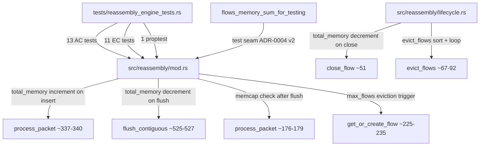
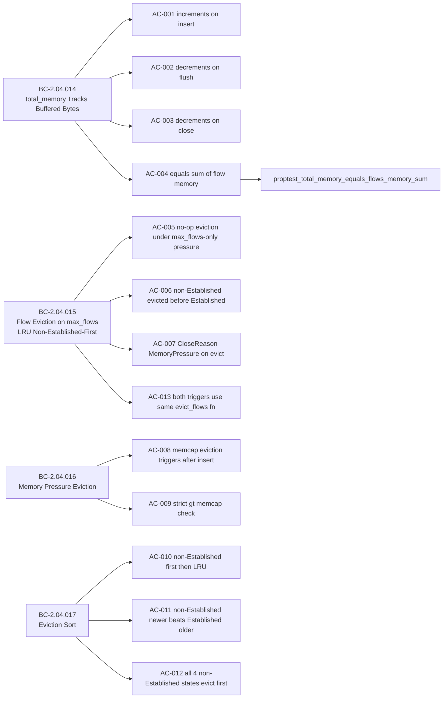

## Summary

Brownfield-formalization of `total_memory` accounting and LRU eviction policy in the TCP reassembly engine. Adds 25 tests (13 AC tests + 11 EC tests + 1 proptest) covering cross-flow memory aggregate accounting, max_flows LRU non-Established-first eviction, memcap pressure eviction, and eviction sort comparator correctness. One additive `src/` change: `#[doc(hidden)] pub fn flows_memory_sum_for_testing()` test seam in `src/reassembly/mod.rs` (opt-in per-guard doctrine, ADR-0004 v2). Zero behavior changes.

**Story:** STORY-020 v1.6 (CONVERGED — 8 adversarial passes: 5 DIRTY + 3 CLEAN)

**Implementation strategy:** brownfield-formalization (verify-only; one additive test seam per ADR-0004 v2)

## Architecture Changes

**`src/` changes:** One additive `#[doc(hidden)] pub fn flows_memory_sum_for_testing()` at `src/reassembly/mod.rs`. Required by AC-004 invariant observation. No behavior changes.

## Story Dependencies

**depends_on:** STORY-019 (previously merged)
**blocks:** STORY-021

## Spec Traceability

**Behavioral Contracts covered:**

| BC | Title | ACs |
|----|-------|-----|
| BC-2.04.014 | total_memory Tracks Buffered Bytes; Decrements on Flush and Close | AC-001, AC-002, AC-003, AC-004 |
| BC-2.04.015 | Flow Eviction on max_flows Hit Uses LRU Non-Established-First | AC-005, AC-006, AC-007, AC-013 |
| BC-2.04.016 | Memory Pressure Eviction When total_memory Exceeds memcap | AC-008, AC-009 |
| BC-2.04.017 | Eviction Sort — Non-Established First, Then Oldest-Last-Seen | AC-010, AC-011, AC-012 |

## Test Evidence

| Metric | Value |
|--------|-------|
| AC tests | 13 (AC-001 through AC-013) |
| EC tests | 11 (EC-001 through EC-011) |
| Proptest | 1 (AC-004 total_memory invariant over random insert/flush/close sequences) |
| **Total new tests** | **25** |
| Prior test suite | 124 passing |
| **Total reassembly engine tests** | **149 passing** |
| All-target test result | ok, 0 failed |

**Key test verifications:**
- `test_BC_2_04_014_total_memory_equals_sum_of_flow_memory` — invariant check after every insert/flush/close via `flows_memory_sum_for_testing()` test seam
- `ac004_proptest::test_BC_2_04_014_proptest_total_memory_equals_flows_memory_sum` — property-based random sequence invariant
- `test_BC_2_04_015_new_flow_dropped_after_no_op_eviction_under_max_flows_only_pressure` — AC-005 no-op eviction path under max_flows-only pressure (dual-conjunction termination)
- `test_BC_2_04_017_all_non_established_states_evict_first` — AC-012 covers all 4 non-Established states: New, SynSent, Closing, Closed
- `test_story_020_ec011_dual_pressure_evicts_existing_and_admits_new` — EC-011 dual-pressure path (both max_flows AND memcap) triggers real eviction

## Adversarial Convergence

| Cycle | Type | Findings | Blocking | Status |
|-------|------|----------|----------|--------|
| Pass 1 | DIRTY | 3 | 3 | Fixed |
| Pass 2 | DIRTY | 8 | 2 | Fixed |
| Pass 3 | DIRTY | 8 | 2 | Fixed |
| Pass 4 | DIRTY | 4 | 1 | Fixed |
| Pass 5 | DIRTY | 4 | 1 | Fixed |
| Pass 6 | CLEAN | 0 | 0 | APPROVE |
| Pass 7 | CLEAN | 0 | 0 | APPROVE |
| Pass 8 | CLEAN | 0 | 0 | APPROVE |

**Convergence: 8 passes (5 DIRTY + 3 CLEAN) — CONVERGED per BC-5.39.001**

## Security Review

No new attack surface. This PR adds test-only code and one `#[doc(hidden)]` test seam. The test seam is guarded by `pub fn` (not `pub(crate)`) per ADR-0004 v2 opt-in-per-guard doctrine — it is visible only to integration test code and carries no production data path exposure. No injection, auth, or input validation changes.

## Risk Assessment

| Dimension | Assessment |
|-----------|-----------|
| Blast radius | Tests only + one additive test seam in src/reassembly/mod.rs |
| Performance impact | None — test seam is dead code in release profile |
| Behavior change | None — brownfield-formalization; all existing logic already conforms |
| Rollback risk | Low — no src/ behavior changes |

## Deferred Findings (Require DF-VALIDATION-001 Research-Agent Validation)

Per CLAUDE.md policy `DF-VALIDATION-001`, these LOW drift items are deferred and require research-agent validation before filing as GitHub issues:

| ID | Description | Priority |
|----|-------------|----------|
| W9-D5 | AC-005 observability gap — max_flows-only eviction-call is structurally unobservable | LOW |
| W9-D8 | Sibling-discipline process gap — codification target post-Wave 10 | LOW |
| W9-D9 | AC-013 line citation precision | LOW |
| W9-D10 | EC-005 scope precision | LOW |
| W9-D11 | EC-011 docstring narrowing | LOW |

## Notable Design Decisions

- **AC-005 + EC-005 joint characterization:** AC-005 and EC-005 together cover the only reachable rejection-after-evict_flows path: the no-op case under max_flows-only pressure. The "evict-runs-and-still-full" scenario is structurally unreachable under BC-2.04.015 v1.3 Invariant 4 dual-conjunction termination.
- **AC-013 bifurcation (PATH 1 + PATH 2):** PATH 1 (max_flows trigger at mod.rs:227-232) is verified by code review — the unconditional `self.evict_flows(handler)` call is the structural witness. PATH 2 (memcap trigger) is verified behaviorally via `CloseReason::MemoryPressure` emission.
- **AC-012 four-state coverage:** The eviction sort treats ALL states except `FlowState::Established` as non-Established. AC-012 explicitly exercises New, SynSent, Closing, and Closed to verify this invariant.
- **BC-2.04.015 v1.3 Invariant 4 DESIGN INTENT:** Dual-conjunction termination (`flows.len() <= max_flows AND total_memory <= memcap`) is the mechanical guard; its most salient application is protecting Established sessions from flow-count-only eviction pressure.

## AI Pipeline Metadata

| Field | Value |
|-------|-------|
| Pipeline mode | Wave 9 VSDD factory brownfield-formalization |
| Story version | STORY-020 v1.6 |
| Adversarial passes | 8 (5 DIRTY + 3 CLEAN) |
| Wave | 9 |
| Story points | 8 |

## Pre-Merge Checklist

- [x] PR description matches actual diff (tests/reassembly_engine_tests.rs + src/reassembly/mod.rs test seam)
- [x] All 13 ACs covered by tests
- [x] Proptest for AC-004 total_memory invariant
- [x] 3 consecutive clean adversarial passes (CONVERGED)
- [x] Rebase onto develop@d636285 (post-STORY-016 merge) — clean, no conflicts
- [x] All 149 reassembly engine tests passing post-rebase
- [x] STORY-019 (depends_on) previously merged
- [x] Deferred LOW findings catalogued for DF-VALIDATION-001 processing
- [ ] CI checks passing
- [ ] pr-reviewer approval
- [ ] Squash merge executed
