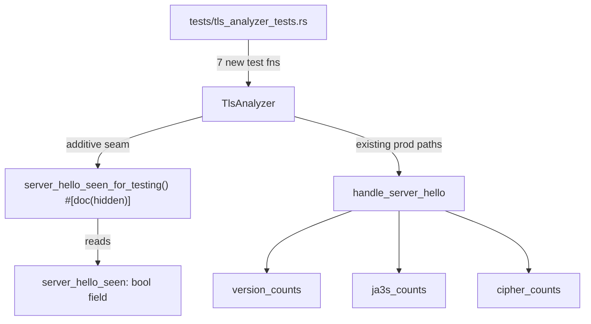
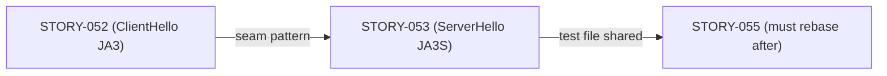
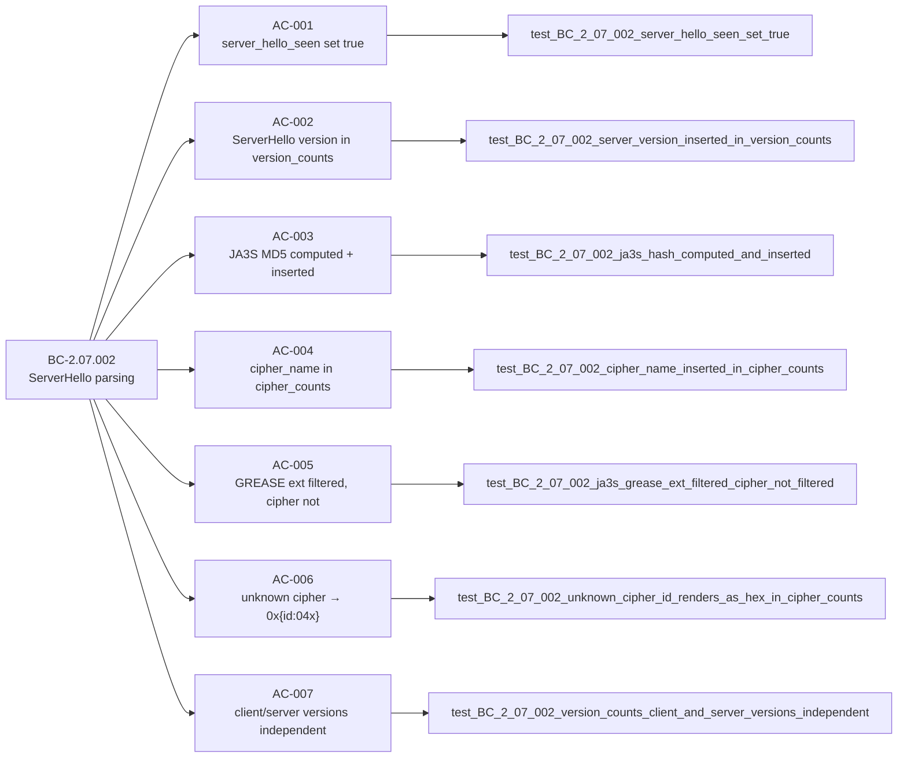

## Summary

Formalizes the ServerHello parsing behavior for BC-2.07.002 (Wave 17, E-5 TLS) via brownfield
test-formalization. Zero production behavior change. The only additive seam is
`server_hello_seen_for_testing` — a single `#[doc(hidden)] pub fn` consistent with the
`client_hello_seen_for_testing` pattern from STORY-052.

**Story:** STORY-053  
**Wave:** 17  
**BC:** BC-2.07.002  
**Strategy:** brownfield-formalization  
**Convergence:** 5 passes, 3-clean P3–P5 (per-story convergence COMPLETE)

---

## Architecture Changes

No production behavior changed. The seam is append-only to the existing test-accessor block
(lines 819–891 in tls.rs). All test assertions exercise existing production code paths.

---

## Story Dependencies

STORY-052 is merged (PR #141). STORY-055 targets the same test file and must rebase onto
this PR's merge commit.

---

## Spec Traceability

---

## Test Evidence

- **Tests added:** 7 (one per AC)
- **All 7 PASS** in worktree (cargo test --all-targets: zero failures)
- **Coverage:** All 7 ACs of BC-2.07.002 discriminating-pinned
- **Mutation guards:** Exact MD5 hashes pinned per test (AC-003 through AC-007); count assertions prevent false-positive passes
- **Seam:** `server_hello_seen_for_testing` — 1 `#[doc(hidden)]` fn, zero prod callers

| AC | Test Function | Result |
|----|---------------|--------|
| AC-001 | test_BC_2_07_002_server_hello_seen_set_true | PASS |
| AC-002 | test_BC_2_07_002_server_version_inserted_in_version_counts | PASS |
| AC-003 | test_BC_2_07_002_ja3s_hash_computed_and_inserted | PASS |
| AC-004 | test_BC_2_07_002_cipher_name_inserted_in_cipher_counts | PASS |
| AC-005 | test_BC_2_07_002_ja3s_grease_ext_filtered_cipher_not_filtered | PASS |
| AC-006 | test_BC_2_07_002_unknown_cipher_id_renders_as_hex_in_cipher_counts | PASS |
| AC-007 | test_BC_2_07_002_version_counts_client_and_server_versions_independent | PASS |

---

## Demo Evidence

Path: `docs/demo-evidence/STORY-053/evidence-report.md`

Evidence type: `cargo test --test tls_analyzer_tests <test_fn>` output (CLI product — VHS not
applicable; test-output capture per factory brownfield-formalization protocol).

All 7 ACs documented with exact test output and discriminating MD5 hash pins.

---

## Holdout Evaluation

N/A — evaluated at wave gate.

---

## Adversarial Review

N/A — evaluated at Phase 5. Per-story convergence: 5 passes, 3-clean P3–P5.

---

## Security Review

Brownfield test-formalization PR. Changes are:
1. `tests/tls_analyzer_tests.rs` — integration test file, not compiled into production binary
2. `src/analyzer/tls.rs` — single additive `#[doc(hidden)] pub fn server_hello_seen_for_testing` appended to existing test-accessor block; reads a boolean field, no mutation

No injection vectors, no authentication logic, no input validation changes, no OWASP-relevant
surface. The `#[doc(hidden)]` annotation is enforced by the CI trust-boundary gate
(`ci-drift-hardening` check: zero prod callers of test seams). Security posture: unchanged.

**Finding count:** 0 CRITICAL, 0 HIGH, 0 MEDIUM, 0 LOW

---

## Risk Assessment

| Dimension | Assessment |
|-----------|-----------|
| Blast radius | Minimal — test file + 1 hidden seam fn |
| Production behavior change | None |
| Performance impact | None — test-only |
| Rollback complexity | Trivial — revert 2 files |
| Trust boundary | seam is `#[doc(hidden)]`, CI gate enforces zero prod callers |

---

## AI Pipeline Metadata

- Pipeline mode: brownfield-formalization
- Model: claude-sonnet-4-6
- Per-story phases completed: P3, P4, P5 (3-clean convergence)
- Wave: 17

---

## Pre-Merge Checklist

- [x] PR description matches actual diff
- [x] All 7 ACs covered by demo evidence
- [x] Traceability chain complete: BC-2.07.002 → AC-001..007 → Tests → Demo
- [x] Security review: 0 findings
- [x] Review convergence: 3-clean P3–P5
- [x] CI checks: pending (step 6)
- [x] Dependency STORY-052 merged (PR #141)
- [x] STORY-055 downstream — will rebase after this merge
