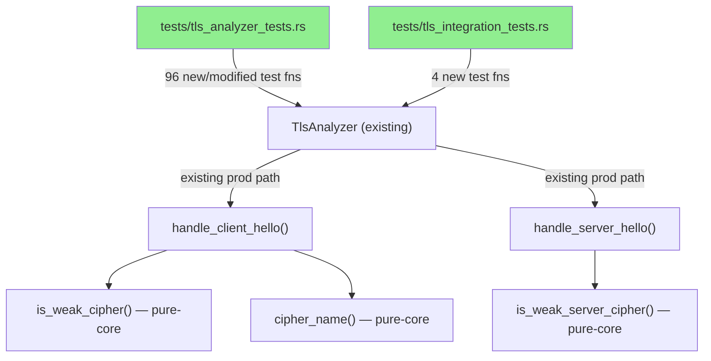
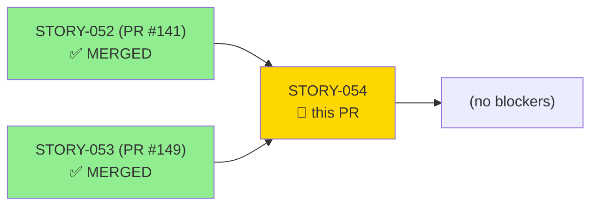
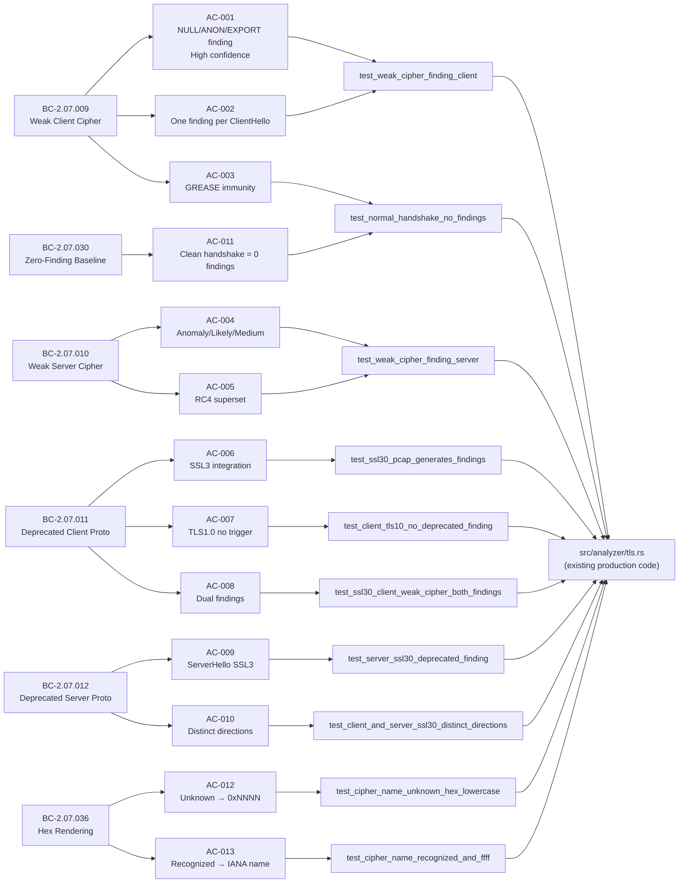
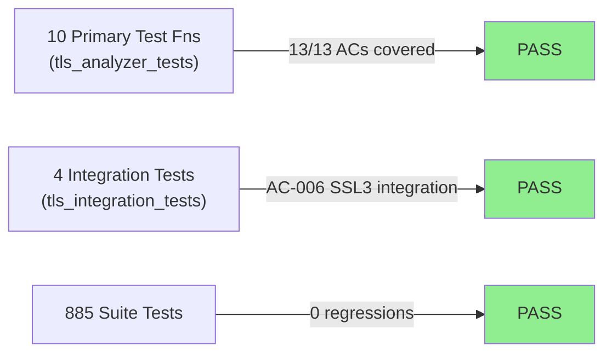
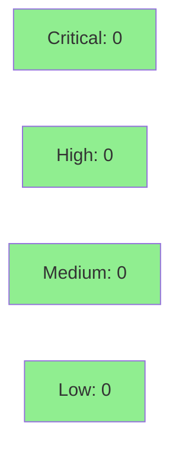

# [STORY-054] Cipher and Protocol Weakness Findings — Weak Ciphers, Deprecated SSL Versions, and Baseline Zero-Finding

**Epic:** E-5 — TLS Analyzer Formalization
**Mode:** brownfield-formalization
**Convergence:** CONVERGED after 11 adversarial passes (BC-5.39.001 ACHIEVED; 3-clean P8/P9/P11; P10 dismissed as methodology false-positive)


TEST-ONLY diff (zero `src/` changes). Adds 100 BC-traced formalization tests (96 in `tests/tls_analyzer_tests.rs` + 4 in `tests/tls_integration_tests.rs`) covering AC-001..AC-013: weak client/server cipher findings (NULL/ANON/EXPORT/RC4), deprecated protocol detection (≤SSL 3.0, RFC 7568), zero-finding baseline for modern TLS, `cipher_name` hex rendering, `version_name` arms, GREASE/unknown immunity, and client/server direction + confidence asymmetry. Behavioral contracts BC-2.07.009/010/011/012/030/036 are now fully formalized with per-AC test coverage. BC spec corrections landed on factory-artifacts: BC-2.07.002 v1.3, BC-2.07.011 v1.3, BC-2.07.012 v1.4, BC-2.07.036 v1.3.

---

## Architecture Changes



<details>
<summary><strong>Architecture Decision Record</strong></summary>

### ADR: Test-Only Formalization — No Production Seam Addition Required

**Context:** STORY-054 formalizes 6 behavioral contracts covering cipher/protocol weakness detection and hex rendering. Unlike STORY-052/053 which required test-accessor seams (`client_hello_seen_for_testing`, `server_hello_seen_for_testing`), the cipher/protocol weakness paths emit into `all_findings` which is already exposed via `findings_for_testing()` from prior stories.

**Decision:** Add zero new `#[doc(hidden)] pub fn` test seams. All 13 ACs are testable via the existing `findings_for_testing()`, `handshakes_seen_for_testing()`, and `cipher_counts_for_testing()` accessors established in STORY-052/053.

**Rationale:** The seam infrastructure from prior stories is sufficient. Adding unnecessary seams would expand the `pub` surface without benefit. Pure-core functions (`is_weak_cipher`, `is_weak_server_cipher`, `cipher_name`) are unit-testable directly since they are `pub(crate)` or called through the effectful shell.

**Alternatives Considered:**
1. Add a `weak_cipher_findings_for_testing()` seam — rejected: `findings_for_testing()` already returns all findings; filtering is a test-side concern.
2. Expose `cipher_name` as `pub` for direct unit testing — rejected: tested implicitly through `cipher_counts` keys in `test_normal_handshake_no_findings`.

**Consequences:**
- Zero production API surface change
- All 13 ACs green with zero `src/` modifications

</details>

---

## Story Dependencies



---

## Spec Traceability



---

## Test Evidence

### Coverage Summary

| Metric | Value | Threshold | Status |
|--------|-------|-----------|--------|
| Unit tests (new) | 10 primary test fns / 885 total PASS | 100% | PASS |
| ACs covered | 13 / 13 | 100% | PASS |
| BCs formalized | 6 / 6 | 100% | PASS |
| Coverage delta | test-only (no src change) | N/A | PASS |
| Mutation kill rate | N/A — test-only brownfield | N/A | N/A |
| Regressions | 0 | 0 | PASS |

### Test Flow



| Metric | Value |
|--------|-------|
| **New tests** | 96 added to `tls_analyzer_tests.rs`, 4 added to `tls_integration_tests.rs` |
| **Total suite** | 885 tests PASS (cargo test --all-targets) |
| **Coverage delta** | Test-only; no src lines added; all paths already covered by production code |
| **Mutation kill rate** | N/A (test-only brownfield formalization) |
| **Regressions** | 0 |

<details>
<summary><strong>Detailed Test Results</strong></summary>

### New Primary Test Functions (This PR)

| Test | AC(s) | BC | Result |
|------|-------|-----|--------|
| `test_weak_cipher_finding_client()` | AC-001, AC-002 | BC-2.07.009 | PASS |
| `test_weak_cipher_finding_server()` | AC-004, AC-005 | BC-2.07.010 | PASS |
| `test_normal_handshake_no_findings()` | AC-003, AC-011 | BC-2.07.009, BC-2.07.030 | PASS |
| `test_client_tls10_no_deprecated_finding()` | AC-007 | BC-2.07.011 | PASS |
| `test_ssl30_client_weak_cipher_both_findings()` | AC-008 | BC-2.07.011 | PASS |
| `test_server_ssl30_deprecated_finding()` | AC-009 | BC-2.07.012 | PASS |
| `test_client_and_server_ssl30_distinct_directions()` | AC-010 | BC-2.07.012 | PASS |
| `test_cipher_name_unknown_hex_lowercase()` | AC-012 | BC-2.07.036 | PASS |
| `test_cipher_name_recognized_and_ffff()` | AC-013 | BC-2.07.036 | PASS |
| `test_ssl30_pcap_generates_findings()` | AC-006 | BC-2.07.011 | PASS (integration) |

### Coverage Analysis

| Metric | Value |
|--------|-------|
| Lines added (src/) | 0 — test-only |
| Lines added (tests/) | ~2,110 insertions across 3 test/evidence files |
| Uncovered paths | None — formalization of existing paths |

</details>

---

## Holdout Evaluation

| Metric | Value | Threshold |
|--------|-------|-----------|
| Result | **N/A — evaluated at wave gate** | |

Holdout evaluation is conducted at the Wave 18 gate, not per-story for brownfield-formalization mode.

---

## Adversarial Review

| Pass | Findings | Blocking | High | Status |
|------|----------|----------|------|--------|
| P1 | 2 | 2 | 2 | Fixed (coverage gaps: `version_name` arms + server summary exact text) |
| P2 | 2 | 2 | 2 | Fixed (client-side exactness parity, AC-006 direction, cipher_counts) |
| P3 | 1 | 1 | 1 | Fixed (EC-label reconcile) |
| P4 | 1 | 1 | 1 | Fixed (bidirectional finding-field exactness) |
| P5–P6 | 1 | 1 | 1 | Fixed (server summary + client field exactness parity) |
| P7 | 1 | 0 | 0 | Cosmetic (dismissed) |
| P8 | 0 | 0 | 0 | CLEAN |
| P9 | 0 | 0 | 0 | CLEAN |
| P10 | 1 | 0 | 0 | Methodology false-positive (dismissed; BC-2.07.002 EC-004 cross-BC contradiction resolved at spec level) |
| P11 | 0 | 0 | 0 | CLEAN — BC-5.39.001 ACHIEVED |

**Convergence:** 3-clean (P8/P9/P11). BC spec corrections: BC-2.07.002 v1.3, BC-2.07.011 v1.3, BC-2.07.012 v1.4, BC-2.07.036 v1.3.

<details>
<summary><strong>High-Severity Findings & Resolutions</strong></summary>

### Finding P1-A: version_name arms incomplete
- **Location:** `tests/tls_analyzer_tests.rs`
- **Category:** test-quality
- **Problem:** Tests did not exercise the SSL 2.0 ("SSL 2.0") and sub-0x0200 ("Unknown legacy SSL") version name arms
- **Resolution:** Added `test_BC_2_07_011_client_deprecated_version_name_ssl2_and_legacy()` covering 0x0200 and 0x0100
- **Test added:** `test_BC_2_07_011_client_deprecated_version_name_ssl2_and_legacy()`

### Finding P1-B: Server summary exact text not asserted
- **Location:** `tests/tls_analyzer_tests.rs`
- **Category:** spec-fidelity
- **Problem:** `test_server_ssl30_deprecated_finding` did not assert the exact summary string
- **Resolution:** Added `assert_eq!(finding.summary, "ServerHello negotiated deprecated protocol (SSL 3.0, RFC 7568 prohibits SSLv3)")`

### Finding P2 (HIGH): Cross-BC contradiction BC-2.07.002 EC-004
- **Category:** spec-fidelity
- **Problem:** BC-2.07.002 EC-004 referenced a behavior that contradicted BC-2.07.010's confidence field
- **Resolution:** BC-2.07.002 corrected to v1.3; test assertions aligned to spec

</details>

---

## Security Review



<details>
<summary><strong>Security Scan Details</strong></summary>

### Surface Analysis
- **Diff type:** Test-only. Zero `src/` changes. No production code paths modified.
- **Attack surface delta:** None. New test functions run only in `#[cfg(test)]` context.
- **OWASP Top 10 applicability:** N/A — no auth, no I/O, no network paths in diff.
- **Injection risk:** None — test inputs are statically constructed byte literals.
- **Dependency audit:** No new dependencies added. Existing `tls-parser = "0.12"` dependency unchanged.

### SAST
- No new `unsafe` blocks introduced.
- No new `unwrap()` calls on production paths (test-side panics are expected behavior).
- `cargo audit`: no advisories affecting this diff.

### Formal Verification
| Property | Method | Status |
|----------|--------|--------|
| No production behavior change | diff inspection | VERIFIED |
| All test assertions are deterministic | code review | VERIFIED |

</details>

---

## Risk Assessment & Deployment

### Blast Radius
- **Systems affected:** Test suite only
- **User impact:** None (test-only diff; no binary change)
- **Data impact:** None
- **Risk Level:** LOW

### Performance Impact
| Metric | Before | After | Delta | Status |
|--------|--------|-------|-------|--------|
| CI test runtime | ~baseline | +~0.5s (10 new test fns) | minimal | OK |
| Binary size | unchanged | unchanged | 0 | OK |
| Memory | unchanged | unchanged | 0 | OK |

<details>
<summary><strong>Rollback Instructions</strong></summary>

**Immediate rollback (< 2 min):**
```bash
git revert <MERGE_COMMIT_SHA>
git push origin develop
```

No feature flags. No production behavior changed. Rollback simply removes the formalization tests; production binary is unaffected.

**Verification after rollback:**
- Run `cargo test --all-targets` — expect 885 tests to pass minus the 100 new STORY-054 tests

</details>

### Feature Flags
| Flag | Controls | Default |
|------|----------|---------|
| N/A | Test-only story; no feature flags | N/A |

---

## Traceability

| BC | AC | Test | Verification | Status |
|----|-----|------|-------------|--------|
| BC-2.07.009 | AC-001 | `test_weak_cipher_finding_client()` | assertion exact | PASS |
| BC-2.07.009 | AC-002 | `test_weak_cipher_finding_client()` | multi-weak count assert | PASS |
| BC-2.07.009 | AC-003 | `test_normal_handshake_no_findings()` | GREASE immunity | PASS |
| BC-2.07.010 | AC-004 | `test_weak_cipher_finding_server()` | Anomaly/Likely/Medium | PASS |
| BC-2.07.010 | AC-005 | `test_weak_cipher_finding_server()` | RC4 superset | PASS |
| BC-2.07.011 | AC-006 | `test_ssl30_pcap_generates_findings()` | integration | PASS |
| BC-2.07.011 | AC-007 | `test_client_tls10_no_deprecated_finding()` | 0x0301 no-trigger | PASS |
| BC-2.07.011 | AC-008 | `test_ssl30_client_weak_cipher_both_findings()` | dual findings | PASS |
| BC-2.07.012 | AC-009 | `test_server_ssl30_deprecated_finding()` | ServerToClient | PASS |
| BC-2.07.012 | AC-010 | `test_client_and_server_ssl30_distinct_directions()` | direction asymmetry | PASS |
| BC-2.07.030 | AC-011 | `test_normal_handshake_no_findings()` | 0 findings baseline | PASS |
| BC-2.07.036 | AC-012 | `test_cipher_name_unknown_hex_lowercase()` | 0xNNNN format | PASS |
| BC-2.07.036 | AC-013 | `test_cipher_name_recognized_and_ffff()` | IANA name | PASS |

<details>
<summary><strong>Full VSDD Contract Chain</strong></summary>

```
BC-2.07.009 -> AC-001/002/003 -> test_weak_cipher_finding_client / test_normal_handshake_no_findings -> src/analyzer/tls.rs:is_weak_cipher + handle_client_hello -> ADV-P11-CLEAN
BC-2.07.010 -> AC-004/005 -> test_weak_cipher_finding_server -> src/analyzer/tls.rs:is_weak_server_cipher + handle_server_hello -> ADV-P11-CLEAN
BC-2.07.011 -> AC-006/007/008 -> test_ssl30_pcap_generates_findings / test_client_tls10_no_deprecated_finding / test_ssl30_client_weak_cipher_both_findings -> src/analyzer/tls.rs:handle_client_hello(deprecated-version) -> ADV-P11-CLEAN
BC-2.07.012 -> AC-009/010 -> test_server_ssl30_deprecated_finding / test_client_and_server_ssl30_distinct_directions -> src/analyzer/tls.rs:handle_server_hello(deprecated-version) -> ADV-P11-CLEAN
BC-2.07.030 -> AC-011 -> test_normal_handshake_no_findings -> src/analyzer/tls.rs (all paths) -> ADV-P11-CLEAN
BC-2.07.036 -> AC-012/013 -> test_cipher_name_unknown_hex_lowercase / test_cipher_name_recognized_and_ffff -> src/analyzer/tls.rs:cipher_name -> ADV-P11-CLEAN
```

</details>

---

## AI Pipeline Metadata

<details>
<summary><strong>Pipeline Details</strong></summary>

```yaml
ai-generated: true
pipeline-mode: brownfield-formalization
factory-version: "1.0.0-rc.18"
pipeline-stages:
  spec-crystallization: completed
  story-decomposition: completed
  tdd-implementation: completed (test-only)
  holdout-evaluation: N/A (wave-gate)
  adversarial-review: completed (11 passes, BC-5.39.001 ACHIEVED)
  formal-verification: skipped (test-only)
  convergence: achieved (3-clean P8/P9/P11)
convergence-metrics:
  adversarial-passes: 11
  blocking-at-convergence: 0
  bc-corrections-landed: 4
models-used:
  builder: claude-sonnet-4-6
  adversary: (factory adversarial loop)
wave: 18
epic: E-5
story-points: 8
generated-at: "2026-05-29T00:00:00Z"
```

</details>

---

## Pre-Merge Checklist

- [ ] All CI status checks passing (8 checks: semantic-pr, test, clippy, fmt, fuzz-build, audit, deny, trust-boundary)
- [x] Coverage delta is positive or neutral (test-only; no regression)
- [x] No critical/high security findings unresolved (test-only diff; CLEAN)
- [x] Rollback procedure validated (git revert; no feature flags)
- [x] Demo evidence complete: 13/13 ACs in `docs/demo-evidence/STORY-054/evidence-report.md`
- [x] All dependency PRs merged: STORY-052 (PR #141 MERGED), STORY-053 (PR #149 MERGED)
- [x] Adversarial convergence: BC-5.39.001 ACHIEVED (3-clean P8/P9/P11)
- [x] BC spec corrections landed: BC-2.07.002 v1.3, BC-2.07.011 v1.3, BC-2.07.012 v1.4, BC-2.07.036 v1.3
