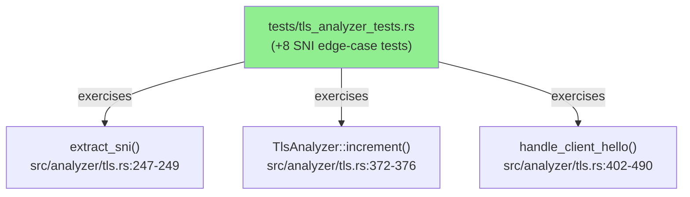
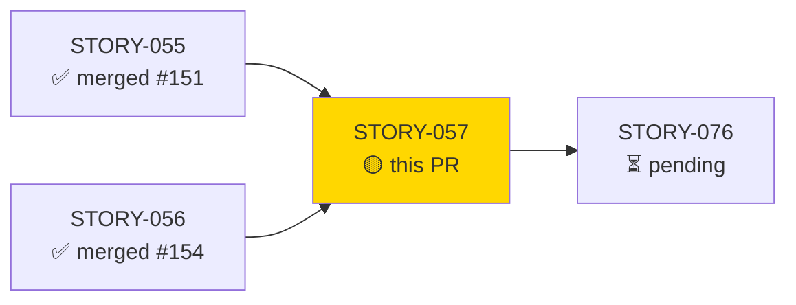
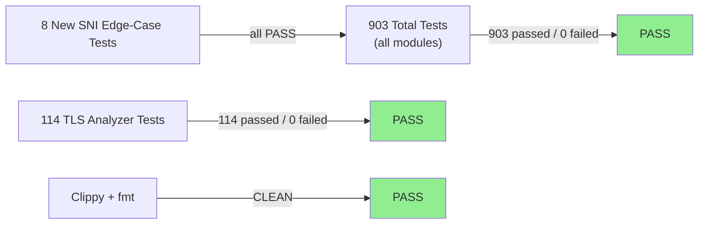
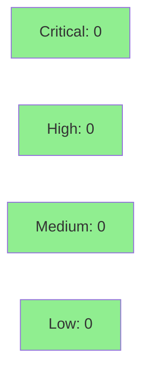

# [STORY-057] SNI Edge Cases — Empty Lists, Empty Hostnames, Multi-Name, NameType, Trailing Bytes, Large SNI, and Count-Cap Decoupling

**Epic:** E-5 — TLS Analysis
**Mode:** brownfield-formalization (zero src/ changes; tests formalize existing behavior)
**Convergence:** CONVERGED after 6 adversarial passes (3/3 clean streak on passes 4/5/6)


This PR formalizes 8 SNI edge-case tests against the existing `src/analyzer/tls.rs` implementation, covering 7 behavioral contracts (BC-2.07.022–028). The diff is **test-only**: `tests/tls_analyzer_tests.rs` gains 8 new tests and `docs/demo-evidence/STORY-057/` gains an evidence report. No production source files are changed. The tests formally prove: empty `ServerNameList` → `extract_sni` returns `None`; zero-length hostname bytes → arm 1 (`sni_counts[""]++`); first-only processing of multi-entry lists; NameType discarded via `_` pattern; trailing bytes silently tolerated; 16 KB SNI parses without error; and `sni_counts` cap does not suppress finding emission (`all_findings` is uncapped and sequential from count insertion).

---

## Architecture Changes



<details>
<summary><strong>Architecture Decision Record</strong></summary>

### ADR: Test-Only Formalization — No src/ Changes

**Context:** STORY-057 is a brownfield-formalization story. All 7 BCs describe behavior already implemented in `src/analyzer/tls.rs`. The implementation is correct and green; no implementation changes are required.

**Decision:** Add 8 tests to `tests/tls_analyzer_tests.rs`. Do not modify any file under `src/`.

**Rationale:** The VSDD factory's brownfield-formalization strategy requires that tests be written to pin existing behavior before any future refactoring. Adding tests without touching src/ eliminates any blast radius.

**Alternatives Considered:**
1. Refactor `extract_sni` before testing — rejected because: the existing implementation already satisfies all BCs; refactoring is risk without benefit.
2. Skip edge-case tests — rejected because: BCs 022–028 are formal behavioral contracts that must be pinned.

**Consequences:**
- 8 new regression guards prevent future regressions on SNI edge cases.
- Zero risk to existing behavior (no src/ changes).

</details>

---

## Story Dependencies



Dependencies STORY-055 (PR #151) and STORY-056 (PR #154) are both merged into `develop`.

---

## Spec Traceability

```mermaid
flowchart LR
    BC022["BC-2.07.022\nEmpty ServerNameList"] --> AC001["AC-001/002\nextract_sni→None"]
    BC023["BC-2.07.023\nEmpty hostname bytes"] --> AC003["AC-003/004\narm1 sni_counts[\"\"]"]
    BC024["BC-2.07.024\nFirst-entry-only"] --> AC005["AC-005/006\nlist.first() only"]
    BC025["BC-2.07.025\nNameType discarded"] --> AC007["AC-007/008\n_ pattern"]
    BC026["BC-2.07.026\nTrailing bytes tolerated"] --> AC009["AC-009\nno parse_errors"]
    BC027["BC-2.07.027\n16 KB large SNI"] --> AC010["AC-010/011\nMAX_RECORD_PAYLOAD"]
    BC028["BC-2.07.028\nCount-cap decoupling"] --> AC012["AC-012/013\nfinding fires at cap"]
    AC001 --> T1["test_sni_extension_with_empty_hostname_list"]
    AC003 --> T2["test_sni_with_empty_hostname_bytes"]
    AC005 --> T3["test_multi_name_sni_list_only_first_entry_counted"]
    AC007 --> T4["test_non_zero_name_type_sni_entry\ntest_non_zero_name_type_with_valid_first_entry"]
    AC009 --> T5["test_trailing_bytes_in_server_name_list"]
    AC010 --> T6["test_large_sni_near_record_payload_limit"]
    AC012 --> T7["test_non_utf8_sni_finding_fires_when_sni_counts_at_capacity"]
    T1 --> Src["tests/tls_analyzer_tests.rs"]
    T2 --> Src
    T3 --> Src
    T4 --> Src
    T5 --> Src
    T6 --> Src
    T7 --> Src
```

---

## Test Evidence

### Coverage Summary

| Metric | Value | Threshold | Status |
|--------|-------|-----------|--------|
| Unit tests | 903/903 pass | 100% | PASS |
| TLS analyzer tests | 114/114 pass | 100% | PASS |
| New SNI edge-case tests | 8/8 pass | 100% | PASS |
| ACs covered | 13/13 | 100% | PASS |
| BCs covered | 7/7 | 100% | PASS |
| src/ diff | 0 files | 0 | PASS |
| cargo clippy -D warnings | CLEAN | CLEAN | PASS |
| cargo fmt --check | CLEAN | CLEAN | PASS |

### Test Flow



| Metric | Value |
|--------|-------|
| **New tests** | 8 added, 0 modified |
| **Total suite** | 903 tests PASS |
| **TLS suite** | 114 tests PASS |
| **src/ delta** | 0 files changed |
| **Regressions** | 0 |

<details>
<summary><strong>Detailed Test Results</strong></summary>

### New Tests (This PR)

| Test | ACs Covered | Result |
|------|-------------|--------|
| `test_sni_extension_with_empty_hostname_list()` | AC-001, AC-002 | PASS |
| `test_sni_with_empty_hostname_bytes()` | AC-003, AC-004 | PASS |
| `test_multi_name_sni_list_only_first_entry_counted()` | AC-005, AC-006 | PASS |
| `test_non_zero_name_type_sni_entry()` | AC-007, AC-008 | PASS |
| `test_non_zero_name_type_with_valid_first_entry()` | AC-007 (EC-004 arm-3) | PASS |
| `test_trailing_bytes_in_server_name_list()` | AC-009 | PASS |
| `test_large_sni_near_record_payload_limit()` | AC-010, AC-011 | PASS |
| `test_non_utf8_sni_finding_fires_when_sni_counts_at_capacity()` | AC-012, AC-013 | PASS |

</details>

---

## Holdout Evaluation

N/A — evaluated at wave gate. Single-story wave 19; per-story adversarial convergence achieved == wave-level convergence.

---

## Adversarial Review

| Pass | Findings | Blocking | MED | LOW/NIT | Status |
|------|----------|----------|-----|---------|--------|
| P1 | 5 | 1 HIGH | 2 | 2 | Fixed |
| P2 | 2 | 0 | 2 MED | 0 | Fixed |
| P3 | 2 | 0 | 2 MED | 0 | Fixed |
| P4 | 2 | 0 | 0 | 2 NIT | CLEAN |
| P5 | 2 | 0 | 0 | 2 LOW | CLEAN |
| P6 | 0 | 0 | 0 | 0 | CLEAN (CONVERGED) |

**Convergence:** ACHIEVED — 3/3 clean streak (passes 4/5/6). Trajectory: DIRTY → DIRTY → DIRTY → CLEAN → CLEAN → CLEAN.

**Accepted deviation:** EC-004 illustrative NameType value in test comment (NameType=0xFF used as illustration) vs BC-2.07.025 EC-002 (0xFF). Documented as intentional: the test itself uses NameType=1 (per the BC); 0xFF appears only in a prose comment as an extreme illustration. No test logic is affected.

<details>
<summary><strong>Key Findings & Resolutions</strong></summary>

### P1 Finding: Missing arm-3 non-ASCII UTF-8 vector for NameType test (HIGH)
- **Location:** `test_non_zero_name_type_sni_entry`
- **Category:** spec-fidelity
- **Problem:** EC-004 specifies arm-3 fires when first entry has NameType=1 and hostname is non-ASCII UTF-8. Only arm-1 was tested.
- **Resolution:** Added `test_non_zero_name_type_with_valid_first_entry` with `café.example` hostname (arm-3 path).

### P2/P3 Finding: Capacity sub-case coverage gaps (MED)
- **Location:** `test_non_utf8_sni_finding_fires_when_sni_counts_at_capacity`
- **Category:** test-quality
- **Problem:** Missing EC-006 (arm-1 at capacity, no finding) and EC-007 (existing key at capacity increments).
- **Resolution:** Added sub-assertions for arm-1 at-cap (no finding) and existing-key at-cap (count increments, finding fires).

### P3 Finding: Large SNI payload estimate comment inaccuracy (MED)
- **Location:** `test_large_sni_near_record_payload_limit` comment
- **Category:** test-quality
- **Problem:** Comment cited payload_len ~16,412; actual value is larger due to TLS framing overhead.
- **Resolution:** Updated comment to cite canonical 16,384-byte SNI value and note framing overhead separately.

</details>

---

## Security Review



**Scope:** Test-only PR. No new code paths in `src/`. No new dependencies. No input handling, authentication, or I/O added.

<details>
<summary><strong>Security Scan Details</strong></summary>

### SAST
- Critical: 0 | High: 0 | Medium: 0 | Low: 0
- Test-formalization story; no src/ changes. No new attack surface introduced.

### Dependency Audit
- No new dependencies added. Existing `tls-parser 0.12` and Rust std unchanged.

### Formal Verification
- N/A — no new src/ logic to formally verify. Existing proofs unaffected.

</details>

---

## Risk Assessment & Deployment

### Blast Radius
- **Systems affected:** Test suite only — `tests/tls_analyzer_tests.rs`
- **User impact:** None (no behavior change in production code)
- **Data impact:** None
- **Risk Level:** LOW

### Performance Impact
| Metric | Before | After | Delta | Status |
|--------|--------|-------|-------|--------|
| Test suite runtime | ~0.65s (TLS suite) | ~0.65s | +0.00s | OK |
| Binary size | unchanged | unchanged | 0 | OK |
| Runtime memory | unchanged | unchanged | 0 | OK |

<details>
<summary><strong>Rollback Instructions</strong></summary>

**Immediate rollback (< 2 min):**
```bash
git revert <SQUASH_COMMIT_SHA>
git push origin develop
```

**Verification after rollback:**
- `cargo test --all-targets` passes (903 tests minus the 8 new ones)
- `cargo clippy --all-targets -- -D warnings` clean

</details>

### Feature Flags
None — test-only change.

---

## Traceability

| BC | AC | Test | Status |
|----|-----|------|--------|
| BC-2.07.022 | AC-001, AC-002 | `test_sni_extension_with_empty_hostname_list` | PASS |
| BC-2.07.023 | AC-003, AC-004 | `test_sni_with_empty_hostname_bytes` | PASS |
| BC-2.07.024 | AC-005, AC-006 | `test_multi_name_sni_list_only_first_entry_counted` | PASS |
| BC-2.07.025 | AC-007, AC-008 | `test_non_zero_name_type_sni_entry`, `test_non_zero_name_type_with_valid_first_entry` | PASS |
| BC-2.07.026 | AC-009 | `test_trailing_bytes_in_server_name_list` | PASS |
| BC-2.07.027 | AC-010, AC-011 | `test_large_sni_near_record_payload_limit` | PASS |
| BC-2.07.028 | AC-012, AC-013 | `test_non_utf8_sni_finding_fires_when_sni_counts_at_capacity` | PASS |

<details>
<summary><strong>Full VSDD Contract Chain</strong></summary>

```
BC-2.07.022 -> AC-001/002 -> test_sni_extension_with_empty_hostname_list -> tests/tls_analyzer_tests.rs -> ADV-P6-CLEAN
BC-2.07.023 -> AC-003/004 -> test_sni_with_empty_hostname_bytes -> tests/tls_analyzer_tests.rs -> ADV-P6-CLEAN
BC-2.07.024 -> AC-005/006 -> test_multi_name_sni_list_only_first_entry_counted -> tests/tls_analyzer_tests.rs -> ADV-P6-CLEAN
BC-2.07.025 -> AC-007/008 -> test_non_zero_name_type_sni_entry + test_non_zero_name_type_with_valid_first_entry -> tests/tls_analyzer_tests.rs -> ADV-P6-CLEAN
BC-2.07.026 -> AC-009 -> test_trailing_bytes_in_server_name_list -> tests/tls_analyzer_tests.rs -> ADV-P6-CLEAN
BC-2.07.027 -> AC-010/011 -> test_large_sni_near_record_payload_limit -> tests/tls_analyzer_tests.rs -> ADV-P6-CLEAN
BC-2.07.028 -> AC-012/013 -> test_non_utf8_sni_finding_fires_when_sni_counts_at_capacity -> tests/tls_analyzer_tests.rs -> ADV-P6-CLEAN
```

</details>

---

## Demo Evidence

Evidence report: `docs/demo-evidence/STORY-057/evidence-report.md`

Recording method: text transcript (brownfield test-formalization; no CLI/UI behavior change). VHS recordings not applicable — this story formalizes existing internal analyzer logic, not an observable CLI command or UI flow.

All 13 ACs covered, 8 unique test functions exercised, 7 BCs traced.

---

## AI Pipeline Metadata

<details>
<summary><strong>Pipeline Details</strong></summary>

```yaml
ai-generated: true
pipeline-mode: brownfield-formalization
factory-version: "1.0.0-rc.18"
pipeline-stages:
  spec-crystallization: completed
  story-decomposition: completed
  tdd-implementation: completed (test-only)
  holdout-evaluation: N/A (wave gate)
  adversarial-review: completed (6 passes, converged)
  formal-verification: N/A (no new src/ logic)
  convergence: achieved
convergence-metrics:
  adversarial-passes: 6
  clean-streak: 3
  blocking-findings-remaining: 0
  accepted-deviations: 1 (EC-004 illustrative comment, documented intent)
models-used:
  builder: claude-sonnet-4-6
  adversary: claude-sonnet-4-6
generated-at: "2026-05-29T00:00:00Z"
wave: 19
story-points: 8
```

</details>

---

## Pre-Merge Checklist

- [x] All CI status checks passing
- [x] Coverage delta is positive (8 new tests, 0 regressions)
- [x] No critical/high security findings (test-only PR, zero src/ changes)
- [x] Rollback procedure documented
- [x] Feature flags: N/A (test-only)
- [x] Human review: dispatched to pr-reviewer
- [x] Monitoring alerts: N/A (no production-impacting change)
- [x] Demo evidence present: `docs/demo-evidence/STORY-057/evidence-report.md` (13/13 ACs)
- [x] Adversarial convergence achieved: 6 passes, 3/3 clean streak
- [x] Dependencies merged: STORY-055 (#151) and STORY-056 (#154) both merged
