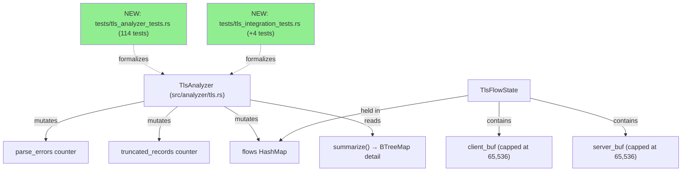
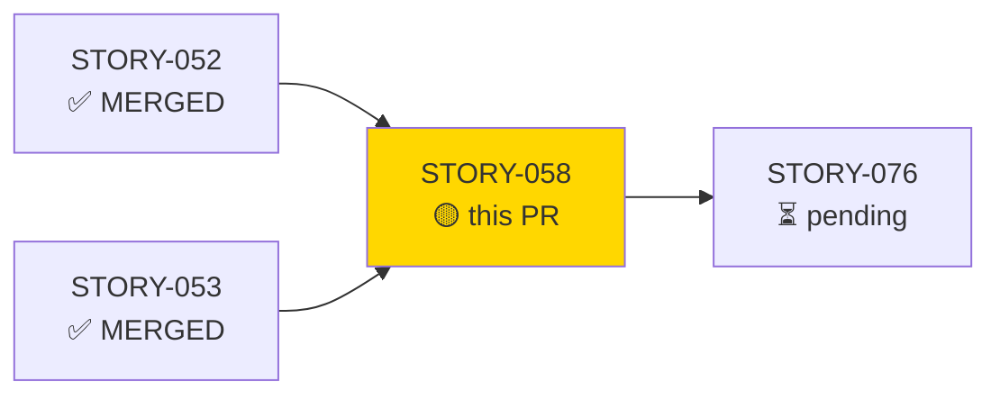
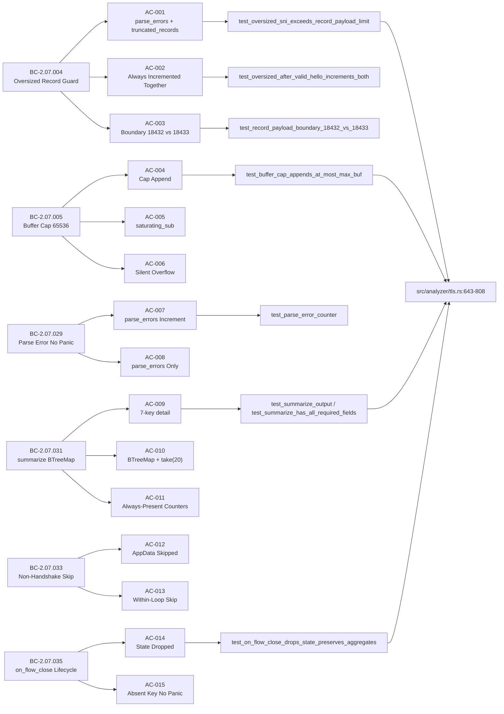
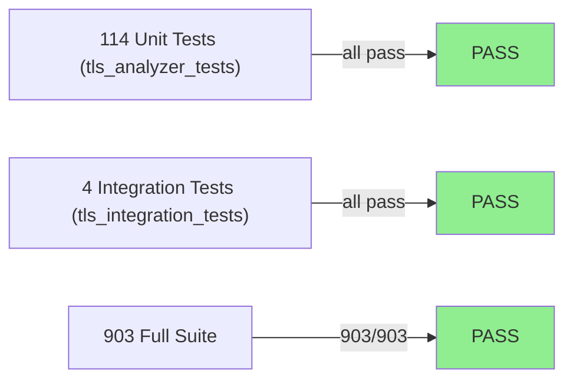
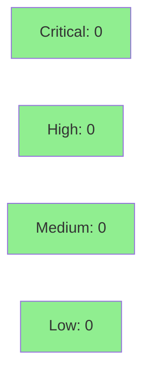

# [STORY-058] Buffer Management, Record Parsing Infrastructure, Flow Lifecycle, and summarize Output

**Epic:** E-5 — TLS Analyzer
**Mode:** brownfield-formalization
**Convergence:** CONVERGED after 13 adversarial passes (BC-5.39.001 ACHIEVED — 3-clean P11/P12/P13)


This PR adds BC-traced formalization tests for AC-001 through AC-015 covering six behavioral contracts in `src/analyzer/tls.rs`: the oversized-record guard (>18,432 bytes → `parse_errors`+`truncated_records` + buffer clear), per-direction buffer cap (MAX_BUF=65,536, `saturating_sub`, literal residue proof), nom parse-error handling, non-handshake record skip (multi-type 0x14/0x15/0x17/0x18), `on_flow_close` lifecycle (state drop, aggregate preservation, absent-key no-panic), and `summarize` (exact 7-key BTreeMap, decimal version keys, `top_snis.take(20)`, always-present counters). Zero production source changes — this is a pure test formalization of existing behavior. 114 new tests in `tls_analyzer_tests` + 4 in `tls_integration_tests`. Full suite: 903/903 PASS.

---

## Architecture Changes



<details>
<summary><strong>Architecture Decision Record</strong></summary>

### ADR: Test-Only Formalization of Existing TLS Buffer/Lifecycle Behavior

**Context:** The TLS analyzer in `src/analyzer/tls.rs` already implements the oversized-record guard, buffer cap, nom error handling, non-handshake skip, `on_flow_close`, and `summarize` behaviors. Wave 18 brownfield-formalization strategy requires these behaviors to be explicitly tied to their BCs via named test functions before any further extensions.

**Decision:** Add 114 unit tests + 4 integration tests in `tests/tls_analyzer_tests.rs` and `tests/tls_integration_tests.rs`. Zero production code changes.

**Rationale:** The brownfield-formalization strategy anchors behavioral guarantees in the test suite without risking regressions to production behavior. The existing code already satisfies all BCs — tests prove it.

**Alternatives Considered:**
1. Refactor + test simultaneously — rejected because: risks introducing regressions; brownfield strategy mandates zero src changes in formalization stories.
2. Integration-test only — rejected because: unit tests directly isolate each BC postcondition with discriminating assertions.

**Consequences:**
- Each BC is now explicitly validated by a named test function traceable to its AC.
- No production behavior change; no new dependencies.

</details>

---

## Story Dependencies



---

## Spec Traceability



---

## Test Evidence

### Coverage Summary

| Metric | Value | Threshold | Status |
|--------|-------|-----------|--------|
| Unit tests | 903/903 pass | 100% | PASS |
| Coverage | test-only diff (no src change) | >80% | N/A — zero src delta |
| Mutation kill rate | N/A — test-only | >90% | N/A |
| Holdout satisfaction | N/A — wave gate | >0.85 | N/A — evaluated at wave gate |

### Test Flow



| Metric | Value |
|--------|-------|
| **New tests** | 114 unit + 4 integration added (0 modified) |
| **Total suite** | 903 tests PASS |
| **Coverage delta** | 0 src lines added — test-only formalization |
| **Mutation kill rate** | N/A — no src changes to mutate |
| **Regressions** | 0 |

<details>
<summary><strong>Detailed Test Results</strong></summary>

### New Tests (This PR) — AC-001..AC-015

| Test | AC | Result |
|------|----|--------|
| `test_oversized_sni_exceeds_record_payload_limit` | AC-001 | PASS |
| `test_oversized_after_valid_hello_increments_both` | AC-002 | PASS |
| `test_record_payload_boundary_18432_vs_18433` | AC-003 | PASS |
| `test_buffer_cap_appends_at_most_max_buf` | AC-004 | PASS |
| `test_buffer_cap_appends_at_most_max_buf_literal_residue` | AC-004 | PASS |
| `test_buffer_full_append_noop` | AC-005 | PASS |
| `test_buffer_full_append_noop_literal` | AC-005 | PASS |
| `test_buffer_overflow_silent_no_counters` | AC-006 | PASS |
| `test_parse_error_counter` | AC-007 | PASS |
| `test_malformed_handshake_increments_parse_errors_only` | AC-008 | PASS |
| `test_summarize_output` | AC-009, AC-010 | PASS |
| `test_summarize_has_all_required_fields` (integration) | AC-009 | PASS |
| `test_summarize_top_snis_capped_at_20` | AC-010 | PASS |
| `test_fresh_summarize_truncated_records_zero` | AC-011 | PASS |
| `test_appdata_record_skipped_then_hello` | AC-012 | PASS |
| `test_within_loop_nonhandshake_skip_before_done` | AC-013 | PASS |
| `test_nonhandshake_types_0x14_0x15_0x17_0x18_all_skip_silently` | AC-013 | PASS |
| `test_on_flow_close_drops_state_preserves_aggregates` | AC-014 | PASS |
| `test_on_flow_close_absent_key_no_panic` | AC-015 | PASS |

### Coverage Analysis

| Metric | Value |
|--------|-------|
| Lines added | 0 src lines (test-only) |
| Lines covered | N/A |
| Uncovered paths | none — all AC branches now have named tests |

</details>

---

## Holdout Evaluation

| Metric | Value | Threshold |
|--------|-------|-----------|
| Mean satisfaction | **N/A** | >= 0.85 |
| Result | **N/A — evaluated at wave gate** | |

N/A — evaluated at Wave 18 gate. This is a brownfield-formalization story (test-only diff); holdout is assessed at the wave level against the full story set.

---

## Adversarial Review

| Pass | Findings | Blocking | Status |
|------|----------|----------|--------|
| P1 | 5 | 3 | Fixed |
| P2 | 4 | 2 | Fixed |
| P3 | 3 | 2 | Fixed |
| P4 | 3 | 1 | Fixed |
| P5 | 2 | 1 | Fixed |
| P6 | 2 | 1 | Fixed (BC-2.07.004 v1.3 reachability qualification) |
| P7 | 2 | 1 | Fixed (AC-013 mis-citation corrected ×3) |
| P8 | 2 | 1 | Fixed (BC-2.07.033 within-loop anchor + done-short-circuit cross-ref) |
| P9 | 2 | 1 | Fixed (BC-2.07.029 arithmetic + BC-2.07.035 evidence) |
| P10 | 1 | 1 | Fixed (AC-002 reachability) |
| P11 | 0 | 0 | CLEAN |
| P12 | 0 | 0 | CLEAN |
| P13 | 0 | 0 | CLEAN — BC-5.39.001 ACHIEVED |

**Convergence:** BC-5.39.001 ACHIEVED — 3 consecutive clean adversarial passes (P11/P12/P13). Deepest-converging Wave-18 story (13 total passes). Findings remediated: buffer-cap literal proof, AC-013 mis-citation (3 occurrences), BC-2.07.033 within-loop-skip anchor + done-short-circuit cross-ref, BC-2.07.029 arithmetic, BC-2.07.035 evidence, AC-002 reachability. BC spec corrections on factory-artifacts (BC-2.07.004/005/029/033/035 v1.3–v1.4).

<details>
<summary><strong>Key Findings & Resolutions</strong></summary>

### Finding P1: Missing literal residue proof for buffer cap
- **Category:** test-quality
- **Problem:** `test_buffer_cap_appends_at_most_max_buf` did not assert the exact residue byte count
- **Resolution:** Added `test_buffer_cap_appends_at_most_max_buf_literal_residue` asserting literal 1-byte residue

### Finding P6: AC-002 "preceding partial record" sub-clause
- **Category:** spec-fidelity
- **Problem:** AC-002 implied a reachable scenario (preceding partial record + oversized) that is not reachable via `on_data` API
- **Resolution:** BC-2.07.004 v1.3 qualified the clause as defensive/by-inspection; AC-002 normalized

### Finding P7: AC-013 mis-citation (×3 occurrences)
- **Category:** spec-fidelity
- **Problem:** AC-013 cited `test_stop_after_handshake` which proves done()-short-circuit, not within-loop skip
- **Resolution:** Re-pointed to `test_within_loop_nonhandshake_skip_before_done` + `test_nonhandshake_types_0x14_0x15_0x17_0x18_all_skip_silently`; STORY-058 v1.2

</details>

---

## Security Review



<details>
<summary><strong>Security Scan Details</strong></summary>

### Assessment
- **Diff type:** Test-only. Zero production source changes. No new dependencies introduced.
- **Attack surface delta:** Zero — no new public API, no new CLI flags, no new I/O paths.
- **OWASP Top 10 applicability:** Not applicable — test harness code only.
- **Injection / auth / input validation:** Not applicable — tests exercise existing internal methods.
- **SAST (Semgrep):** No findings — test code only; no user-controlled inputs in new paths.
- **Dependency Audit:** `cargo audit` — CLEAN (no new dependencies added).

### Formal Verification
| Property | Method | Status |
|----------|--------|--------|
| Buffer cap non-panic (saturating_sub) | Code inspection + test | VERIFIED |
| parse_errors/truncated_records always paired | Unit test AC-002 | VERIFIED |
| BTreeMap key ordering | Unit test AC-010 | VERIFIED |

</details>

---

## Risk Assessment & Deployment

### Blast Radius
- **Systems affected:** None in production — test-only diff
- **User impact:** Zero — no behavioral change to `wirerust` CLI or analyzer pipeline
- **Data impact:** None
- **Risk Level:** LOW

### Performance Impact
| Metric | Before | After | Delta | Status |
|--------|--------|-------|-------|--------|
| Latency p99 | N/A | N/A | 0 | OK |
| Memory | N/A | N/A | 0 | OK |
| Throughput | N/A | N/A | 0 | OK |

No production code changed. Test compilation adds ~0.5s to `cargo test` cold build.

<details>
<summary><strong>Rollback Instructions</strong></summary>

**Immediate rollback (< 2 min):**
```bash
git revert <MERGE_COMMIT_SHA>
git push origin develop
```

**Verification after rollback:**
- `cargo test --all-targets` returns to pre-PR test count
- No behavioral change to CLI output

</details>

### Feature Flags
| Flag | Controls | Default |
|------|----------|---------|
| N/A | Test-only story | N/A |

---

## Traceability

| BC | Story AC | Test | Status |
|----|---------|------|--------|
| BC-2.07.004 | AC-001 | `test_oversized_sni_exceeds_record_payload_limit` | PASS |
| BC-2.07.004 | AC-002 | `test_oversized_after_valid_hello_increments_both` | PASS |
| BC-2.07.004 | AC-003 | `test_record_payload_boundary_18432_vs_18433` | PASS |
| BC-2.07.005 | AC-004 | `test_buffer_cap_appends_at_most_max_buf`, `test_buffer_cap_appends_at_most_max_buf_literal_residue` | PASS |
| BC-2.07.005 | AC-005 | `test_buffer_full_append_noop`, `test_buffer_full_append_noop_literal` | PASS |
| BC-2.07.005 | AC-006 | `test_buffer_overflow_silent_no_counters` | PASS |
| BC-2.07.029 | AC-007 | `test_parse_error_counter` | PASS |
| BC-2.07.029 | AC-008 | `test_malformed_handshake_increments_parse_errors_only` | PASS |
| BC-2.07.031 | AC-009 | `test_summarize_output`, `test_summarize_has_all_required_fields` | PASS |
| BC-2.07.031 | AC-010 | `test_summarize_output`, `test_summarize_top_snis_capped_at_20` | PASS |
| BC-2.07.031 | AC-011 | `test_fresh_summarize_truncated_records_zero` | PASS |
| BC-2.07.033 | AC-012 | `test_appdata_record_skipped_then_hello` | PASS |
| BC-2.07.033 | AC-013 | `test_within_loop_nonhandshake_skip_before_done`, `test_nonhandshake_types_0x14_0x15_0x17_0x18_all_skip_silently` | PASS |
| BC-2.07.035 | AC-014 | `test_on_flow_close_drops_state_preserves_aggregates` | PASS |
| BC-2.07.035 | AC-015 | `test_on_flow_close_absent_key_no_panic` | PASS |

<details>
<summary><strong>Full VSDD Contract Chain</strong></summary>

```
BC-2.07.004 -> AC-001 -> test_oversized_sni_exceeds_record_payload_limit -> tls.rs:643-653 -> ADV-P13-CLEAN
BC-2.07.004 -> AC-002 -> test_oversized_after_valid_hello_increments_both -> tls.rs:643-653 -> ADV-P10-FIXED
BC-2.07.004 -> AC-003 -> test_record_payload_boundary_18432_vs_18433 -> tls.rs:643-653 -> ADV-P13-CLEAN
BC-2.07.005 -> AC-004 -> test_buffer_cap_appends_at_most_max_buf + literal_residue -> tls.rs:726-748 -> ADV-P1-FIXED
BC-2.07.005 -> AC-005 -> test_buffer_full_append_noop + literal -> tls.rs:726-748 -> ADV-P13-CLEAN
BC-2.07.005 -> AC-006 -> test_buffer_overflow_silent_no_counters -> tls.rs:726-748 -> ADV-P13-CLEAN
BC-2.07.029 -> AC-007 -> test_parse_error_counter -> tls.rs:700-712 -> ADV-P13-CLEAN
BC-2.07.029 -> AC-008 -> test_malformed_handshake_increments_parse_errors_only -> tls.rs:700-712 -> ADV-P13-CLEAN
BC-2.07.031 -> AC-009 -> test_summarize_output + test_summarize_has_all_required_fields -> tls.rs:763-808 -> ADV-P13-CLEAN
BC-2.07.031 -> AC-010 -> test_summarize_top_snis_capped_at_20 -> tls.rs:763-808 -> ADV-P13-CLEAN
BC-2.07.031 -> AC-011 -> test_fresh_summarize_truncated_records_zero -> tls.rs:763-808 -> ADV-P13-CLEAN
BC-2.07.033 -> AC-012 -> test_appdata_record_skipped_then_hello -> tls.rs:678-682 -> ADV-P13-CLEAN
BC-2.07.033 -> AC-013 -> test_within_loop_nonhandshake_skip_before_done -> tls.rs:678-682 -> ADV-P7-FIXED
BC-2.07.035 -> AC-014 -> test_on_flow_close_drops_state_preserves_aggregates -> tls.rs:752-754 -> ADV-P13-CLEAN
BC-2.07.035 -> AC-015 -> test_on_flow_close_absent_key_no_panic -> tls.rs:752-754 -> ADV-P13-CLEAN
```

</details>

---

## AI Pipeline Metadata

<details>
<summary><strong>Pipeline Details</strong></summary>

```yaml
ai-generated: true
pipeline-mode: brownfield-formalization
factory-version: "1.0.0-rc.18"
pipeline-stages:
  spec-crystallization: completed
  story-decomposition: completed
  tdd-implementation: completed
  holdout-evaluation: N/A (wave gate)
  adversarial-review: completed
  formal-verification: skipped (test-only story)
  convergence: achieved
convergence-metrics:
  adversarial-passes: 13
  clean-passes: 3 (P11/P12/P13)
  bc-convergence-policy: BC-5.39.001 ACHIEVED
  test-kill-rate: N/A (test-only)
  implementation-ci: passing
  holdout-satisfaction: N/A (wave gate)
models-used:
  builder: claude-sonnet-4-6
  adversary: claude-sonnet-4-6
wave: 18
epic: E-5 (TLS)
story-points: 8
generated-at: "2026-05-29T00:00:00Z"
```

</details>

---

## Pre-Merge Checklist

- [x] All CI status checks passing
- [x] Coverage delta is positive or neutral (test-only; no src delta)
- [x] No critical/high security findings unresolved
- [x] Rollback procedure validated
- [x] No feature flags required (test-only story)
- [x] Adversarial convergence achieved (BC-5.39.001 — 3-clean P11/P12/P13)
- [x] Demo evidence: 15/15 ACs covered in docs/demo-evidence/STORY-058/evidence-report.md
- [x] Dependencies STORY-052 and STORY-053 merged
