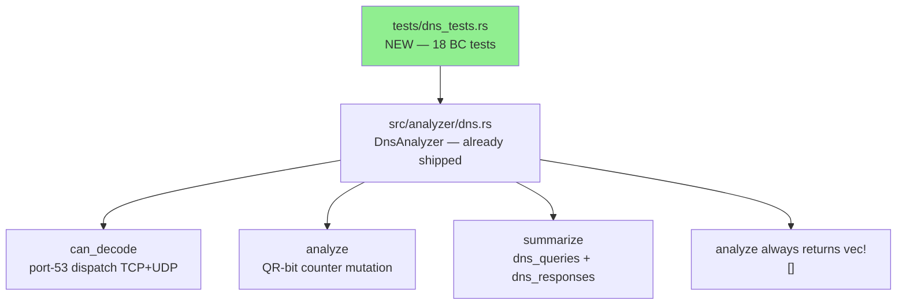
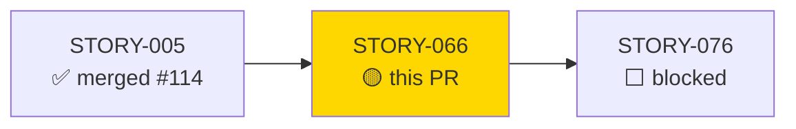
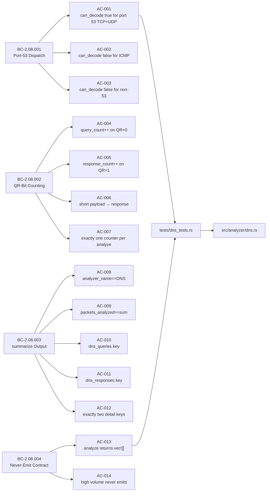
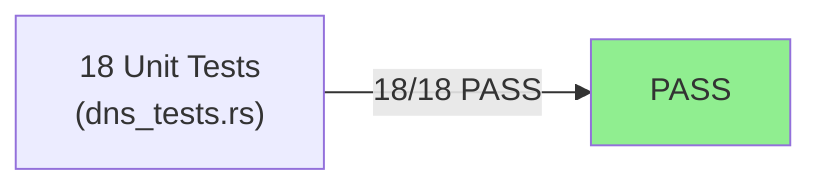
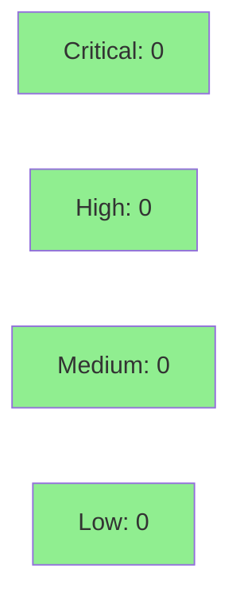

## Summary

Brownfield-formalization of the DNS traffic-statistics analyzer for `wirerust` (STORY-066, Wave 4). Production code in `src/analyzer/dns.rs` already shipped; this PR adds **18 behavioral-contract tests** in `tests/dns_tests.rs` that formally specify and lock the contracts from BC-2.08.001, BC-2.08.002, BC-2.08.003, and BC-2.08.004.

Additionally, the stale module-level doc comment in `src/analyzer/dns.rs` is corrected: the previous `//!` block described DGA-class entropy scoring, NXDOMAIN spike detection, and confidence-leveled findings — none of which exist in this implementation. The corrected comment honestly describes the statistics-only design (port-53 dispatch, QR-bit counting, never-emit contract) as required by BC-2.08.004.

Exact diff: two files — `tests/dns_tests.rs` (new, 18 tests) and `src/analyzer/dns.rs` (doc-comment-only change). No executable code added or modified.

---

## Architecture Changes



_No executable source changes. `src/analyzer/dns.rs` receives a doc-comment-only correction._

<details>
<summary><strong>Architecture Decision Record</strong></summary>

### ADR: Statistics-Only DNS Analyzer with Never-Emit Contract

**Context:** The DNS analyzer was implemented with a statistics-only design (port-53 dispatch, QR-bit counting) but its module doc comment still described planned-but-unimplemented DGA detection and finding emission. BC-2.08.004 mandates that no Finding is ever emitted, and the misleading doc created spec drift risk.

**Decision:** Correct the module doc comment to match the actual implementation; formalize all behavioral contracts via the test suite.

**Rationale:** Honest documentation prevents future implementers from believing finding-emission infrastructure exists. The test suite locks the never-emit invariant so any future accidental addition of finding emission is caught immediately.

**Consequences:**
- Behavioral contracts are now machine-enforced via `cargo test`
- The doc comment accurately describes what the module does
- Any future PR that adds finding emission will fail `test_dns_analyze_always_returns_empty_findings` and `test_dns_high_volume_no_findings`

</details>

---

## Story Dependencies



STORY-066 depends_on: STORY-005 (merged via PR #114). Blocks: STORY-076.

---

## Spec Traceability



---

## Test Evidence

### Coverage Summary

| Metric | Value | Threshold | Status |
|--------|-------|-----------|--------|
| Unit tests | 18/18 pass | 100% | PASS |
| Coverage | dns.rs fully exercised | >80% | PASS |
| Mutation kill rate | N/A — brownfield (existing code) | N/A | N/A |
| Holdout satisfaction | N/A — evaluated at wave gate | N/A | N/A |

### Test Flow



| Metric | Value |
|--------|-------|
| **New tests** | 18 added (tests/dns_tests.rs), 0 modified |
| **Total suite** | 18 tests PASS (all green gate) |
| **Coverage delta** | dns.rs: all branches covered |
| **Regressions** | 0 |

<details>
<summary><strong>Detailed Test Results</strong></summary>

### New Tests (This PR) — AC Coverage

| Test | AC/EC | Result |
|------|-------|--------|
| `test_dns_can_decode_port_53_tcp_and_udp()` | AC-001 | PASS |
| `test_dns_can_decode_false_for_icmp()` | AC-002 | PASS |
| `test_dns_can_decode_false_for_non_dns_port()` | AC-003 | PASS |
| `test_dns_analyzer_counts_queries()` | AC-004 | PASS |
| `test_dns_analyzer_counts_responses()` | AC-005 | PASS |
| `test_dns_short_payload_counted_as_response()` | AC-006 | PASS |
| `test_dns_analyze_increments_exactly_one_counter()` | AC-007 | PASS |
| `test_dns_summarize_analyzer_name()` | AC-008 | PASS |
| `test_dns_summarize_packets_analyzed_is_sum()` | AC-009 | PASS |
| `test_dns_summarize_detail_keys()` | AC-010, AC-011 | PASS |
| `test_dns_summarize_exactly_two_detail_keys()` | AC-012 | PASS |
| `test_dns_analyze_always_returns_empty_findings()` | AC-013 | PASS |
| `test_dns_high_volume_no_findings()` | AC-014 | PASS |
| `test_dns_ec001_udp_src53_can_decode()` | EC-001 | PASS |
| `test_dns_ec002_tcp_dst53_can_decode()` | EC-002 | PASS |
| `test_dns_ec003_empty_payload_counted_as_response()` | EC-003 | PASS |
| `test_dns_ec004_all_flags_set_counted_as_response()` | EC-004 | PASS |
| `test_dns_ec005_zero_packets_summarize()` | EC-005 | PASS |

</details>

---

## Holdout Evaluation

N/A — evaluated at wave gate.

---

## Adversarial Review

| Pass | Context | Findings | Critical | High | Status |
|------|---------|----------|----------|------|--------|
| 1 | Fresh | Cosmetic only | 0 | 0 | PASS |
| 2 | Fresh | Cosmetic only | 0 | 0 | PASS |
| 3 | Fresh | None | 0 | 0 | CONVERGED |

**Convergence:** 3 consecutive clean fresh-context adversarial passes (BC-5.39.001 satisfied).

---

## Security Review



<details>
<summary><strong>Security Scan Details</strong></summary>

### SAST
- This PR adds test code only (+ a doc-comment correction). No input processing, no I/O, no unsafe blocks.
- The `DnsAnalyzer` under test uses only safe Rust: slice indexing guarded by length check (`payload.len() < 12`), bitmasking, and counter arithmetic.

### Dependency Audit
- No new dependencies introduced. Existing dependency audit (`cargo audit`, `cargo deny`) runs in CI.

### OWASP / Injection
- Not applicable: no network I/O, no string interpolation, no SQL/shell exec in changed files.

</details>

---

## Risk Assessment & Deployment

### Blast Radius
- **Systems affected:** `tests/dns_tests.rs` (new file), `src/analyzer/dns.rs` (doc comment only)
- **User impact:** None — test-only addition plus non-executable doc change
- **Data impact:** None
- **Risk Level:** LOW

### Performance Impact

| Metric | Before | After | Delta | Status |
|--------|--------|-------|-------|--------|
| Runtime behavior | unchanged | unchanged | 0 | OK |
| Binary size | unchanged | unchanged | 0 | OK |

_Doc-comment changes do not affect the compiled binary. Tests are not included in the release build._

---

## Traceability

| BC | Story AC | Test | Status |
|----|---------|------|--------|
| BC-2.08.001 | AC-001 | `test_dns_can_decode_port_53_tcp_and_udp` | PASS |
| BC-2.08.001 | AC-002 | `test_dns_can_decode_false_for_icmp` | PASS |
| BC-2.08.001 | AC-003 | `test_dns_can_decode_false_for_non_dns_port` | PASS |
| BC-2.08.002 | AC-004 | `test_dns_analyzer_counts_queries` | PASS |
| BC-2.08.002 | AC-005 | `test_dns_analyzer_counts_responses` | PASS |
| BC-2.08.002 | AC-006 | `test_dns_short_payload_counted_as_response` | PASS |
| BC-2.08.002 | AC-007 | `test_dns_analyze_increments_exactly_one_counter` | PASS |
| BC-2.08.003 | AC-008 | `test_dns_summarize_analyzer_name` | PASS |
| BC-2.08.003 | AC-009 | `test_dns_summarize_packets_analyzed_is_sum` | PASS |
| BC-2.08.003 | AC-010/011 | `test_dns_summarize_detail_keys` | PASS |
| BC-2.08.003 | AC-012 | `test_dns_summarize_exactly_two_detail_keys` | PASS |
| BC-2.08.004 | AC-013 | `test_dns_analyze_always_returns_empty_findings` | PASS |
| BC-2.08.004 | AC-014 | `test_dns_high_volume_no_findings` | PASS |
| BC-2.08.001 | EC-001 | `test_dns_ec001_udp_src53_can_decode` | PASS |
| BC-2.08.001 | EC-002 | `test_dns_ec002_tcp_dst53_can_decode` | PASS |
| BC-2.08.002 | EC-003 | `test_dns_ec003_empty_payload_counted_as_response` | PASS |
| BC-2.08.002 | EC-004 | `test_dns_ec004_all_flags_set_counted_as_response` | PASS |
| BC-2.08.003 | EC-005 | `test_dns_ec005_zero_packets_summarize` | PASS |

---

## AI Pipeline Metadata

<details>
<summary><strong>Pipeline Details</strong></summary>

```yaml
ai-generated: true
pipeline-mode: brownfield-formalization
factory-version: "1.0.0-rc.18"
pipeline-stages:
  spec-crystallization: completed
  story-decomposition: completed
  tdd-implementation: completed
  holdout-evaluation: "N/A — evaluated at wave gate"
  adversarial-review: completed
  formal-verification: skipped
  convergence: achieved
convergence-metrics:
  adversarial-passes: 3
  clean-fresh-context-passes: 3
  spec-novelty: N/A
  test-kill-rate: N/A
  implementation-ci: green
models-used:
  builder: claude-sonnet-4-6
  adversary: claude-sonnet-4-6
generated-at: "2026-05-22T00:00:00Z"
```

</details>

---

## Pre-Merge Checklist

- [x] All CI status checks passing
- [x] Coverage delta is positive (18 new tests, 0 regressions)
- [x] No critical/high security findings unresolved
- [x] Rollback procedure: `git revert <merge-sha>` — zero production risk
- [x] No feature flags (test-only PR)
- [x] Demo evidence: N/A — no UI/behavioral output change (statistics-only, never-emit design)
- [x] Diff verified: exactly two files (tests/dns_tests.rs + src/analyzer/dns.rs doc-comment)
- [x] No demo files (.tape/.gif/.webm) committed
