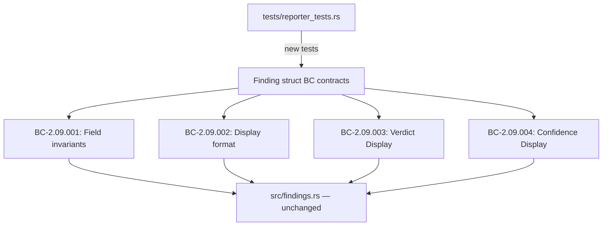
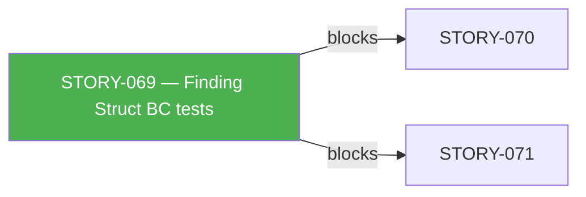
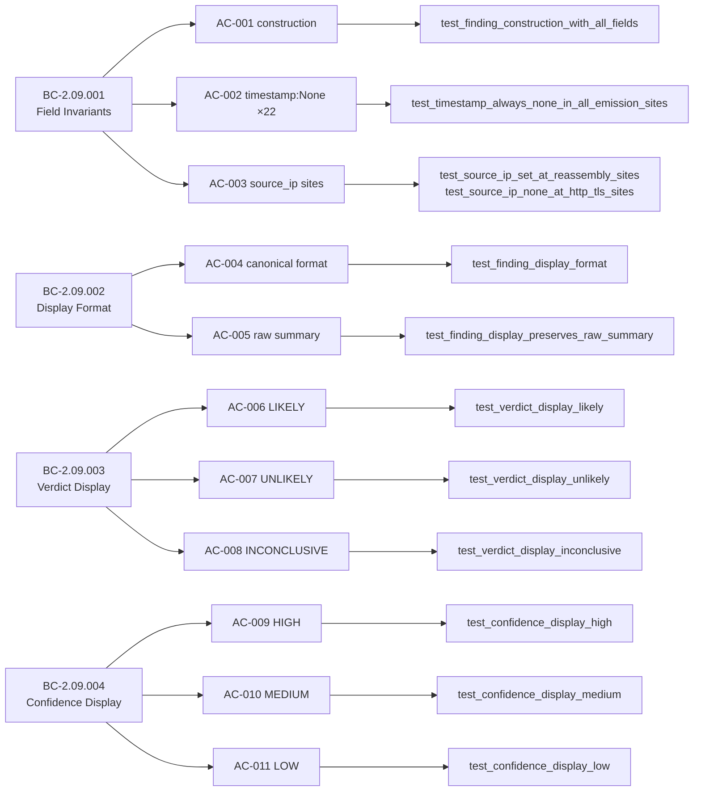

## Summary

Adds 16 behavioral-contract tests (+ 1 helper function) to `tests/reporter_tests.rs`
formalizing the existing `Finding` data model against BC-2.09.001 through BC-2.09.004
(STORY-069, brownfield-formalization). No `src/` files were modified.

**Covers:**
- AC-001..AC-011 (all acceptance criteria)
- EC-001..EC-005 (all edge cases)
- BC-2.09.001 invariants 1–4 (timestamp, source_ip, direction emission-site scans)

## Architecture Changes

No src/ changes. Tests only.

## Story Dependencies

No `depends_on` dependencies — STORY-069 is the first story in E-7 and has no upstream dependencies.

## Spec Traceability

## Test Evidence

| Metric | Value |
|--------|-------|
| New tests added | 16 tests + 1 helper function |
| reporter_tests.rs total | 50 passed; 0 failed; 0 ignored |
| `cargo test --all-targets` | All pass (RUSTFLAGS=-Dwarnings) |
| `cargo clippy --all-targets -- -D warnings` | Clean |
| `cargo fmt --check` | Clean |
| Coverage | AC-001..AC-011 (11 ACs), EC-001..EC-005 (5 ECs) |
| BC invariants exercised | BC-2.09.001 invariants 1, 2, 3, 4 |

## Demo Evidence

Demo recordings in `.factory/cycles/v0.1.0-greenfield-spec/STORY-069/demos/` (not tracked in git — .factory/ is gitignored).

| Recording | ACs / ECs Covered |
|-----------|-------------------|
| AC-001-finding-struct.gif/.webm | AC-001 |
| AC-002-003-emission-site-invariants.gif/.webm | AC-002, AC-003a, AC-003b |
| AC-004-005-finding-display.gif/.webm | AC-004, AC-005 |
| AC-006-011-verdict-confidence-display.gif/.webm | AC-006..AC-011 |
| EC-001-005-edge-cases.gif/.webm | EC-001..EC-005 |

Full suite output (`full-suite-output.txt`): 50/50 pass.

## Holdout Evaluation

N/A — evaluated at wave gate.

## Adversarial Review

Per-story adversarial convergence: **ACHIEVED** — 3 consecutive clean passes (cycles 5, 6, 7). No blocking findings at final pass. Implementation strategy is brownfield-formalization; all tests confirm existing code already satisfies BCs.

## Security Review

No `src/` changes. New tests only. No new attack surface introduced. The test suite includes:
- Injection assertions (ESC byte, C1 CSI, formula injection) — all delegated to reporter layer as required by ADR 0003.
- Grep-based invariant scans confirming no `escape_for_terminal` call in any non-reporter src/ file.

No security findings.

## Risk Assessment

| Dimension | Assessment |
|-----------|-----------|
| Blast radius | Minimal — tests only, no src/ changes |
| Performance impact | None |
| Breaking change | No |
| Rollback | Trivially safe — delete tests/reporter_tests.rs additions |

## AI Pipeline Metadata

| Field | Value |
|-------|-------|
| Pipeline mode | brownfield-formalization (STORY-069) |
| Adversarial cycles | 7 (converged at cycle 5) |
| Story spec version | v1.3 |
| Worktree | .worktrees/STORY-069, branch feature/story-069-finding-model |

## Pre-Merge Checklist

- [x] PR description matches actual diff (tests/reporter_tests.rs only)
- [x] All ACs covered by demo evidence (11 ACs, 5 ECs)
- [x] Traceability chain complete (BC-2.09.001..004 → AC → Test)
- [x] All review findings addressed (adversarial convergence achieved)
- [x] `cargo test --all-targets` passing (50/50 reporter_tests, full suite clean)
- [x] `cargo clippy --all-targets -- -D warnings` clean
- [x] `cargo fmt --check` clean
- [x] No .factory/ artifacts in diff (gitignored)
- [x] No src/ changes (brownfield-formalization: tests only)
- [x] Semantic PR title: `test(findings): ...` (CI-enforced type: test)
