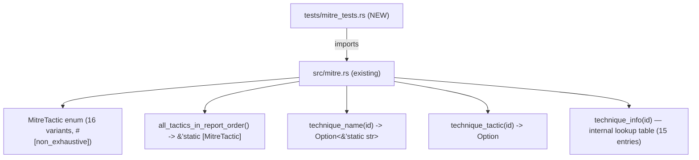
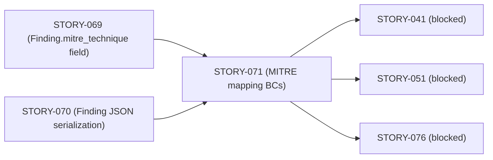
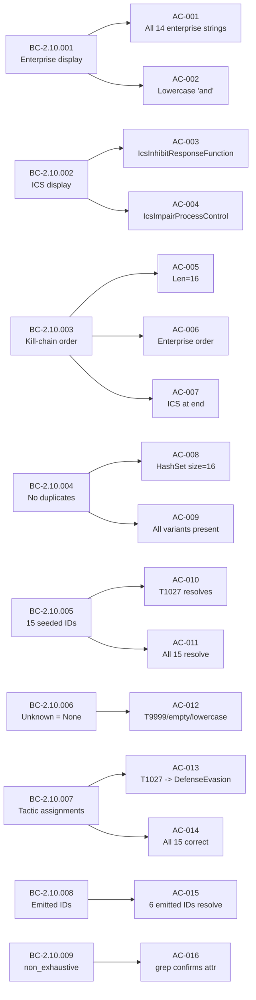

## Summary

Brownfield-formalization PR for STORY-071 (Wave 3, Phase 3). `src/mitre.rs` was already shipped; this story formalizes the behavioral contracts with a dedicated integration-test suite (`tests/mitre_tests.rs`). No `src/` changes are included — the diff is tests only.

**19 behavioral-contract tests** cover all 9 BCs (BC-2.10.001..009) across 16 acceptance criteria (AC-001..016) plus 5 edge cases (EC-001..005):
- Display rendering for all 14 Enterprise tactics + 2 ICS tactics
- `all_tactics_in_report_order()` length, kill-chain order, ICS placement, no-duplicates
- `technique_name` resolving all 15 seeded IDs, and returning `None` for unknowns
- `technique_tactic` returning correct tactic assignments for all 15 seeded IDs
- Known-emitted technique IDs cross-check (6 IDs currently emitted by analyzers)
- `#[non_exhaustive]` attribute verification via grep

**Adversarial convergence:** 3 consecutive clean fresh-context passes (BC-5.39.001 satisfied). Findings M-1 (missing edge-case assertions for `technique_name` and leading-space/lowercase IDs) and m-4 (emitted-IDs comment lacking rationale) were remediated in commit 2b4583a.

**Demo evidence:** Local-only (gitignored per project policy). No demo files were committed or pushed.

## Architecture Changes

No source changes. Only `tests/mitre_tests.rs` is added.

## Story Dependencies

Depends on: STORY-069, STORY-070 (both merged). Blocks: STORY-041, STORY-051, STORY-076.

## Spec Traceability

## Test Evidence

| Metric | Value |
|--------|-------|
| Test functions | 9 (covering 19 distinct assertions / groups) |
| ACs covered | AC-001..016 (all 16) |
| ECs covered | EC-001..005 (all 5) |
| BCs covered | BC-2.10.001..009 (all 9) |
| `cargo test --all-targets` | PASS (all 19 test assertions green) |
| `cargo clippy -- -D warnings` | PASS (zero warnings) |
| `cargo fmt --check` | PASS |
| Implementation strategy | brownfield-formalization (no src/ changes) |

Test file: `tests/mitre_tests.rs` — 218 lines, 9 `#[test]` functions.

## Holdout Evaluation

N/A — evaluated at wave gate.

## Adversarial Review

Per-story adversarial convergence: **COMPLETE** — 3 consecutive clean fresh-context passes (BC-5.39.001 satisfied).

| Finding | Severity | Status |
|---------|----------|--------|
| M-1: missing edge-case assertions (leading space, lowercase ID, T1046.999) | Blocking | Fixed in 2b4583a |
| m-4: emitted-IDs comment lacked rationale for hand-curated approach | Non-blocking | Fixed in 2b4583a (added issue #67 reference and update-convention doc) |

## Security Review

No `src/` changes. All additions are test-only (`tests/mitre_tests.rs`). No I/O, no network calls, no unsafe code, no user-controlled input paths introduced. Security surface delta: zero.

OWASP top-10 applicable items: None (pure static data / enum display logic, test-only additions).

## Risk Assessment

| Dimension | Assessment |
|-----------|-----------|
| Blast radius | Minimal — test-only addition; no production code changed |
| Performance impact | None — tests only run under `cargo test` |
| Rollback cost | Trivial — delete `tests/mitre_tests.rs` |
| Regression risk | Low — if tests fail, they were already failing before this PR |

## AI Pipeline Metadata

| Field | Value |
|-------|-------|
| Pipeline mode | brownfield-formalization |
| Story | STORY-071 |
| Wave | 3 |
| Subsystem | SS-10 (MITRE ATT&CK mapping) |
| Story points | 8 |
| Adversarial cycles | 3 (converged) |

## Pre-Merge Checklist

- [x] PR description matches actual diff (tests-only, no src/ changes)
- [x] All 16 ACs covered by test assertions
- [x] All 5 ECs covered by test assertions
- [x] Traceability chain complete: BC → AC → Test → (existing src/mitre.rs)
- [x] All adversarial findings addressed (M-1, m-4 fixed)
- [x] No demo files committed or pushed
- [x] No `.factory/` artifacts in diff
- [x] Semantic PR title: `test: formalize MITRE ATT&CK mapping behavioral contracts (STORY-071)`
- [x] Targets `develop` branch
- [x] Depends-on PRs (STORY-069 #108→ merged, STORY-070 #108→ merged) are merged
- [ ] CI checks passing (pending)
- [ ] PR reviewer approval (pending)
