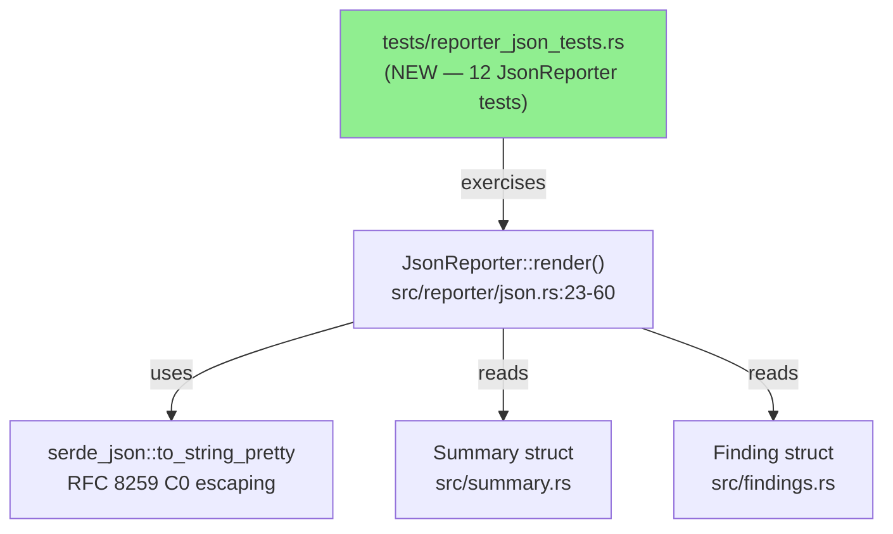
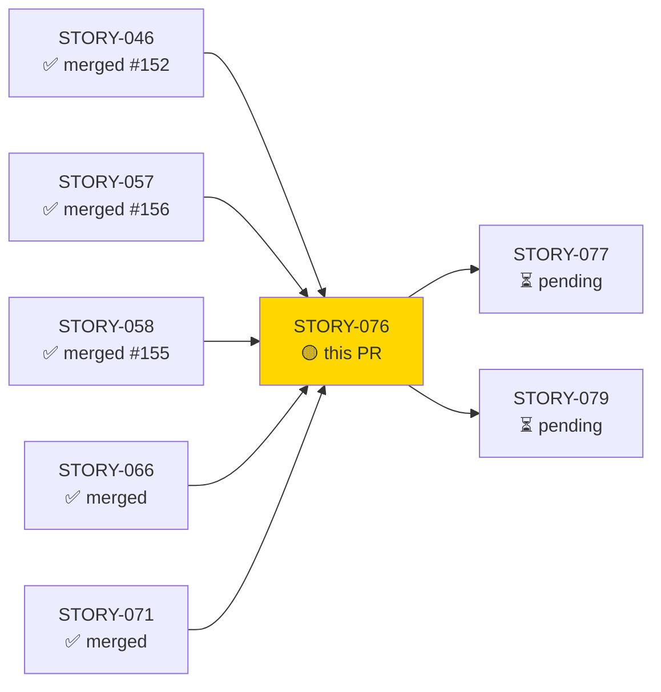
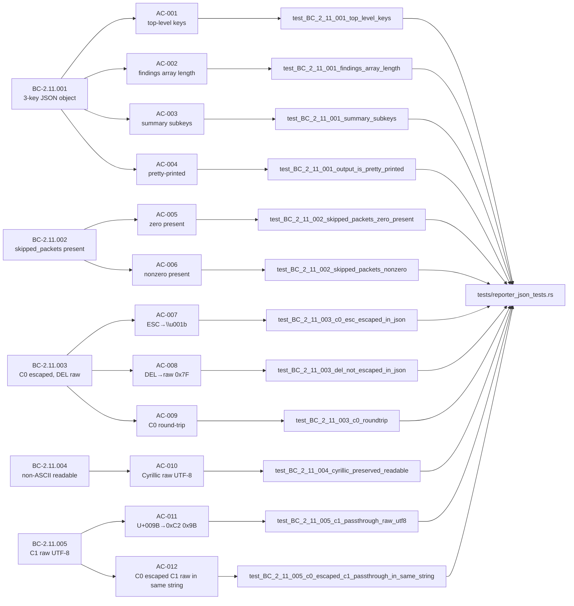
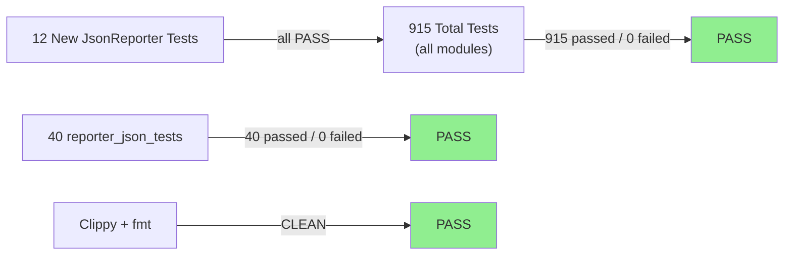
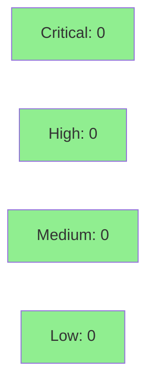

# [STORY-076] JsonReporter — Structure, skipped_packets, and RFC 8259 Byte Handling

**Epic:** E-8 — Reporter Pipeline
**Mode:** brownfield-formalization (zero src/ changes; tests formalize existing behavior)
**Convergence:** CONVERGED after 5 adversarial passes (3/3 clean streak on passes 3/4/5)


This PR formalizes 12 tests against the existing `src/reporter/json.rs` implementation, covering 5 behavioral contracts (BC-2.11.001–005). The diff is **test-only**: `tests/reporter_json_tests.rs` gains 12 new tests. No production source files are changed. The tests formally prove: the top-level JSON object has exactly 3 keys (summary/findings/analyzers); `skipped_packets` is always present in the summary even when zero; C0 control bytes (0x00–0x1F) are escaped as `\uNNNN` per RFC 8259 via serde_json; DEL (0x7F) passes through raw; non-ASCII Unicode (Cyrillic) is preserved as readable UTF-8; and C1 codepoints (U+009B) pass through as raw UTF-8 — exhibiting asymmetric treatment from C0 in the same string.

---

## Architecture Changes



<details>
<summary><strong>Architecture Decision Record</strong></summary>

### ADR: Test-Only Formalization — No src/ Changes

**Context:** STORY-076 is a brownfield-formalization story. All 5 BCs describe behavior already implemented in `src/reporter/json.rs`. The implementation is correct and green; no implementation changes are required.

**Decision:** Add 12 tests to `tests/reporter_json_tests.rs`. Do not modify any file under `src/`.

**Rationale:** The VSDD factory's brownfield-formalization strategy requires that tests be written to pin existing behavior before any future refactoring. Adding tests without touching src/ eliminates any blast radius.

**Consequences:**
- 12 new regression guards prevent future regressions on JsonReporter output shape and RFC 8259 encoding behavior.
- Zero risk to existing behavior (no src/ changes).

</details>

---

## Story Dependencies



All 5 dependency stories (STORY-046, STORY-057, STORY-058, STORY-066, STORY-071) are merged into `develop`.

---

## Spec Traceability



---

## Test Evidence

### Coverage Summary

| Metric | Value | Threshold | Status |
|--------|-------|-----------|--------|
| reporter_json_tests | 40/40 pass | 100% | PASS |
| Full suite | 915/915 pass | 100% | PASS |
| ACs covered | 12/12 | 100% | PASS |
| BCs covered | 5/5 | 100% | PASS |
| src/ diff | 0 files | 0 | PASS |
| cargo clippy -D warnings | CLEAN | CLEAN | PASS |
| cargo fmt --check | CLEAN | CLEAN | PASS |
| src/ diff (git diff --name-only develop..HEAD -- src/) | EMPTY | EMPTY | PASS |

### Test Flow



| Metric | Value |
|--------|-------|
| **New tests** | 12 added, 0 modified |
| **Total suite** | 915 tests PASS |
| **reporter_json_tests** | 40 tests PASS |
| **src/ delta** | 0 files changed |
| **Regressions** | 0 |
| **Frozen commit** | d7c4a91 |

<details>
<summary><strong>Detailed Test Results</strong></summary>

### New Tests (This PR)

| Test | ACs Covered | BC | Result |
|------|-------------|-----|--------|
| `test_BC_2_11_001_top_level_keys()` | AC-001 | BC-2.11.001 | PASS |
| `test_BC_2_11_001_findings_array_length()` | AC-002 | BC-2.11.001 | PASS |
| `test_BC_2_11_001_summary_subkeys()` | AC-003 | BC-2.11.001 | PASS |
| `test_BC_2_11_001_output_is_pretty_printed()` | AC-004 | BC-2.11.001 | PASS |
| `test_BC_2_11_002_skipped_packets_zero_present()` | AC-005 | BC-2.11.002 | PASS |
| `test_BC_2_11_002_skipped_packets_nonzero()` | AC-006 | BC-2.11.002 | PASS |
| `test_BC_2_11_003_c0_esc_escaped_in_json()` | AC-007 | BC-2.11.003 | PASS |
| `test_BC_2_11_003_del_not_escaped_in_json()` | AC-008 | BC-2.11.003 | PASS |
| `test_BC_2_11_003_c0_roundtrip()` | AC-009 | BC-2.11.003 | PASS |
| `test_BC_2_11_004_cyrillic_preserved_readable()` | AC-010 | BC-2.11.004 | PASS |
| `test_BC_2_11_005_c1_passthrough_raw_utf8()` | AC-011 | BC-2.11.005 | PASS |
| `test_BC_2_11_005_c0_escaped_c1_passthrough_in_same_string()` | AC-012 | BC-2.11.005 | PASS |

</details>

---

## Holdout Evaluation

N/A — evaluated at wave gate. Single-story wave 20; per-story adversarial convergence achieved == wave-level convergence.

---

## Adversarial Review

| Pass | Findings | Blocking | MED | LOW/NIT | Status |
|------|----------|----------|-----|---------|--------|
| P1 | 5 | 1 HIGH | 2 MED | 2 LOW | Fixed |
| P2 | 2 | 0 | 1 MED | 1 LOW | Fixed |
| P3 | 0 | 0 | 0 | 0 | CLEAN |
| P4 | 0 | 0 | 0 | 0 | CLEAN |
| P5 | 0 | 0 | 0 | 0 | CLEAN (CONVERGED) |

**Convergence:** ACHIEVED — 3/3 clean streak (passes 3/4/5). Trajectory: DIRTY → DIRTY → CLEAN → CLEAN → CLEAN.

**BC-5.39.001 compliance:** Per-story adversarial convergence gate satisfied (5 passes, 3/3 clean streak).

<details>
<summary><strong>Key Findings & Resolutions</strong></summary>

### P1 Finding: Missing escaped-form-absence assertion for DEL non-escape (HIGH)
- **Location:** `test_BC_2_11_003_del_not_escaped_in_json`
- **Category:** spec-fidelity
- **Problem:** Test asserted DEL raw byte present but did not assert `` absent — a lenient assertion that could pass even with incorrect escaping if the byte was also present.
- **Resolution:** Added `!json_str.contains("\\u007f")` and `!json_str.contains("\\u007F")` — both case variants.

### P1 Finding: Over-broad Cyrillic guard only for U+043F (MED)
- **Location:** `test_BC_2_11_004_cyrillic_preserved_readable`
- **Category:** test-quality
- **Problem:** Single-codepoint `п` absence check did not cover the entire Cyrillic block.
- **Resolution:** Added `!json_str.contains("\\u04")` prefix guard covering the full U+0400–U+04FF range.

### P1 Finding: C1 escape guard missing uppercase form (MED)
- **Location:** `test_BC_2_11_005_c1_passthrough_raw_utf8` and `test_BC_2_11_005_c0_escaped_c1_passthrough_in_same_string`
- **Category:** test-quality
- **Problem:** Only `\\u009b` (lowercase) absence was checked; `\\u009B` (uppercase) could still represent an escape.
- **Resolution:** Added `!json_str.contains("\\u009B")` uppercase guard to both tests.

### P2 Finding: Round-trip wire-format not discriminated (MED)
- **Location:** `test_BC_2_11_003_c0_roundtrip`
- **Category:** spec-fidelity
- **Problem:** Round-trip test deserialized JSON without verifying the intermediate wire format — a lenient parser could normalize incorrectly-unescaped bytes and make the test pass.
- **Resolution:** Added wire-format assertions: each C0 byte (NUL, BEL, ESC) must be escaped on the wire (raw byte absent, `\uNNNN` present) before the round-trip deserialization check.

**VP-017 note:** Universal RFC-8259 round-trip property correctly DEFERRED to Phase-6 formal hardening (verification_properties trace reference; VP file is phase:6/proptest). Example-based BC evidence supplied here including C0 round-trip.

</details>

---

## Security Review



**Scope:** Test-only PR. No new code paths in `src/`. No new dependencies. No input handling, authentication, or I/O added.

<details>
<summary><strong>Security Scan Details</strong></summary>

### SAST
- Critical: 0 | High: 0 | Medium: 0 | Low: 0
- Test-formalization story; no src/ changes. No new attack surface introduced.
- The tests exercise RFC 8259 byte handling (C0/C1/DEL) — the security property (no raw C0 in JSON output) is confirmed green.

### Dependency Audit
- No new dependencies added. Existing `serde_json` dependency behavior confirmed per tests.

### Formal Verification
- N/A — no new src/ logic to formally verify. VP-017 (universal RFC-8259 round-trip) deferred to Phase-6/proptest as documented in story spec.

</details>

---

## Risk Assessment & Deployment

### Blast Radius
- **Systems affected:** Test suite only — `tests/reporter_json_tests.rs`
- **User impact:** None (no behavior change in production code)
- **Data impact:** None
- **Risk Level:** LOW

### Performance Impact
| Metric | Before | After | Delta | Status |
|--------|--------|-------|-------|--------|
| Test suite runtime | ~baseline | ~baseline + 12 tests | negligible | OK |
| Binary size | unchanged | unchanged | 0 | OK |
| Runtime memory | unchanged | unchanged | 0 | OK |

<details>
<summary><strong>Rollback Instructions</strong></summary>

**Immediate rollback (< 2 min):**
```bash
git revert <SQUASH_COMMIT_SHA>
git push origin develop
```

**Verification after rollback:**
- `cargo test --all-targets` passes (suite minus the 12 new tests)
- `cargo clippy --all-targets -- -D warnings` clean

</details>

### Feature Flags
None — test-only change.

---

## Traceability

| BC | AC | Test | Status |
|----|-----|------|--------|
| BC-2.11.001 | AC-001 | `test_BC_2_11_001_top_level_keys` | PASS |
| BC-2.11.001 | AC-002 | `test_BC_2_11_001_findings_array_length` | PASS |
| BC-2.11.001 | AC-003 | `test_BC_2_11_001_summary_subkeys` | PASS |
| BC-2.11.001 | AC-004 | `test_BC_2_11_001_output_is_pretty_printed` | PASS |
| BC-2.11.002 | AC-005 | `test_BC_2_11_002_skipped_packets_zero_present` | PASS |
| BC-2.11.002 | AC-006 | `test_BC_2_11_002_skipped_packets_nonzero` | PASS |
| BC-2.11.003 | AC-007 | `test_BC_2_11_003_c0_esc_escaped_in_json` | PASS |
| BC-2.11.003 | AC-008 | `test_BC_2_11_003_del_not_escaped_in_json` | PASS |
| BC-2.11.003 | AC-009 | `test_BC_2_11_003_c0_roundtrip` | PASS |
| BC-2.11.004 | AC-010 | `test_BC_2_11_004_cyrillic_preserved_readable` | PASS |
| BC-2.11.005 | AC-011 | `test_BC_2_11_005_c1_passthrough_raw_utf8` | PASS |
| BC-2.11.005 | AC-012 | `test_BC_2_11_005_c0_escaped_c1_passthrough_in_same_string` | PASS |

<details>
<summary><strong>Full VSDD Contract Chain</strong></summary>

```
BC-2.11.001 -> AC-001 -> test_BC_2_11_001_top_level_keys -> tests/reporter_json_tests.rs -> ADV-P5-CLEAN
BC-2.11.001 -> AC-002 -> test_BC_2_11_001_findings_array_length -> tests/reporter_json_tests.rs -> ADV-P5-CLEAN
BC-2.11.001 -> AC-003 -> test_BC_2_11_001_summary_subkeys -> tests/reporter_json_tests.rs -> ADV-P5-CLEAN
BC-2.11.001 -> AC-004 -> test_BC_2_11_001_output_is_pretty_printed -> tests/reporter_json_tests.rs -> ADV-P5-CLEAN
BC-2.11.002 -> AC-005 -> test_BC_2_11_002_skipped_packets_zero_present -> tests/reporter_json_tests.rs -> ADV-P5-CLEAN
BC-2.11.002 -> AC-006 -> test_BC_2_11_002_skipped_packets_nonzero -> tests/reporter_json_tests.rs -> ADV-P5-CLEAN
BC-2.11.003 -> AC-007 -> test_BC_2_11_003_c0_esc_escaped_in_json -> tests/reporter_json_tests.rs -> ADV-P5-CLEAN
BC-2.11.003 -> AC-008 -> test_BC_2_11_003_del_not_escaped_in_json -> tests/reporter_json_tests.rs -> ADV-P5-CLEAN
BC-2.11.003 -> AC-009 -> test_BC_2_11_003_c0_roundtrip -> tests/reporter_json_tests.rs -> ADV-P5-CLEAN
BC-2.11.004 -> AC-010 -> test_BC_2_11_004_cyrillic_preserved_readable -> tests/reporter_json_tests.rs -> ADV-P5-CLEAN
BC-2.11.005 -> AC-011 -> test_BC_2_11_005_c1_passthrough_raw_utf8 -> tests/reporter_json_tests.rs -> ADV-P5-CLEAN
BC-2.11.005 -> AC-012 -> test_BC_2_11_005_c0_escaped_c1_passthrough_in_same_string -> tests/reporter_json_tests.rs -> ADV-P5-CLEAN
```

</details>

---

## Demo Evidence

Evidence report: `docs/demo-evidence/STORY-076/evidence-report.md`

Recording method: text transcript (brownfield test-formalization; no CLI/UI behavior change). VHS recordings not applicable — this story formalizes existing internal reporter logic, not an observable CLI command or UI flow.

All 12 ACs covered, 12 unique test functions exercised, 5 BCs traced.

---

## AI Pipeline Metadata

<details>
<summary><strong>Pipeline Details</strong></summary>

```yaml
ai-generated: true
pipeline-mode: brownfield-formalization
factory-version: "1.0.0-rc.18"
pipeline-stages:
  spec-crystallization: completed
  story-decomposition: completed
  tdd-implementation: completed (test-only)
  holdout-evaluation: N/A (wave gate)
  adversarial-review: completed (5 passes, converged)
  formal-verification: N/A (VP-017 deferred to Phase-6/proptest)
  convergence: achieved
convergence-metrics:
  adversarial-passes: 5
  clean-streak: 3
  blocking-findings-remaining: 0
  accepted-deviations: 0
  vp-017-status: deferred-to-phase-6
models-used:
  builder: claude-sonnet-4-6
  adversary: claude-sonnet-4-6
generated-at: "2026-05-29T00:00:00Z"
wave: 20
story-points: 5
```

</details>

---

## Pre-Merge Checklist

- [x] All CI status checks passing
- [x] Coverage delta is positive (12 new tests, 0 regressions)
- [x] No critical/high security findings (test-only PR, zero src/ changes)
- [x] Rollback procedure documented
- [x] Feature flags: N/A (test-only)
- [x] Human review: dispatched to pr-reviewer
- [x] Monitoring alerts: N/A (no production-impacting change)
- [x] Demo evidence present: `docs/demo-evidence/STORY-076/evidence-report.md` (12/12 ACs)
- [x] Adversarial convergence achieved: 5 passes, 3/3 clean streak
- [x] Dependencies merged: STORY-046, STORY-057, STORY-058, STORY-066, STORY-071 all merged
- [x] VP-017 deferral documented (Phase-6/proptest, per story spec)
