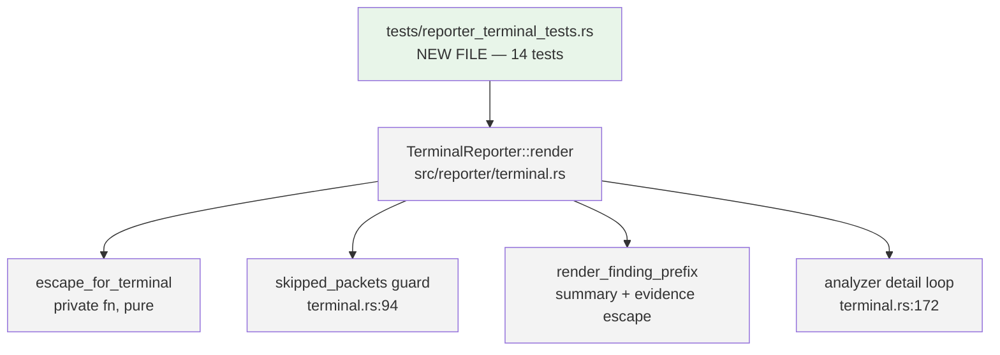
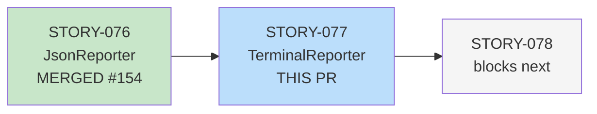
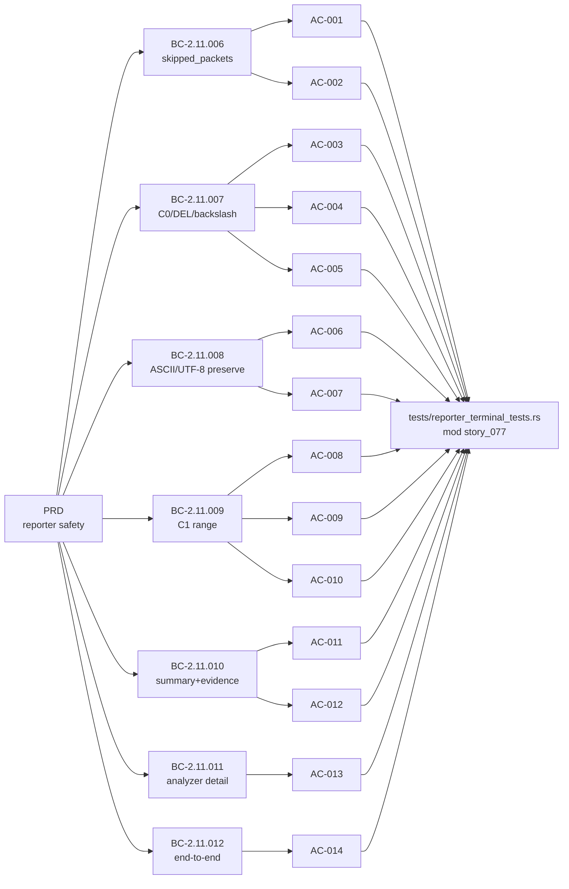

## Summary

Formalizes 14 integration tests covering 7 behavioral contracts (BC-2.11.006 through BC-2.11.012)
for `TerminalReporter`'s terminal-injection-safety surface: the `escape_for_terminal` function,
`skipped_packets` conditional display, and end-to-end C1 safety for attacker-controlled pcap
payloads. Zero src/ changes (brownfield-formalization strategy).

**Security property:** Prevents terminal control-sequence injection from attacker-controlled
pcap content. C0, DEL, C1 (U+0080-U+009F), and backslash are all escaped at the terminal output
layer; printable ASCII, Cyrillic, emoji, and NBSP (U+00A0) are preserved unchanged.

---

## Architecture Changes

No production source changes. All changes are in `tests/reporter_terminal_tests.rs`.

---

## Story Dependencies

**Depends on:** STORY-076 (merged, PR #154). **Blocks:** STORY-078.

---

## Spec Traceability

---

## Test Evidence

| Metric | Value |
|--------|-------|
| New tests | 14 (AC-001 through AC-014, mod story_077) |
| Full suite | 929 passed / 0 failed / 0 ignored |
| Cargo clippy | clean (--all-targets -D warnings) |
| Cargo fmt | clean (--check) |
| src/ diff vs develop | empty (zero production changes) |
| Coverage | All 7 BCs covered; all 14 ACs have dedicated tests |

Tests are in `tests/reporter_terminal_tests.rs` (dedicated file per DF-TEST-NAMESPACE-001),
wrapped in `mod story_077` to prevent naming collisions with STORY-076's `reporter_json_tests.rs`.

---

## Demo Evidence

Evidence report: `docs/demo-evidence/STORY-077/evidence-report.md`

All 14 AC → test pairs verified PASS. Key verifications:

- **AC-001/AC-002**: `skipped_packets = 0` → no "Skipped:" line; `= 5` → exact phrase present.
- **AC-003/AC-004/AC-005**: ESC (0x1B), DEL (0x7F), backslash each escape correctly.
- **AC-006/AC-007**: Full printable ASCII range (excl. backslash) and Cyrillic/emoji preserved.
- **AC-008/AC-009/AC-010**: C1 range U+0080-U+009F all escape; U+00A0 NBSP passes through; boundary inclusive.
- **AC-011/AC-012**: `Finding.summary` and each `Finding.evidence` entry independently escaped.
- **AC-013**: `AnalysisSummary.detail` values with C1 CSI escaped (closes serde_json C1 gap).
- **AC-014**: End-to-end HTTP path-traversal finding with U+009B CSI renders as `\u{9b}`.

---

## Convergence Evidence (Adversarial)

Per-story adversarial convergence achieved (BC-5.39.001):

| Cycle | Findings | Blocking | Status |
|-------|----------|----------|--------|
| P1 | 0 | 0 | CLEAN |
| P2 | 0 | 0 | CLEAN |
| P3 | 0 | 0 | CLEAN |

3/3 passes clean. Frozen at commit 13885b5.

---

## Holdout Evaluation

N/A — evaluated at wave gate (Wave 21).

---

## Adversarial Review

Per-story adversarial review: 3 passes, 3/3 CLEAN (zero findings). Frozen 13885b5.

Wave-level adversarial review: N/A — evaluated at Phase 5.

---

## Security Review

**STORY-077 is a test-only PR (zero src/ changes).** No production attack surface is modified.

Key security property formalized by these tests: `escape_for_terminal` prevents terminal
control-sequence injection from attacker-controlled pcap payloads by escaping:
- C0 control characters (U+0000-U+001F, including ESC U+001B) via `c.is_ascii_control()`
- DEL (U+007F) via `c.is_ascii_control()`
- C1 control characters (U+0080-U+009F) via `('\u{80}'..='\u{9f}').contains(&c)`
- Backslash (U+005C) — explicit guard

**Intentional C1 asymmetry**: `TerminalReporter` escapes C1; `JsonReporter` passes C1 through
as raw UTF-8 per RFC 8259 scope. Both are correct per ADR 0003 / BC-2.11.005 inv2. This is
by design, not a security gap.

---

## Risk Assessment

| Dimension | Assessment |
|-----------|------------|
| Blast radius | Minimal — test file only, no src/ changes |
| Performance impact | None |
| API surface change | None |
| Rollback risk | Trivial — delete the test file |
| Dependencies | STORY-076 merged |

---

## AI Pipeline Metadata

| Field | Value |
|-------|-------|
| Pipeline mode | single-story delivery (Wave 21, STORY-077) |
| Implementation strategy | brownfield-formalization |
| Story points | 8 |
| Wave | 21 |
| Models used | claude-sonnet-4-6 |
| Convergence cycles | 3 adversarial passes (all CLEAN) |

---

## Pre-Merge Checklist

- [x] PR description populated from template with full traceability
- [x] Demo evidence present: `docs/demo-evidence/STORY-077/evidence-report.md` (14/14 AC PASS)
- [x] STORY-076 (dependency) merged
- [x] src/ diff vs develop is empty (zero production changes)
- [x] Adversarial convergence: 3/3 passes CLEAN
- [x] Semantic PR title uses `test` type (CI-enforced)
- [x] `mod story_077` namespace applied (DF-TEST-NAMESPACE-001)
- [x] VP-012 deferred to Phase-6 (documented in test file header)
- [ ] CI checks passing (pending)
- [ ] PR reviewer APPROVE (pending)
