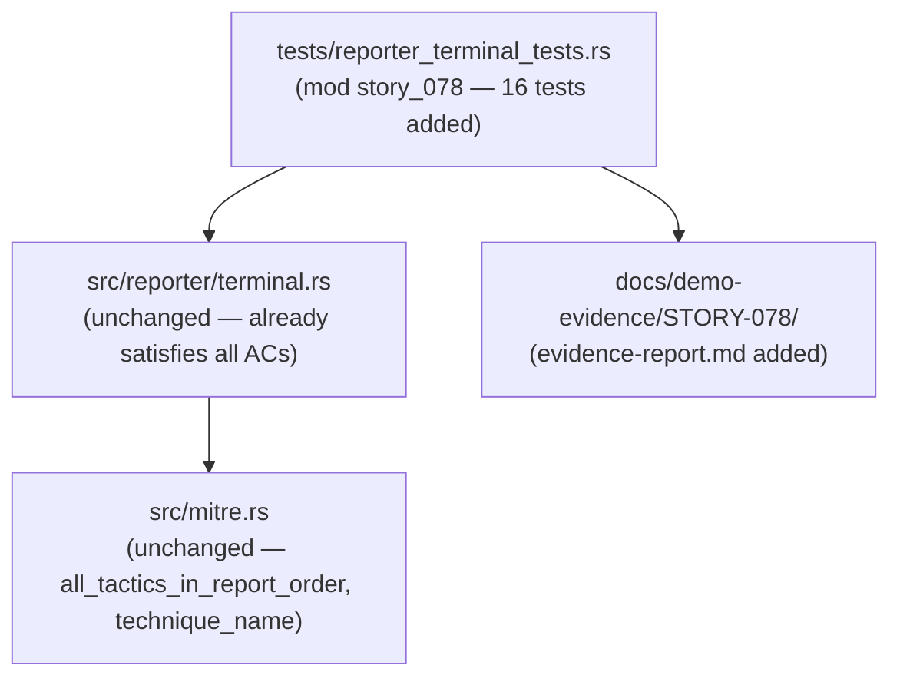
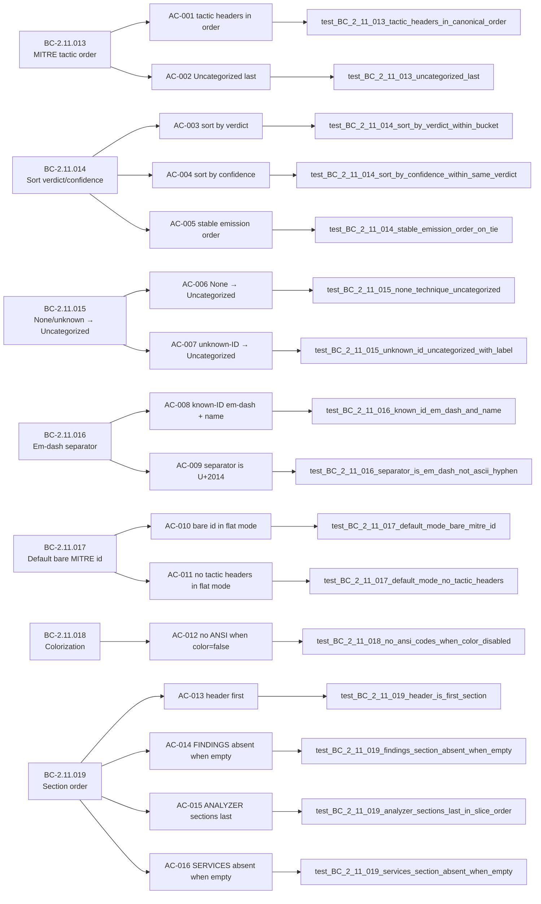

## Summary

Brownfield-formalization: 16 tests in `tests/reporter_terminal_tests.rs` (mod `story_078`) formally verify 7 behavioral contracts governing MITRE tactic grouping, section ordering, and colorization in `TerminalReporter`. Zero `src/` changes — the production implementation already satisfies all ACs.

**Story:** STORY-078 | **Wave:** 22 | **Epic:** E-8 | **Points:** 8 | **Strategy:** brownfield-formalization | **TDD Mode:** strict

---

## Architecture Changes

No `src/` changes. This PR adds only test code formalizing existing behavior.

---

## Story Dependencies

STORY-077 is merged (PR #158). No downstream stories blocked by this PR.

---

## Spec Traceability

---

## Test Evidence

| Metric | Value |
|--------|-------|
| Story tests (mod story_078) | 16 passed / 0 failed / 0 ignored |
| Full suite (cargo test --all-targets) | 958 passed / 0 failed |
| cargo clippy --all-targets -D warnings | CLEAN |
| cargo fmt --check | CLEAN |
| src/ diff vs develop | empty (zero source changes) |
| Frozen test artifact | 0eaa3fc |

**Per-AC Test Evidence:**

| AC | Test Name | BC | Result |
|----|-----------|-----|--------|
| AC-001 | `test_BC_2_11_013_tactic_headers_in_canonical_order` | BC-2.11.013 pc2, inv3 | PASS |
| AC-002 | `test_BC_2_11_013_uncategorized_last` | BC-2.11.013 pc4 | PASS |
| AC-003 | `test_BC_2_11_014_sort_by_verdict_within_bucket` | BC-2.11.014 pc1 | PASS |
| AC-004 | `test_BC_2_11_014_sort_by_confidence_within_same_verdict` | BC-2.11.014 pc2 | PASS |
| AC-005 | `test_BC_2_11_014_stable_emission_order_on_tie` | BC-2.11.014 pc3, inv3 | PASS |
| AC-006 | `test_BC_2_11_015_none_technique_uncategorized` | BC-2.11.015 pc1, pc4 | PASS |
| AC-007 | `test_BC_2_11_015_unknown_id_uncategorized_with_label` | BC-2.11.015 pc2, pc3 | PASS |
| AC-008 | `test_BC_2_11_016_known_id_em_dash_and_name` | BC-2.11.016 pc1, inv1 | PASS |
| AC-009 | `test_BC_2_11_016_separator_is_em_dash_not_ascii_hyphen` | BC-2.11.016 inv1 | PASS |
| AC-010 | `test_BC_2_11_017_default_mode_bare_mitre_id` | BC-2.11.017 pc1, inv1, inv2 | PASS |
| AC-011 | `test_BC_2_11_017_default_mode_no_tactic_headers` | BC-2.11.017 pc3 | PASS |
| AC-012 | `test_BC_2_11_018_no_ansi_codes_when_color_disabled` | BC-2.11.018 pc5 | PASS |
| AC-013 | `test_BC_2_11_019_header_is_first_section` | BC-2.11.019 pc1 | PASS |
| AC-014 | `test_BC_2_11_019_findings_section_absent_when_empty` | BC-2.11.019 pc4, inv2 | PASS |
| AC-015 | `test_BC_2_11_019_analyzer_sections_last_in_slice_order` | BC-2.11.019 pc5 | PASS |
| AC-016 | `test_BC_2_11_019_services_section_absent_when_empty` | BC-2.11.019 inv3 | PASS |

---

## Demo Evidence

Evidence report: `docs/demo-evidence/STORY-078/evidence-report.md` (16/16 AC → test PASS).

All 16 ACs verified with passing test output embedded in evidence report (recorded 2026-05-30).

---

## Holdout Evaluation

N/A — evaluated at wave gate.

---

## Adversarial Review

Per-story adversarial convergence ACHIEVED (BC-5.39.001):
- **3 passes: P1 / P2 / P3 — all 3 CLEAN**
- Only LOW non-blocking observations:
  - AC-007 trace completeness (fixed in story spec v1.2: pc2→pc2,3)
  - BC-anchor staleness logged as deferred drift `F-W22-BC-ANCHOR`
- Frozen test artifact: 0eaa3fc

---

## Security Review

Diff is test-only (no `src/` changes). No new attack surface introduced. No injection vectors, auth changes, or OWASP-relevant patterns in the diff.

Security classification: **NONE — test-only brownfield formalization.**

---

## Risk Assessment

| Dimension | Assessment |
|-----------|-----------|
| Blast radius | Minimal — test file addition only; zero src/ changes |
| Performance impact | None — no production code changed |
| Breaking change | No |
| Rollback | Delete test file (no src/ revert needed) |

---

## AI Pipeline Metadata

| Field | Value |
|-------|-------|
| Pipeline mode | brownfield-formalization (strict TDD) |
| Wave | 22 |
| Story points | 8 |
| Models used | claude-sonnet-4-6 |
| Story spec version | v1.2 |
| Convergence passes | 3 (P1/P2/P3 CLEAN) |

---

## Pre-Merge Checklist

- [x] PR description matches actual diff (test-only, zero src/ changes)
- [x] All 16 ACs covered by passing tests (evidence-report.md, 16/16 PASS)
- [x] Traceability chain complete: BC-2.11.013..019 → AC-001..016 → test → PASS
- [x] Demo evidence at `docs/demo-evidence/STORY-078/evidence-report.md`
- [x] Dependency STORY-077 merged (PR #158)
- [x] No blocking adversarial findings (3/3 passes CLEAN)
- [x] cargo clippy --all-targets -D warnings CLEAN
- [x] cargo fmt --check CLEAN
- [x] cargo test --all-targets: 958 passed / 0 failed
- [ ] CI checks passing (pending push)
- [ ] PR reviewer APPROVED
- [ ] Squash-merged into develop
