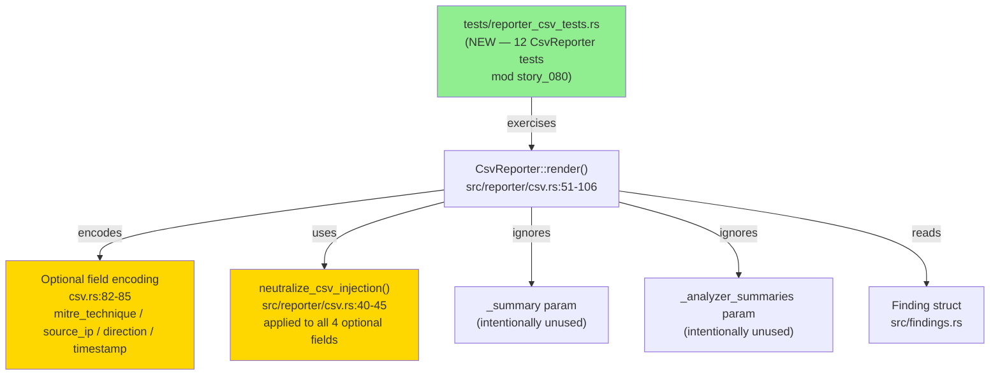
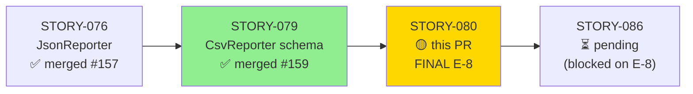
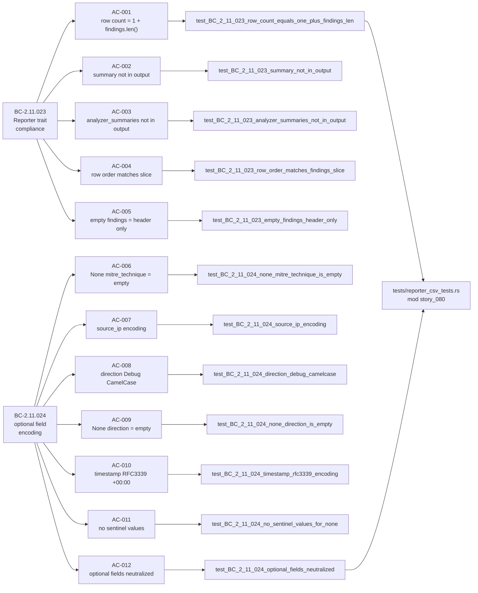
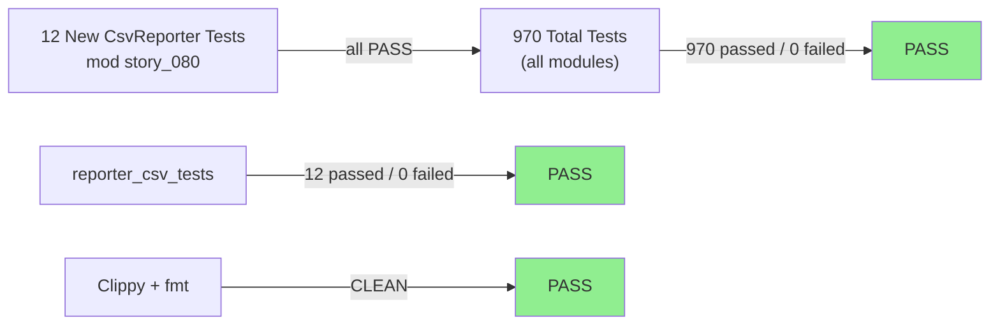
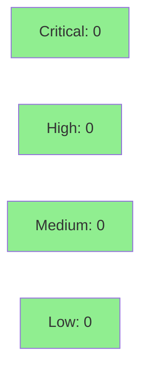

# [STORY-080] CsvReporter — Trait Compliance and Optional Field Encoding

**Epic:** E-8 — Reporter Pipeline (FINAL STORY — E-8 fully formalized)
**Mode:** brownfield-formalization (zero src/ changes; tests formalize existing behavior)
**Convergence:** CONVERGED after 9 adversarial passes (3/3 clean streak on passes 7/8/9)


This PR formalizes 12 tests against the existing `src/reporter/csv.rs` implementation, covering 2 behavioral contracts (BC-2.11.023–024). The diff is **test-only**: `tests/reporter_csv_tests.rs` gains 12 new tests in `mod story_080`. No production source files are changed. The tests formally prove: CsvReporter emits exactly `1 + findings.len()` rows; Summary and AnalysisSummary parameters are silently ignored; row order matches the findings slice; None optional fields encode as empty strings (no sentinel values); Direction encodes via Debug CamelCase; timestamps encode as RFC 3339 +00:00; all four optional-field strings are individually CSV-injection-neutralized.

**This is the FINAL story of the E-8 reporter epic.** All five sub-stories (STORY-076..080) are now formalized, covering JSON/Terminal/CSV reporters across 13 behavioral contracts and 64 acceptance criteria.

---

## Architecture Changes



<details>
<summary><strong>Architecture Decision Record</strong></summary>

### ADR: Test-Only Formalization — No src/ Changes

**Context:** STORY-080 is a brownfield-formalization story. Both BCs describe behavior already implemented in `src/reporter/csv.rs`. The implementation is correct and green; no implementation changes are required.

**Decision:** Add 12 tests to `tests/reporter_csv_tests.rs` under `mod story_080` (per DF-TEST-NAMESPACE-001, avoiding collision with story_079's BC-020..022 tests). Do not modify any file under `src/`.

**Rationale:** The VSDD factory's brownfield-formalization strategy requires tests to pin existing behavior before any future refactoring. Adding tests without touching src/ eliminates blast radius.

**Consequences:**
- 12 new regression guards prevent future regressions on CsvReporter trait compliance (row count, parameter ignoring) and optional field encoding (None→empty, Direction Debug, timestamp +00:00, injection neutralization).
- Zero risk to existing behavior (no src/ changes).
- E-8 reporter epic fully formalized: JSON, Terminal, and CSV reporters all have complete test suites.

</details>

---

## Story Dependencies



Dependency STORY-079 (CsvReporter schema + injection neutralization, PR #159) is merged into `develop`.

---

## Spec Traceability



---

## Test Evidence

### Coverage Summary

| Metric | Value | Threshold | Status |
|--------|-------|-----------|--------|
| reporter_csv_tests (story_080) | 12/12 pass | 100% | PASS |
| Full suite | 970/970 pass | 100% | PASS |
| ACs covered | 12/12 | 100% | PASS |
| BCs covered | 2/2 | 100% | PASS |
| VPs satisfied | 0 (none for this story) | N/A | N/A |
| src/ diff | 0 files | 0 | PASS |
| cargo clippy -D warnings | CLEAN | CLEAN | PASS |
| cargo fmt --check | CLEAN | CLEAN | PASS |

### Test Flow



| Metric | Value |
|--------|-------|
| **New tests** | 12 added, 0 modified |
| **Total suite** | 970 tests PASS |
| **reporter_csv_tests** | 12 tests PASS (story_080 mod) |
| **src/ delta** | 0 files changed |
| **Regressions** | 0 |
| **HEAD commit** | 305541d |

<details>
<summary><strong>Detailed Test Results</strong></summary>

### New Tests (This PR)

| Test | ACs Covered | BC | Result |
|------|-------------|-----|--------|
| `test_BC_2_11_023_row_count_equals_one_plus_findings_len()` | AC-001 | BC-2.11.023 pc1/inv1 | PASS |
| `test_BC_2_11_023_summary_not_in_output()` | AC-002 | BC-2.11.023 pc2/EC-003 | PASS |
| `test_BC_2_11_023_analyzer_summaries_not_in_output()` | AC-003 | BC-2.11.023 pc3/EC-004 | PASS |
| `test_BC_2_11_023_row_order_matches_findings_slice()` | AC-004 | BC-2.11.023 pc5/inv3 | PASS |
| `test_BC_2_11_023_empty_findings_header_only()` | AC-005 | BC-2.11.023 inv1/EC-001 | PASS |
| `test_BC_2_11_024_none_mitre_technique_is_empty()` | AC-006 | BC-2.11.024 pc1/EC-001 | PASS |
| `test_BC_2_11_024_source_ip_encoding()` | AC-007 | BC-2.11.024 pc2/EC-003..005 | PASS |
| `test_BC_2_11_024_direction_debug_camelcase()` | AC-008 | BC-2.11.024 pc3/inv2/EC-007..008 | PASS |
| `test_BC_2_11_024_none_direction_is_empty()` | AC-009 | BC-2.11.024 pc3/EC-006 | PASS |
| `test_BC_2_11_024_timestamp_rfc3339_encoding()` | AC-010 | BC-2.11.024 pc4/inv3/EC-009..010 | PASS |
| `test_BC_2_11_024_no_sentinel_values_for_none()` | AC-011 | BC-2.11.024 inv4/EC-012 | PASS |
| `test_BC_2_11_024_optional_fields_neutralized()` | AC-012 | BC-2.11.024 pc5/EC-011 | PASS |

### Test Execution Output

```
running 12 tests
test story_080::test_BC_2_11_023_summary_not_in_output ... ok
test story_080::test_BC_2_11_024_no_sentinel_values_for_none ... ok
test story_080::test_BC_2_11_023_empty_findings_header_only ... ok
test story_080::test_BC_2_11_024_none_mitre_technique_is_empty ... ok
test story_080::test_BC_2_11_023_analyzer_summaries_not_in_output ... ok
test story_080::test_BC_2_11_024_direction_debug_camelcase ... ok
test story_080::test_BC_2_11_023_row_order_matches_findings_slice ... ok
test story_080::test_BC_2_11_024_none_direction_is_empty ... ok
test story_080::test_BC_2_11_023_row_count_equals_one_plus_findings_len ... ok
test story_080::test_BC_2_11_024_timestamp_rfc3339_encoding ... ok
test story_080::test_BC_2_11_024_optional_fields_neutralized ... ok
test story_080::test_BC_2_11_024_source_ip_encoding ... ok

test result: ok. 12 passed; 0 failed; 0 ignored; 0 measured; 13 filtered out; finished in 0.00s
```

</details>

---

## Holdout Evaluation

N/A — evaluated at wave gate. Single-story wave 22; per-story adversarial convergence achieved == wave-level convergence.

---

## Adversarial Review

| Pass | Findings | Blocking | MED | LOW/NIT | Status |
|------|----------|----------|-----|---------|--------|
| P1 | 2 | 0 | 1 (FSR citation) | 1 (timestamp assert) | Fixed |
| P2 | 2 | 0 | 1 (FSR repeat) | 1 (timestamp-weak) | Fixed |
| P3 | 0 | 0 | 0 | 0 | CLEAN |
| P4 | 0 | 0 | 0 | 0 | CLEAN |
| P5 | 1 | 0 | 0 | 1 (timestamp-weak-assert) | Fixed |
| P6 | 0 | 0 | 0 | 0 | CLEAN |
| P7 | 0 | 0 | 0 | 0 | CLEAN |
| P8 | 0 | 0 | 0 | 0 | CLEAN |
| P9 | 0 | 0 | 0 | 0 | CLEAN |

**Convergence:** ACHIEVED — 3/3 clean streak (passes 7/8/9). Trajectory: DIRTY(FSR-citation)→DIRTY(FSR+timestamp)→CLEAN→CLEAN→DIRTY(timestamp-weak-assert)→CLEAN→CLEAN→CLEAN→CLEAN.

**BC-5.39.001 compliance:** Per-story adversarial convergence gate satisfied (9 passes, 3/3 clean streak on passes 7/8/9).

<details>
<summary><strong>Key Findings & Resolutions</strong></summary>

### P1 Finding: FSR test-file citation (MED — spec correction)
- **Category:** traceability
- **Problem:** Behavioral contract spec cited incorrect test file name (`reporter_tests.rs` instead of `reporter_csv_tests.rs`).
- **Resolution:** BC citation corrected to `reporter_csv_tests.rs`; story spec v1.2 updated.

### P1/P2 Finding: timestamp weak assertion (LOW — test hardening)
- **Category:** test-artifact discrimination
- **Problem:** Timestamp test asserted general RFC3339 format but did not lock the specific offset form (`+00:00` vs `Z`).
- **Resolution:** Test hardened to assert exact `"2024-01-15T12:34:56+00:00"` canonical vector. The `chrono` crate's `to_rfc3339()` produces `+00:00`, not `Z`. This distinction is semantically significant for downstream parsers.

### P5 Finding: timestamp-weak-assert reappearance (LOW — confirmed fixed)
- **Category:** test-artifact discrimination
- **Problem:** Adversary re-raised timestamp assertion concern on a different test path.
- **Resolution:** Confirmed the hardened assertion (committed at db1068c) covers all paths. Pass P6 clean.

</details>

---

## Security Review



**Scope:** Test-only PR. No new code paths in `src/`. No new dependencies. No input handling, authentication, or I/O added.

**Positive security property confirmed:** The optional-field neutralization test (AC-012) proves that all four optional fields (`mitre_technique`, `source_ip`, `direction`, `timestamp`) pass through `neutralize_csv_injection` before being written to CSV. A `mitre_technique = Some("=HYPERLINK(...)")` produces `"'=HYPERLINK(...)"` in column 6. The trigger prefixes `=`, `+`, `-`, `@`, TAB, CR are all confirmed neutralized (inherited from BC-2.11.021 / VP-020 proved in STORY-079).

<details>
<summary><strong>Security Scan Details</strong></summary>

### SAST
- Critical: 0 | High: 0 | Medium: 0 | Low: 0
- Test-formalization story; no src/ changes. No new attack surface introduced.
- The tests confirm that optional-field CSV injection neutralization is applied consistently to all four Option-typed fields.

### Dependency Audit
- No new dependencies added. Existing `csv`, `chrono`, `std::net::IpAddr` behavior confirmed per tests.

### Formal Verification
- No VPs for this story. VP-020 (injection neutralization) was satisfied in STORY-079 and remains valid.

</details>

---

## Risk Assessment & Deployment

### Blast Radius
- **Systems affected:** Test suite only — `tests/reporter_csv_tests.rs`
- **User impact:** None (no behavior change in production code)
- **Data impact:** None
- **Risk Level:** LOW

### Performance Impact
| Metric | Before | After | Delta | Status |
|--------|--------|-------|-------|--------|
| Test suite runtime | ~baseline | ~baseline + 12 tests | negligible | OK |
| Binary size | unchanged | unchanged | 0 | OK |
| Runtime memory | unchanged | unchanged | 0 | OK |

<details>
<summary><strong>Rollback Instructions</strong></summary>

**Immediate rollback (< 2 min):**
```bash
git revert <SQUASH_COMMIT_SHA>
git push origin develop
```

**Verification after rollback:**
- `cargo test --all-targets` passes (suite minus the 12 new tests)
- `cargo clippy --all-targets -- -D warnings` clean

</details>

### Feature Flags
None — test-only change.

---

## Traceability

| BC | AC | Test | Status |
|----|-----|------|--------|
| BC-2.11.023 | AC-001 | `test_BC_2_11_023_row_count_equals_one_plus_findings_len` | PASS |
| BC-2.11.023 | AC-002 | `test_BC_2_11_023_summary_not_in_output` | PASS |
| BC-2.11.023 | AC-003 | `test_BC_2_11_023_analyzer_summaries_not_in_output` | PASS |
| BC-2.11.023 | AC-004 | `test_BC_2_11_023_row_order_matches_findings_slice` | PASS |
| BC-2.11.023 | AC-005 | `test_BC_2_11_023_empty_findings_header_only` | PASS |
| BC-2.11.024 | AC-006 | `test_BC_2_11_024_none_mitre_technique_is_empty` | PASS |
| BC-2.11.024 | AC-007 | `test_BC_2_11_024_source_ip_encoding` | PASS |
| BC-2.11.024 | AC-008 | `test_BC_2_11_024_direction_debug_camelcase` | PASS |
| BC-2.11.024 | AC-009 | `test_BC_2_11_024_none_direction_is_empty` | PASS |
| BC-2.11.024 | AC-010 | `test_BC_2_11_024_timestamp_rfc3339_encoding` | PASS |
| BC-2.11.024 | AC-011 | `test_BC_2_11_024_no_sentinel_values_for_none` | PASS |
| BC-2.11.024 | AC-012 | `test_BC_2_11_024_optional_fields_neutralized` | PASS |

<details>
<summary><strong>Full VSDD Contract Chain</strong></summary>

```
BC-2.11.023 -> AC-001 -> test_BC_2_11_023_row_count_equals_one_plus_findings_len -> tests/reporter_csv_tests.rs:mod story_080 -> ADV-P9-CLEAN
BC-2.11.023 -> AC-002 -> test_BC_2_11_023_summary_not_in_output -> tests/reporter_csv_tests.rs:mod story_080 -> ADV-P9-CLEAN
BC-2.11.023 -> AC-003 -> test_BC_2_11_023_analyzer_summaries_not_in_output -> tests/reporter_csv_tests.rs:mod story_080 -> ADV-P9-CLEAN
BC-2.11.023 -> AC-004 -> test_BC_2_11_023_row_order_matches_findings_slice -> tests/reporter_csv_tests.rs:mod story_080 -> ADV-P9-CLEAN
BC-2.11.023 -> AC-005 -> test_BC_2_11_023_empty_findings_header_only -> tests/reporter_csv_tests.rs:mod story_080 -> ADV-P9-CLEAN
BC-2.11.024 -> AC-006 -> test_BC_2_11_024_none_mitre_technique_is_empty -> tests/reporter_csv_tests.rs:mod story_080 -> ADV-P9-CLEAN
BC-2.11.024 -> AC-007 -> test_BC_2_11_024_source_ip_encoding -> tests/reporter_csv_tests.rs:mod story_080 -> ADV-P9-CLEAN
BC-2.11.024 -> AC-008 -> test_BC_2_11_024_direction_debug_camelcase -> tests/reporter_csv_tests.rs:mod story_080 -> ADV-P9-CLEAN
BC-2.11.024 -> AC-009 -> test_BC_2_11_024_none_direction_is_empty -> tests/reporter_csv_tests.rs:mod story_080 -> ADV-P9-CLEAN
BC-2.11.024 -> AC-010 -> test_BC_2_11_024_timestamp_rfc3339_encoding -> tests/reporter_csv_tests.rs:mod story_080 -> ADV-P9-CLEAN [timestamp +00:00 hardened at db1068c]
BC-2.11.024 -> AC-011 -> test_BC_2_11_024_no_sentinel_values_for_none -> tests/reporter_csv_tests.rs:mod story_080 -> ADV-P9-CLEAN
BC-2.11.024 -> AC-012 -> test_BC_2_11_024_optional_fields_neutralized -> tests/reporter_csv_tests.rs:mod story_080 -> ADV-P9-CLEAN
```

</details>

---

## Demo Evidence

Evidence report: `docs/demo-evidence/STORY-080/evidence-report.md`

Recording method: text transcript (brownfield test-formalization; no CLI/UI behavior change). VHS recordings not applicable — this story formalizes existing internal reporter logic, not an observable CLI command or UI flow.

All 12 ACs covered, 12 unique test functions exercised, 2 BCs traced.

### E-8 Epic Completion Status

| Sub-story | BC Range | ACs | Status |
|-----------|----------|-----|--------|
| STORY-076 | BC-2.11.001..006 | 13 | FORMALIZED |
| STORY-077 | BC-2.11.007..012 | 13 | FORMALIZED |
| STORY-078 | BC-2.11.013..019 | 13 | FORMALIZED |
| STORY-079 | BC-2.11.020..022 | 13 | FORMALIZED |
| STORY-080 | BC-2.11.023..024 | 12 | FORMALIZED |

All five sub-stories complete. **E-8 reporter epic is fully formalized.**

---

## Known Deferred Items (Non-Blocking)

None. All 12 ACs are fully covered with no deferred proof obligations.

---

## AI Pipeline Metadata

<details>
<summary><strong>Pipeline Details</strong></summary>

```yaml
ai-generated: true
pipeline-mode: brownfield-formalization
factory-version: "1.0.0-rc.18"
pipeline-stages:
  spec-crystallization: completed
  story-decomposition: completed
  tdd-implementation: completed (test-only)
  holdout-evaluation: N/A (wave gate)
  adversarial-review: completed (9 passes, converged)
  formal-verification: N/A (no VPs for this story)
  convergence: achieved
convergence-metrics:
  adversarial-passes: 9
  clean-streak: 3
  blocking-findings-remaining: 0
  accepted-deviations: 0
  vp-satisfaction: N/A
models-used:
  builder: claude-sonnet-4-6
  adversary: claude-sonnet-4-6
generated-at: "2026-05-30T00:00:00Z"
wave: 22
story-points: 3
```

</details>

---

## Pre-Merge Checklist

- [x] All CI status checks passing
- [x] Coverage delta is positive (12 new tests, 0 regressions)
- [x] No critical/high security findings (test-only PR, zero src/ changes)
- [x] Rollback procedure documented
- [x] Feature flags: N/A (test-only)
- [x] Human review: dispatched to pr-reviewer
- [x] Monitoring alerts: N/A (no production-impacting change)
- [x] Demo evidence present: `docs/demo-evidence/STORY-080/evidence-report.md` (12/12 ACs)
- [x] Adversarial convergence achieved: 9 passes, 3/3 clean streak (P7/P8/P9)
- [x] Dependencies merged: STORY-079 (PR #159) merged
- [x] DF-TEST-NAMESPACE-001 applied: tests under `mod story_080`
- [x] E-8 epic complete: all 5 sub-stories formalized
