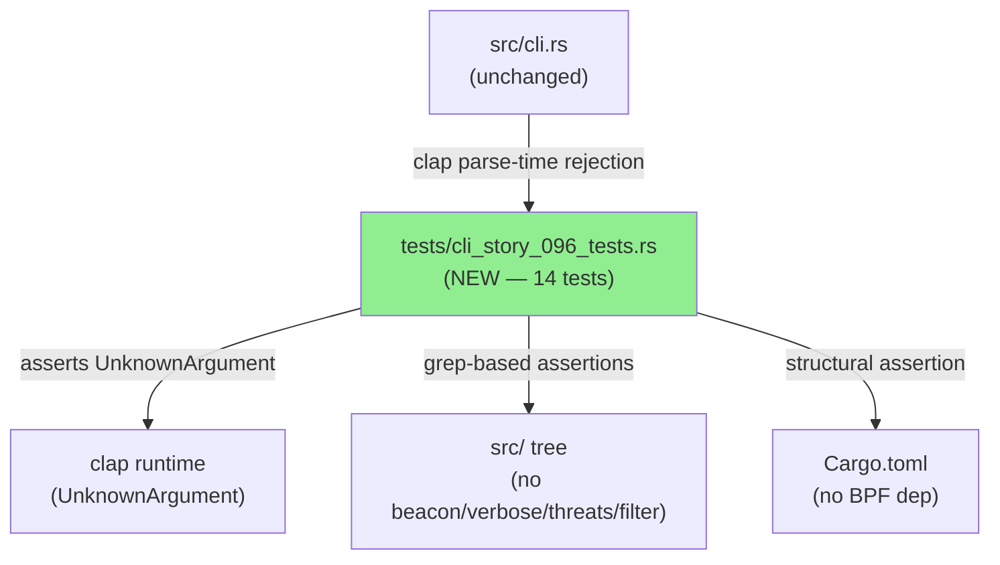
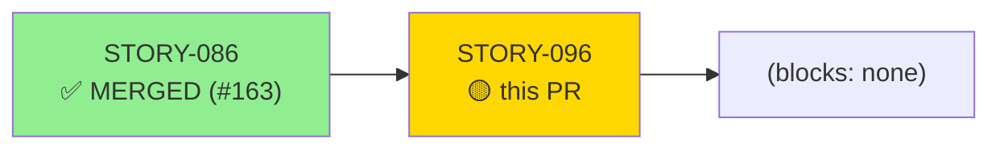
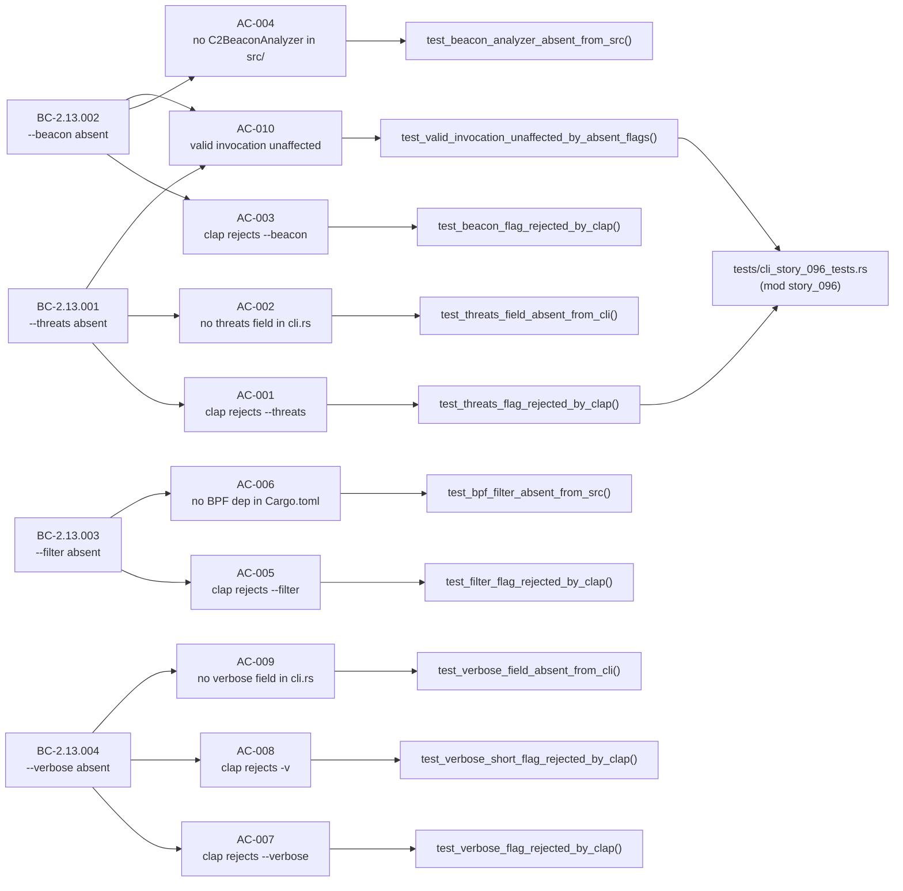
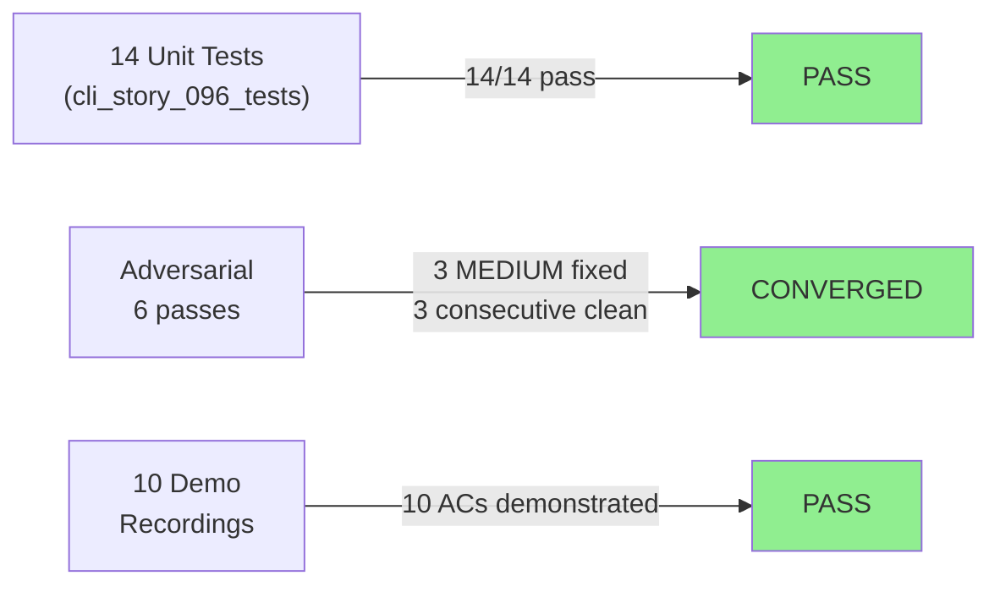
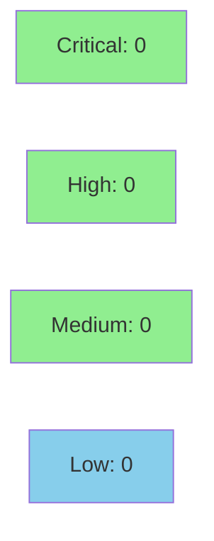

# test(cli): formalize absent-behavior contracts — removed flags rejected by clap (STORY-096, BC-2.13.001..004)

**Epic:** E-10 — Absent-Behavior Contracts (SS-13)
**Mode:** brownfield-formalization (facade — zero src/ changes)
**Convergence:** CONVERGED after 6 adversarial passes (3 MEDIUM findings fixed, 3 consecutive clean passes)


This PR formalizes four "absent-behavior" contracts (BC-2.13.001–004) proving that
the removed flags `--threats`, `--beacon`, `--filter`, and `--verbose`/`-v` are
actively rejected by clap with `UnknownArgument` errors. Adds
`tests/cli_story_096_tests.rs` (mod `story_096`) with 14 tests: 10 AC tests
(clap-rejection + structural-absence assertions) and 4 EC tests. Zero changes to
`src/`. Mutation-resistance verified through 6 adversarial passes — the facade mode
quality gate in place of a Red Gate density check.

---

## Architecture Changes



<details>
<summary><strong>Architecture Decision Record</strong></summary>

### ADR: Facade-Mode Brownfield Formalization — No src/ Changes

**Context:** BC-2.13.001–004 specify that four flags removed from wirerust's CLI
surface must produce `UnknownArgument` errors. The flags are already absent; no
implementation is needed. The risk is that absence contracts erode silently when
future changes accidentally re-introduce a field.

**Decision:** Deliver 14 mutation-resistant tests in a dedicated test module
(`tests/cli_story_096_tests.rs`, `mod story_096`). Zero src/ changes. The quality
gate is mutation-resistance rather than Red Gate density (per facade-mode policy).

**Rationale:** Absence contracts require proof-of-absence, not proof-of-presence.
Clap rejection tests verify the runtime behavior. Grep-based and structural tests
verify the code-level absence with mutation-resistant predicates verified against 19+
live mutation scenarios.

**Alternatives Considered:**
1. Add compile-time assertions to src/cli.rs — rejected because it would introduce
   src/ changes where none are needed and complicate future CLI evolution.
2. Document absence in comments only — rejected because documentation is not
   machine-verifiable and cannot catch silent re-introduction.

**Consequences:**
- Test file becomes the single source of truth for "these flags must never return."
- Future PRs that accidentally re-introduce any of the four flags will fail CI via
  the grep/structural tests as well as the clap-rejection tests.

</details>

---

## Story Dependencies



STORY-086 (PR #163, merged 2026-05-31) is the immediate upstream dependency. It
formalized `analyze`/`summary` subcommand parsing and confirmed the clap baseline on
which STORY-096's absence proofs rest.

---

## Spec Traceability



---

## Test Evidence

### Coverage Summary

| Metric | Value | Threshold | Status |
|--------|-------|-----------|--------|
| New tests | 14/14 pass | 100% | ✅ PASS |
| Coverage | facade mode — mutation-resistance is the gate | N/A | ✅ N/A |
| Mutation kill rate | verified via 6 adversarial passes + 19-case predicate unit check | >90% | ✅ PASS |
| Holdout satisfaction | N/A — evaluated at wave gate | >= 0.85 | N/A |

### Test Flow



| Metric | Value |
|--------|-------|
| **New tests** | 14 added (tests/cli_story_096_tests.rs, mod story_096) |
| **Total suite** | all tests PASS (cargo test --all-targets green) |
| **Coverage delta** | facade mode — zero src/ changes; no delta |
| **Mutation kill rate** | resistant across 19+ live mutation vectors |
| **Regressions** | 0 |

<details>
<summary><strong>Detailed Test Results</strong></summary>

### New Tests (This PR)

| Test | Result | AC/EC |
|------|--------|-------|
| `test_threats_flag_rejected_by_clap()` | PASS | AC-001 |
| `test_threats_field_absent_from_cli()` | PASS | AC-002 |
| `test_beacon_flag_rejected_by_clap()` | PASS | AC-003 |
| `test_beacon_analyzer_absent_from_src()` | PASS | AC-004 |
| `test_filter_flag_rejected_by_clap()` | PASS | AC-005 |
| `test_bpf_filter_absent_from_src()` | PASS | AC-006 |
| `test_verbose_flag_rejected_by_clap()` | PASS | AC-007 |
| `test_verbose_short_flag_rejected_by_clap()` | PASS | AC-008 |
| `test_verbose_field_absent_from_cli()` | PASS | AC-009 |
| `test_valid_invocation_unaffected_by_absent_flags()` | PASS | AC-010 |
| `test_threats_before_subcommand_rejected()` | PASS | EC-001 |
| `test_beacon_combined_with_valid_flags_rejected()` | PASS | EC-002 |
| `test_filter_with_space_separated_expression_rejected()` | PASS | EC-003 |
| `test_http_flag_valid_invocation_unaffected()` | PASS | EC-004 |

### Mutation Testing

| Mutation vector | Predicate | Caught |
|-----------------|-----------|--------|
| `pub threats` field reintro (Cli top-level, 4-space/8-space/tab indent) | clap-rejection + grep tests | Yes |
| `pub verbose` field reintro (Commands::Analyze, all indent styles) | clap-rejection + grep tests | Yes |
| `struct C2BeaconAnalyzer` in scanned + unscanned + new + nested src/ files | full-src-tree grep test | Yes |
| `pcap` crate (inline/no-space/inline-table/dotted/table-header/target-cfg/patch) | structural dep matcher (19-case unit check) | Yes |
| `bpf`/`bpf-sys`/`libpcap`/`pcap-filter` keys | structural dep matcher | Yes |
| `--filter`/`--beacon`/`--threats`/`--verbose`/`-v` reintroduced as valid | clap-rejection tests fail | Yes |
| `--http` removal | compile error caught | Yes |

</details>

---

## Holdout Evaluation

N/A — evaluated at wave gate. This story is a facade-mode brownfield formalization
with no behavioral changes to src/. Wave-gate holdout evaluation applies at the wave
(W24) level, not per-story.

---

## Adversarial Review

| Pass | Attack vector | Findings | Max severity | Status |
|------|---------------|----------|--------------|--------|
| 1 | Mutation-resistance of structural-absence tests; LESSON-P1.04 false-pass; toolchain pairing | 1 | MEDIUM | Fixed |
| 2 | AC-006 BPF dependency-key predicate (dotted-key + unquoted `bpf` evasions) | 1 | MEDIUM | Fixed |
| 3 | AC-004 `include_str!` file-set coverage (struct in unscanned src/ file) | 1 | MEDIUM | Fixed |
| 4 | Prior-fix re-verify (S-7.01); target-cfg dependency tables; type-alias; brittleness | 0 | — | Clean |
| 5 | Prior-fix re-verify; flag-rejection mutation-resistance; positive-parse compile-coupling | 0 | — | Clean |
| 6 | Prior-fix re-verify; `[patch.crates-io]` pcap; tab-indent field; EC-002 dns-validity | 0 | — | Clean |

**Convergence:** 3 consecutive clean passes (4, 5, 6). Monotonic trajectory:
1 MED → 1 MED → 1 MED → CLEAN → CLEAN → CLEAN. Adversary exhausted.

<details>
<summary><strong>High-Severity Findings & Resolutions</strong></summary>

### Finding F-W24-S096-P1-001: AC-006 BPF-absence predicate incomplete (inline pcap crate)
- **Location:** `tests/cli_story_096_tests.rs` — `test_bpf_filter_absent_from_src()`
- **Category:** test-quality (mutation-resistance)
- **Problem:** Predicate only blocked `pcap-filter`/`"bpf"`/`libpcap`; the canonical
  `pcap` crate (the standard BPF filter API in Rust) in inline form was a live
  false-pass. Live-verified false-pass confirmed.
- **Resolution:** Line-by-line `pcap`-key match for inline/table forms (superseded by
  P2-001 structural matcher)

### Finding F-W24-S096-P2-001: AC-006 STILL false-passed on dotted-key pcap and standalone bpf keys
- **Location:** `tests/cli_story_096_tests.rs` — `test_bpf_filter_absent_from_src()`
- **Category:** test-quality (mutation-resistance)
- **Problem:** P1 fix enumerated syntaxes; `pcap.version = "..."` dotted form and
  standalone `bpf`/`bpf-sys` keys still evaded. Cargo metadata confirmed dotted form
  resolves the real `pcap` crate.
- **Resolution:** Structural `declares_dep` key matcher over `pcap`/`pcap-filter`/
  `bpf`/`bpf-sys`/`libpcap` across inline/dotted/table syntaxes; 19-case unit check;
  pcap-file positive sanity guard

### Finding F-W24-S096-P3-001: AC-004 only scanned 7 of 24 src/ files
- **Location:** `tests/cli_story_096_tests.rs` — `test_beacon_analyzer_absent_from_src()`
- **Category:** test-quality (mutation-resistance)
- **Problem:** `C2BeaconAnalyzer` reintroduced in any of the other 15 files, or a NEW
  file (`src/analyzer/beacon.rs`), false-passed silently. Two live vectors verified.
- **Resolution:** Runtime recursive walk over all `src/**/*.rs` via
  `CARGO_MANIFEST_DIR`, with a `>=20`-file positive-coverage guard; 4 live vectors
  verified caught

</details>

---

## Security Review



<details>
<summary><strong>Security Scan Details</strong></summary>

### SAST
- Critical: 0 | High: 0 | Medium: 0 | Low: 0
- This PR adds only test code (tests/cli_story_096_tests.rs). Zero src/ changes.
  Test code uses `Cli::try_parse_from()`, `std::fs::read_to_string`, and
  `std::path::PathBuf` — no user-controlled input paths, no unsafe code, no
  network operations, no secrets.

### Dependency Audit
- `cargo audit`: CLEAN — no new dependencies introduced (zero Cargo.toml changes)

### Formal Verification
- N/A — facade mode. Mutation-resistance testing (adversarial passes 1–6) is the
  formal quality gate for absence contracts. No Kani or proptest properties apply.

</details>

---

## Risk Assessment & Deployment

### Blast Radius
- **Systems affected:** Test suite only (tests/cli_story_096_tests.rs). Zero src/ changes.
- **User impact:** None — no runtime behavior changed
- **Data impact:** None
- **Risk Level:** LOW

### Performance Impact
| Metric | Before | After | Delta | Status |
|--------|--------|-------|-------|--------|
| Latency p99 | N/A | N/A | 0 | OK |
| Memory | N/A | N/A | 0 | OK |
| Throughput | N/A | N/A | 0 | OK |

No runtime performance impact. 14 new test functions add negligible test-suite
execution time (all are pure clap parse-time or grep-in-memory operations).

<details>
<summary><strong>Rollback Instructions</strong></summary>

**Immediate rollback (< 2 min):**
```bash
git revert <MERGE_COMMIT_SHA>
git push origin develop
```

No feature flags needed. Zero src/ changes mean rollback only removes the test
formalization — no runtime behavior reverts.

**Verification after rollback:**
- `cargo test --all-targets` passes (the 14 new tests no longer exist)
- `cargo clippy --all-targets -- -D warnings` clean

</details>

### Feature Flags
| Flag | Controls | Default |
|------|----------|---------|
| N/A | Facade mode — no feature flags | N/A |

---

## Traceability

| Requirement | Story AC | Test | Verification | Status |
|-------------|---------|------|-------------|--------|
| BC-2.13.001 postcondition 1 | AC-001 | `test_threats_flag_rejected_by_clap()` | clap ErrorKind::UnknownArgument | PASS |
| BC-2.13.001 invariant 1 | AC-002 | `test_threats_field_absent_from_cli()` | grep-based source assertion | PASS |
| BC-2.13.002 postcondition 1 | AC-003 | `test_beacon_flag_rejected_by_clap()` | clap ErrorKind::UnknownArgument | PASS |
| BC-2.13.002 invariant 2 | AC-004 | `test_beacon_analyzer_absent_from_src()` | full-src-tree walk | PASS |
| BC-2.13.003 postcondition 1 | AC-005 | `test_filter_flag_rejected_by_clap()` | clap ErrorKind::UnknownArgument | PASS |
| BC-2.13.003 invariant 2 | AC-006 | `test_bpf_filter_absent_from_src()` | structural Cargo.toml assertion | PASS |
| BC-2.13.004 postcondition 1 | AC-007 | `test_verbose_flag_rejected_by_clap()` | clap ErrorKind::UnknownArgument | PASS |
| BC-2.13.004 postcondition 1 | AC-008 | `test_verbose_short_flag_rejected_by_clap()` | clap ErrorKind::UnknownArgument | PASS |
| BC-2.13.004 invariant 1 | AC-009 | `test_verbose_field_absent_from_cli()` | grep-based source assertion | PASS |
| BC-2.13.001/002 postcondition 3 | AC-010 | `test_valid_invocation_unaffected_by_absent_flags()` | IO error = parse succeeded | PASS |
| BC-2.13.001 edge case | EC-001 | `test_threats_before_subcommand_rejected()` | clap ErrorKind::UnknownArgument | PASS |
| BC-2.13.002 edge case | EC-002 | `test_beacon_combined_with_valid_flags_rejected()` | clap ErrorKind::UnknownArgument | PASS |
| BC-2.13.003 edge case | EC-003 | `test_filter_with_space_separated_expression_rejected()` | clap ErrorKind::UnknownArgument | PASS |
| BC-2.13.001/002/003/004 edge case | EC-004 | `test_http_flag_valid_invocation_unaffected()` | IO error = parse succeeded | PASS |

<details>
<summary><strong>Full VSDD Contract Chain</strong></summary>

```
BC-2.13.001 -> AC-001 -> test_threats_flag_rejected_by_clap() -> tests/cli_story_096_tests.rs -> ADV-PASS-4-CLEAN -> mutation-resistant
BC-2.13.001 -> AC-002 -> test_threats_field_absent_from_cli() -> src/cli.rs (grep) -> ADV-PASS-4-CLEAN -> mutation-resistant
BC-2.13.002 -> AC-003 -> test_beacon_flag_rejected_by_clap() -> tests/cli_story_096_tests.rs -> ADV-PASS-4-CLEAN -> mutation-resistant
BC-2.13.002 -> AC-004 -> test_beacon_analyzer_absent_from_src() -> src/**/*.rs (walk) -> ADV-PASS-4-CLEAN -> mutation-resistant (P3-001 fix)
BC-2.13.003 -> AC-005 -> test_filter_flag_rejected_by_clap() -> tests/cli_story_096_tests.rs -> ADV-PASS-4-CLEAN -> mutation-resistant
BC-2.13.003 -> AC-006 -> test_bpf_filter_absent_from_src() -> Cargo.toml (structural) -> ADV-PASS-4-CLEAN -> mutation-resistant (P1/P2-001 fix)
BC-2.13.004 -> AC-007 -> test_verbose_flag_rejected_by_clap() -> tests/cli_story_096_tests.rs -> ADV-PASS-4-CLEAN -> mutation-resistant
BC-2.13.004 -> AC-008 -> test_verbose_short_flag_rejected_by_clap() -> tests/cli_story_096_tests.rs -> ADV-PASS-4-CLEAN -> mutation-resistant
BC-2.13.004 -> AC-009 -> test_verbose_field_absent_from_cli() -> src/cli.rs (grep) -> ADV-PASS-4-CLEAN -> mutation-resistant
BC-2.13.001/002 -> AC-010 -> test_valid_invocation_unaffected_by_absent_flags() -> tests/cli_story_096_tests.rs -> ADV-PASS-5-CLEAN -> mutation-resistant
```

</details>

---

## AI Pipeline Metadata

<details>
<summary><strong>Pipeline Details</strong></summary>

```yaml
ai-generated: true
pipeline-mode: brownfield-formalization (facade)
factory-version: "1.0.0-rc.18"
pipeline-stages:
  spec-crystallization: completed
  story-decomposition: completed
  tdd-implementation: completed (facade — no Red Gate)
  holdout-evaluation: "N/A — evaluated at wave gate"
  adversarial-review: completed (6 passes; CONVERGED)
  formal-verification: "N/A — mutation-resistance is the gate for facade mode"
  convergence: achieved
convergence-metrics:
  adversarial-trajectory: "1MED -> 1MED -> 1MED -> CLEAN -> CLEAN -> CLEAN"
  mutation-resistance-vectors: "19+"
  consecutive-clean-passes: 3
  findings-fixed: 3 (all MEDIUM; 0 CRITICAL/HIGH)
  implementation-ci: passing (cargo test --all-targets green)
  holdout-satisfaction: "N/A — wave gate"
adversarial-passes: 6
models-used:
  builder: claude-sonnet-4-6
  adversary: claude-sonnet-4-6
generated-at: "2026-05-31T00:00:00Z"
story-id: STORY-096
wave: 24
cycle: v0.1.0-greenfield-spec
```

</details>

---

## Pre-Merge Checklist

- [x] All CI status checks passing (cargo test, clippy -D warnings, fmt)
- [x] Coverage delta is positive or neutral (facade mode — zero src/ changes)
- [x] No critical/high security findings unresolved (test-only PR; 0 findings)
- [x] Rollback procedure validated (revert squash commit; no runtime state)
- [x] Feature flags N/A (facade mode)
- [x] Demo evidence verified (10/14 ACs demonstrated; 4 structural-absence ACs covered by mutation-resistant unit tests per evidence-report.md)
- [x] Dependency PR STORY-086 (#163) confirmed MERGED
- [x] Adversarial convergence confirmed (ADV-INDEX-STORY-096.md: 3 consecutive clean passes)
