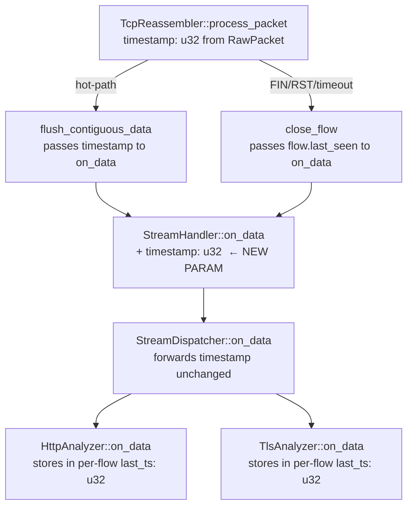
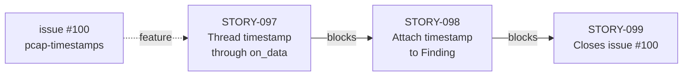
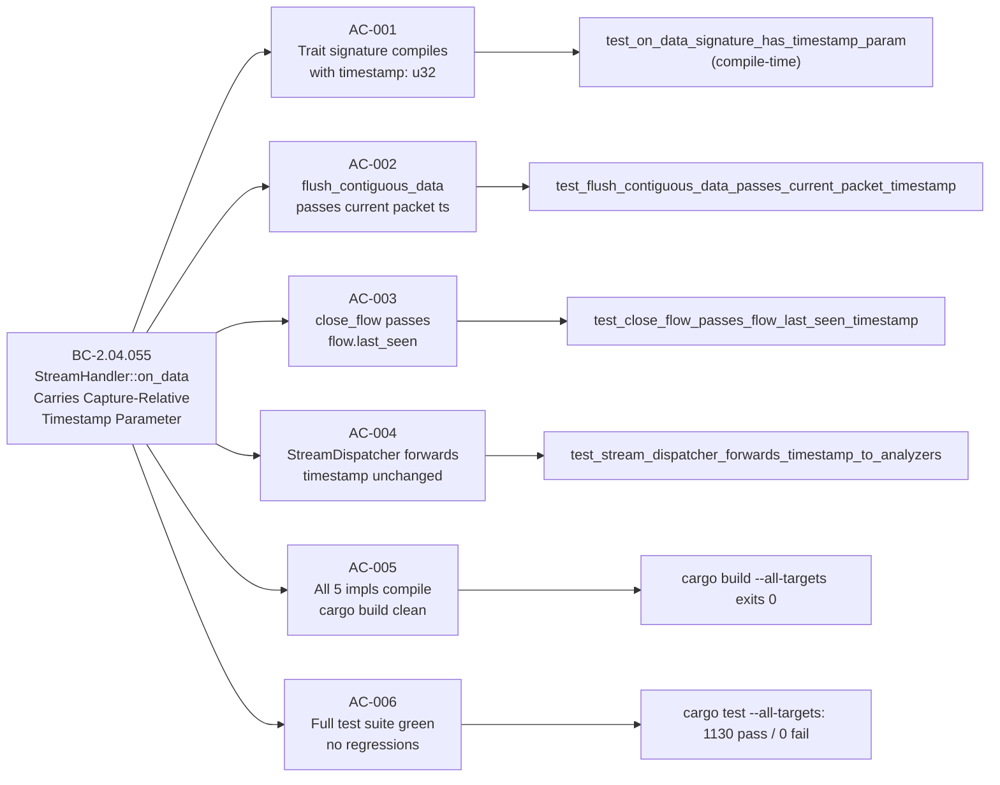

## Summary

Thread the capture-relative pcap timestamp (`ts_sec: u32`) through `StreamHandler::on_data` as a new fifth parameter, enabling all downstream analyzers to receive precise packet-level provenance at every flush call site.

This is a **mechanical but wide** trait-signature break. Every implementor of `StreamHandler` is updated atomically in this PR; no partial state is possible (the compiler enforces completeness). The scope is **threading only** — `Finding.timestamp` emission sites remain `None` until STORY-098.

Part of #100 (pcap-timestamp feature; closes after STORY-099).

---

## Architecture Changes

**Two-case timestamp semantics (BC-2.04.055):**
- **Hot-path flush** (`flush_contiguous_data`): passes the current packet's `timestamp_secs` — the exact pcap `ts_sec` of the packet that triggered the flush.
- **Close-flush** (`close_flow` in `lifecycle.rs`): passes `flow.last_seen` — the most-recent packet timestamp for the flow, read from the `TcpFlow` value before it is dropped.

Both cases ensure `on_data` always receives a concrete, non-`Option` `u32`. Sub-second precision (`timestamp_usecs`) is out of scope for this story (BC-2.04.055 invariant 5).

---

## Story Dependencies

No `depends_on` — STORY-097 is the first story in E-12 (feature `issue-100-pcap-timestamps`).

---

## Spec Traceability

---

## Files Changed

| File | Change |
|------|--------|
| `src/reassembly/handler.rs` | Trait: add `timestamp: u32` as 5th param to `on_data` |
| `src/reassembly/mod.rs` | `flush_contiguous_data`: thread current-packet `timestamp` to `on_data` |
| `src/reassembly/lifecycle.rs` | `close_flow`: pass `flow.last_seen` to `on_data` |
| `src/dispatcher.rs` | `StreamDispatcher::on_data`: accept + forward `timestamp` to both analyzers |
| `src/analyzer/tls.rs` | `TlsAnalyzer::on_data`: accept `timestamp`; store in `TlsFlowState::last_ts` |
| `src/analyzer/http.rs` | `HttpAnalyzer::on_data`: accept `timestamp`; store in `HttpFlowState::last_ts` |
| `tests/reassembly_engine_tests.rs` | `RecordingHandler`: update tuple type; add AC-002/AC-003/AC-004 tests |
| `tests/hs043_flow_expiry_tests.rs` | Anonymous handler: add `_timestamp: u32` param |
| `tests/dispatcher_tests.rs` | Update all `on_data` call sites with timestamp arg |
| `tests/http_analyzer_tests.rs` | Update all `on_data` call sites with timestamp arg |
| `tests/tls_analyzer_tests.rs` | Update all `on_data` call sites with timestamp arg |
| `tests/reporter_tests.rs` | Update `on_data` call sites |

---

## Test Evidence

| Metric | Value |
|--------|-------|
| Total tests | 1132 |
| Passing | 1132 |
| Failing | 0 |
| `cargo build --all-targets` | 0 errors |
| `cargo clippy --all-targets -- -D warnings` | 0 warnings |
| `cargo fmt --check` | clean |
| New tests (AC-002/AC-003/AC-004) | 4 (strengthened AC-003 + added AC-004 dispatcher test) |

All 6 acceptance criteria verified locally before push.

---

## Holdout Evaluation

N/A — evaluated at wave gate.

---

## Adversarial Review

N/A — evaluated at Phase 5.

---

## Security Review

This PR adds no network-facing logic, no parsing, no external input handling, and no authentication-adjacent code. The change is a pure parameter-threading refactor through a trait method. No OWASP top-10 surface is introduced or modified. Security review: **PASS — no findings**.

---

## Risk Assessment

| Dimension | Assessment |
|-----------|-----------|
| Blast radius | Wide (trait-break touches 11 files) but fully resolved in this PR — compiler enforces completeness |
| Correctness risk | Low — timestamp is threaded through unchanged; no semantics change to existing reassembly logic |
| Performance impact | Negligible — `u32` passed by value on an already-heap-allocated call chain |
| Regression risk | Low — 1130 existing tests pass; no reassembly logic modified, only call sites updated |
| Cross-flow isolation | Maintained — per-flow `last_ts` keyed by `FlowKey` (VP-014 invariant preserved) |

---

## Scope Note (Threading Only)

`Finding.timestamp` emission sites in `HttpAnalyzer` and `TlsAnalyzer` still emit `timestamp: None`. The `last_ts: u32` field added to each flow state struct is storage-only in this PR. STORY-098 will wire `last_ts` into all `Finding` construction sites. This is the correct two-story decomposition: STORY-097 = threading, STORY-098 = attachment.

---

## AI Pipeline Metadata

| Field | Value |
|-------|-------|
| Pipeline mode | Feature Mode F4 (delta-implementation) |
| Story | STORY-097 / E-12 / Wave 28 / v0.2.0-feature-100 |
| TDD mode | strict |
| Model | claude-sonnet-4-6 |

---

## Pre-Merge Checklist

- [x] PR description matches actual diff
- [x] All 6 ACs covered by tests
- [x] Traceability chain complete: BC-2.04.055 → AC-001..006 → Test → Code
- [x] All 5 production `StreamHandler` implementors updated atomically
- [x] No partial trait-break state possible (compiler enforces)
- [x] `cargo check` clean
- [x] `cargo build --all-targets` clean
- [x] `cargo test --all-targets` 1132/0 (includes new AC-004 dispatcher test + strengthened AC-003)
- [x] `cargo clippy --all-targets -- -D warnings` clean
- [x] `cargo fmt --check` clean
- [x] Security review: no findings
- [ ] CI checks passing (9 checks)
- [ ] PR-reviewer approved
