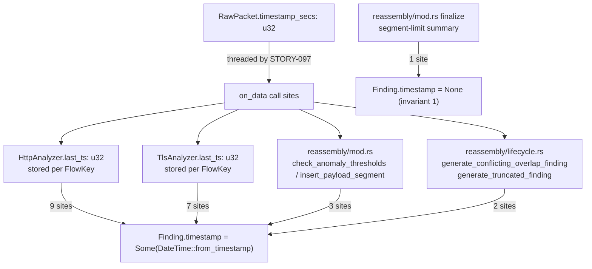
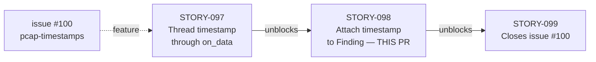
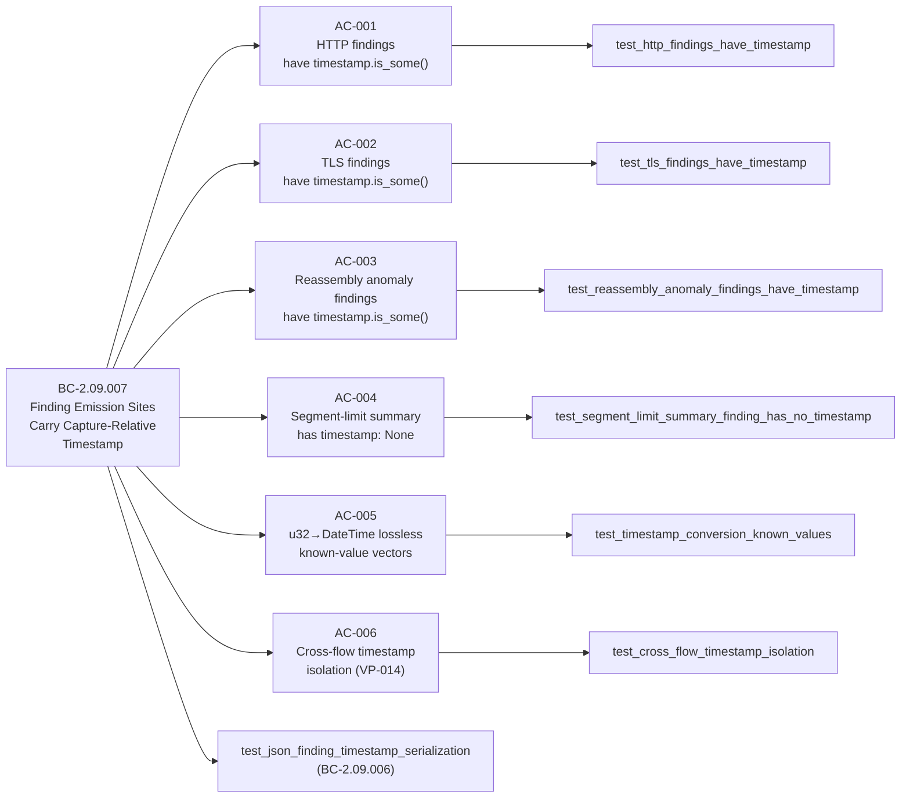

## Summary

Attach the capture-relative pcap timestamp to `Finding` emission sites across 21 of 22 sites. Every `Finding` emitted by `HttpAnalyzer` (9 sites), `TlsAnalyzer` (7 sites), `reassembly/mod.rs` (3 sites), and `reassembly/lifecycle.rs` (2 sites) now sets `timestamp: Some(DateTime<Utc>)` via `DateTime::from_timestamp(ts_sec as i64, 0)`. The segment-limit summary finding in `finalize` retains `timestamp: None` per BC-2.09.007 invariant 1 (21/22 split).

The `u32 ts_sec` value threaded by STORY-097 flows directly into `DateTime::from_timestamp`, converting the raw pcap epoch seconds into a UTC `DateTime`. This gives every threat finding a capture-relative timestamp indicating when the anomalous traffic actually appeared in the pcap stream.

**Known spec issue:** BC-2.09.007 test-vector for `ts_sec=1_000_000` lists an incorrect date in the spec. The implementation and tests use the correct value (`1970-01-12T13:46:40Z`). This discrepancy is tracked for cleanup in the feature-convergence spec pass.

Part of #100 (pcap-timestamp feature; does NOT close — STORY-099 completes #100).

---

## Architecture Changes

**Timestamp propagation (BC-2.09.007):**
- `HttpAnalyzer`: `check_request_detections(parsed, flow_key, last_ts)` — `last_ts` read from per-flow `HttpFlowState.last_ts`, which was set by the preceding `on_data` call.
- `TlsAnalyzer`: `handle_client_hello(ch, flow_key, last_ts)` — same pattern via `TlsFlowState.last_ts`.
- `reassembly/mod.rs`: `check_anomaly_thresholds` and `insert_payload_segment` receive `timestamp: u32` directly from the current packet.
- `reassembly/lifecycle.rs`: `generate_conflicting_overlap_finding` and `generate_truncated_finding` receive `timestamp: u32` from their callers.
- **Segment-limit site** (`finalize`): no per-packet context available at finalization; retains `timestamp: None`.

---

## Story Dependencies

**Dependency:** STORY-097 (PR #197) merged to develop — provides `last_ts: u32` fields in `HttpFlowState`/`TlsFlowState` and the `timestamp` parameter on all `on_data`/`generate_*` call sites.

---

## Spec Traceability

---

## Files Changed

| File | Change |
|------|--------|
| `src/analyzer/http.rs` | `check_request_detections` gains `last_ts: u32`; 9 `Finding` sites: `None` → `DateTime::from_timestamp(last_ts as i64, 0)` |
| `src/analyzer/tls.rs` | `handle_client_hello` gains `last_ts: u32`; 7 `Finding` sites: `None` → `DateTime::from_timestamp(last_ts as i64, 0)` |
| `src/reassembly/mod.rs` | `check_anomaly_thresholds` + `insert_payload_segment` gain `timestamp: u32`; 3 sites updated |
| `src/reassembly/lifecycle.rs` | `generate_conflicting_overlap_finding` + `generate_truncated_finding` gain `timestamp: u32`; 2 sites updated |
| `tests/reassembly_engine_tests.rs` | New AC-001..AC-006 tests + `test_json_finding_timestamp_serialization` (769 lines added) |
| `tests/reporter_tests.rs` | Updated `test_timestamp_always_none_in_all_emission_sites` → asserts 1 None + 21 `DateTime::from_timestamp` occurrences |
| `tests/tls_analyzer_tests.rs` | Updated `on_data` call sites with timestamp arg; AC-002 coverage |

---

## Test Evidence

| Metric | Value |
|--------|-------|
| Total tests | 1139 |
| Passing | 1139 |
| Failing | 0 |
| `cargo build --all-targets` | 0 errors |
| `cargo clippy --all-targets -- -D warnings` | 0 warnings |
| `cargo fmt --check` | clean |
| New tests (AC-001..AC-006 + JSON) | 7 new test functions |
| Emission sites with `Some(timestamp)` | 21 of 22 |
| Emission sites with `None` (invariant) | 1 (segment-limit summary in `finalize`) |

All 6 acceptance criteria verified locally before push.

---

## Holdout Evaluation

N/A — evaluated at wave gate.

---

## Adversarial Review

N/A — evaluated at Phase 5.

---

## Security Review

This PR attaches a `u32` pcap timestamp (already trusted, sourced from the capture file header) to `Finding` structs via `DateTime::from_timestamp`. No new network-facing input, parsing, or authentication-adjacent logic is introduced. The `u32 as i64` cast is safe for all valid pcap epoch values. No OWASP top-10 surface is introduced or modified. Security review: **PASS — no findings**.

---

## Risk Assessment

| Dimension | Assessment |
|-----------|-----------|
| Blast radius | Moderate — touches 4 source files and 3 test files, but all changes are mechanical (None → Some wrapping) |
| Correctness risk | Low — `DateTime::from_timestamp` returns `Option<DateTime<Utc>>`; `None` only on out-of-range values, which cannot occur for valid u32 pcap timestamps before year 2106 |
| Performance impact | Negligible — one additional function call per Finding emitted (rare vs. packet rate) |
| Regression risk | Low — 1132 pre-existing tests pass; only `timestamp` field changes from `None` to `Some` |
| Cross-flow isolation | Maintained — per-flow `last_ts` keyed by `FlowKey`; AC-006 + VP-014 invariant verified |
| Segment-limit invariant | Preserved — finalize path retains `timestamp: None` as specified by BC-2.09.007 invariant 1 |

---

## AI Pipeline Metadata

| Field | Value |
|-------|-------|
| Pipeline mode | Feature Mode F4 (delta-implementation) |
| Story | STORY-098 / E-12 / Wave 28 / v0.2.0-feature-100 |
| TDD mode | strict |
| Model | claude-sonnet-4-6 |

---

## Pre-Merge Checklist

- [x] PR description matches actual diff
- [x] All 6 ACs covered by tests (AC-001..AC-006 + JSON serialization test)
- [x] Traceability chain complete: BC-2.09.007 → AC-001..006 → Test → Code
- [x] 21 of 22 emission sites set `timestamp: Some(DateTime<Utc>)`
- [x] 1 site (segment-limit summary) retains `timestamp: None` per invariant 1
- [x] `cargo check` clean
- [x] `cargo build --all-targets` clean
- [x] `cargo test --all-targets` 1139/0
- [x] `cargo clippy --all-targets -- -D warnings` clean
- [x] `cargo fmt --check` clean
- [x] Security review: no findings
- [x] Dependency STORY-097 (PR #197) merged to develop
- [x] CI checks passing (9 checks — all green: Format, Fuzz build, Audit, Action pin gate, Clippy, Deny, Semantic PR, Test, Trust-boundary)
- [x] PR-reviewer approved (cycle 1 — APPROVE, no blocking findings)
