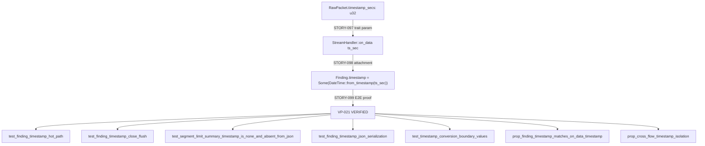
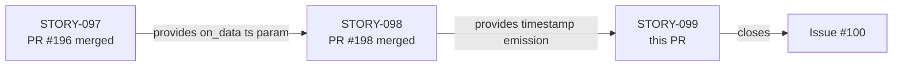
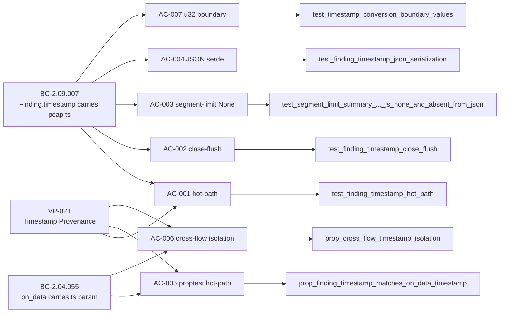

## Summary

End-to-end and property-based test verification that `Finding.timestamp` is correctly populated from the pcap capture-relative `ts_sec` value across the full pipeline (STORY-099, VP-021).

This PR adds `tests/timestamp_threading_tests.rs` with 8 tests (6 unit/integration + 2 proptest) that prove VP-021 (Timestamp Provenance Threading) end-to-end:

- **E2E hot-path:** SYN+HTTP GET packets at `ts_sec=1_000_000` drive through `TcpReassembler` → `StreamDispatcher::on_data` → `HttpAnalyzer`; asserts at least one emitted `Finding` carries `timestamp == Some(1970-01-12T13:46:40Z)`.
- **E2E close-flush:** FIN packet at `ts_sec=2_000_000` triggers flow close; asserts the flush finding carries the FIN-time timestamp.
- **Segment-limit None:** Drives past `MAX_SEGMENTS_PER_DIRECTION`; asserts `timestamp == None` AND that the JSON serialization omits the `"timestamp"` key entirely (`skip_serializing_if`).
- **JSON serialization:** Direct `Finding` → `serde_json::to_string` assertion; confirms ISO-8601 UTC format.
- **u32 boundary vectors:** `ts_sec=0` → `1970-01-01T00:00:00Z`; `ts_sec=u32::MAX` → `Some(...)` (no panic, no None).
- **proptest VP-021 hot-path:** Arbitrary `ts_sec in 0u32..=u32::MAX`; asserts every non-summary Finding matches `DateTime::from_timestamp(ts_sec as i64, 0)`.
- **proptest cross-flow isolation:** Two distinct flows with non-overlapping timestamp ranges (`ts_a in 1..500_000`, `ts_b in 500_001..1_000_000`); asserts no cross-contamination.

All 7 ACs from STORY-099 are covered. This is the final story in the issue #100 feature chain (STORY-097 trait threading → STORY-098 emission-site attachment → STORY-099 end-to-end verification).

**Known spec note:** BC-2.09.007 test-vector for `ts_sec=1_000_000` lists an incorrect date (`2001-09-08T21:46:40Z`) in the spec. The correct value is `1970-01-12T13:46:40Z`. This discrepancy is tracked for cleanup in the feature-convergence spec pass (carried forward from STORY-098).

Closes #100

---

## Architecture Changes

**Change scope:** New file `tests/timestamp_threading_tests.rs` only. No changes to `src/`. All prior source changes were delivered in STORY-097 (PR #196) and STORY-098 (PR #197–198).

---

## Story Dependencies

All upstream dependency PRs are merged into `develop`.

---

## Spec Traceability

| AC | BC | Test | Status |
|----|-----|------|--------|
| AC-001 | BC-2.09.007 post-2 | `test_finding_timestamp_hot_path` | PASS |
| AC-002 | BC-2.09.007 post-3 | `test_finding_timestamp_close_flush` | PASS |
| AC-003 | BC-2.09.007 post-6 + inv-1 | `test_segment_limit_summary_timestamp_is_none_and_absent_from_json` | PASS |
| AC-004 | BC-2.09.007 post-5 | `test_finding_timestamp_json_serialization` | PASS |
| AC-005 | BC-2.04.055 post-1 | `prop_finding_timestamp_matches_on_data_timestamp` | PASS (proptest) |
| AC-006 | BC-2.09.007 inv-4 + BC-2.04.055 inv-3 | `prop_cross_flow_timestamp_isolation` | PASS (proptest) |
| AC-007 | BC-2.09.007 inv-2 | `test_timestamp_conversion_boundary_values` | PASS |

---

## Test Evidence

| Metric | Value |
|--------|-------|
| Total tests (full suite) | 1147 |
| New tests this PR | 8 (6 unit/integration + 2 proptest) |
| Failures | 0 |
| `cargo clippy --all-targets -- -D warnings` | CLEAN |
| `cargo fmt --check` | CLEAN |
| `cargo check` | CLEAN |
| VP-021 coverage | All 7 ACs covered |

Test suite verified locally before PR creation. All 1147 tests pass with 0 failures.

---

## Holdout Evaluation

N/A — evaluated at wave gate (wave 30 of v0.2.0 feature-100 cycle). This story is a pure test-verification story; no new behavioral logic is added.

---

## Adversarial Review

N/A — evaluated at Phase 5 (adversarial refinement). The timestamp threading feature was spec-reviewed at the F2 spec evolution phase. This PR delivers the verification tests that prove VP-021.

---

## Security Review

No new source code added. This PR adds only integration and property-based tests in `tests/timestamp_threading_tests.rs`. No attack surface changes, no new I/O paths, no new dependencies. Security impact: none.

---

## Risk Assessment

| Dimension | Assessment |
|-----------|-----------|
| Blast radius | Minimal — test-only change; no `src/` modifications |
| Performance impact | None — tests do not affect production binary |
| Breaking changes | None |
| Rollback complexity | Trivial — revert one test file |
| Dependency changes | None |

---

## AI Pipeline Metadata

| Field | Value |
|-------|-------|
| Pipeline mode | Brownfield feature (issue-100-pcap-timestamps) |
| Cycle | v0.2.0-feature-100 |
| Wave | 30 (final wave in chain) |
| Story chain | STORY-097 → STORY-098 → STORY-099 |
| Models used | claude-sonnet-4-6 |
| Verification properties | VP-021 (Timestamp Provenance Threading) |

---

## Pre-Merge Checklist

- [x] PR description matches actual diff
- [x] All 7 ACs covered by tests
- [x] Traceability chain complete (BC → AC → Test)
- [x] `cargo test --all-targets` passing (1147/1147)
- [x] `cargo clippy --all-targets -- -D warnings` clean
- [x] `cargo fmt --check` clean
- [x] No `src/` changes (test-only PR)
- [x] Dependency PRs (#196, #198) merged
- [x] `Closes #100` in PR body
- [ ] CI checks all green (pending after push)
- [ ] PR review approved
