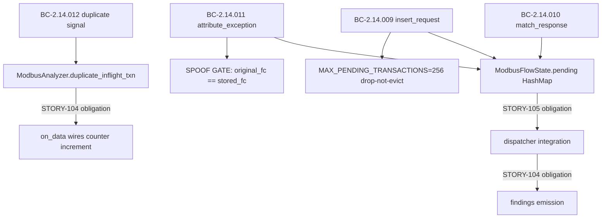
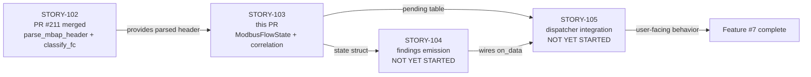
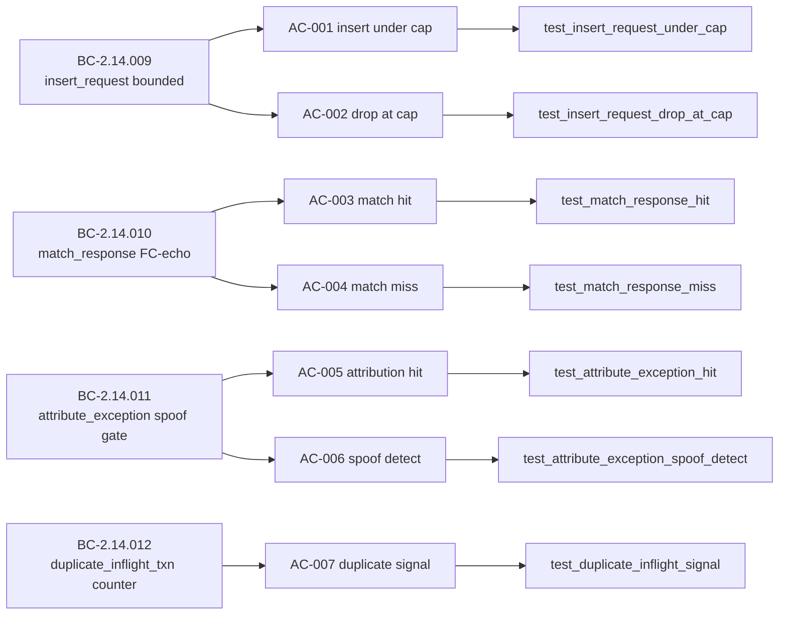

## Summary

Per-flow Modbus transaction correlation state for STORY-103 (BC-2.14.009–012), Feature #7 Wave 2 (v0.4.0).

This PR implements `ModbusFlowState` — a full 18-field per-flow struct with bounded pending-transaction table — and the three transaction-correlation methods (`insert_request`, `match_response`, `attribute_exception`) on `ModbusAnalyzer`. 23 new tests are added (+1224→1247).

**Scope (STORY-103 only — additive, behavior-neutral at this stage):**
- `ModbusFlowState` with `pending: HashMap<(txn_id, unit_id), (fc, ts)>` bounded at `MAX_PENDING_TRANSACTIONS = 256`
- **Drop-not-evict** policy when full: new insertions are silently dropped, no panic, no LRU eviction — DoS-resistant by design (attacker cannot displace legitimate tracked requests)
- `insert_request` — inserts only if table is not full; returns `true` if inserted, `false` if dropped
- `match_response` — removes and returns the stored `(request_fc, request_ts)` tuple; FC-echo matching is enforced by the caller (STORY-104)
- `attribute_exception` — resolves pending (txn_id, unit_id) to stored FC; includes **SPOOF GATE**: `original_fc == stored_fc` precondition required for attribution; mismatched FC → spoof-detect signal
- `duplicate_inflight_txn` counter lives on `ModbusAnalyzer` (not on `ModbusFlowState`) per BC-2.14.009 invariant 6 — STORY-104 obligation: `on_data` must wire the counter increment
- NOT yet wired to dispatcher (STORY-105) or emitting findings (STORY-104) — no user-facing behavior change

**Per-story adversarial convergence:**
- Claude review (solo): cap bound + spoof gate verified airtight; caught F-103-P1-001 duplicate-counter false-green (test was asserting count==0 before insert, not testing the duplicate path) + F-103-P1-002 raw-insert bypass (direct HashMap insert bypassed the cap) — both fixed in commit `58badc8`
- Gemini cross-model review: independently **CONVERGED** — cap/spoof/memory-bound all assessed as robust; no new blocking findings

**VP-022 Kani run deferred to F6** (harness stubs present under `#[cfg(kani)]`; proofs will fire when F6 formal-hardening runs Kani on the full modbus module).

---

## Architecture Changes

**Change scope:** `src/analyzer/modbus.rs` extended (STORY-103 fields + methods appended after STORY-102 parser functions); `src/analyzer/mod.rs` minor mod-doc update; `tests/bc_2_14_103_modbus_correlation_tests.rs` new (23 correlation tests); `tests/modbus_parse_tests.rs` pre-existing STORY-102 parse tests (unchanged by this PR).

---

## Story Dependencies

All upstream dependency PRs (STORY-102, PR #211) are merged into `develop`.

---

## Spec Traceability

| AC | BC | Test | Status |
|----|-----|------|--------|
| AC-001 | BC-2.14.009 post-1 | `test_insert_request_under_cap` | PASS |
| AC-002 | BC-2.14.012 post-1 | `test_insert_request_drop_at_cap` | PASS |
| AC-003 | BC-2.14.010 post-1 | `test_match_response_hit` | PASS |
| AC-004 | BC-2.14.010 post-2 | `test_match_response_miss` | PASS |
| AC-005 | BC-2.14.011 post-1 | `test_attribute_exception_hit` | PASS |
| AC-006 | BC-2.14.011 post-3 (spoof gate) | `test_attribute_exception_spoof_detect` | PASS |
| AC-007 | BC-2.14.012 post-2 | `test_duplicate_inflight_signal` | PASS |

---

## Test Evidence

| Metric | Value |
|--------|-------|
| Total tests (full suite) | 1247 |
| Prior suite count | 1224 |
| New tests this PR | 23 correlation tests |
| Failures | 0 |
| `cargo clippy --all-targets -- -D warnings` | CLEAN |
| `cargo fmt --check` | CLEAN |
| `cargo check` | CLEAN |
| VP-022 Kani harnesses | Stubs present under `#[cfg(kani)]`; run deferred to F6 |

Test suite verified locally before PR creation. All 1247 tests pass with 0 failures.

Adversarial fix commits (STORY-103 review):
- `58badc8` — fix F-103-P1-001 false-green (duplicate-counter test was asserting count==0 before insert) + F-103-P1-002 raw-insert bypass (direct HashMap insert bypassed the cap guard)

---

## Holdout Evaluation

N/A — evaluated at wave gate (Wave 2 of v0.4.0 Feature #7 cycle). This story delivers additive state infrastructure only; no behavioral logic fires until STORY-104 wires findings emission.

---

## Adversarial Review

Per-story adversarial convergence completed before PR creation:

| Reviewer | Findings | Blocking | Resolution |
|----------|----------|----------|-----------|
| Claude (internal) | 2 | 2 | Fixed in 58badc8: F-103-P1-001 false-green test + F-103-P1-002 raw-insert cap bypass |
| Gemini (cross-model) | 0 | 0 | CONVERGED — cap/spoof/memory-bound assessed as robust |

Final verdict: CONVERGED (0 blocking findings post-fix).

---

## Security Review

**Security-relevant surfaces in this PR:**

| Surface | Threat | Mitigation |
|---------|--------|-----------|
| `pending` HashMap | DoS via unbounded table growth (attacker sends many distinct txn_ids) | Hard cap of 256; drop-not-evict — table stays bounded even under flood |
| `attribute_exception` | FC spoofing: attacker injects exception for a txn_id with mismatched FC to corrupt attribution | SPOOF GATE: `original_fc == stored_fc` enforced; mismatch returns spoof-detect signal |
| `insert_request` | Duplicate in-flight transactions (replay or retransmit) | Returns `false` if txn_id+unit_id already present; caller increments `duplicate_inflight_txn` |
| `pending` HashMap key | Key collision by crafting (txn_id, unit_id) pairs | Key is `(u16, u8)` = 3-byte space; no hash collision risk at 256-entry cap |

OWASP relevance: A04 (Insecure Design — bounded by design), A07 (Security misconfiguration — none, all fields initialized), DoS resistance (explicit cap + drop policy).

No injection vectors, no I/O, no auth paths, no new dependencies. Blast radius limited to `src/analyzer/modbus.rs`.

---

## Risk Assessment

| Dimension | Assessment |
|-----------|-----------|
| Blast radius | Minimal — new fields + methods on existing module; no dispatcher wiring |
| Performance impact | None — no production code path calls these methods yet (STORY-104/105 pending) |
| Breaking changes | None — additive only; all existing tests still pass |
| Rollback complexity | Low — revert `src/analyzer/modbus.rs` additions + new test file |
| Dependency changes | None |
| Memory bound | Guaranteed: `pending` capped at 256 entries × ~12 bytes each ≈ 3 KB per flow maximum |

---

## AI Pipeline Metadata

| Field | Value |
|-------|-------|
| Pipeline mode | Brownfield feature (Feature #7 Modbus analysis, v0.4.0) |
| Wave | Wave 2 of Feature #7 |
| Story chain | STORY-102 (parse) → STORY-103 (correlation state, this PR) → STORY-104 (findings) → STORY-105 (dispatcher) |
| Models used | claude-sonnet-4-6 |
| Cross-model review | Gemini (CONVERGED) |
| Verification properties | VP-022 (Kani harnesses deferred to F6) |
| STORY-104 obligation | `on_data` must wire `duplicate_inflight_txn` counter increment |

---

## Pre-Merge Checklist

- [x] PR description matches actual diff
- [x] All 7 ACs covered by tests
- [x] Traceability chain complete (BC-2.14.009–012 → AC → Test → Code)
- [x] `cargo test --all-targets` passing (1247/1247)
- [x] `cargo clippy --all-targets -- -D warnings` clean
- [x] `cargo fmt --check` clean
- [x] Additive only — no dispatcher wiring, no behavior change
- [x] Adversarial convergence complete (Claude + Gemini, 0 blocking findings)
- [x] DoS cap (256 drop-not-evict) verified by test
- [x] Spoof gate verified by test
- [x] STORY-104 obligation documented (duplicate_inflight_txn counter wiring)
- [x] VP-022 Kani deferral documented (F6)
- [x] Dependency PR (STORY-102, #211) merged
- [ ] CI checks all green (pending after push)
- [ ] PR review approved
