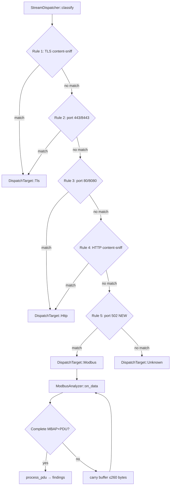
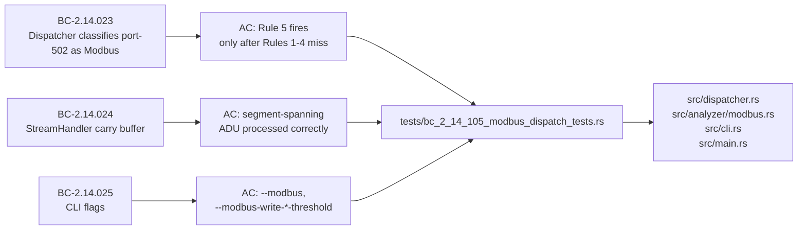

## STORY-105: Modbus Dispatcher Integration + CLI — Modbus Analyzer Goes Live

**Feature:** Feature #7 Wave 2 (v0.4.0 milestone)
**Story:** STORY-105 — Modbus dispatcher integration + CLI (BC-2.14.023/024/025)
**Branch:** `feature/story-105-modbus-dispatch` → `develop`
**Status:** CONVERGED (Claude + Gemini cross-model adversarial review, both resolved)

---

## Summary

This PR makes the Modbus analyzer **live** in the wire-monitoring pipeline. Prior stories (STORY-102/103/104) built and validated the `ModbusAnalyzer` in isolation; this story wires it into the `StreamDispatcher` and exposes it through the CLI.

### Key changes

- **Dispatcher — Rule 5 (port-502):** `StreamDispatcher::classify` gains `DispatchTarget::Modbus`. Port-502 flows are classified as Modbus **only** when no higher-priority rule fires first (Rule 1: content-sniff TLS; Rule 2: port 443/8443; Rule 3: port 80/8080 HTTP; Rule 4: content-sniff HTTP). VP-004 precedence is fully preserved — Modbus never steals flows that belong to http or tls analyzers.
- **VP-004 classify_oracle extension:** The oracle used by property-based tests is extended to mirror Rule 5, keeping formal coverage current.
- **StreamHandler implementation:** `ModbusAnalyzer` implements `StreamHandler`. Per-flow carry buffer handles segment-spanning ADUs (partial Modbus frames that arrive across TCP segments). Carry buffer is DoS-bounded at 260 bytes (the maximum valid Modbus/TCP PDU size + MBAP header). `on_flow_close` drains and processes any buffered partial frame.
- **CLI flags:** `--modbus` (enable analyzer), `--modbus-write-burst-threshold <N>` (default 20), `--modbus-write-sustained-threshold <N>` (default 10). Zero-value inputs are rejected with a clear error message.
- **`main.rs` wiring:** Modbus summary is emitted under the `analyzer_name` key in JSON output. The v0.3.0 schema is preserved — no breaking rename.

---

## Architecture Changes

---

## Story Dependencies

All upstream PRs (#210 STORY-102, #211 STORY-103, #213 STORY-104) are merged into develop.

---

## Spec Traceability

---

## Test Evidence

| Metric | Value |
|--------|-------|
| Total tests passing | 1324 (+28 vs pre-story) |
| New tests added | 28 (in `bc_2_14_105_modbus_dispatch_tests.rs`) |
| Clippy (-D warnings) | CLEAN |
| `cargo fmt --check` | CLEAN |
| Regression tests | 0 failures (all prior 1296 pass) |

Test file: `tests/bc_2_14_105_modbus_dispatch_tests.rs` — 1146 lines covering:
- Rule 5 classify precedence (port-502 not stolen by TLS/HTTP rules)
- VP-004 oracle parity
- `on_data` with complete frames
- `on_data` with segment-spanning (partial) frames — carry buffer correctness
- DoS-cap: carry buffer never exceeds 260 bytes
- `on_flow_close` drain
- CLI flag parsing (zero-rejection, defaults)
- JSON output schema (`analyzer_name` key preserved)

---

## Adversarial Review — Convergence

Two independent adversarial reviewers (Claude + Gemini) reviewed the implementation. Both reviewers independently identified the same two bugs, confirming high-confidence detection:

| Finding | Severity (Claude / Gemini) | Resolution |
|---------|---------------------------|------------|
| Breaking serde rename: `analyzer_name` → `analyzer` would have renamed ALL analyzers' JSON key | HIGH / HIGH | Reverted in commit `a6d2802` |
| Partial-ADU buffering bug: carry buffer not properly bounded cumulatively across calls | HIGH / CRITICAL | Fixed with DoS-capped carry buffer + pinning tests in commit `6fcb087` |
| Carry-cap guard applied per-call not cumulatively | MEDIUM | Cleanup in commit `e381969` |

Re-review after fixes: **CONVERGED** (no remaining blocking findings from either reviewer).

---

## Security Review

- **Attacker-controlled input:** Modbus frames arrive from the network. The carry buffer is bounded at 260 bytes — any frame exceeding this is discarded (not buffered), preventing memory exhaustion.
- **No parser state escapes:** The carry buffer is per-flow and dropped on `on_flow_close`.
- **No injection vectors:** Modbus findings are structured Rust values serialized via serde; no string interpolation from packet bytes into command execution paths.
- **Classifier precedence:** TLS and HTTP classifiers always take priority over Modbus (Rules 1-4 before Rule 5) — a crafted port-502 TLS connection is correctly classified as TLS, not Modbus.

---

## Deferred Items (Non-blocking)

| ID | Item | Severity | Target |
|----|------|----------|--------|
| F-105-003 | E2E port-502 pcap fixture for live traffic validation | LOW | Future hardening pass |
| VP-022, VP-004 | Kani formal verification runs for dispatcher + carry buffer | INFO | F6 hardening (kani not in CI) |

---

## Risk Assessment

| Dimension | Assessment |
|-----------|------------|
| Blast radius | Modbus path only; TLS/HTTP dispatch paths unchanged |
| Performance | O(frame) per flow; carry buffer is bounded constant memory |
| Schema compatibility | v0.3.0 JSON schema preserved (no field renames) |
| Regression risk | LOW — 1296 pre-existing tests remain green |

---

## AI Pipeline Metadata

| Field | Value |
|-------|-------|
| Pipeline mode | Feature delivery (Phase 3 TDD → adversarial → convergence) |
| Cross-model adversarial | Claude Sonnet + Gemini (independent review) |
| Convergence cycles | 2 (bugs found in cycle 1, fixed, re-reviewed clean in cycle 2) |
| Stories in wave | STORY-102 ✓ STORY-103 ✓ STORY-104 ✓ STORY-105 (this PR) |

---

## Pre-Merge Checklist

- [x] Semantic PR title (`feat(modbus): ...`)
- [x] Targets `develop` branch
- [x] All dependency PRs merged (STORY-102/103/104)
- [x] 1324 tests passing, +28 net new
- [x] Clippy clean (-D warnings)
- [x] fmt clean
- [x] VP-004 classify_oracle extended to mirror Rule 5
- [x] Carry buffer DoS-bounded at 260 bytes
- [x] v0.3.0 JSON schema preserved
- [x] Adversarial review converged (2 cycles, both bugs fixed)
- [ ] CI checks green (pending)
