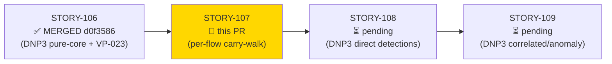
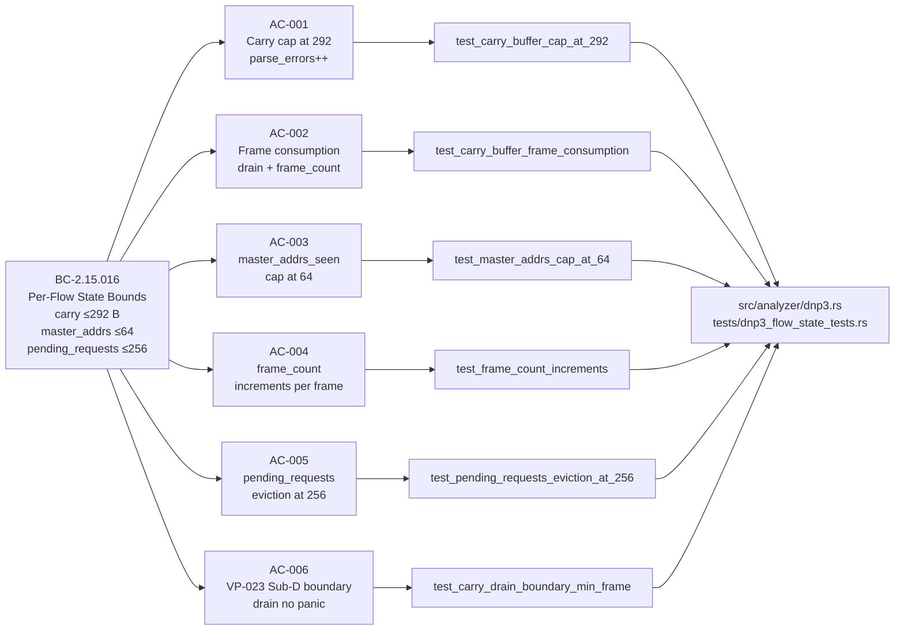
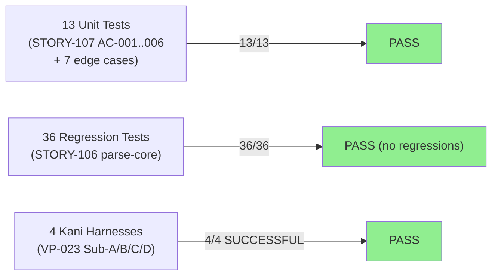
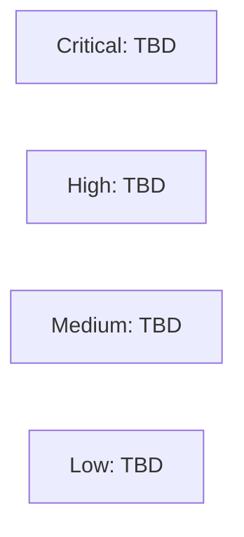

## feat(dnp3): per-flow carry-buffer frame-walk + bounds (STORY-107)

**Epic:** E-15 — Feature #8 DNP3/ICS Analyzer (issue #8)
**Mode:** brownfield / feature
**Wave:** 36 | **Points:** 5 | **Target:** v0.6.0
**Convergence:** CONVERGED after 3 adversarial passes (P1 NITPICK_ONLY → P2 CLEAN → P3 CLEAN) — satisfies BC-5.39.001 / DF-CONVERGENCE-BEFORE-MERGE-001


Restructures the STORY-106 `on_data` skeleton into the real carry-buffer frame-walk for the DNP3 analyzer (`src/analyzer/dnp3.rs`). Implements per-flow state bounds mandated by BC-2.15.016: carry buffer capped at `MAX_DNP3_FRAME_LEN = 292` bytes, `master_addrs_seen` bounded at `MAX_MASTER_ADDRS = 64`, and `pending_requests` bounded at `MAX_PENDING_REQUESTS = 256` entries with oldest-by-`request_ts` eviction. The `on_data` loop is now a gate-before-count accumulate → frame-consume pipeline (ADR-007 Decision 2). `parse_errors` is a lifetime counter (never reset at window expiry). 13 new unit tests (AC-001 through AC-006 + 7 edge-case tests) pass; 36 STORY-106 regression tests remain green; all 4 VP-023 Kani harnesses SUCCESSFUL.

> **Skeleton → real frame-walk adjustment:** Three STORY-106 `on_data` test frames were updated from the placeholder `LENGTH=0x0E` byte to the wire-valid `LENGTH=0x06` (frame_len=11 bytes) to match the actual test payload sizes. The test assertions are unchanged — this is a correction of the skeleton-era dummy `LENGTH` bytes to values consistent with the real frame-walk implementation.

Closes #8 (partial — per-flow state layer; detection emissions in STORY-108+)

---

## Architecture Changes

```mermaid
graph TD
    Dispatcher["src/analyzer/mod.rs\n(dispatcher)"] -->|pub mod dnp3| Dnp3["src/analyzer/dnp3.rs\n(SS-15)"]
    Dnp3 -->|pure fn| ParseCore["parse_dnp3_dl_header / is_valid /\nclassify_fc / compute_frame_len\n(STORY-106 foundation)"]
    Dnp3 -->|pure fn| IsMaster["is_master_frame(control)\n→ bool (NEW STORY-107)"]
    Dnp3 -->|effectful shell| FlowState["Dnp3FlowState\ncarry: Vec&lt;u8&gt; [≤292]\nmaster_addrs_seen: Vec&lt;u16&gt; [≤64]\npending_requests: HashMap [≤256]\nframe_count: u64\nparse_errors: u64 (LIFETIME)"]
    Dnp3 -->|effectful| OnData["on_data() carry-walk\naccumulate → cap → consume → track"]
    Dnp3 -->|cfg(kani)| KaniProofs["kani_proofs\n(VP-023 Sub-A/B/C/D — unchanged)"]
    style FlowState fill:#90EE90
    style OnData fill:#90EE90
    style IsMaster fill:#90EE90
```

<details>
<summary><strong>Architecture Decision Record</strong></summary>

### ADR-007 Decision 2: Carry-Buffer Pattern for DNP3 TCP Reassembly

**Context:** DNP3 TCP delivers partial frames across multiple `on_data` calls. The analyzer must accumulate bytes into a per-flow buffer and consume complete frames as they become available, without allocating unbounded memory under adversarial traffic.

**Decision:** `Dnp3FlowState.carry: Vec<u8>` accumulates raw wire bytes. A hard cap at `MAX_DNP3_FRAME_LEN = 292` bytes (the maximum DNP3 link-layer frame size, proved by VP-023 Sub-D) prevents adversarial partial-frame floods from exhausting per-flow memory. Frame consumption uses a `while` loop (not `if`) to handle multiple complete frames per `on_data` call.

**Rationale:** (1) 292-byte cap is formally proven tight by VP-023 Sub-D (Kani SUCCESSFUL). (2) `while` loop matches STORY-103 Modbus lesson (single `if` caused frame alignment drift in the Modbus implementation). (3) CRC bytes are NOT stripped during accumulation — carry holds raw wire bytes; CRC skip happens during frame parsing (ADR-007 Decision 3). (4) `parse_errors` is a lifetime counter per BC-2.15.015 — windowed anomaly counting (`malformed_in_window`) is STORY-109 scope.

**Consequences:**
- Per-flow memory is bounded at 292 bytes for the carry buffer plus O(64) words for master_addrs + O(256) entries for pending_requests.
- `pending_requests` eviction by oldest `request_ts` is the DoS-safe overflow behavior (BC-2.15.016 PC10); evicted entries generate NO T1691.001 timeout event.

</details>

---

## Story Dependencies



**STORY-106** (DNP3 pure-core parser + VP-023 Kani, PR #225, merged at d0f3586) provides `compute_dnp3_frame_len`, `is_valid_dnp3_frame_header`, `Dnp3FlowState.is_non_dnp3`, and the `src/analyzer/dnp3.rs` module. The carry-consume loop calls `compute_dnp3_frame_len`; STORY-107 cannot exist before that function does. STORY-107 blocks STORY-108 (direct detection emissions), which adds detection fields to `Dnp3FlowState` and writes detection branches inside the carry-walk loop established here.

---

## Spec Traceability



---

## Test Evidence

### Coverage Summary

| Metric | Value | Threshold | Status |
|--------|-------|-----------|--------|
| New STORY-107 unit tests | 13/13 pass | 100% | PASS |
| STORY-106 regression tests | 36/36 pass | 100% | PASS |
| VP-023 Kani harnesses | 4/4 SUCCESSFUL | 100% | PASS |
| Demo evidence ACs | 6/6 covered | 6/6 | PASS |
| Regressions | 0 | 0 | PASS |

### Test Flow



| Metric | Value |
|--------|-------|
| **New tests** | 13 added (AC-001..006 + EC-001..006 + is_master_frame helper) |
| **Total suite** | 49 tests PASS (13 new + 36 STORY-106 regression) |
| **VP-023 Kani** | 4/4 SUCCESSFUL (unchanged; Sub-D is the critical AC-006 invariant) |
| **Regressions** | 0 |

<details>
<summary><strong>Detailed Test Results</strong></summary>

### New Tests (STORY-107)

| Test | AC/EC | Assertion | Result |
|------|-------|-----------|--------|
| `test_BC_2_15_016_is_master_frame_dir_bit` | helper | DIR bit (0x10) biconditional | PASS |
| `test_carry_buffer_cap_at_292` | AC-001 | carry=292, parse_errors=1, 3 bytes discarded | PASS |
| `test_carry_buffer_frame_consumption` | AC-002 | 11 bytes remain, frame_count=1 | PASS |
| `test_master_addrs_cap_at_64` | AC-003 | master_addrs_seen.len()==64 after 65th addr | PASS |
| `test_frame_count_increments` | AC-004 | frame_count==3 after 3 complete frames | PASS |
| `test_pending_requests_eviction_at_256` | AC-005 | map.len()==256; oldest (ts=0) evicted | PASS |
| `test_carry_drain_boundary_min_frame` | AC-006 | carry.len()==1 after min-frame drained; no panic | PASS |
| `test_EC_001_partial_frame_in_carry` | EC-001 | carry.len()==7, frame_count==0 | PASS |
| `test_EC_002_two_complete_frames_one_call` | EC-002 | carry.len()==0, frame_count==2 (while-loop) | PASS |
| `test_EC_003_carry_291_plus_2_overflow` | EC-003 | carry.len()==292, parse_errors==1 | PASS |
| `test_EC_004_bailed_flow_is_noop` | EC-004 | is_non_dnp3==true, carry.len()==0 | PASS |
| `test_EC_005_pending_requests_tie_break_eviction` | EC-005 | map.len()==256; one of tie entries evicted | PASS |
| `test_EC_006_invalid_length_byte_increments_parse_errors` | EC-006 | parse_errors==1, carry advanced past invalid LENGTH | PASS |

### VP-023 Kani Formal Verification

| Harness | Sub-Property | Checks | Result |
|---------|-------------|--------|--------|
| `verify_parse_dnp3_dl_header_safety` | Sub-A: parse no OOB for all lengths 0..=12 | 141 | SUCCESSFUL |
| `verify_classify_dnp3_fc_total` | Sub-B: FC classification totality over all 256 u8 values | 20 | SUCCESSFUL |
| `verify_is_valid_dnp3_frame_gate` | Sub-C: validity gate biconditional (sync AND length>=5) | 19 | SUCCESSFUL |
| `verify_compute_dnp3_frame_len` | Sub-D: frame_len in [10,292] for all valid LENGTH values | 30 | SUCCESSFUL |

Sub-D is the critical invariant for AC-006: `compute_dnp3_frame_len(length)` returns values in `[10, 292]` for all valid inputs, guaranteeing `carry.drain(..frame_len)` cannot index out of bounds when `carry.len() >= frame_len`.

Tool: Kani Rust Verifier 0.67.0 (CBMC 6.8.0)

</details>

---

## Demo Evidence

All 6 ACs have recorded VHS terminal sessions committed at `docs/demo-evidence/STORY-107/` on this branch.

| AC | Test | Recording |
|----|------|-----------|
| AC-001 Carry cap 292 | `test_carry_buffer_cap_at_292` | [GIF](../../docs/demo-evidence/STORY-107/AC-001-carry-buffer-cap.gif) |
| AC-002 Frame consumption | `test_carry_buffer_frame_consumption` | [GIF](../../docs/demo-evidence/STORY-107/AC-002-carry-frame-consumption.gif) |
| AC-003 master_addrs cap 64 | `test_master_addrs_cap_at_64` | [GIF](../../docs/demo-evidence/STORY-107/AC-003-master-addrs-cap.gif) |
| AC-004 frame_count increments | `test_frame_count_increments` | [GIF](../../docs/demo-evidence/STORY-107/AC-004-frame-count-increments.gif) |
| AC-005 pending_requests eviction | `test_pending_requests_eviction_at_256` | [GIF](../../docs/demo-evidence/STORY-107/AC-005-pending-requests-eviction.gif) |
| AC-006 VP-023 Sub-D boundary | `test_carry_drain_boundary_min_frame` | [GIF](../../docs/demo-evidence/STORY-107/AC-006-carry-drain-boundary.gif) |

Full evidence report: `docs/demo-evidence/STORY-107/evidence-report.md`

---

## Holdout Evaluation

N/A — evaluated at wave gate (wave 36). Holdout evaluation is a wave-level gate, not a per-PR gate for brownfield feature stories.

---

## Adversarial Review

Per-story adversarial convergence per DF-CONVERGENCE-BEFORE-MERGE-001:

| Pass | Verdict | Findings | Blocking | Status |
|------|---------|----------|----------|--------|
| P1 | NITPICK_ONLY | 2 (F-1 pending-seed scope, F-2 resync-drain doc) | 0 | Documented |
| P2 | CLEAN | 0 | 0 | Closed |
| P3 | CLEAN | 0 | 0 | Confirmed |

**Convergence:** 3 passes. P1 raised two NITPICK-level findings (F-1: pending-seed scope boundary documented in STORY-107's AC-005 note; F-2: resync-drain progression strengthened in EC-006 test assertion). P2 and P3 both CLEAN. Satisfies BC-5.39.001 / DF-CONVERGENCE-BEFORE-MERGE-001.

<details>
<summary><strong>P1 Findings (NITPICK — resolved inline)</strong></summary>

### F-1: Pending-seed scope boundary unclear
- **Location:** `on_data` + AC-005 description
- **Category:** spec-fidelity (NITPICK)
- **Problem:** AC-005 seeds `pending_requests` via a minimal path that may insert spurious entries; scope boundary vs STORY-108 detection-driven seeding was implicit.
- **Resolution:** AC-005 scope boundary note added to STORY-107.md v1.2 (story-writer revision). Detection-driven seeding explicitly deferred to STORY-108.

### F-2: EC-006 resync-drain progress assertion weak
- **Category:** test-quality (NITPICK)
- **Problem:** EC-006 assertion did not verify carry advance past invalid LENGTH byte.
- **Resolution:** EC-006 test strengthened (commit 8fbbbff) to assert `carry.len()==9` (drain-1 resync advanced past invalid LENGTH byte).

</details>

---

## Security Review

Pending — out of scope for this dispatch (step 4, executed separately by orchestrator).



*Security review findings will be posted as a PR comment after step 4 completes.*

---

## Risk Assessment & Deployment

### Blast Radius
- **Systems affected:** `src/analyzer/dnp3.rs` only — no changes to dispatcher, CLI, or other analyzers
- **User impact:** None at v0.6.0 target — DNP3 analyzer not yet wired into the dispatcher (STORY-110 scope)
- **Data impact:** Per-flow state is in-memory only; no persistence, no DB writes
- **Risk Level:** LOW — bounded pure in-memory state addition to a module not yet in the dispatch path

### Performance Impact

| Metric | Notes |
|--------|-------|
| Memory per flow | carry ≤292 B + master_addrs ≤128 B + pending_requests ≤256 entries × ~12 B = ≤3.5 KB/flow (hard bounded) |
| Throughput | Carry-walk is O(n/frame_len) per on_data call; no allocation on the hot path beyond Vec::extend_from_slice |
| Latency | Negligible — HashMap eviction is O(n) over ≤256 entries (max 256 comparisons for min-find) |

<details>
<summary><strong>Rollback Instructions</strong></summary>

**Immediate rollback (< 2 min):**
```bash
git revert 9fe884b  # HEAD of feature/story-107-dnp3-flow-state
git push origin develop
```

DNP3 analyzer is not yet wired into the dispatcher (STORY-110). Rollback has no user-visible impact.

</details>

### Feature Flags

None — DNP3 analyzer is not yet in the active dispatch path.

---

## Traceability

| BC | AC | Test | Verification | Status |
|----|----|----|-------------|--------|
| BC-2.15.016 PC1-2 | AC-001 | `test_carry_buffer_cap_at_292` | unit | PASS |
| BC-2.15.016 PC3-4 | AC-002 | `test_carry_buffer_frame_consumption` | unit | PASS |
| BC-2.15.016 PC5-6 | AC-003 | `test_master_addrs_cap_at_64` | unit | PASS |
| BC-2.15.016 PC7 | AC-004 | `test_frame_count_increments` | unit | PASS |
| BC-2.15.016 PC8-10 | AC-005 | `test_pending_requests_eviction_at_256` | unit | PASS |
| BC-2.15.016 inv1 + VP-023 Sub-D | AC-006 | `test_carry_drain_boundary_min_frame` | Kani (Sub-D) + unit | PASS |

<details>
<summary><strong>Full VSDD Contract Chain</strong></summary>

```
BC-2.15.016 PC1-2  → AC-001 → test_carry_buffer_cap_at_292        → dnp3.rs on_data accumulate+cap  → ADV-P3-CLEAN → unit PASS
BC-2.15.016 PC3-4  → AC-002 → test_carry_buffer_frame_consumption  → dnp3.rs on_data frame-walk       → ADV-P3-CLEAN → unit PASS
BC-2.15.016 PC5-6  → AC-003 → test_master_addrs_cap_at_64          → dnp3.rs is_master_frame + push   → ADV-P3-CLEAN → unit PASS
BC-2.15.016 PC7    → AC-004 → test_frame_count_increments           → dnp3.rs frame_count++            → ADV-P3-CLEAN → unit PASS
BC-2.15.016 PC8-10 → AC-005 → test_pending_requests_eviction_at_256 → dnp3.rs min-evict insert         → ADV-P3-CLEAN → unit PASS
BC-2.15.016 inv1   → AC-006 → test_carry_drain_boundary_min_frame   → VP-023 Sub-D Kani SUCCESSFUL     → ADV-P3-CLEAN → PASS
ADR-007 D2         → carry-walk loop                                → STORY-103 Modbus precedent while-loop lesson applied
```

</details>

---

## AI Pipeline Metadata

<details>
<summary><strong>Pipeline Details</strong></summary>

```yaml
ai-generated: true
pipeline-mode: brownfield / feature (wave 36)
factory-version: "1.0.0"
story-id: STORY-107
epic-id: E-15
wave: 36
points: 5
pipeline-stages:
  spec-crystallization: completed (BC-2.15.016 v1.1)
  story-decomposition: completed (STORY-107 v1.2)
  tdd-implementation: completed
  adversarial-review: completed (3 passes, P1 NITPICK_ONLY → P2/P3 CLEAN)
  formal-verification: completed (VP-023 4/4 Kani SUCCESSFUL — pure-core unchanged)
  convergence: achieved (BC-5.39.001 satisfied)
convergence-metrics:
  adversarial-passes: 3
  blocking-findings-resolved: 0 (P1 findings were NITPICK level only)
models-used:
  builder: claude-sonnet-4-6
generated-at: "2026-06-11T00:00:00Z"
dependency-pr: "#225 (STORY-106, merged d0f3586)"
```

</details>

---

## Pre-Merge Checklist

- [ ] All CI status checks passing
- [x] 13 new + 36 regression tests green (confirmed on branch)
- [x] VP-023 Kani 4/4 SUCCESSFUL (confirmed on branch)
- [x] Demo evidence: 6/6 ACs covered (`docs/demo-evidence/STORY-107/evidence-report.md`)
- [x] Adversarial convergence: 3 passes (P1 NITPICK_ONLY → P2 CLEAN → P3 CLEAN)
- [x] Dependency STORY-106 merged (PR #225, d0f3586)
- [ ] Security review completed (step 4 — pending orchestrator dispatch)
- [ ] PR review approval (step 5 — pending orchestrator dispatch)
- [ ] No critical/high security findings unresolved
- [ ] Rollback procedure validated
- [ ] Human review completed (if autonomy level requires)
