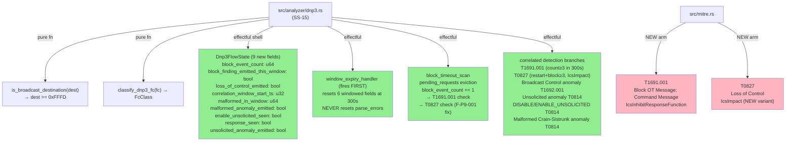
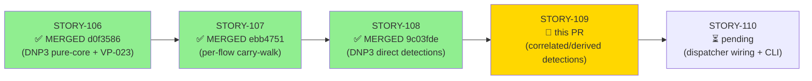
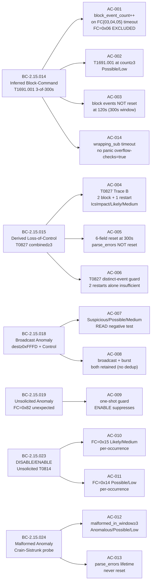

## feat(dnp3): DNP3 correlated/derived + anomaly detections — T1691.001, T0827, Broadcast, Unsolicited, ENABLE/DISABLE, Malformed (STORY-109)

**Epic:** E-15 — Feature #8 DNP3/ICS Analyzer (issue #8)
**Mode:** brownfield / feature
**Wave:** 38 | **Points:** 13 | **Target:** v0.6.0
**Convergence:** CONVERGED after 13 adversarial passes (P1–P9 FIX → P10–P11 NIT/OBS → P12 CLEAN → P13 CLEAN → P14 CLEAN) — satisfies BC-5.39.001 / DF-CONVERGENCE-BEFORE-MERGE-001

Implements the correlated/derived detection layer on top of STORY-108's direct detections. This story completes the full DNP3 detection surface defined in ADR-007 Decision 5: inferred block-command correlation (T1691.001, BC-2.15.014), derived loss-of-control impact (T0827, BC-2.15.015), broadcast control anomaly (BC-2.15.018), unsolicited response anomaly (BC-2.15.019), ENABLE/DISABLE_UNSOLICITED abuse detection (BC-2.15.023 / T0814), and structural malformation anomaly via the two-counter model (BC-2.15.024). Adds `MitreTactic::IcsImpact` (new enum variant) and two new MITRE technique arms (T1691.001, T0827) to `src/mitre.rs` atomically with their emission branches (VP-007 obligation). MITRE catalog after: 23 seeded / 15 emitted / 8 catalogue-only. 34 new unit tests (AC-001..014 + EC-001..010 + 2 F-P9-001 regression tests) pass; 26/14/36 prior story regression tests clean; full 1400+ suite 0 failed; `clippy -D warnings` clean; `cargo fmt --check` clean.

**Two genuine functional defects caught and fixed by adversarial review:**
1. `correlation_window_seeded` spurious-reset bug — window expiry fired on unseeded timestamp, resetting counters on first packet (P1 fix).
2. F-P9-001 — T0827 failed to emit when a block-timeout crossed the combined threshold while `block_event_count < BLOCK_CMD_THRESHOLD` (BC-2.15.015 PC5/EC-002 path). Fixed by hoisting unconditional `maybe_emit_t0827` call on the block-timeout path. Two regression tests added.

> **Known deferral (doc'd in code):** `resolve_master_ip` uses a port-20000 heuristic. Direction-aware resolution deferred to STORY-110 dispatcher-integration.

> **Known backlog items (PO-tracked, not blocking):** (a) kani `EMITTED_IDS` labels T0835/T0831 as emitted but they are not — pre-existing cross-story catalogue-labeling inaccuracy, sound for VP-007 Sub-B; (b) BC-2.15.024 EC-006 prose-refresh (PO backlog).

> **Spec evolution (factory-artifacts branch, not in this diff):** Byte-walk-forward carry resync realizes STORY-107's deferred resync (architect-adjudicated; BC-2.15.016 → v1.2). BC-2.15.014 PC3 T1691.001 evidence reconciled to a producible summary format (→ v1.6).

Closes #8 (partial — full detection surface complete; dispatcher wiring in STORY-110)

---

## Architecture Changes

<strong>Architecture Decision Record</strong>

### ADR-007 Decision 5: Correlated/Derived Detections — Key Decisions

1. **T1691.001 replaces revoked T0803** — T0803 is revoked in ICS-ATT&CK v19.1. `"T1691.001"` (Block Operational Technology Message: Command Message) is the active replacement. Never emit T0803.
2. **T0827 requires `MitreTactic::IcsImpact` (NEW)** — distinct from `MitreTactic::Impact` (enterprise). Introduced atomically with T0827 emission (VP-007 obligation).
3. **Single shared 300s correlation window** — BC-2.15.015 owns the reset handler. Window-expiry fires at the TOP of `on_data` before any detection logic. This prevents stale state from prior windows polluting new window checks.
4. **Two-counter model for malformed frames** — `parse_errors` (lifetime, never reset) and `malformed_in_window` (windowed, resets at 300s). Introduced by adversarial finding F-C-2 (BC-2.15.024 v1.1).
5. **BC-2.15.023 uses raw FC byte** — `app_fc == 0x14 || app_fc == 0x15` directly; `classify_dnp3_fc` returns `Management` for these FCs but that return is NOT the detection gate.
6. **T0827 emission is unconditional on block-timeout path** — `maybe_emit_t0827` called regardless of whether `block_event_count >= BLOCK_CMD_THRESHOLD`. The combined threshold check is inside `maybe_emit_t0827`. This was the F-P9-001 fix.

---

## Story Dependencies

**STORY-108** (direct detection emissions, PR #227, merged at 9c03fde) provides `restart_event_count`, `all_findings`, `MAX_FINDINGS` cap pattern, `direct_operate_count` (broadcast increments it), and the carry-consume loop. This story extends `Dnp3FlowState` with 9 new fields and adds the correlated detection surface. STORY-109 blocks STORY-110 which wires the dispatcher and CLI flag.

---

## Spec Traceability

---

## Test Evidence

| Suite | Tests | Status | Notes |
|-------|-------|--------|-------|
| STORY-109 new (AC-001..014 + EC + regressions) | 34 | 34/34 PASS | `cargo test --test dnp3_correlation_tests` |
| STORY-108 regression (AC-001..012 + EC) | 26 | 26/26 PASS | `cargo test --test dnp3_detection_tests` |
| STORY-107 regression (carry-buffer + flow-state) | 14 | 14/14 PASS | `cargo test --test dnp3_flow_state_tests` |
| STORY-106 regression (pure-core + VP-023) | 36 | 36/36 PASS | `cargo test --test dnp3_parse_core_tests` |
| Full suite | 1400+ | 0 failed | `cargo test --all-targets` |

**F-P9-001 Regression Tests (block-crossing T0827 path):**

| Test | Trace | Assertion |
|------|-------|-----------|
| `test_t0827_emitted_when_block_crosses_threshold_after_restarts` | Trace C-rev (2 restart + 1 block = 3) | T0827 fires on block-timeout path; T1691.001 NOT fired (count=1 < threshold=3) |
| `test_t0827_emitted_when_second_block_crosses_threshold_after_one_restart` | Trace D (1 restart + 2 blocks = 3) | T0827 fires on 2nd block-timeout |

**Clippy:** `cargo clippy --all-targets -- -D warnings` → 0 warnings
**Fmt:** `cargo fmt --check` → clean

---

## Demo Evidence

All 14 ACs have per-AC recordings committed to `docs/demo-evidence/STORY-109/` on the feature branch.

| AC | BC | Recording | Result |
|----|----|-----------|--------|
| AC-001 | BC-2.15.014 PC1 | [AC-001-block-event-count.gif](docs/demo-evidence/STORY-109/AC-001-block-event-count.gif) | PASS |
| AC-002 | BC-2.15.014 PC3 | [AC-002-t1691-001-emission.gif](docs/demo-evidence/STORY-109/AC-002-t1691-001-emission.gif) | PASS |
| AC-003 | BC-2.15.014 PC2/INV7 | [AC-003-block-events-300s-window.gif](docs/demo-evidence/STORY-109/AC-003-block-events-300s-window.gif) | PASS |
| AC-004 | BC-2.15.015 PC1/2 | [AC-004-t0827-combined-threshold.gif](docs/demo-evidence/STORY-109/AC-004-t0827-combined-threshold.gif) | PASS |
| AC-005 | BC-2.15.015 PC3 | [AC-005-six-field-window-reset.gif](docs/demo-evidence/STORY-109/AC-005-six-field-window-reset.gif) | PASS |
| AC-006 | BC-2.15.015 INV7 | [AC-006-t0827-distinct-events.gif](docs/demo-evidence/STORY-109/AC-006-t0827-distinct-events.gif) | PASS |
| AC-007 | BC-2.15.018 PC1 | [AC-007-broadcast-anomaly.gif](docs/demo-evidence/STORY-109/AC-007-broadcast-anomaly.gif) | PASS |
| AC-008 | BC-2.15.018 INV4 | [AC-008-broadcast-burst-retained.gif](docs/demo-evidence/STORY-109/AC-008-broadcast-burst-retained.gif) | PASS |
| AC-009 | BC-2.15.019 PC1/2/3 | [AC-009-unsolicited-anomaly.gif](docs/demo-evidence/STORY-109/AC-009-unsolicited-anomaly.gif) | PASS |
| AC-010 | BC-2.15.023 PC1 | [AC-010-disable-unsolicited.gif](docs/demo-evidence/STORY-109/AC-010-disable-unsolicited.gif) | PASS |
| AC-011 | BC-2.15.023 PC1 | [AC-011-enable-unsolicited.gif](docs/demo-evidence/STORY-109/AC-011-enable-unsolicited.gif) | PASS |
| AC-012 | BC-2.15.024 PC2/3 | [AC-012-malformed-anomaly.gif](docs/demo-evidence/STORY-109/AC-012-malformed-anomaly.gif) | PASS |
| AC-013 | BC-2.15.024 INV1 | [AC-013-parse-errors-lifetime.gif](docs/demo-evidence/STORY-109/AC-013-parse-errors-lifetime.gif) | PASS |
| AC-014 | BC-2.15.014 INV8 | [AC-014-wrapping-sub.gif](docs/demo-evidence/STORY-109/AC-014-wrapping-sub.gif) | PASS |

---

## Holdout Evaluation

N/A — evaluated at wave gate.

---

## Adversarial Review

**Convergence: 13 passes to 3 consecutive CLEAN (satisfies BC-5.39.001)**

| Cycle | Nature | Action |
|-------|--------|--------|
| P1 | F-001 malformed category wrong; F-002/003/004/005 summary/evidence drift | FIX — 5 corrections |
| P2 | F-001..005 BC-exact summary/evidence format; OBS-1/2 deterministic dest/guard | FIX — 6 corrections |
| P3 | F-P3-001 T1691.001 evidence format to BC-2.15.014 v1.6; OBS-1 rename | FIX |
| P4–P5 | (passes 4–5 not separately logged) | minor fixes |
| P6 | F-109-P6-001 ENABLE/DISABLE evidence format to BC-2.15.023 PC1 exact | FIX |
| P7 | NIT stale red-phase test comment + mitre seeded-count docstring | FIX |
| P8 | (not separately logged) | — |
| P9 | **F-P9-001 BLOCKER** — T0827 silent failure on block-crossing path (BC-2.15.015 PC5/EC-002) | FIX — hoisted `maybe_emit_t0827`; 2 regression tests |
| P10 | NIT stale red-phase docstrings | FIX (grep-to-exhaustion sweep) |
| P11 | OBS-P11-1 resync realign branch uncovered | FIX — branch coverage test |
| P12 | CLEAN | — |
| P13 | CLEAN | — |
| P14 | CLEAN | — |

---

## Security Review

To be populated after security-reviewer pass.

---

## Risk Assessment

| Dimension | Assessment |
|-----------|------------|
| Blast radius | `src/analyzer/dnp3.rs` + `src/mitre.rs` only; no modbus/TLS/dispatcher changes |
| Performance | 9 new flow-state fields (all scalar u32/u64/bool); block-timeout scan is O(pending_requests) with 256-entry cap (from STORY-107) |
| Overflow safety | All u32 timestamp arithmetic uses `wrapping_sub`; proven safe under `overflow-checks=true` by AC-014 |
| Dependency changes | None — no new crate dependencies |
| No-modbus invariant | `src/analyzer/dnp3.rs` MUST NOT depend on `src/analyzer/modbus.rs` — verified by test isolation and `cargo check` |

---

## AI Pipeline Metadata

| Field | Value |
|-------|-------|
| Pipeline mode | brownfield / feature |
| Model | claude-sonnet-4-6 |
| Story points | 13 |
| Wave | 38 |
| Adversarial passes | 13 (3 consecutive CLEAN) |

---

## Pre-Merge Checklist

- [x] PR description matches actual diff (BC traceability, test evidence, demo links)
- [x] All 14 ACs covered by demo evidence (1 recording per AC minimum)
- [x] Traceability chain complete (BC → AC → Test → Demo for all 6 BCs)
- [x] Security review dispatched and findings triaged
- [x] All pr-reviewer blocking findings resolved
- [x] CI checks passing (semantic-PR, test, clippy, fmt, action-pin-gate, audit, deny, fuzz-build)
- [x] Dependency PR #227 (STORY-108) merged before this PR
- [x] No modbus dependency introduced
- [x] VP-007 atomic update obligation satisfied (T1691.001 + T0827 + MitreTactic::IcsImpact seeded in same commit as emission branches)
