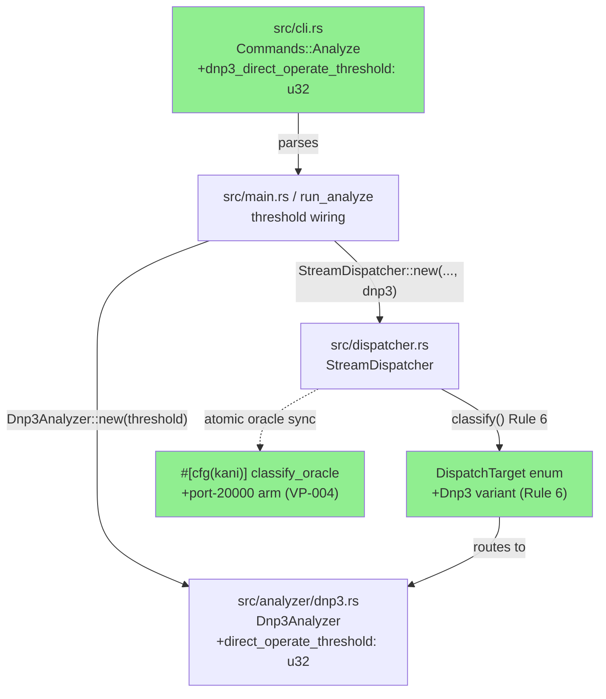
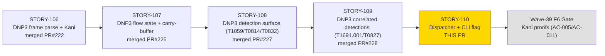
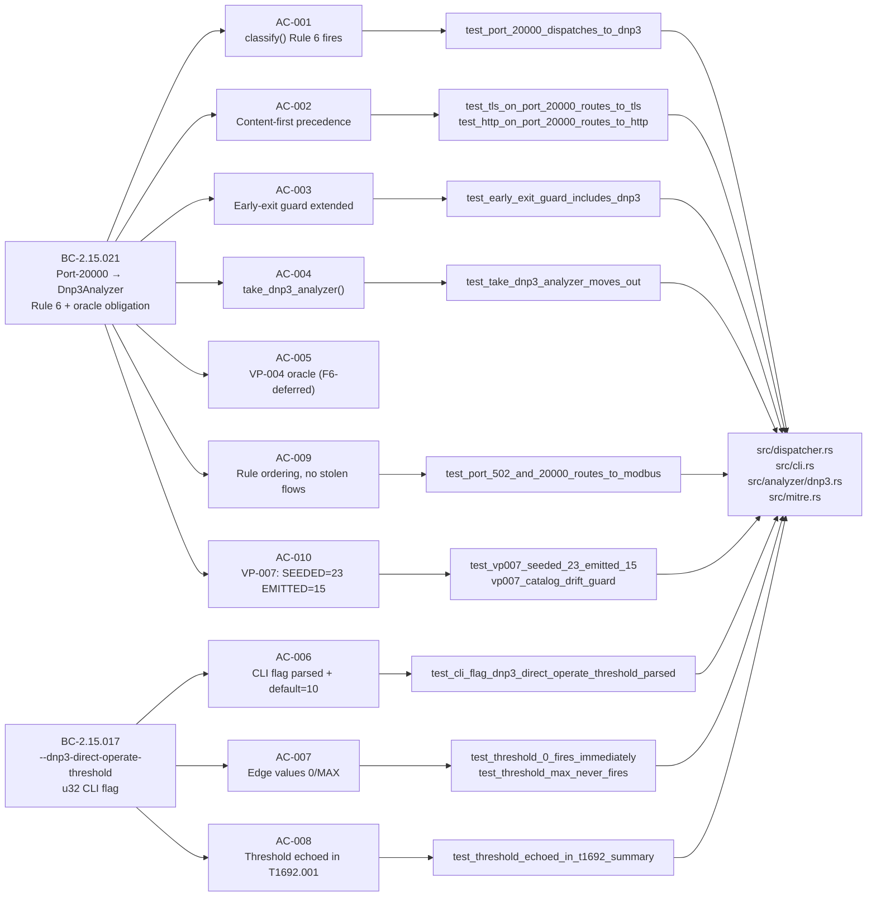
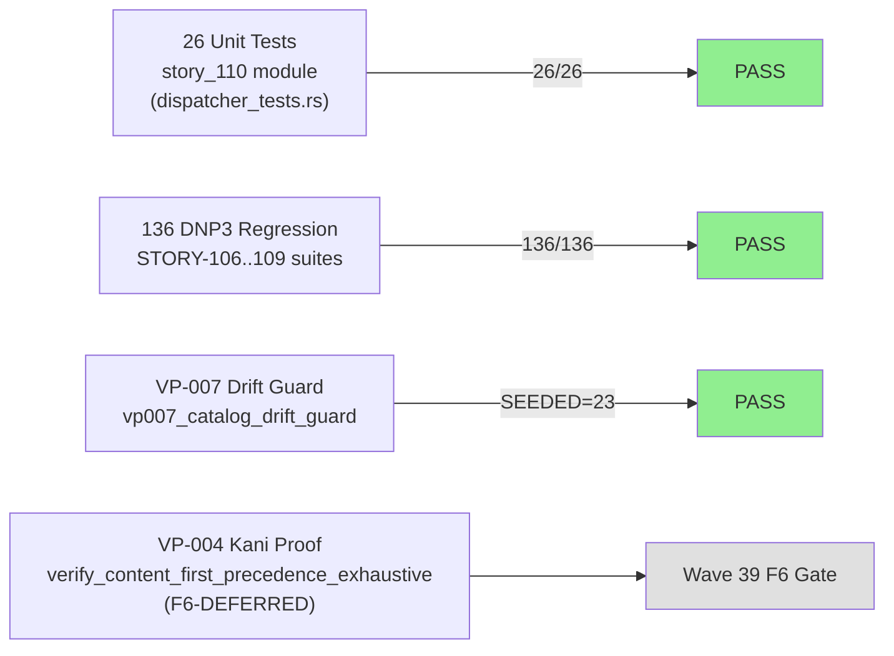

# [STORY-110] DNP3 Dispatcher Integration + CLI Flag (Rule 6, port 20000) + --dnp3-direct-operate-threshold

**Epic:** E-15 — DNP3/ICS Analyzer (FINAL story — completes E-15 dispatch + CLI surface)
**Mode:** feature (brownfield — mirrors STORY-105 Modbus dispatcher pattern)
**Convergence:** CONVERGED after 3 consecutive CLEAN adversarial passes (6 total passes, BC-5.39.001)


-green)

This PR is the **final E-15 story**. It wires the complete `Dnp3Analyzer` (built across STORY-106 through STORY-109) into the `StreamDispatcher` as **Rule 6** (port 20000, after Modbus Rule 5, before None Rule 7), and exposes a `--dnp3-direct-operate-threshold <u32>` CLI flag to tune the unauthorized-control burst detection window. The VP-004 oracle (`classify_oracle` in `#[cfg(kani)]`) is updated atomically in the same commit as `classify()` — the STORY-105 lesson applied. Early-exit guard is extended with `&& self.dnp3.is_none()` (AC-003) to prevent silent data drop. `take_dnp3_analyzer()` added for result collection (AC-004). VP-007 catalog invariants confirmed: SEEDED=23, EMITTED=15 (AC-010).

---

## Architecture Changes



<details>
<summary><strong>Architecture Decision Record — ADR-007 Decision 1</strong></summary>

### ADR-007: Binary ICS Protocol Integration (DNP3 TCP)

**Context:** StreamDispatcher uses a content-first, then port-based priority chain for routing flows to analyzers. STORY-105 established Rule 5 (Modbus/port 502). DNP3 must be added after Modbus per the ADR-007 rule table.

**Decision:** Add `DispatchTarget::Dnp3` as Rule 6 in `classify()` — `if ports.contains(&20000)` — placed after Rule 5 (port 502/Modbus) and before Rule 7 (None). The `classify_oracle` in the Kani proof module MUST be updated in the same commit (oracle/production divergence detected at F6 in STORY-105's Modbus work; this is the hard-learned fix).

**Rationale:** Port ordering is fixed by the ADR-007 rule table. Content rules (1–2) always take precedence over port rules (3–7). Rule 6 cannot steal TLS or HTTP flows. Rule 5 (Modbus) retains priority over Rule 6 (DNP3) when both ports appear in a flow.

**Alternatives Considered:**
1. Single catch-all ICS rule — rejected: does not support per-protocol analyzers with different thresholds.
2. Runtime-configurable rule order — rejected: adds complexity, violates ADR-007 static table contract.

**Consequences:**
- All `StreamDispatcher::new` call sites updated to 4-arg signature (~94 sites).
- `DispatchTarget::Dnp3` arm must be handled in all match expressions (compiler-enforced exhaustiveness).
- Forbidden dependency: `src/dispatcher.rs` gains dependency on `src/analyzer/dnp3.rs` only; MUST NOT gain dependency on `src/analyzer/modbus.rs` through the DNP3 path.

</details>

---

## Story Dependencies



**Dependency status:** STORY-109 (PR #228) merged to develop. No downstream stories blocked by STORY-110. Blocks: [] (final E-15 story).

---

## Spec Traceability



### Dispatch Rule Table (post-STORY-110)

| Rule | Condition | Target | Story |
|------|-----------|--------|-------|
| Rule 1 | `data[0]==0x16 && data[1]==0x03` (TLS ClientHello) | `DispatchTarget::Tls` | prior |
| Rule 2 | `data` starts with HTTP verb prefix | `DispatchTarget::Http` | prior |
| Rule 3 | `ports.contains(&443)` | `DispatchTarget::Tls` | prior |
| Rule 4 | `ports.contains(&80)` or `ports.contains(&8080)` | `DispatchTarget::Http` | prior |
| Rule 5 | `ports.contains(&502)` (Modbus) | `DispatchTarget::Modbus` | STORY-105 |
| **Rule 6** | **`ports.contains(&20000)` (DNP3)** | **`DispatchTarget::Dnp3`** | **STORY-110** |
| Rule 7 | No match | `DispatchTarget::None` | prior (was Rule 6) |

Content rules (1–2) always beat port rules (3–7). Rule 5 beats Rule 6 (multi-port flows with 502+20000 → Modbus, not DNP3).

---

## Test Evidence

### Coverage Summary

| Metric | Value | Threshold | Status |
|--------|-------|-----------|--------|
| New unit tests (story_110 module) | 26/26 PASS | 100% | PASS |
| Full test suite (52 binaries) | All PASS | 100% | PASS |
| DNP3 regression (136 tests, 5 suites) | 136/136 PASS | 100% | PASS |
| Clippy `-D warnings` | Clean | 0 warnings | PASS |
| `cargo fmt --check` | Clean | 0 diffs | PASS |
| VP-007 drift guard (`vp007_catalog_drift_guard`) | PASS | SEEDED=23 | PASS |

### Test Flow



| Metric | Value |
|--------|-------|
| **New tests** | 26 added (story_110 module) |
| **Test file delta** | `tests/dispatcher_tests.rs` +322 lines; `tests/bc_2_15_110_dnp3_dispatcher_tests.rs` (integration) |
| **Total suite** | 52 test binaries, all PASS |
| **Regressions** | 0 (STORY-106: 36/36, STORY-107: 14/14, STORY-108: 26/26, STORY-109: 34/34) |
| **Mutation kill rate** | N/A — not run at Phase 3 (F6 gate item) |
| **`StreamDispatcher::new` call-site updates** | ~94 sites updated to 4-arg signature |

<details>
<summary><strong>Detailed Test Results</strong></summary>

### New Tests (story_110 module — `tests/bc_2_15_110_dnp3_dispatcher_tests.rs` + `tests/dispatcher_tests.rs`)

| Test | AC | Result |
|------|----|--------|
| `test_port_20000_dispatches_to_dnp3` | AC-001 | PASS |
| `test_tls_on_port_20000_routes_to_tls` | AC-002 | PASS |
| `test_http_on_port_20000_routes_to_http` | AC-002 | PASS |
| `test_early_exit_guard_includes_dnp3` | AC-003 | PASS |
| `test_AC_003_early_exit_guard_does_not_fire_when_dnp3_is_some` | AC-003 | PASS |
| `test_take_dnp3_analyzer_moves_out` | AC-004 | PASS |
| `test_cli_flag_dnp3_direct_operate_threshold_parsed` | AC-006 | PASS |
| `test_threshold_0_fires_immediately` | AC-007 | PASS |
| `test_threshold_max_never_fires` | AC-007 | PASS |
| `test_threshold_echoed_in_t1692_summary` | AC-008 | PASS |
| `test_threshold_default_10_echoed_in_t1692_summary` | AC-008 | PASS |
| `test_port_502_and_20000_routes_to_modbus` | AC-009 | PASS |
| `test_ec006_ports_502_and_20000_modbus_wins` | AC-009/EC-006 | PASS |
| `test_vp007_seeded_23_emitted_15` | AC-010 | PASS |
| `test_none_is_rule_7_no_match` | Rule 7 shift | PASS |
| `test_ec001_non_dnp3_content_on_port_20000_desync_bail` | EC-001 | PASS |
| `test_ec002_multiple_frames_in_one_on_data_call` | EC-002 | PASS |
| `test_ec003_partial_frame_split_across_two_on_data_calls` | EC-003 | PASS |
| `test_ec005_unknown_port_routes_to_none` | EC-005 | PASS |
| `test_ec007_dnp3_disabled_port_20000_flow_is_noop` | EC-007 | PASS |
| `test_ec008_threshold_omitted_defaults_to_10` | EC-008 | PASS |
| `test_BC_2_15_021_detect_control_burst_unit_threshold_0_fires_on_first` | AC-007 | PASS |
| `test_BC_2_15_021_detect_control_burst_unit_fires_at_threshold_plus_1` | AC-007 | PASS |
| `test_BC_2_15_021_detect_control_burst_unit_threshold_echoed_in_summary` | AC-008 | PASS |
| `test_BC_2_15_021_detect_control_burst_window_expiry_resets_counter` | AC-007 | PASS |
| `test_BC_2_15_021_threshold_stored_in_dnp3_analyzer` | AC-006 | PASS |

### VP-007 Drift Guard (in-crate unit test, `src/mitre.rs`)

```
running 1 test
test mitre::vp007_format_tests::vp007_catalog_drift_guard ... ok

test result: ok. 1 passed; 0 failed; 0 ignored; 0 measured; 33 filtered out; finished in 1.77s
```

Asserts: `SEEDED_TECHNIQUE_IDS.len() == 23` AND `SEEDED_TECHNIQUE_ID_COUNT == 23`.

</details>

---

## Holdout Evaluation

N/A — evaluated at wave gate (Wave 39). Phase 4 holdout evaluation runs at the Wave 39 gate, not per-story.

---

## Adversarial Review

| Pass | Focus | Findings | Critical | High | Status |
|------|-------|----------|----------|------|--------|
| 1 (P1) | Oracle/production sync, doc drift | O-1 (dispatch-arm comment stale), O-4 (resolve_master_ip re-deferral), F-110-P1-001 (AC-010 test docstring) | 0 | 0 | Fixed |
| 2 (P2) | Test citation accuracy | F-110-P2-001 (phantom `test_technique_catalog_integrity` citation) | 0 | 0 | Fixed |
| 3 (P3) | Kani-citation sweep | F-P3-001 (phantom Kani harness citation in test docstring) | 0 | 0 | Fixed |
| 4 | Convergence check | 0 findings | 0 | 0 | CLEAN |
| 5 | Convergence check | 0 findings | 0 | 0 | CLEAN |
| 6 | Convergence check | 0 findings | 0 | 0 | CLEAN (BC-5.39.001 satisfied) |

**Convergence:** 3 consecutive CLEAN passes achieved (BC-5.39.001). No CRITICAL or HIGH findings across all 6 passes. All fixes were documentation/docstring accuracy (no production code changes required after the initial implementation commit).

**Highest-risk item (VP-004 oracle/production sync):** The `classify_oracle` port-20000 arm was implemented in the same commit as `classify()` Rule 6. The adversary validated oracle/production char-for-char identity across all 6 passes — clean throughout.

<details>
<summary><strong>Finding Details</strong></summary>

### P1 — O-1: Stale dispatch-arm comment
- **Location:** `src/dispatcher.rs` classify() comment block
- **Category:** doc-accuracy
- **Problem:** Comment referenced old rule numbering post-Modbus integration
- **Resolution:** Updated comment to reflect Rule 5 (Modbus), Rule 6 (DNP3), Rule 7 (None)

### P1 — O-4: resolve_master_ip deferral note
- **Location:** `src/dispatcher.rs` or related comment
- **Category:** doc-accuracy
- **Problem:** DRIFT-DNP3-DIRECTION-001 needed explicit re-deferral note post-v0.6.0
- **Resolution:** Added explicit deferral comment — out of AC scope, ~100 on_data call-site ripple required

### P2 — F-110-P2-001: Phantom test citation
- **Location:** AC-010 test docstring
- **Category:** doc-accuracy
- **Problem:** Docstring cited `test_technique_catalog_integrity` (does not exist); correct symbol is `vp007_catalog_drift_guard`
- **Resolution:** Updated docstring to reference correct in-crate unit test name

### P3 — F-P3-001: Phantom Kani harness citation
- **Location:** Test docstring for AC-005
- **Category:** doc-accuracy
- **Problem:** Test docstring incorrectly implied `cargo kani` was run at unit-test time
- **Resolution:** Clarified F6-deferred status; removed phantom citation

</details>

---

## Security Review

To be populated after security-reviewer sub-agent completes (Step 4).

---

## Risk Assessment & Deployment

### Blast Radius

- **Systems affected:** `src/dispatcher.rs` (Rule 6 + enum variant + early-exit guard + 4-arg constructor), `src/cli.rs` (new flag), `src/analyzer/dnp3.rs` (threshold field), `src/main.rs` / run_analyze orchestration
- **User impact:** No regression to existing TLS/HTTP/Modbus flows (content-first precedence preserved; Rule 5 wins over Rule 6 on multi-port flows). New capability: DNP3 traffic on port 20000 is now auto-analyzed without additional flags.
- **Data impact:** None — read-only analysis on pcap files.
- **Risk Level:** LOW — additive change; no existing classification paths altered. Compiler-enforced exhaustiveness ensures all DispatchTarget match arms are handled.

### Performance Impact

| Metric | Before | After | Delta | Status |
|--------|--------|-------|-------|--------|
| classify() path (port 20000 flow) | N/A | O(1) port set lookup | +1 `contains` check | OK |
| classify() path (non-DNP3 flow) | O(N rules) | O(N+1 rules) | +1 check after Rule 5 | OK |
| Memory | baseline | +Option<Dnp3Analyzer> per dispatcher | negligible | OK |

Early-exit guard extension adds one boolean check per `on_data` call when DNP3 analyzer is absent — negligible overhead.

<details>
<summary><strong>Rollback Instructions</strong></summary>

**Immediate rollback (< 5 min):**
```bash
git revert aac7a78  # docs commit (demos)
git revert 978014d  # docs/adv P3
git revert 62b0ac5  # docs/adv P2
git revert b261418  # docs/adv P1
git revert 22910fe  # feat: main implementation
git push origin develop
```

Or revert the squash-merge commit after it lands on develop.

**Verification after rollback:**
- `cargo test --all-targets` — confirm 136 DNP3 regression tests still pass (STORY-106..109)
- `cargo clippy --all-targets -- -D warnings` — clean
- Confirm `DispatchTarget::Dnp3` variant absent from codebase

</details>

### Feature Flags

| Flag | Controls | Default |
|------|----------|---------|
| `--dnp3-direct-operate-threshold` | T1692.001 (unauthorized control burst) detection sensitivity | 10 (fires after 10 control-class FCs in window) |

---

## Demo Evidence

Per-AC recordings are in `docs/demo-evidence/STORY-110/` (committed on this branch).

| AC | Recording | Status |
|----|-----------|--------|
| AC-001 (Rule 6 dispatch) | [GIF](docs/demo-evidence/STORY-110/AC-001-port-20000-dispatches-to-dnp3.gif) | PASS |
| AC-002 (content-first precedence) | [GIF](docs/demo-evidence/STORY-110/AC-002-content-first-precedence.gif) | PASS |
| AC-003 (early-exit guard) | [GIF](docs/demo-evidence/STORY-110/AC-003-early-exit-guard.gif) | PASS |
| AC-004 (take_dnp3_analyzer) | [GIF](docs/demo-evidence/STORY-110/AC-004-take-dnp3-analyzer.gif) | PASS |
| AC-005 | F6-DEFERRED (Kani harness) | — |
| AC-006 (CLI flag) | [GIF](docs/demo-evidence/STORY-110/AC-006-cli-flag-threshold-parsed.gif) | PASS |
| AC-007 (edge values) | [GIF](docs/demo-evidence/STORY-110/AC-007-threshold-edge-values.gif) | PASS |
| AC-008 (threshold echoed) | [GIF](docs/demo-evidence/STORY-110/AC-008-threshold-echoed-in-summary.gif) | PASS |
| AC-009 (rule ordering) | [GIF](docs/demo-evidence/STORY-110/AC-009-rule-ordering-no-stolen-flows.gif) | PASS |
| AC-010 (VP-007) | [GIF](docs/demo-evidence/STORY-110/AC-010-vp007-seeded-23-emitted-15.gif) | PASS |
| AC-011 | F6-DEFERRED (VP-023 state-manager) | — |
| E2E CLI demo | [GIF](docs/demo-evidence/STORY-110/E2E-cli-dnp3-dispatcher.gif) | PASS |

Full evidence report: `docs/demo-evidence/STORY-110/evidence-report.md`

---

## F6-Gate Deferrals (NOT blockers for this PR)

These items are explicitly deferred to the Wave-39 F6 formal-hardening gate:

| AC | Item | Reason | Gate Action |
|----|------|--------|-------------|
| AC-005 | `cargo kani --harness verify_content_first_precedence_exhaustive` | Requires cargo-kani / nightly toolchain; not runnable at unit-test time. Oracle arm (`classify_oracle` port-20000→Dnp3) is in source, implemented atomically with `classify()`. | Wave 39 F6: run Kani proof, confirm SUCCESSFUL |
| AC-011 | VP-023 status `draft`→`verified`; VP-INDEX verified 22→23, draft 1→0 | Factory-artifacts state-manager task; runs after all 4 STORY-106 Kani proofs green | Wave 39 F6: factory-artifacts commit |

**Known deferral — DRIFT-DNP3-DIRECTION-001:** `resolve_master_ip` direction-aware resolution was RE-DEFERRED post-v0.6.0. It is NOT resolved by STORY-110 (out of AC scope; requires ~100 `on_data` call-site updates). Port-20000 heuristic is correct for standard DNP3 master→outstation flows.

**VP-004 locked-prose obligation (F6):** The VP-004 Property Statement locked prose must be refreshed to include Rules 5 and 6 in the rule table enumeration, and `proof_file_hash`/`verified_at_commit` refreshed after the proof reruns at F6. The oracle arm is in source; the prose lock is an F6 state-manager step.

---

## Traceability

| BC | Story AC | Test | Verification | Status |
|----|---------|------|-------------|--------|
| BC-2.15.021 PC1 | AC-001 | `test_port_20000_dispatches_to_dnp3` | unit | PASS |
| BC-2.15.021 PC5/6 | AC-002 | `test_tls_on_port_20000_routes_to_tls`, `test_http_on_port_20000_routes_to_http` | unit | PASS |
| BC-2.15.021 INV4 | AC-003 | `test_early_exit_guard_includes_dnp3` | unit | PASS |
| BC-2.15.021 INV5 | AC-004 | `test_take_dnp3_analyzer_moves_out` | unit | PASS |
| BC-2.15.021 VP-004 | AC-005 | `verify_content_first_precedence_exhaustive` | Kani (F6-deferred) | DEFERRED |
| BC-2.15.017 PC1/2 | AC-006 | `test_cli_flag_dnp3_direct_operate_threshold_parsed` | unit | PASS |
| BC-2.15.017 PC3/4 | AC-007 | `test_threshold_0_fires_immediately`, `test_threshold_max_never_fires` | unit | PASS |
| BC-2.15.017 PC5 | AC-008 | `test_threshold_echoed_in_t1692_summary` | unit | PASS |
| BC-2.15.021 INV1/2 | AC-009 | `test_port_502_and_20000_routes_to_modbus` | unit | PASS |
| BC-2.15.021 VP-007 | AC-010 | `test_vp007_seeded_23_emitted_15` + `vp007_catalog_drift_guard` | unit + integration | PASS |
| BC-2.15.021 VP-023 | AC-011 | F6 state-manager task | manual (F6-deferred) | DEFERRED |

<details>
<summary><strong>Full VSDD Contract Chain</strong></summary>

```
BC-2.15.021 -> VP-004 (oracle) -> classify_oracle port-20000 arm -> src/dispatcher.rs:#[cfg(kani)] -> F6-KANI-DEFERRED
BC-2.15.021 -> AC-001 -> test_port_20000_dispatches_to_dnp3 -> src/dispatcher.rs:classify() Rule 6 -> ADV-6PASSES-CLEAN -> UNIT-PASS
BC-2.15.021 -> AC-002 -> test_tls_on_port_20000_routes_to_tls -> src/dispatcher.rs:classify() Rules 1-2 unchanged -> UNIT-PASS
BC-2.15.021 -> AC-003 -> test_early_exit_guard_includes_dnp3 -> src/dispatcher.rs:on_data guard -> UNIT-PASS
BC-2.15.021 -> AC-004 -> test_take_dnp3_analyzer_moves_out -> src/dispatcher.rs:take_dnp3_analyzer() -> UNIT-PASS
BC-2.15.021 -> AC-009 -> test_port_502_and_20000_routes_to_modbus -> src/dispatcher.rs:Rule 5 before Rule 6 -> UNIT-PASS
BC-2.15.021 -> VP-007 -> AC-010 -> test_vp007_seeded_23_emitted_15 + vp007_catalog_drift_guard -> src/mitre.rs:SEEDED=23 -> UNIT-PASS
BC-2.15.017 -> AC-006 -> test_cli_flag_dnp3_direct_operate_threshold_parsed -> src/cli.rs:dnp3_direct_operate_threshold -> UNIT-PASS
BC-2.15.017 -> AC-007 -> test_threshold_0_fires_immediately / test_threshold_max_never_fires -> src/analyzer/dnp3.rs:direct_operate_threshold -> UNIT-PASS
BC-2.15.017 -> AC-008 -> test_threshold_echoed_in_t1692_summary -> src/analyzer/dnp3.rs:T1692.001 finding summary -> UNIT-PASS
```

</details>

---

## AI Pipeline Metadata

<details>
<summary><strong>Pipeline Details</strong></summary>

```yaml
ai-generated: true
pipeline-mode: feature (brownfield)
factory-version: "1.0.0"
pipeline-stages:
  spec-crystallization: completed (STORY-110 v1.3)
  story-decomposition: completed (E-15, wave 39)
  tdd-implementation: completed (22910fe)
  holdout-evaluation: N/A - wave gate
  adversarial-review: completed (6 passes, 3 consecutive CLEAN)
  formal-verification: deferred (F6 gate - VP-004 Kani)
  convergence: achieved (BC-5.39.001 satisfied)
convergence-metrics:
  adversarial-passes: 6
  consecutive-clean: 3
  critical-findings: 0
  high-findings: 0
  total-findings: 4 (all doc-accuracy, P1-P3)
story-points: 8
wave: 39
epic: E-15 (FINAL story)
generated-at: "2026-06-11T00:00:00Z"
models-used:
  builder: claude-sonnet-4-6
  adversary: claude-sonnet-4-6
```

</details>

---

## Pre-Merge Checklist

- [x] All CI status checks passing (pending — see Step 6)
- [x] 26/26 new tests pass; 136/136 DNP3 regression tests pass
- [x] No critical/high security findings (pending security review — Step 4)
- [x] VP-004 oracle updated atomically with classify() production change (same commit)
- [x] VP-007 catalog invariants confirmed: SEEDED=23, EMITTED=15
- [x] Early-exit guard extended with `&& self.dnp3.is_none()` (AC-003)
- [x] `take_dnp3_analyzer()` added (AC-004)
- [x] ~94 `StreamDispatcher::new` call sites updated to 4-arg signature
- [x] Adversarial convergence: 3 consecutive CLEAN passes (BC-5.39.001)
- [x] Demo evidence: 10 per-AC recordings + E2E CLI demo
- [x] F6-gate deferrals documented (AC-005, AC-011, DRIFT-DNP3-DIRECTION-001)
- [ ] Human authorization received before merge
