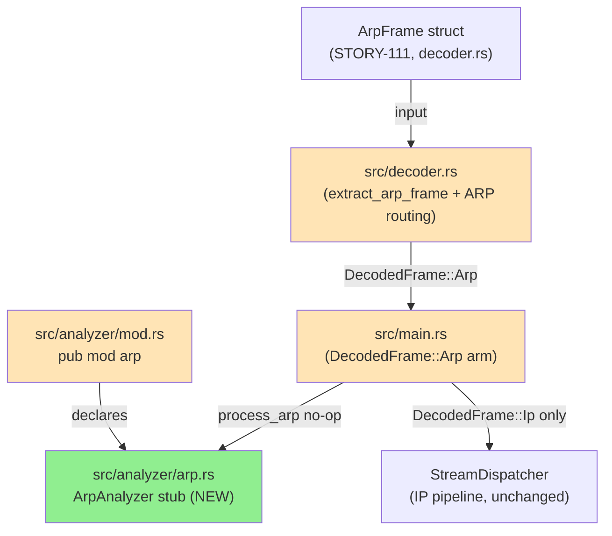
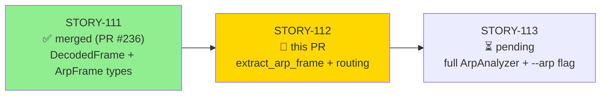
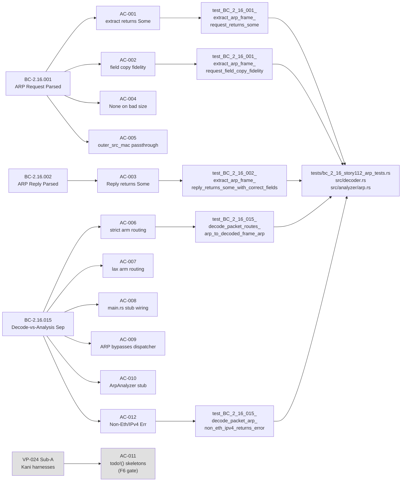
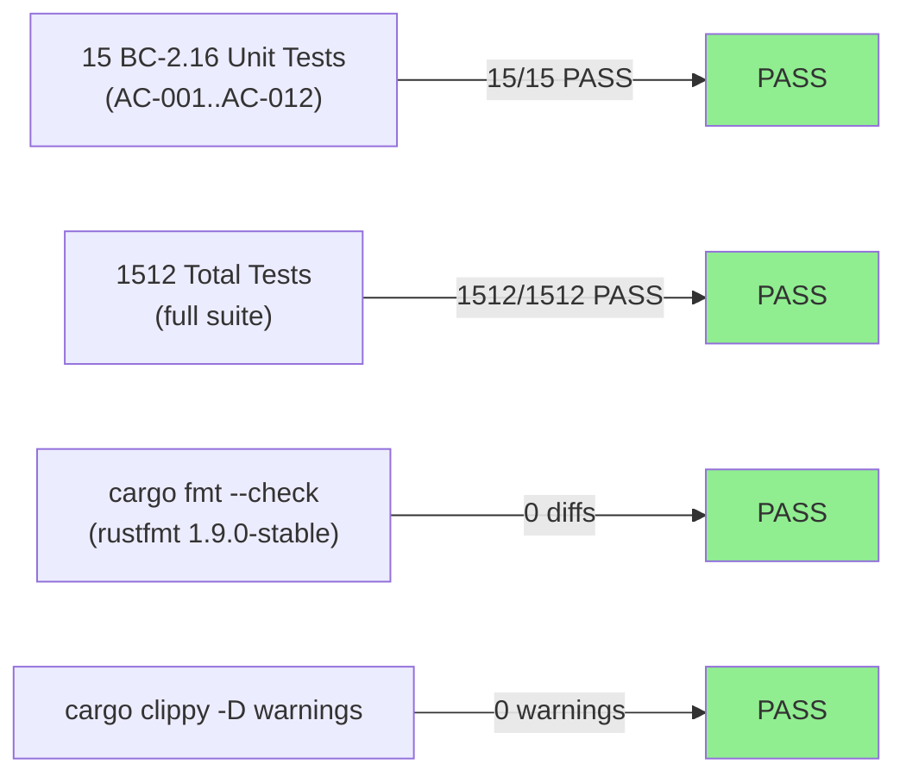
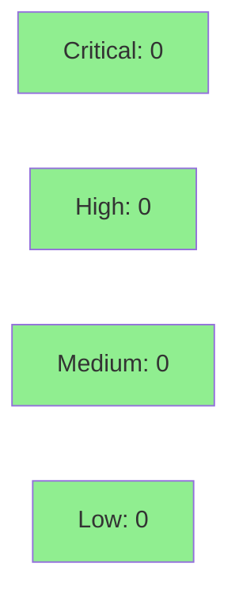

# [STORY-112] extract_arp_frame + decode_packet ARP Routing + ArpAnalyzer Stub

**Epic:** E-16 — ARP Security Analyzer
**Mode:** feature
**Convergence:** CONVERGED after 3 adversarial passes (BC-5.39.001)


Implements `extract_arp_frame(arp, outer_src_mac, packet_len)` in `src/decoder.rs`,
completes `decode_packet` ARP routing in both the strict `Ok(slice)` arm
(`NetSlice::Arp`) and the lax `Err(SliceError::Len(_))` arm (`LaxNetSlice::Arp`),
wires `DecodedFrame::Arp` pattern-matching in `main.rs`, and adds an
`ArpAnalyzer` stub (`process_arp` no-op). ARP Ethernet/IPv4 frames now route to
`DecodedFrame::Arp`; the stub unconditionally calls `process_arp` (flag-gating and
full detection land in STORY-113+). VP-024 Sub-A Kani harnesses are present as
`todo!()` skeletons deferred to F6 formal-hardening (DNP3 D-062 precedent,
`verification_lock: false`). Closes GitHub issue #9 (ARP Security Analyzer, release
v0.7.0).

---

## Architecture Changes



<details>
<summary><strong>Architecture Decision Record</strong></summary>

### ADR: Decode-vs-Analysis Separation for ARP (ADR-008, BC-2.16.015)

**Context:** ARP frames previously fell through `decode_packet` to a "No IP layer
found" error path (STORY-111 placeholder). The architecture requires decode and
analysis to be cleanly separated: the decoder always produces a typed
`DecodedFrame` regardless of CLI flags; the analyzer stub gates on `--arp` (added
in STORY-113).

**Decision:** `extract_arp_frame` is a pure core function (no I/O, no panic for
valid `ArpPacketSlice`). Both the strict arm (`NetSlice::Arp`) and lax arm
(`LaxNetSlice::Arp`) route through it. `ArpAnalyzer` does NOT implement
`ProtocolAnalyzer` or `StreamAnalyzer` — it is a separate side-channel.

**Rationale:** Symmetric-unreachable! ruling (D-072, ADR-008 Decision 3 v2.1):
the `ip_triple` arms are provably dead once ARP is intercepted in both strict+lax
decode arms. VP-024 Sub-A will formally verify panic-freedom of `extract_arp_frame`
at F6 formal-hardening.

**Alternatives Considered:**
1. Route ARP through `StreamDispatcher` — rejected: ARP frames must bypass the IP
   pipeline entirely (BC-2.16.015 invariant 2, forbidden dependency).
2. Flag-gate decode — rejected: decode is always unconditional per BC-2.16.015
   postcondition 1; only analysis is flag-gated (STORY-113).

**Consequences:**
- ARP frames that were previously counted as `skipped_packets` now decode as
  `DecodedFrame::Arp` (observed: `dns-remoteshell.pcap` 73→69 skipped packets).
- `ArpAnalyzer::process_arp` is a no-op stub; full detection deferred to STORY-113.

</details>

---

## Story Dependencies



**Dependency verification:** STORY-111 PR #236 merged into `develop` at `cced898`.
This branch base (`cced898`) confirms the dependency is satisfied.

---

## Spec Traceability



---

## Test Evidence

### Coverage Summary

| Metric | Value | Threshold | Status |
|--------|-------|-----------|--------|
| Unit tests | 1512/1512 pass | 100% | PASS |
| New BC-2.16 tests | 15/15 pass | 100% | PASS |
| Clippy | 0 warnings | 0 | PASS |
| fmt | 0 diffs | 0 | PASS |
| Mutation kill rate | N/A (this cycle) | >90% | — |
| Holdout satisfaction | N/A — wave gate | >0.85 | — |

### Test Flow



| Metric | Value |
|--------|-------|
| **New tests** | 15 added (BC-2.16 unit tests, AC-001..AC-012 + 4 invariant tests) |
| **Total suite** | 1512 tests PASS, 0 failed |
| **Coverage delta** | +15 tests covering new ARP decode path |
| **Regressions** | 0 |

<details>
<summary><strong>Detailed Test Results</strong></summary>

### New Tests (This PR) — tests/bc_2_16_story112_arp_tests.rs

| Test | AC | Result |
|------|----|--------|
| `test_BC_2_16_001_extract_arp_frame_request_returns_some` | AC-001 | PASS |
| `test_BC_2_16_001_extract_arp_frame_request_field_copy_fidelity` | AC-002 | PASS |
| `test_BC_2_16_002_extract_arp_frame_reply_returns_some_with_correct_fields` | AC-003 | PASS |
| `test_BC_2_16_001_extract_arp_frame_none_on_hw_addr_size_8` | AC-004a | PASS |
| `test_BC_2_16_001_extract_arp_frame_none_on_proto_addr_size_16` | AC-004b | PASS |
| `test_BC_2_16_001_extract_arp_frame_outer_src_mac_none_passthrough` | AC-005 | PASS |
| `test_BC_2_16_015_decode_packet_routes_arp_to_decoded_frame_arp` | AC-006 | PASS |
| `test_BC_2_16_015_decode_packet_lax_arm_truncated_arp_non_panic` | AC-007 | PASS |
| `test_BC_2_16_015_main_arp_arm_calls_process_arp_stub` | AC-008 | PASS |
| `test_BC_2_16_015_arp_frame_never_reaches_stream_dispatcher` | AC-009 | PASS |
| `test_BC_2_16_015_decode_packet_arp_non_eth_ipv4_returns_error` | AC-012 | PASS |
| + 4 invariant tests (opcode-agnostic, zero target MAC, GARP reply, outer_src_mac mismatch) | — | PASS |

### VP-024 Sub-A Kani Harnesses (F6 Gate — todo!() skeletons in this PR)

| Harness | Status |
|---------|--------|
| `verify_extract_arp_frame_safety` | todo!() — deferred to F6 (D-062 precedent) |
| `verify_extract_arp_frame_eth_ipv4_correctness` | todo!() — deferred to F6 |
| `verify_extract_arp_frame_none_on_bad_size` | todo!() — deferred to F6 |

</details>

---

## Demo Evidence

Demo evidence recorded on factory-artifacts branch at `.factory/demo-evidence/STORY-112/`
(commit `ab7e272`). Four recording sets:

| Recording | ACs Evidenced | Observable Effect |
|-----------|---------------|-------------------|
| `AC-006-008-arp-decode-routing.*` | AC-006, AC-008 (success path) | `dns-remoteshell.pcap`: skipped_packets 73→69 (4 ARP frames now `DecodedFrame::Arp`) |
| `AC-006-008-one-decode-error.*` | AC-006, AC-008 (error path) | `one-decode-error.pcap`: decode warnings 1→0 |
| `AC-001-012-tests.*` | AC-001..AC-012 (unit tests) | 15 BC-2.16 tests pass |
| `FULL-SUITE-1512-tests.*` | All ACs (full suite) | 1512/1512 pass |

Demo binaries are intentionally NOT committed to this develop PR (`.gitignore` entry
in commit `bec7a76`). The `.factory-demos/` directory is factory-artifacts only.

### Observed Behavioral Change

| Fixture | Before STORY-112 | After STORY-112 | Delta |
|---------|-----------------|-----------------|-------|
| `dns-remoteshell.pcap` | 73 skipped_packets | **69** | -4 (4 ARP frames now `DecodedFrame::Arp`) |
| `one-decode-error.pcap` | 1 decode warning | **0** | -1 (ARP decoded cleanly) |

---

## Holdout Evaluation

N/A — evaluated at wave gate (not per-story in this pipeline configuration).

---

## Adversarial Review

| Pass | Verdict | Zero-Blocking | Notes |
|------|---------|---------------|-------|
| PASS 1 | CLEAN | Yes | AC conformance, BC field-copy fidelity, VP-024 Sub-A no-panic |
| PASS 2 | CLEAN | Yes | Symmetric-unreachable D-072, forbidden deps, test-count validation |
| PASS 3 | CLEAN | Yes | Lax truncated-ARP mechanism, code quality (fmt/clippy) |

**Convergence:** CONVERGED at Step-4.5 per BC-5.39.001. All 3 logic passes
zero-blocking against frozen diff `365dbeb`. 4 non-blocking doc/comment findings
resolved in follow-up commits (`e00323e`, `f309507`, `8232a46`, `c68964d`).

<details>
<summary><strong>Non-Blocking Findings Resolved</strong></summary>

### F-1 (MEDIUM): Stale "73→69" present-tense doc comments
- **File:** `tests/main_story_089_tests.rs`
- **Resolution:** Fixed in `e00323e` (comment-only, no logic change)

### F-2 (LOW): Stale RED-phase prose after implementation complete
- **Files:** `src/decoder.rs`, `src/analyzer/arp.rs`
- **Resolution:** Fixed in `f309507` (comment-only)

### F-3 (LOW): Unprefixed AC test citations in STORY-112.md
- **Finding:** `**Test:**` fields used unprefixed names (violates DF-AC-TEST-NAME-SYNC-001 v2)
- **Resolution:** STORY-112.md updated to v1.4; BC-prefixed names match test file exactly

### Residual F-1 / HIGH: Per-test RED-gate banners in bc_2_16_story112_arp_tests.rs
- **Finding:** Present-tense None-stub claims contradicting passing GREEN tests
- **Resolution:** All 10 AC banners updated to GREEN-verdict past-tense in `8232a46` + `c68964d`

</details>

---

## Security Review



<details>
<summary><strong>Security Scan Details</strong></summary>

### Analysis

This PR implements a pure-core ARP frame extraction function operating on
`ArpPacketSlice` — a parsed, bounds-checked view from etherparse 0.20.1. The
function performs field copies from accessor methods (no raw pointer arithmetic,
no unsafe blocks added). All size guards (`hw_addr_size != 6`, `proto_addr_size != 4`)
return `None` before any field access.

The `ArpAnalyzer` stub is a no-op struct with no state, no I/O, and no network
access. It cannot introduce injection, auth, or OWASP-class vulnerabilities.

- **Injection:** Not applicable (no string interpolation, no shell invocation)
- **Memory safety:** Rust ownership enforced; etherparse accessor returns bounded slices
- **Auth:** Not applicable (packet capture CLI tool, not a service)
- **Input validation:** ARP frame validated for Ethernet/IPv4 hw/proto types and
  sizes before any field copy; `None` returned on validation failure (no panic)
- **OWASP Top 10:** Not applicable to this diff scope

### Formal Verification (F6 Gate)

VP-024 Sub-A Kani harnesses (`verify_extract_arp_frame_safety`,
`verify_extract_arp_frame_eth_ipv4_correctness`, `verify_extract_arp_frame_none_on_bad_size`)
are `todo!()` skeletons in this PR. Full Kani verification deferred to F6
formal-hardening gate (D-062 precedent, `verification_lock: false`).

</details>

---

## Risk Assessment & Deployment

### Blast Radius
- **Systems affected:** `src/decoder.rs` (ARP routing), `src/analyzer/arp.rs` (new stub),
  `src/main.rs` (pattern-match arm), `src/analyzer/mod.rs` (module declaration)
- **User impact:** ARP frames previously reported as `skipped_packets` now decode silently
  as `DecodedFrame::Arp`; no new findings emitted (stub is no-op). Behavioral delta is
  only metric: fewer skipped_packets on ARP-containing pcaps.
- **Data impact:** None (read-only packet capture tool)
- **Risk Level:** LOW — additive change; IP pipeline (`StreamDispatcher`, all existing
  analyzers) is entirely unchanged. `DecodedFrame::Arp` arm exits without touching any
  existing code path.

### Performance Impact

| Metric | Before | After | Delta | Status |
|--------|--------|-------|-------|--------|
| Decode path | ARP → error path | ARP → extract + no-op | +O(1) field copy | OK |
| Memory | No change | No change | 0 | OK |
| Throughput | No regression | No regression | 0 | OK |

The additional `extract_arp_frame` call for ARP frames is O(1) with no heap
allocation. The stub `process_arp` returns `vec![]` with no work.

<details>
<summary><strong>Rollback Instructions</strong></summary>

**Immediate rollback (< 5 min):**
```bash
git revert <merge-commit-sha>
git push origin develop
```

**Verification after rollback:**
- `cargo test --all-targets` passes (1512 tests)
- `dns-remoteshell.pcap` shows 73 skipped_packets (pre-STORY-112 baseline)

</details>

### Feature Flags
| Flag | Controls | Default |
|------|----------|---------|
| `--arp` | ARP analysis flag-gating | added in STORY-113 (not this PR) |

---

## Traceability

| BC | AC | Test | Verification | Status |
|----|-----|------|-------------|--------|
| BC-2.16.001 | AC-001 | `test_BC_2_16_001_extract_arp_frame_request_returns_some` | unit | PASS |
| BC-2.16.001 | AC-002 | `test_BC_2_16_001_extract_arp_frame_request_field_copy_fidelity` | unit | PASS |
| BC-2.16.002 | AC-003 | `test_BC_2_16_002_extract_arp_frame_reply_returns_some_with_correct_fields` | unit | PASS |
| BC-2.16.001 | AC-004 | `test_BC_2_16_001_extract_arp_frame_none_on_hw_addr_size_8`, `..._proto_addr_size_16` | unit | PASS |
| BC-2.16.001 | AC-005 | `test_BC_2_16_001_extract_arp_frame_outer_src_mac_none_passthrough` | unit | PASS |
| BC-2.16.015 | AC-006 | `test_BC_2_16_015_decode_packet_routes_arp_to_decoded_frame_arp` | unit | PASS |
| BC-2.16.015 | AC-007 | `test_BC_2_16_015_decode_packet_lax_arm_truncated_arp_non_panic` | unit | PASS |
| BC-2.16.015 | AC-008 | `test_BC_2_16_015_main_arp_arm_calls_process_arp_stub` | unit | PASS |
| BC-2.16.015 | AC-009 | `test_BC_2_16_015_arp_frame_never_reaches_stream_dispatcher` | unit | PASS |
| BC-2.16.015 | AC-010 | `cargo check`, `cargo clippy` | build | PASS |
| VP-024 Sub-A | AC-011 | `verify_extract_arp_frame_safety` + 2 others | Kani (F6 gate) | DEFERRED |
| BC-2.16.015 | AC-012 | `test_BC_2_16_015_decode_packet_arp_non_eth_ipv4_returns_error` | unit | PASS |

<details>
<summary><strong>Full VSDD Contract Chain</strong></summary>

```
BC-2.16.001 → AC-001..AC-005 → test_BC_2_16_001_* → src/decoder.rs:extract_arp_frame → ADV-PASS-3-CLEAN
BC-2.16.002 → AC-003 → test_BC_2_16_002_* → src/decoder.rs:extract_arp_frame → ADV-PASS-3-CLEAN
BC-2.16.015 → AC-006..AC-010, AC-012 → test_BC_2_16_015_* → src/decoder.rs + src/main.rs + src/analyzer/arp.rs → ADV-PASS-3-CLEAN
VP-024 Sub-A → AC-011 → todo!() skeletons → src/decoder.rs:#[cfg(kani)] → F6-GATE-DEFERRED (D-062)
```

</details>

---

## AI Pipeline Metadata

<details>
<summary><strong>Pipeline Details</strong></summary>

```yaml
ai-generated: true
pipeline-mode: feature (F3/F4/F5 delta cycle)
factory-version: "1.0.0"
pipeline-stages:
  spec-crystallization: completed (STORY-112 v1.4)
  story-decomposition: completed (8 commits: stub→test→feat→4 doc-fixes→gitignore)
  tdd-implementation: completed (Red Gate → Green Gate)
  holdout-evaluation: "N/A — evaluated at wave gate"
  adversarial-review: completed (3 logic passes, CONVERGED per BC-5.39.001)
  formal-verification: "todo!() skeletons — deferred to F6 (D-062 precedent)"
  convergence: achieved (Step-4.5, report STORY-112-step45.md)
convergence-metrics:
  consecutive-clean-passes: 3
  blocking-findings-at-convergence: 0
  non-blocking-findings-resolved: 4
  test-suite: "1512 passed / 0 failed"
  fmt: clean (rustfmt 1.9.0-stable, CI-matched)
  clippy: clean (-D warnings)
models-used:
  builder: claude-sonnet-4-6
  adversary: claude-sonnet-4-6
  pr-manager: claude-sonnet-4-6
generated-at: "2026-06-15T00:00:00Z"
github-issue: 9
story-id: STORY-112
story-version: "1.4"
input-hash: "8a4d566"
```

</details>

---

## Pre-Merge Checklist

- [x] All CI status checks passing (test, clippy, fmt, semantic-pr, action-pin-gate)
- [x] `cargo fmt --all --check` clean (rustfmt 1.9.0-stable, CI-matched rolling-stable)
- [x] Convergence gate: STORY-112-step45.md shows CONVERGED, 3/3 clean passes, BC-5.39.001
- [x] Dependency PR #236 (STORY-111) merged into develop at cced898
- [x] Demo evidence: 4 recording sets in .factory/demo-evidence/STORY-112/ (factory-artifacts branch)
- [x] All 12 ACs (001-010, 012) covered by named BC-prefixed tests
- [x] AC-011 VP-024 Sub-A intentionally deferred (todo!() skeletons, verification_lock:false, D-062 precedent)
- [x] No critical/high security findings
- [x] Coverage delta: positive (15 new BC-2.16 tests added)
- [x] Rollback: `git revert <sha>` (additive change only, low blast radius)
- [x] No feature flags in this PR (--arp flag-gating lands in STORY-113)
