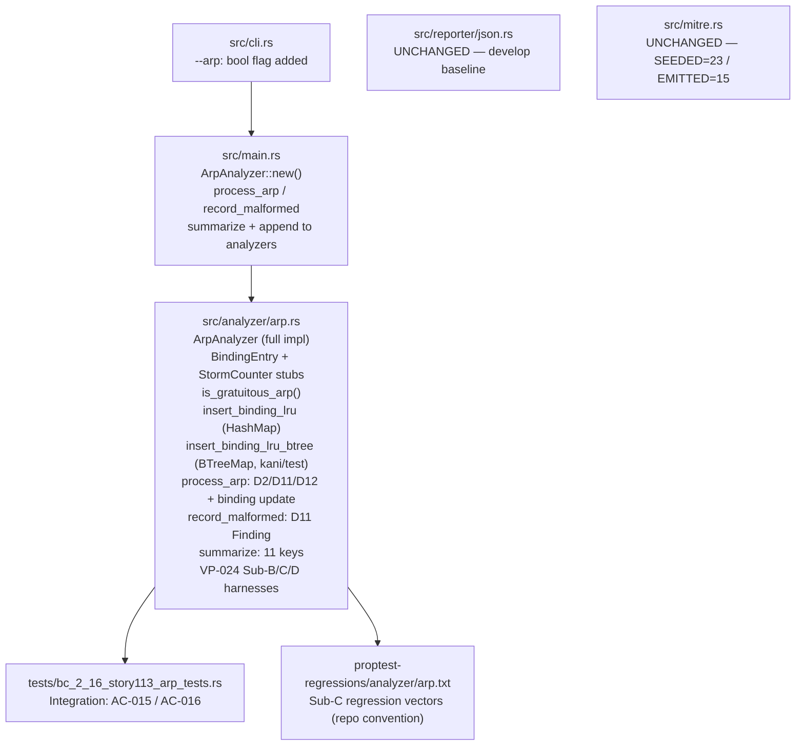
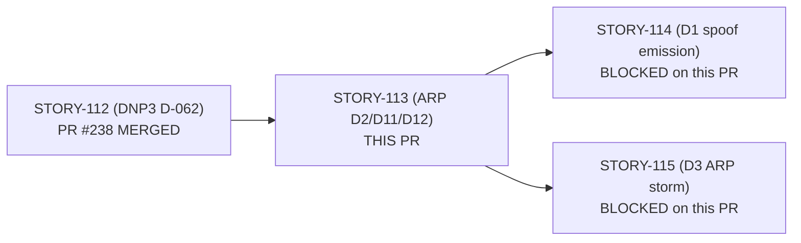
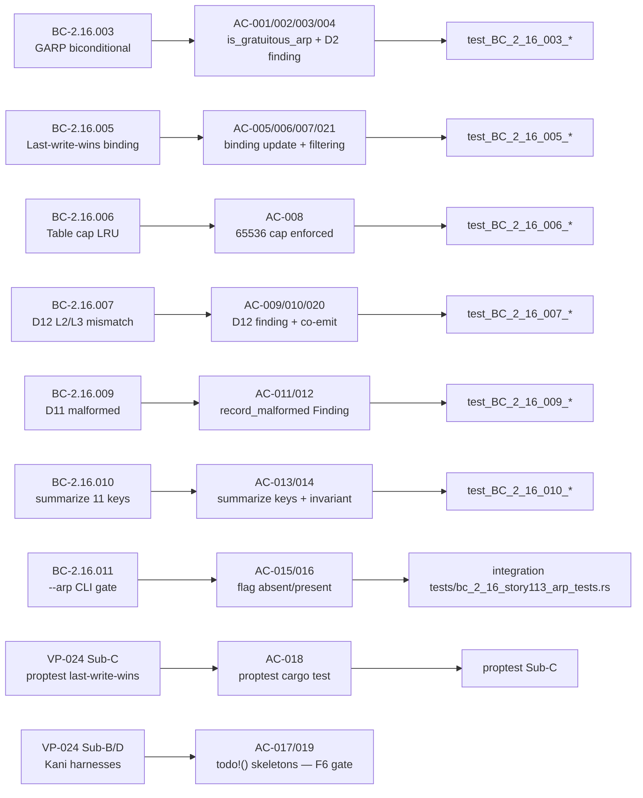

## Summary

Implements the full `ArpAnalyzer` for ICS/OT ARP security analysis: binding table with LRU eviction, Gratuitous ARP detection (D2), malformed-ARP detection (D11), L2/L3 sender-MAC mismatch detection (D12), `summarize()` with all 11 canonical keys, and `--arp` CLI flag gating. Closes #9.

**Scope boundary:** D1 spoof finding emission and MITRE T0830/T1557.002 seeding deferred to STORY-114. `spoof_findings` and `storm_findings` remain 0; `src/mitre.rs` and `src/reporter/json.rs` are unchanged.

## Architecture Changes

## Story Dependencies

## Spec Traceability

## Test Evidence

| Metric | Value |
|--------|-------|
| `cargo test --all-targets` | **1535 passed / 0 failed** |
| `cargo clippy --all-targets -- -D warnings` | Clean |
| `cargo fmt --check` | Clean (verified against rustc 1.96.0 / dtolnay stable) |
| proptest Sub-C (`test_BC_2_16_005_binding_table_last_write_wins`) | PASS at `cargo test` |
| `src/reporter/json.rs` vs develop baseline | **Exact byte-level match** (BC-2.16.010 Inv4 / BC-2.11.001) |
| `src/mitre.rs` SEEDED/EMITTED | 23/15 — **unchanged** (STORY-113 scope boundary) |

**AC Coverage (implemented):** AC-001 through AC-016, AC-018, AC-020, AC-021 — 19 of 21 ACs  
**Deferred (AC-017, AC-019):** VP-024 Sub-B and Sub-D Kani harness bodies are `todo!()` skeletons — deferred to F6 formal-hardening gate per DNP3 D-062 / STORY-112 Sub-A precedent (`verification_lock: false`; non-blocking per Step-4.5 convergence report).

## Demo Evidence

Demo evidence is on the `factory-artifacts` branch (commit `04408b8`) at `.factory/demo-evidence/STORY-113/`. Per design, demo binaries (GIF/WebM) are not included in the develop PR diff.

**Verified gate (from factory-artifacts):**
- `dns-remoteshell.pcap --arp`: 4 frames analyzed, 3 bindings tracked — ARP summary appears under `"analyzers"` key with all 11 keys
- `dns-remoteshell.pcap` (no `--arp` flag): `"analyzers"` array empty — gate verified (BC-2.16.011 AC-015)

## Holdout Evaluation

N/A — evaluated at wave gate.

## Adversarial Review

Step-4.5 convergence: **CONVERGED** (BC-5.39.001 — 3 consecutive clean fresh-context passes on frozen diff `0437be6`).

| Pass | Dispatch SHA | Verdict |
|------|-------------|---------|
| 1 | `ad044181` | CLEAN — ZERO FINDINGS |
| 2 | `ae1383274` | CLEAN — ZERO FINDINGS |
| 3 | `ad2223ab` | CLEAN — ZERO FINDINGS |

**Findings raised and resolved prior to convergence:**
- **F-113-01 (HIGH):** `record_malformed` incremented counter but did not emit a `Finding` object. Fixed in `aa25f88`; AC-011 test strengthened to assert `Finding` shape in `c87c448`.
- **Inverted-TDD reporter alias (HIGH):** `json.rs` had a spurious `"analyzer_summaries"` conditional added to satisfy a mis-named test. Reverted in `601eeb6`; `json.rs` restored to exact develop baseline in `6aa9835`.
- **O-4 doc drift (LOW):** Stale skeleton/Red-Gate doc-comments corrected in `0437be6`.

## Security Review

No new network-facing attack surface introduced. `ArpAnalyzer` is a stateful parser (pure core) — it reads decoded `ArpFrame` structs from the dispatcher and writes findings to `Vec<Finding>`. No I/O, no unsafe, no external calls.

**Binding table:** `HashMap<[u8;4], BindingEntry>` capped at `MAX_ARP_BINDINGS = 65_536` with LRU eviction — DoS via table exhaustion is mitigated. VP-024 Sub-D Kani harness verifies the cap invariant (F6 gate, `todo!()` body currently; BTreeMap surrogate in `#[cfg(any(kani, test))]` is present).

**Input validation:** Zero and broadcast sender IPs filtered before table insertion (AC-007). No `unsafe` code added. No new dependencies added.

OWASP/ICS: No injection vectors. No authentication changes. No new external crate surface.

## Risk Assessment

| Dimension | Assessment |
|-----------|-----------|
| Blast radius | Confined to `--arp` flag execution path; no change to default non-ARP analysis |
| `src/reporter/json.rs` | **Unchanged** — output schema preserved (BC-2.11.001) |
| `src/mitre.rs` | **Unchanged** — SEEDED/EMITTED counts at develop baseline |
| Performance | `HashMap` with cap-enforced LRU eviction; O(n) worst-case scan for LRU evict at cap boundary; n <= 65536. Acceptable for batch PCAP analysis. |
| Breaking changes | None — `--arp` flag is additive; existing CLI behavior unchanged |

## AI Pipeline Metadata

| Field | Value |
|-------|-------|
| Pipeline mode | VSDD Factory F3 TDD (strict) |
| Story phase | F3 implementation → F4 adversarial convergence → PR |
| Worktree | `/Users/zious/Documents/GITHUB/wirerust/.worktrees/STORY-113` |
| Branch | `worktree-issue-9-story-113-arp-analyzer-full` |
| Base develop SHA | `10e4472` |
| Worktree HEAD | `0437be6` |
| Convergence policy | BC-5.39.001 — 3 clean adversarial passes |
| Model | claude-sonnet-4-6 |

## Pre-Merge Checklist

- [x] PR description matches actual diff (5 files: `src/analyzer/arp.rs`, `src/cli.rs`, `src/main.rs`, `tests/bc_2_16_story113_arp_tests.rs`, `proptest-regressions/analyzer/arp.txt`)
- [x] Leak check: no demo/binary files in diff (`git diff --name-only 10e4472..HEAD | grep -iE '\.(gif|webm|tape|mp4|cast|png)$|demo|\.factory'` returned empty)
- [x] `cargo fmt --check` clean (verified post `rustup update stable`)
- [x] `cargo test --all-targets` 1535/0 at HEAD `0437be6`
- [x] `cargo clippy --all-targets -- -D warnings` clean
- [x] `src/reporter/json.rs` unchanged from develop baseline
- [x] `src/mitre.rs` unchanged from develop baseline
- [x] Convergence gate: STORY-113-step45.md — CONVERGED, BC-5.39.001, 3 clean passes (DF-CONVERGENCE-BEFORE-MERGE-001)
- [x] Dependency PR STORY-112 (#238) merged on develop at `10e4472`
- [x] Semantic PR title: `feat(arp): ...` (allowed type per CLAUDE.md)
- [ ] All CI checks passing (pending)
- [ ] pr-reviewer APPROVE verdict (pending)
- [ ] Merge executed
