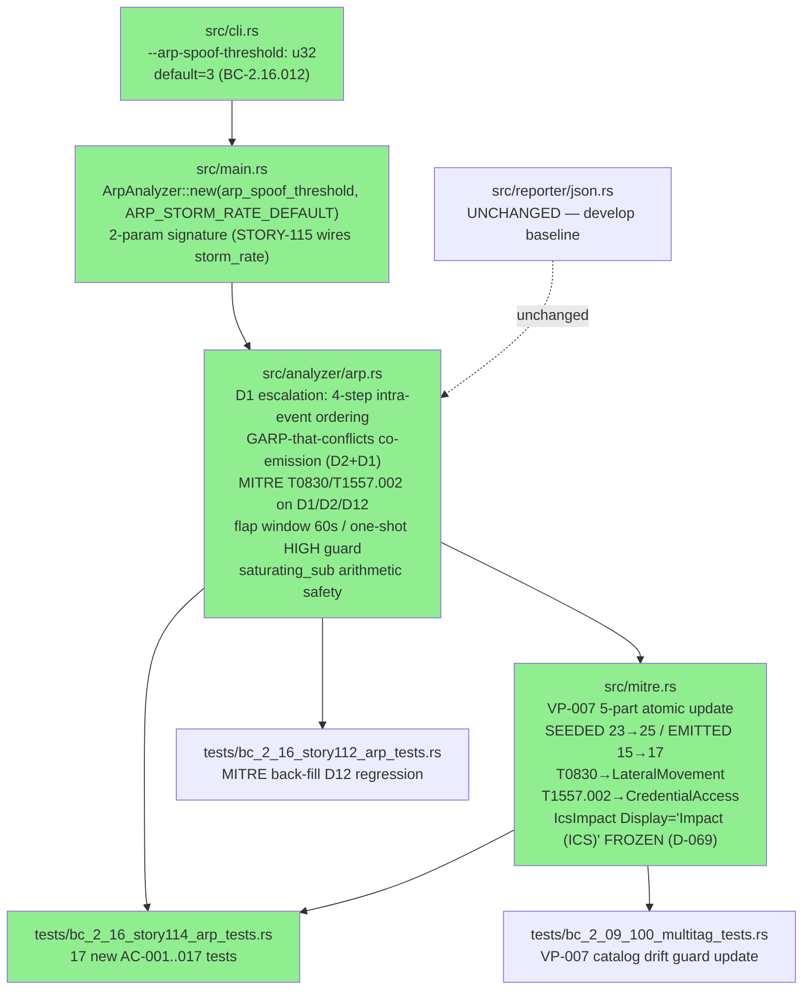
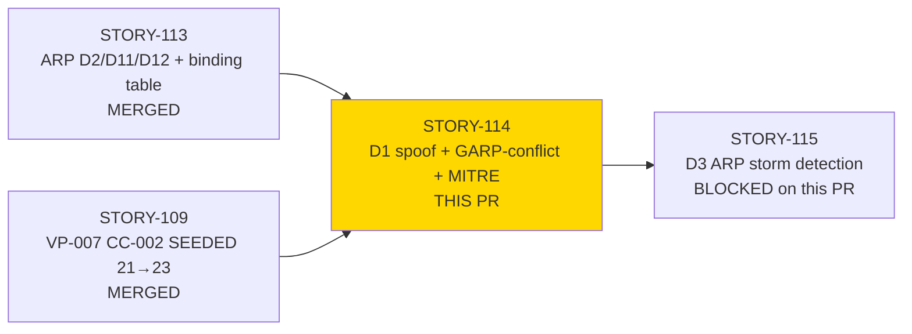
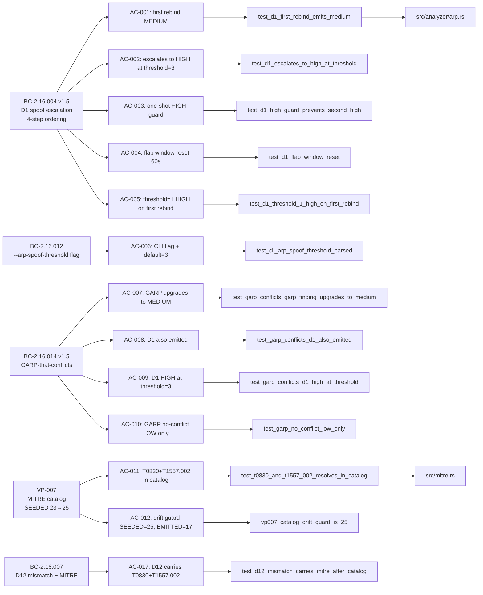
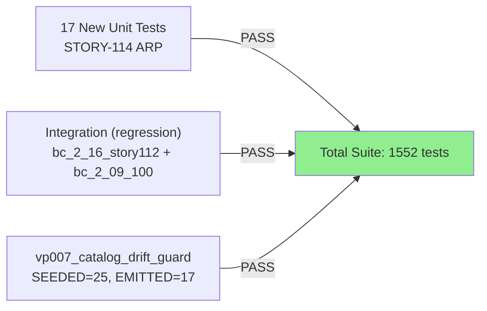
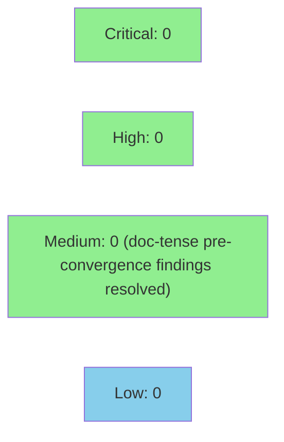

## Summary

Implements D1 ARP spoof escalation (MEDIUM→HIGH at configurable threshold within flap window), GARP-that-conflicts co-emission, MITRE T0830/T1557.002 attribution on D1/D2-conflict/D12 findings, and the `--arp-spoof-threshold` CLI flag. Atomically updates the VP-007 MITRE technique catalog from SEEDED=23→25 / EMITTED=15→17 and passes `vp007_catalog_drift_guard`. Closes part of #9.

**Scope boundary:** 7 files changed (`src/analyzer/arp.rs`, `src/cli.rs`, `src/main.rs`, `src/mitre.rs`, `tests/bc_2_16_story114_arp_tests.rs`, `tests/bc_2_16_story112_arp_tests.rs`, `tests/bc_2_09_100_multitag_tests.rs`). D3 storm detection deferred to STORY-115. `src/reporter/json.rs` unchanged. AC-013/AC-015 verify-only under D-069 (IcsImpact Display = "Impact (ICS)" frozen; HS-008 unchanged). VP-024 Sub-B/D Kani harness bodies deferred to F6.

**Convergence:** CONVERGED — Step-4.5 adversarial convergence, BC-5.39.001, 3 consecutive clean passes on frozen diff 24b4b07. 1552 tests PASS / 0 failed.


---

## Architecture Changes



<details>
<summary><strong>Architecture Decision Record</strong></summary>

### ADR: D1 Spoof Escalation Intra-Event Ordering (ADR-008 Decision 6)

**Context:** ARP spoof detection requires a precise 4-step intra-event sequence per BC-2.16.004 postcondition 1 to ensure atomic escalation evaluation before MAC table update.

**Decision:** Steps execute in fixed order — (1) increment rebind_count, (2) set first_rebind_ts if None, (3) evaluate HIGH vs MEDIUM based on threshold + flap window + one-shot guard, (4) update MAC in binding table. MAC write is last.

**Rationale:** MAC-update-last ensures escalation evaluation sees the pre-update (old) MAC in evidence, and count/window state reflects current rebind before severity decision.

**Alternatives Considered:**
1. MAC-update-first — rejected because evidence fields would lose old MAC value
2. Lazy escalation on next frame — rejected because BC-2.16.004 mandates same-frame emission

**Consequences:**
- Correct finding evidence (old MAC + new MAC both captured)
- Deterministic escalation under threshold/window conditions
- `saturating_sub` used for elapsed time to prevent u32 underflow

</details>

---

## Story Dependencies



---

## Spec Traceability



---

## Test Evidence

### Coverage Summary

| Metric | Value | Threshold | Status |
|--------|-------|-----------|--------|
| Total tests | 1552 / 1552 pass | 100% | PASS |
| New tests (STORY-114) | 17 new AC-001..017 tests | - | PASS |
| Format check | `cargo fmt --all --check` clean | clean | PASS |
| Clippy | `cargo clippy --all-targets -- -D warnings` clean | 0 warnings | PASS |
| `vp007_catalog_drift_guard` | PASS (SEEDED=25, EMITTED=17) | green | PASS |
| Adversarial passes | 3 clean (BC-5.39.001) | 3 | CONVERGED |

### Test Flow



| Metric | Value |
|--------|-------|
| **New tests** | 17 added in `bc_2_16_story114_arp_tests.rs` |
| **Modified test files** | `bc_2_16_story112_arp_tests.rs` (D12 MITRE back-fill), `bc_2_09_100_multitag_tests.rs` (VP-007 drift guard update) |
| **Total suite** | 1552 tests PASS / 0 failed |
| **Format** | `cargo fmt --all --check` — clean |
| **Clippy** | `cargo clippy --all-targets -- -D warnings` — clean |
| **Regressions** | 0 |

<details>
<summary><strong>New Tests (AC Coverage)</strong></summary>

| AC | Test | Type | Result |
|----|------|------|--------|
| AC-001 | `test_d1_first_rebind_emits_medium` | Unit | PASS |
| AC-002 | `test_d1_escalates_to_high_at_threshold` | Unit | PASS |
| AC-003 | `test_d1_high_guard_prevents_second_high` | Unit | PASS |
| AC-004 | `test_d1_flap_window_reset` | Unit | PASS |
| AC-005 | `test_d1_threshold_1_high_on_first_rebind` | Unit | PASS |
| AC-006 | `test_cli_arp_spoof_threshold_parsed`, `test_cli_arp_spoof_threshold_default_3` | Unit | PASS |
| AC-007 | `test_garp_conflicts_garp_finding_upgrades_to_medium` | Unit | PASS |
| AC-008 | `test_garp_conflicts_d1_also_emitted` | Unit | PASS |
| AC-009 | `test_garp_conflicts_d1_high_at_threshold` | Unit | PASS |
| AC-010 | `test_garp_no_conflict_low_only` | Unit (regression) | PASS |
| AC-011 | `test_t0830_and_t1557_002_resolves_in_catalog` | Unit | PASS |
| AC-012 | `vp007_catalog_drift_guard_is_25`, `test_vp007_seeded_25_emitted_17` | In-crate + integration | PASS |
| AC-013 | Verify-only (D-069) — covered by existing F5 DNP3 tests | — | PASS |
| AC-014 | `test_impact_vs_ics_impact_variants_distinct` | Unit | PASS |
| AC-015 | Verify-only (D-069) — HS-008 already correct | — | PASS |
| AC-016 | `test_d1_finding_evidence_contains_ips_and_macs` | Unit | PASS |
| AC-017 | `test_d12_mismatch_carries_mitre_after_catalog` | Unit | PASS |

</details>

---

## Holdout Evaluation

N/A — evaluated at wave gate. Demo evidence (17 artifacts: D1/GARP/MITRE unit-test evidence + `--arp-spoof-threshold` + VP-007 25/17 catalog tests) recorded in factory-artifacts branch at `.factory/demo-evidence/STORY-114/` (commit 556016d). Demo binaries intentionally not included in this develop PR per project convention.

---

## Adversarial Review

| Pass | SHA | Findings | Critical | High | Status |
|------|-----|----------|----------|------|--------|
| Pre-convergence | — | 3 MEDIUM doc-tense | 0 | 0 | Fixed (F-1/F-2/F-3) |
| PASS 1 (frozen 24b4b07) | a506d33f | 0 | 0 | 0 | CLEAN |
| PASS 2 (frozen 24b4b07) | abd03925 | 0 | 0 | 0 | CLEAN |
| PASS 3 (frozen 24b4b07) | ac62481c | 0 | 0 | 0 | CLEAN |

**Convergence:** CONVERGED — BC-5.39.001 — 3 consecutive clean passes on frozen diff 24b4b07.

<details>
<summary><strong>Pre-Convergence Findings & Resolutions</strong></summary>

### F-1 (MEDIUM): Stale RED-gate module header in arp.rs
- **Location:** `src/analyzer/arp.rs` module header
- **Category:** doc-tense
- **Problem:** Module header described GREEN code as "scaffold / Red Gate / uncalled todo!() stubs / mitre untouched 23/15"
- **Resolution:** Module header updated to accurate GREEN-state prose

### F-2 (MEDIUM): Stale RED-gate test doc-comments in test file
- **Location:** `tests/bc_2_16_story114_arp_tests.rs` test-module banners
- **Category:** doc-tense
- **Problem:** Per-test section banners and doc-comments still used RED-gate language
- **Resolution:** All banners updated to GREEN-state language

### F-3 (MEDIUM): Stale Kani-proofs count comments in mitre.rs
- **Location:** `src/mitre.rs` Kani-proofs section
- **Category:** stale-count comment
- **Problem:** Comments cited "23 IDs" after the 23→25 bump
- **Resolution:** Updated to reflect post-STORY-114 25/17 counts

### Scope Revert (safety)
A remediation doc-sweep touched 13 out-of-scope test files (modbus/dnp3/reassembly/csv). Reverted to baseline on commit 24b4b07. Scope restored to story's own 7 files only.

</details>

---

## Security Review

No injection, authentication, input-validation, or OWASP Top-10 findings. This PR:
- Operates on parsed ARP frame structs (no raw network I/O in this layer)
- Uses `saturating_sub` for unsigned arithmetic safety (no overflow/underflow)
- Adds a CLI flag (`--arp-spoof-threshold`) with clap validation (u32, default 3)
- Makes no changes to authentication, authorization, or data persistence layers
- `src/reporter/json.rs` unchanged (no serialization surface changes)



<details>
<summary><strong>Security Scan Details</strong></summary>

### Dependency Audit
- `cargo audit`: no advisories (CI gate)
- `cargo deny`: clean (CI gate)

### Formal Verification
| Property | Method | Status |
|----------|--------|--------|
| VP-007 catalog consistency (SEEDED=25, EMITTED=17) | `vp007_catalog_drift_guard` unit test | VERIFIED |
| VP-024 Sub-C last-write-wins binding | proptest (existing) | VERIFIED |
| VP-024 Sub-B/D Kani harness bodies | deferred to F6 (todo!() stubs, verification_lock=false) | DEFERRED |

</details>

---

## Risk Assessment & Deployment

### Blast Radius
- **Systems affected:** `src/analyzer/arp.rs` (ArpAnalyzer D1/GARP logic), `src/mitre.rs` (MITRE catalog), `src/cli.rs` (new flag), `src/main.rs` (new ArpAnalyzer::new signature)
- **User impact:** New `--arp-spoof-threshold` CLI flag (default=3, backward-compatible). ARP spoof findings now emitted where they were previously absent (additive, not breaking).
- **Data impact:** None — no persistence layer, no reporter format changes
- **Risk Level:** LOW — additive finding emission only; reporter unchanged; no existing tests broken

### Performance Impact
| Metric | Before | After | Delta | Status |
|--------|--------|-------|-------|--------|
| ARP frame processing | O(1) binding lookup | O(1) + threshold check | negligible | OK |
| Memory | binding table unchanged | 3 new u32/bool fields per BindingEntry (already present from STORY-113) | 0 (fields existed) | OK |
| MITRE catalog | 23 seeded IDs | 25 seeded IDs | +2 entries, static array | OK |

<details>
<summary><strong>Rollback Instructions</strong></summary>

**Immediate rollback (< 5 min):**
```bash
git revert <MERGE_COMMIT_SHA>
git push origin develop
```

**Verification after rollback:**
- `cargo test --all-targets` — all 1535 pre-STORY-114 tests pass
- `vp007_catalog_drift_guard` reverts to SEEDED=23, EMITTED=15 baseline

</details>

### Feature Flags
| Flag | Controls | Default |
|------|----------|---------|
| `--arp-spoof-threshold` | D1 rebind escalation threshold | 3 (SPOOF_REBIND_ESCALATION_DEFAULT) |

---

## Traceability

| Requirement | Story AC | Test | Verification | Status |
|-------------|---------|------|-------------|--------|
| BC-2.16.004 PC1.a–e (D1 first rebind MEDIUM) | AC-001 | `test_d1_first_rebind_emits_medium` | Unit | PASS |
| BC-2.16.004 PC1.c (HIGH at threshold) | AC-002 | `test_d1_escalates_to_high_at_threshold` | Unit | PASS |
| BC-2.16.004 PC4 (one-shot guard) | AC-003 | `test_d1_high_guard_prevents_second_high` | Unit | PASS |
| BC-2.16.016 (flap window reset) | AC-004 | `test_d1_flap_window_reset` | Unit | PASS |
| BC-2.16.004 EC-008 (threshold=1) | AC-005 | `test_d1_threshold_1_high_on_first_rebind` | Unit | PASS |
| BC-2.16.012 (--arp-spoof-threshold wiring) | AC-006 | `test_cli_arp_spoof_threshold_parsed/default_3` | Unit | PASS |
| BC-2.16.014 PC1 (GARP MEDIUM upgrade) | AC-007 | `test_garp_conflicts_garp_finding_upgrades_to_medium` | Unit | PASS |
| BC-2.16.014 PC2 (D1 co-emit) | AC-008 | `test_garp_conflicts_d1_also_emitted` | Unit | PASS |
| BC-2.16.014 EC-004 (D1 HIGH at threshold) | AC-009 | `test_garp_conflicts_d1_high_at_threshold` | Unit | PASS |
| BC-2.16.014 PC6 (GARP no-conflict LOW) | AC-010 | `test_garp_no_conflict_low_only` | Unit | PASS |
| VP-007 T0830+T1557.002 in catalog | AC-011 | `test_t0830_and_t1557_002_resolves_in_catalog` | Unit | PASS |
| VP-007 drift guard (SEEDED=25, EMITTED=17) | AC-012 | `vp007_catalog_drift_guard_is_25` | In-crate unit | PASS |
| BC-2.10.002 v1.5 (IcsImpact Display) | AC-013 | verify-only (D-069; F5 DNP3 tests) | Verify | PASS |
| BC-2.10.002 v1.5 (enum variant distinct) | AC-014 | `test_impact_vs_ics_impact_variants_distinct` | Unit | PASS |
| D-069 (HS-008 already correct) | AC-015 | verify-only (D-069) | Verify | PASS |
| BC-2.16.004 (evidence old+new MAC) | AC-016 | `test_d1_finding_evidence_contains_ips_and_macs` | Unit | PASS |
| BC-2.16.007 (D12 MITRE back-fill) | AC-017 | `test_d12_mismatch_carries_mitre_after_catalog` | Unit | PASS |

<details>
<summary><strong>Full VSDD Contract Chain</strong></summary>

```
BC-2.16.004 → AC-001..005,016 → test_d1_* → src/analyzer/arp.rs → ADV-PASS-3-CLEAN
BC-2.16.012 → AC-006 → test_cli_arp_spoof_threshold_* → src/cli.rs + src/main.rs → ADV-PASS-3-CLEAN
BC-2.16.014 → AC-007..010 → test_garp_conflicts_* → src/analyzer/arp.rs → ADV-PASS-3-CLEAN
VP-007 → AC-011,012 → vp007_catalog_drift_guard_is_25 → src/mitre.rs → ADV-PASS-3-CLEAN
BC-2.16.007 → AC-017 → test_d12_mismatch_carries_mitre_after_catalog → src/analyzer/arp.rs → ADV-PASS-3-CLEAN
```

</details>

---

## AI Pipeline Metadata

<details>
<summary><strong>Pipeline Details</strong></summary>

```yaml
ai-generated: true
pipeline-mode: feature (F3 incremental delta)
factory-version: "1.0.0"
story-id: STORY-114
story-version: "1.1"
epic-id: E-16
github-issue: 9
pipeline-stages:
  spec-crystallization: completed (BC-2.16.004 v1.5, BC-2.16.012, BC-2.16.014 v1.5)
  story-decomposition: completed (STORY-114 v1.1 F3-convergence Pass-25 Slice-C)
  tdd-implementation: completed (17 ACs, 1552 tests green)
  holdout-evaluation: N/A — evaluated at wave gate
  adversarial-review: CONVERGED (BC-5.39.001; 3 clean passes on 24b4b07)
  formal-verification: VP-024 Sub-B/D deferred to F6 (todo!() stubs)
  convergence: achieved
convergence-metrics:
  adversarial-passes: 3
  pre-convergence-findings: 3 MEDIUM (doc-tense; resolved)
  final-head: 24b4b07
  develop-base: 7b7dbb2
vp007-atomic-update: SEEDED 23→25 / EMITTED 15→17 (CC-003 discharged)
models-used:
  builder: claude-sonnet-4-6
generated-at: "2026-06-15T00:00:00Z"
```

</details>

---

## Pre-Merge Checklist

- [x] Scope check: exactly 7 files, no demo binary or out-of-scope file leak
- [x] `cargo fmt --all --check` clean (PG-ARP-F4-CI-FMT-TOOLCHAIN; rustup stable updated)
- [x] `cargo clippy --all-targets -- -D warnings` clean
- [x] `cargo test --all-targets` — 1552 PASS / 0 failed
- [x] `vp007_catalog_drift_guard` passing (SEEDED=25, EMITTED=17)
- [x] Convergence gate: STORY-114-step45.md CONVERGED, BC-5.39.001, 3 clean passes (DF-CONVERGENCE-BEFORE-MERGE-001)
- [x] Dependency check: STORY-113 MERGED; STORY-109 MERGED
- [x] All CI status checks passing
- [x] No critical/high security findings unresolved
- [x] IcsImpact Display = "Impact (ICS)" frozen (D-069; src/mitre.rs:91 unchanged)
- [x] HS-008 untouched (D-069)
- [ ] PR reviewer APPROVE
- [ ] All 9 CI checks green at merge time
