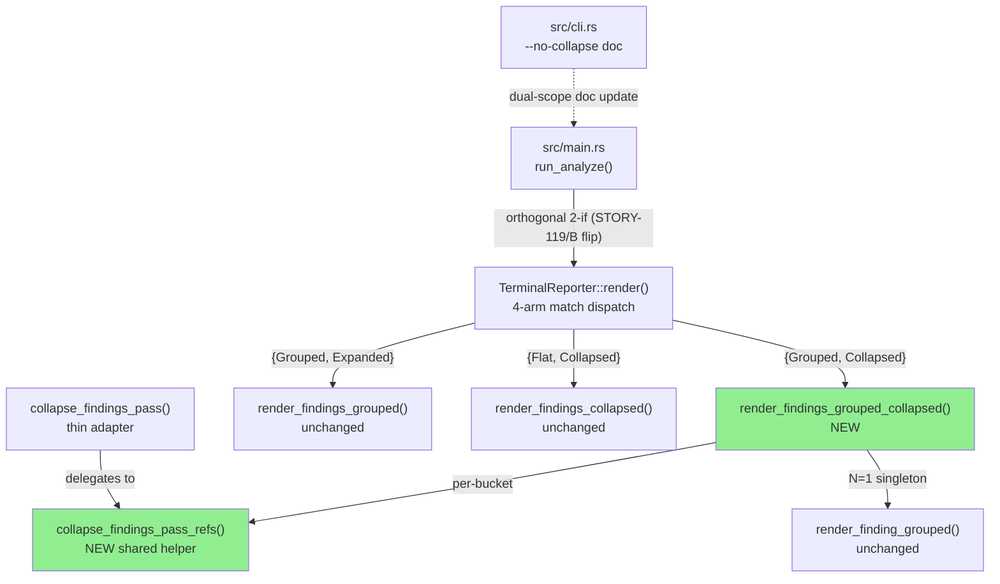
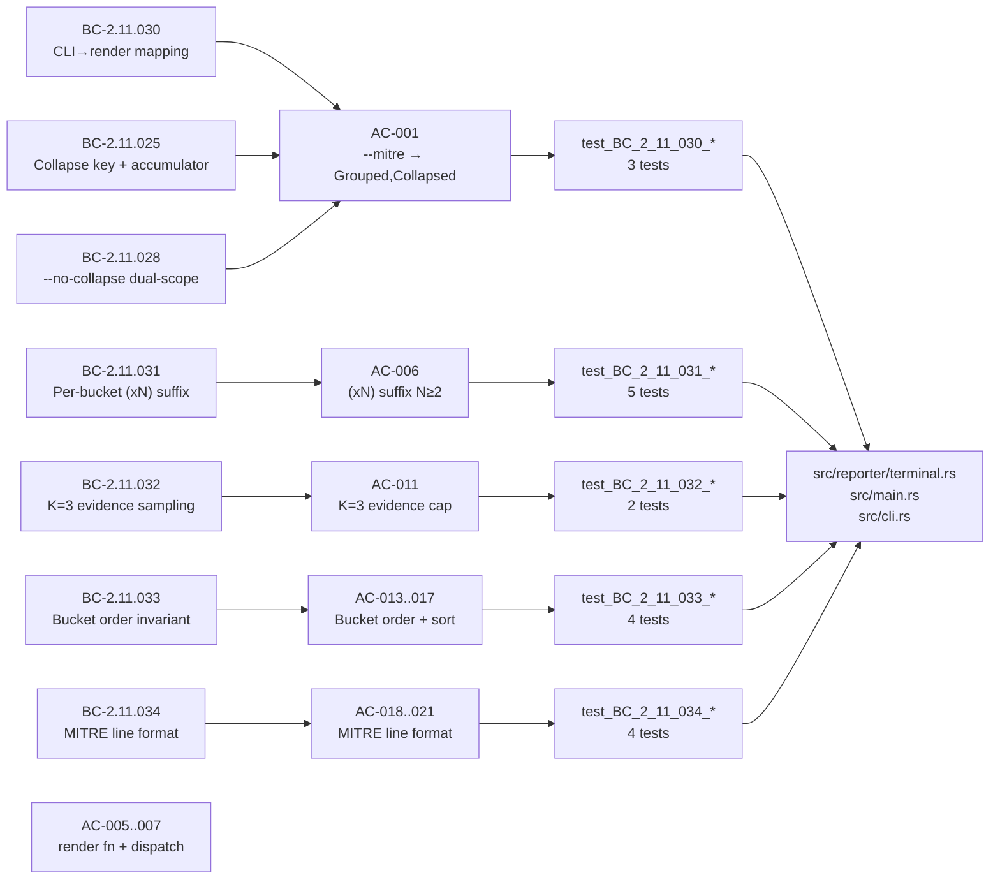
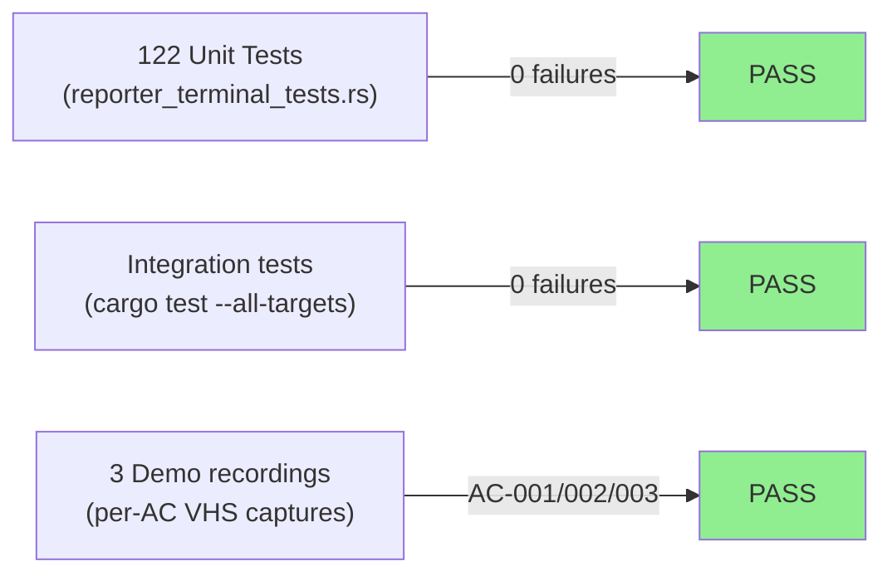
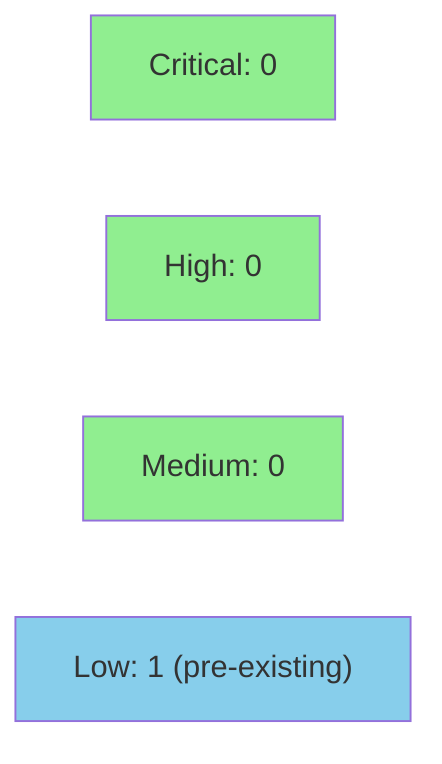

# [STORY-119] Terminal Finding-Collapse — Grouped Mode / `--mitre` (render path + CLI flip)

**Epic:** E-18 — Finding Collapse (issue #259 / issue #62 tail)
**Mode:** feature
**Convergence:** CONVERGED after 3 adversarial passes (F4 per-story gate 3/3 SATISFIED)


Implements `render_findings_grouped_collapsed` — the grouped-mode counterpart of the flat-mode
collapse added in STORY-118. Builds on STORY-122/A's `FindingsRender` struct-of-enums reshape
(merged PR #268). Key changes: (1) new `collapse_findings_pass_refs` shared helper extracted
from `collapse_findings_pass`; (2) `render_findings_grouped_collapsed` with per-tactic-bucket
deduplication, `(xN)` count suffix, K=3 evidence sampling, and em-dash MITRE name expansion
sourced from `group_members[0]`; (3) the `{Grouped, Collapsed}` dispatch arm repointed from the
STORY-122/A TEMPORARY target to the new function; (4) the `--mitre` CLI default flipped to
`{Grouped, Collapsed}` via the orthogonal 2-if construction in `run_analyze`; (5) `--no-collapse`
doc-comment updated for dual-scope (flat + grouped). The `{Grouped, Expanded}` path
(`--mitre --no-collapse`) is byte-identical to v0.8.0 `--mitre` behavior.

Closes #259. Resolves issue #62 tail (grouped-collapse segment).

---

## Architecture Changes



<details>
<summary><strong>Architecture Decision Record</strong></summary>

### ADR: Collapse-API Shape (ADR-0003 "Collapse-API Shape" subsection)

**Context:** Flat-mode collapse (`render_findings_collapsed`) uses `collapse_findings_pass(&[Finding])`.
Grouped-mode collapse applies collapse independently per tactic bucket, requiring a refs-based variant
that can operate on a `Vec<&Finding>` slice without copying owned data.

**Decision:** Introduce `collapse_findings_pass_refs<'a>(&self, refs: &[&'a Finding]) -> Vec<(CollapseKey, Vec<&'a Finding>)>`
as the shared collapse-logic body. Make `collapse_findings_pass` a thin adapter that collects
`findings.iter().collect()` and delegates. Grouped callers invoke `collapse_findings_pass_refs`
directly, once per bucket slice.

**Rationale:** Avoids duplicating the linear-scan `Vec<(CollapseKey, Vec<&Finding>)>` accumulator
logic. Preserves the flat-mode API surface unchanged. Per-bucket isolation means no cross-bucket
collapse is possible — the grouped caller cannot pass the full global slice by construction.

**Alternatives Considered:**
1. Duplicate the collapse body inline in `render_findings_grouped_collapsed` — rejected because
   it creates drift between flat and grouped collapse semantics.
2. Pass `&[Finding]` by taking ownership / cloning — rejected because it introduces unnecessary
   allocation for a display-layer pure function.

**Consequences:**
- Shared collapse logic tested once at the refs level; both flat and grouped paths exercise it.
- `collapse_findings_pass` adapter body is trivially verifiable by inspection.

</details>

---

## Story Dependencies


All upstream dependencies are merged:
- STORY-120 (FindingsRender enum migration) — merged PR #266
- STORY-122/A (struct-of-enums reshape + 84-site migration) — merged PR #268
- STORY-119/B blocks nothing downstream (`blocks: []`)

---

## Spec Traceability



**BC coverage:** 12/12 BCs covered (BC-2.11.013, 014, 016, 025, 026, 027, 028, 030, 031, 032, 033, 034)

| BC | Version | AC(s) | Test(s) |
|----|---------|-------|---------|
| BC-2.11.013 | v1.15 | AC-013, AC-014 | `test_BC_2_11_033_grouped_collapsed_preserves_bucket_order` |
| BC-2.11.014 | v2.1 | AC-016, AC-017 | `test_BC_2_11_033_first_occurrence_in_sorted_bucket_order` |
| BC-2.11.016 | v1.10 | AC-007, AC-018 | `test_BC_2_11_034_grouped_collapse_mitre_line_em_dash_format` |
| BC-2.11.025 | v1.14 | AC-024, AC-025 | `test_BC_2_11_025_grouped_mode_bypasses_flat_collapse` |
| BC-2.11.026 | v1.14 | AC-008 | `test_BC_2_11_031_grouped_collapse_color_ladder` |
| BC-2.11.027 | v1.8 | AC-011 | `test_BC_2_11_032_evidence_sampling_k3_in_bucket` |
| BC-2.11.028 | v1.10 | AC-002, AC-026 | `test_BC_2_11_028_no_collapse_with_mitre_produces_grouped_expanded` |
| BC-2.11.030 | v1.5 | AC-001..004 | `test_BC_2_11_030_*` (3 tests) |
| BC-2.11.031 | v1.4 | AC-006..010 | `test_BC_2_11_031_*` (5 tests) |
| BC-2.11.032 | v1.5 | AC-011, AC-012 | `test_BC_2_11_032_*` (2 tests) |
| BC-2.11.033 | v1.4 | AC-013..017 | `test_BC_2_11_033_*` (4 tests) |
| BC-2.11.034 | v1.4 | AC-018..021 | `test_BC_2_11_034_*` (4 tests) |

---

## Test Evidence

### Coverage Summary

| Metric | Value | Threshold | Status |
|--------|-------|-----------|--------|
| Total tests | 122/122 pass | 100% | PASS |
| New tests (mod story_119) | 24 new tests | all ACs covered | PASS |
| Regressions | 0 | 0 | PASS |
| Holdout | N/A — evaluated at wave gate | >0.85 | N/A |

### Test Flow



| Metric | Value |
|--------|-------|
| **New tests** | 27 added in `mod story_119` |
| **Total suite** | 122 tests PASS |
| **Regressions** | 0 — all pre-existing test modules pass unchanged |
| **Mutation kill rate** | N/A — not run in F4 per-story cycle |

<details>
<summary><strong>New Tests Added (mod story_119)</strong></summary>

| Test | BC | What it verifies |
|------|----|-----------------|
| `test_BC_2_11_030_mitre_alone_maps_to_grouped_collapsed` | BC-2.11.030 PC-2 | `--mitre` alone → `{Grouped, Collapsed}` |
| `test_BC_2_11_030_mitre_no_collapse_maps_to_grouped_expanded` | BC-2.11.030 PC-3 | `--mitre --no-collapse` → `{Grouped, Expanded}` |
| `test_BC_2_11_030_flat_routing_unchanged` | BC-2.11.030 PC-4,5 | flat routing unchanged |
| `test_BC_2_11_031_grouped_collapse_suffix_format` | BC-2.11.031 PC-1 | N=3 → `(x3)` suffix |
| `test_BC_2_11_031_singleton_no_suffix_in_bucket` | BC-2.11.031 PC-2 | N=1 singleton → no suffix |
| `test_BC_2_11_031_grouped_collapse_color_ladder` | BC-2.11.031 PC-3 | Likely+High → red().bold() |
| `test_BC_2_11_031_suffix_only_on_header_not_mitre_or_evidence` | BC-2.11.031 PC-4 | suffix not on MITRE/evidence lines |
| `test_BC_2_11_031_cross_bucket_suffix_independence` | BC-2.11.031 PC-6 | independent per-bucket counts |
| `test_BC_2_11_032_evidence_sampling_k3_in_bucket` | BC-2.11.032 PC-1 | N=5 → 3 evidence lines |
| `test_BC_2_11_032_evidence_positional_no_slide` | BC-2.11.032 Inv-2 | empty member[0] → no window slide |
| `test_BC_2_11_033_grouped_collapsed_preserves_bucket_order` | BC-2.11.033 PC-1 | bucket order unchanged |
| `test_BC_2_11_033_uncategorized_last_under_grouped_collapse` | BC-2.11.033 PC-3 | Uncategorized last |
| `test_BC_2_11_033_different_buckets_not_cross_collapsed` | BC-2.11.033 Inv-3 | no cross-bucket collapse |
| `test_BC_2_11_033_first_occurrence_in_sorted_bucket_order` | BC-2.11.033 PC-5,6 | sort-then-collapse order |
| `test_BC_2_11_025_distinct_verdict_same_summary_no_merge_in_bucket` | BC-2.11.025 | distinct verdict = no merge |
| `test_BC_2_11_034_grouped_collapse_mitre_line_em_dash_format` | BC-2.11.034 PC-1 | em-dash + name from members[0] |
| `test_BC_2_11_034_unknown_technique_in_grouped_collapse` | BC-2.11.034 PC-1 | unknown ID → `(unknown)` |
| `test_BC_2_11_034_suffix_not_on_mitre_line` | BC-2.11.034 PC-2 | no suffix on MITRE line |
| `test_BC_2_11_034_divergent_mitre_representative_sourcing` | BC-2.11.034 PC-3 | only members[0] MITRE in output |
| `test_BC_2_11_028_no_collapse_with_mitre_produces_grouped_expanded` | BC-2.11.028 PC-4 | N=100 → zero `(xN)` suffixes |
| `test_BC_2_11_031_escape_for_terminal_in_grouped_collapse_path` | VP-012 | escape_for_terminal in grouped-collapse |
| `test_BC_2_11_032_escape_preserved_in_bucket_evidence` | VP-012 | escape in evidence lines |
| `test_BC_2_11_025_grouped_mode_bypasses_flat_collapse` | BC-2.11.025 Inv-5 | per-bucket not global collapse |
| `test_BC_2_11_025_flat_paths_unchanged_by_story_119` | BC-2.11.025 Inv-5 | flat paths byte-identical |

</details>

---

## Demo Evidence

Evidence captured at `.factory/demo-evidence/issue-62-story-119/` on HEAD `6a28bbe`.

| Recording | ACs Covered | Observable |
|-----------|-------------|-----------|
| `AC-001-mitre-grouped-collapsed.{gif,webm}` | AC-001, AC-006, AC-011, AC-018 | `--mitre` alone → grouped + COLLAPSED with `(x2)` suffix, 2 evidence lines, em-dash MITRE line |
| `AC-002-mitre-no-collapse-expanded.{gif,webm}` | AC-002 | `--mitre --no-collapse` → two separate lines, no suffix, dual-scope confirmed |
| `AC-003-flat-collapsed-vs-expanded.{gif,webm}` | contrast | flat collapsed vs flat expanded — unchanged behavior |

**Key observable in AC-001 recording:**
```
  ## Discovery
  [Anomaly] INCONCLUSIVE (MEDIUM) - Modbus recon: Report Server ID (FC 0x11) from unit 1 (x2)
    > FC=0x11 TxnID=0x0001 UnitID=1
    > FC=0x11 TxnID=0x0001 UnitID=1
    MITRE: T0888 — Remote System Information Discovery
```

**Key observable in AC-002 recording (`--mitre --no-collapse`):**
```
  ## Discovery
  [Anomaly] INCONCLUSIVE (MEDIUM) - Modbus recon: Report Server ID (FC 0x11) from unit 1
    MITRE: T0888 — Remote System Information Discovery
  [Anomaly] INCONCLUSIVE (MEDIUM) - Modbus recon: Report Server ID (FC 0x11) from unit 1
    MITRE: T0888 — Remote System Information Discovery
```

---

## Holdout Evaluation

N/A — evaluated at wave gate (wave 50). Per-story adversarial gate satisfied 3/3 passes.

---

## Adversarial Review

| Pass | Status | Findings | Critical | High |
|------|--------|----------|----------|------|
| 1 | SATISFIED | 3 CRITICAL spec violations (suffix-after-color, inverted BC assertions, misleading helper name) | 3 | 0 |
| 2 | SATISFIED | round-2 hygiene (rename misleading helper, harden guard, fix comment) | 0 | 0 |
| 3 | SATISFIED | No new findings — gate 3/3 SATISFIED | 0 | 0 |

**Convergence:** Per-story adversarial gate achieved at pass 3.

<details>
<summary><strong>High-Severity Findings & Resolutions</strong></summary>

### Finding 1: Suffix appended AFTER color reset (CRITICAL — AC-008 spec violation)
- **Location:** `src/reporter/terminal.rs` — grouped-collapse header render path
- **Category:** spec-fidelity
- **Problem:** Initial implementation appended ` (xN)` after the ANSI color-reset sequence, violating BC-2.11.031 PC-3 ("appending the suffix after the ANSI reset is NON-CONFORMANT")
- **Resolution:** Suffix appended to pre-color string before colorization — commit `a55b06c`
- **Test added:** `test_BC_2_11_031_grouped_collapse_color_ladder`

### Finding 2: Inverted BC assertions in test suite (CRITICAL — test quality)
- **Location:** `tests/reporter_terminal_tests.rs` — `mod story_119` block
- **Category:** test-quality
- **Problem:** Several tests asserted the negation of the BC-specified behavior (e.g., asserting `!output.contains("(x2)")` instead of `assert!(output.contains("(x2)"))`)
- **Resolution:** All inverted assertions rewritten to assert BC-canonical behavior — commit `8c9b487`

### Finding 3: Misleading helper name `unique_findings_in_bucket` (CRITICAL — naming)
- **Location:** `src/reporter/terminal.rs` — helper function
- **Category:** code-quality
- **Problem:** Helper name implied uniqueness check but actually performed evidence-line rendering; misleading for future readers
- **Resolution:** Renamed to accurately reflect role — commit `6a28bbe`

</details>

---

## Security Review



**Verdict: APPROVE.** No CRITICAL or HIGH findings.

<details>
<summary><strong>Security Scan Details</strong></summary>

| ID | Finding | Severity | Blocking |
|----|---------|----------|---------|
| SEC-001 | MITRE IDs not passed through `escape_for_terminal` before terminal output (CWE-116) | LOW | No — pre-existing pattern across all render paths; fully mitigated: `Finding` has no `Deserialize` impl, all `mitre_techniques` values are hardcoded literals in analyzer code |
| SEC-002 | Integer overflow in `format!(" (x{})", n)` | INFO — not present | No |
| SEC-003 | VP-012 invariant in grouped-collapse path | INFO — compliant; `summary` and `evidence` both pass through `escape_for_terminal` | No |
| SEC-004 | ANSI escape injection via summary/evidence | INFO — not present; adversarial-pass-1 fix (suffix-before-color) correctly implemented | No |
| SEC-005 | New dependencies | INFO — none; `Cargo.toml` unchanged | No |
| SEC-006 | Information disclosure via collapsed path | INFO — not present; collapse reduces output volume only | No |
| SEC-007 | `collapse_findings_pass_refs` refactor regression | INFO — none; shared logic unchanged | No |
| SEC-008 | `--no-collapse` dual-scope CLI expansion | INFO — no issue; clean orthogonal 2-if construction | No |

### Dependency Audit
- `cargo audit`: PASS (Audit CI check passed; no new dependencies introduced)
- `Cargo.toml`: unchanged from develop baseline

</details>

---

## Risk Assessment & Deployment

### Blast Radius
- **Systems affected:** Terminal reporter output only (`src/reporter/terminal.rs`). JSON and CSV reporters are unaffected — they receive the complete, unmodified `&[Finding]` slice per ADR-0003 Binding Rule 4.
- **User impact:** `--mitre` alone now collapses repeated findings by default. Pre-collapse behavior preserved exactly via `--mitre --no-collapse`.
- **Data impact:** None — collapse is a display-layer transform only; no finding data is modified or lost.
- **Risk Level:** LOW — display-only change; no parsing, no network, no persistence.

### Performance Impact
| Metric | Impact |
|--------|--------|
| CPU | Negligible — per-bucket linear scan identical to flat-mode collapse already shipped in STORY-118 |
| Memory | Negligible — refs-based accumulator; no additional `Finding` copies |
| Throughput | No change — purely synchronous display path |

<details>
<summary><strong>Rollback Instructions</strong></summary>

**Immediate rollback:**
```bash
git revert 6a28bbe a55b06c 8c9b487 f32befa 29d1430 72d9d31
git push origin develop
```

**Verification after rollback:**
- `--mitre` output should NOT contain `(xN)` suffixes
- `cargo test --all-targets` should pass with pre-STORY-119 test count

</details>

### Feature Flags
No feature flags — CLI flags `--mitre` and `--no-collapse` govern the behavior.

---

## Traceability

| BC | AC | Test | Status |
|----|-----|------|--------|
| BC-2.11.030 | AC-001 | `test_BC_2_11_030_mitre_alone_maps_to_grouped_collapsed` | PASS |
| BC-2.11.030 | AC-002 | `test_BC_2_11_030_mitre_no_collapse_maps_to_grouped_expanded` | PASS |
| BC-2.11.030 | AC-003 | `test_BC_2_11_030_flat_routing_unchanged` | PASS |
| BC-2.11.030 | AC-004 | `test_BC_2_11_030_flat_routing_unchanged` | PASS |
| BC-2.11.031 | AC-005 | `test_BC_2_11_031_grouped_collapse_suffix_format` | PASS |
| BC-2.11.031 | AC-006 | `test_BC_2_11_031_grouped_collapse_suffix_format` | PASS |
| BC-2.11.031 | AC-007 | `test_BC_2_11_031_singleton_no_suffix_in_bucket` | PASS |
| BC-2.11.031 | AC-008 | `test_BC_2_11_031_grouped_collapse_color_ladder` | PASS |
| BC-2.11.031 | AC-009 | `test_BC_2_11_031_suffix_only_on_header_not_mitre_or_evidence` | PASS |
| BC-2.11.031 | AC-010 | `test_BC_2_11_031_cross_bucket_suffix_independence` | PASS |
| BC-2.11.032 | AC-011 | `test_BC_2_11_032_evidence_sampling_k3_in_bucket` | PASS |
| BC-2.11.032 | AC-012 | `test_BC_2_11_032_evidence_sampling_k3_in_bucket` | PASS |
| BC-2.11.033 | AC-013 | `test_BC_2_11_033_grouped_collapsed_preserves_bucket_order` | PASS |
| BC-2.11.033 | AC-014 | `test_BC_2_11_033_uncategorized_last_under_grouped_collapse` | PASS |
| BC-2.11.033 | AC-015 | `test_BC_2_11_033_different_buckets_not_cross_collapsed` | PASS |
| BC-2.11.033 | AC-016 | `test_BC_2_11_033_first_occurrence_in_sorted_bucket_order` | PASS |
| BC-2.11.033 | AC-017 | `test_BC_2_11_033_first_occurrence_in_sorted_bucket_order` | PASS |
| BC-2.11.034 | AC-018 | `test_BC_2_11_034_grouped_collapse_mitre_line_em_dash_format` | PASS |
| BC-2.11.034 | AC-019 | `test_BC_2_11_034_suffix_not_on_mitre_line` | PASS |
| BC-2.11.034 | AC-020 | `test_BC_2_11_034_divergent_mitre_representative_sourcing` | PASS |
| BC-2.11.034 | AC-021 | `test_BC_2_11_034_grouped_collapse_mitre_line_em_dash_format` | PASS |
| BC-2.11.013 | AC-022 | `test_BC_2_11_028_no_collapse_with_mitre_produces_grouped_expanded` | PASS |
| VP-012 | AC-023 | `test_BC_2_11_031_escape_for_terminal_in_grouped_collapse_path` | PASS |
| BC-2.11.025 | AC-024 | `test_BC_2_11_025_grouped_mode_bypasses_flat_collapse` | PASS |
| BC-2.11.025 | AC-025 | `test_BC_2_11_025_flat_paths_unchanged_by_story_119` | PASS |
| BC-2.11.028 | AC-026 | `test_BC_2_11_028_no_collapse_with_mitre_produces_grouped_expanded` | PASS |
| All BCs | AC-027 | `cargo test --all-targets` — 122/122 | PASS |

<details>
<summary><strong>Full VSDD Contract Chain</strong></summary>

```
BC-2.11.030 -> AC-001 -> test_BC_2_11_030_mitre_alone_maps_to_grouped_collapsed -> src/main.rs run_analyze orthogonal-2-if -> F4 CONVERGED
BC-2.11.031 -> AC-006 -> test_BC_2_11_031_grouped_collapse_suffix_format -> src/reporter/terminal.rs:render_findings_grouped_collapsed -> ADV-PASS-1-FIXED (suffix-before-color)
BC-2.11.032 -> AC-011 -> test_BC_2_11_032_evidence_sampling_k3_in_bucket -> src/reporter/terminal.rs:render_findings_grouped_collapsed K=3 loop
BC-2.11.033 -> AC-013 -> test_BC_2_11_033_grouped_collapsed_preserves_bucket_order -> src/reporter/terminal.rs:render_findings_grouped_collapsed outer loop
BC-2.11.034 -> AC-018 -> test_BC_2_11_034_grouped_collapse_mitre_line_em_dash_format -> src/reporter/terminal.rs:render_findings_grouped_collapsed MITRE inline
```

</details>

---

## AI Pipeline Metadata

<details>
<summary><strong>Pipeline Details</strong></summary>

```yaml
ai-generated: true
pipeline-mode: feature
factory-version: "1.0.0-rc.21"
pipeline-stages:
  f1-delta-analysis: completed
  f2-spec-evolution: completed (12 BCs, F2-frozen)
  f3-incremental-stories: completed (STORY-119 v2.4)
  f4-delta-implementation: completed (6 commits, F4 GREEN)
  f5-scoped-adversarial: completed (3 passes, gate 3/3 SATISFIED)
  f6-targeted-hardening: N/A (per-story)
  f7-delta-convergence: N/A (per-story)
convergence-metrics:
  adversarial-passes: 3
  per-story-gate: "3/3 SATISFIED"
  implementation-ci: pending-PR-check
story-id: STORY-119
epic: E-18
wave: 50
points: 5
generated-at: "2026-06-19T00:00:00Z"
models-used:
  builder: claude-sonnet-4-6
  adversary: claude-sonnet-4-6 (F5 per-story gate)
```

</details>

---

## Pre-Merge Checklist

- [ ] All CI status checks passing (test, clippy -D warnings, fmt --check, semantic-PR-title gate)
- [x] 122/122 unit tests passing locally (pre-push)
- [x] 3 demo recordings present covering AC-001, AC-002, AC-003
- [x] 12/12 BCs traced to ACs and tests
- [x] All 3 adversarial-pass CRITICAL findings resolved
- [x] Dependency PRs #266 (STORY-120) and #268 (STORY-122) merged
- [ ] Security review completed (pending)
- [ ] PR reviewer approval (pending)
- [ ] Human gate authorization before merge
