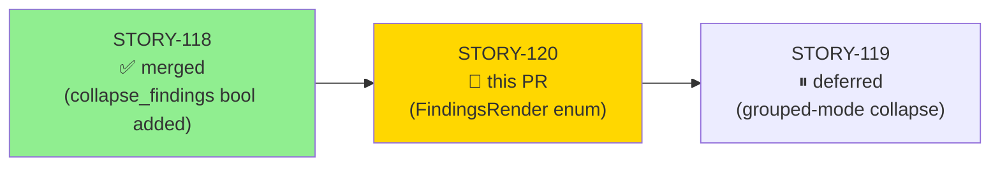
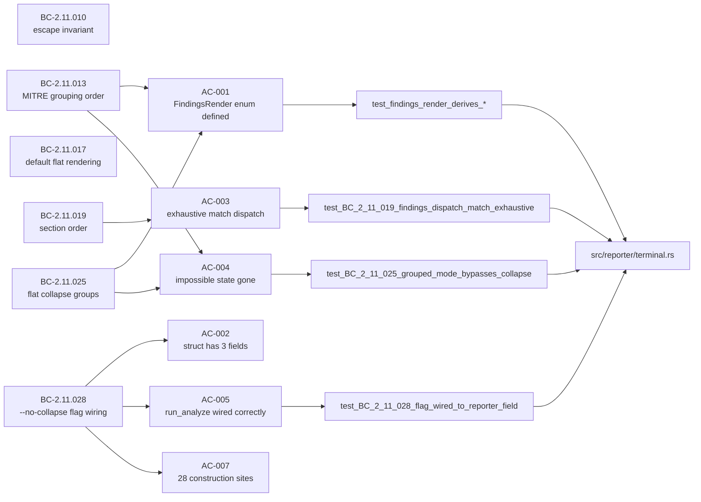
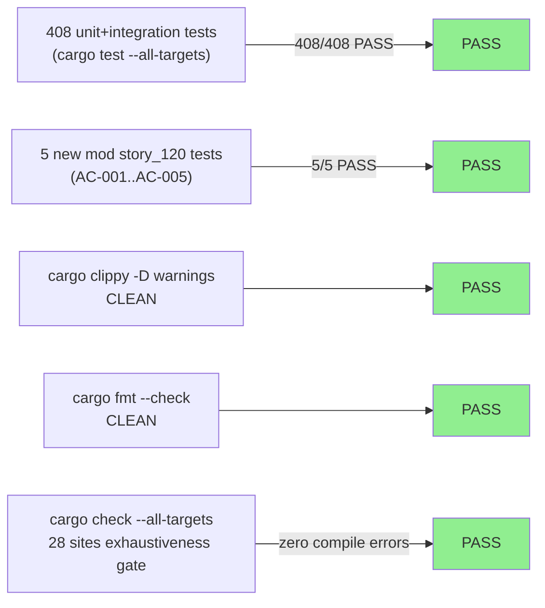
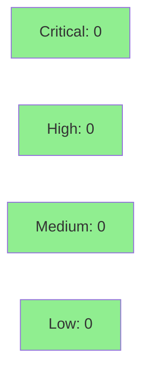

# [STORY-120] TerminalReporter FindingsRender Enum Migration (v0.9.0)

**Epic:** E-8 — TerminalReporter Render-Mode Refactor
**Mode:** feature
**Convergence:** CONVERGED after 3 adversarial passes (fresh-context triple, frozen corpus 864de05; all CLEAN, zero MEDIUM+)


Closes #62. Replaces the two-bool `show_mitre_grouping`/`collapse_findings` fields on
`TerminalReporter` with a single `pub enum FindingsRender { Grouped, FlatCollapsed, FlatExpanded }`,
making the previously-representable illegal state (`show_mitre_grouping = true &&
collapse_findings = true`) structurally unrepresentable. The FINDINGS dispatch `if`-chain
becomes an exhaustive `match`. All 28 construction sites across 6 files are migrated. Terminal
output is byte-identical — this is a pure refactor. Cargo.toml bumps to v0.9.0 (breaking public
struct-field change per RFC 1105; expected `struct_field_missing` via cargo-semver-checks).

---

## Architecture Changes

```mermaid
graph TD
    CLI["src/cli.rs<br/>--mitre / --no-collapse flags<br/>(unchanged)"]
    MAIN["src/main.rs<br/>run_analyze / run_summary<br/>(2 construction sites updated)"]
    ENUM["FindingsRender enum<br/>(NEW — src/reporter/terminal.rs)"]
    REPORTER["TerminalReporter struct<br/>render: FindingsRender<br/>(replaces 2 bool fields)"]
    DISPATCH["render() dispatch<br/>match self.render<br/>(replaces if-chain)"]
    GROUPED["render_findings_grouped()<br/>(unchanged)"]
    COLLAPSED["render_findings_collapsed()<br/>(unchanged)"]
    FLAT["render_finding_flat()<br/>(unchanged)"]

    CLI -->|bool params| MAIN
    MAIN -->|TerminalReporter { render: ... }| REPORTER
    ENUM -.->|new type| REPORTER
    REPORTER --> DISPATCH
    DISPATCH -->|Grouped arm| GROUPED
    DISPATCH -->|FlatCollapsed arm| COLLAPSED
    DISPATCH -->|FlatExpanded arm| FLAT

    style ENUM fill:#90EE90
    style DISPATCH fill:#90EE90
```

<details>
<summary><strong>Architecture Decision Record — ADR-0003 Binding Rule 5</strong></summary>

### ADR: Render-Mode Enum (Issue #62 — v0.9.0)

**Context:** v0.8.0 shipped `TerminalReporter` with four boolean fields. Issue #62's
trigger condition ("when a 3rd render flag is added") fired when STORY-118 added
`collapse_findings`. Two illegal-state violations resulted: (1) `show_mitre_grouping =
true && collapse_findings = true` is a representable struct value silently handled only
by dispatch order; (2) `run_summary` has an inert `collapse_findings: true` with a comment
explaining the value does not matter.

**Decision:** Replace `show_mitre_grouping: bool` + `collapse_findings: bool` with
`render: FindingsRender` — a three-variant enum that makes the mutually-exclusive
rendering modes unrepresentable as invalid combinations.

**Rationale:** Rust's enum + exhaustive match makes impossible states unrepresentable.
The compiler enforces exhaustiveness; no arm can be forgotten. Adding a future variant
forces all call sites to handle it.

**Alternatives Considered:**
1. Keep bools, add a validation assertion — rejected because: the invariant remains
   comment-only; the type still permits the illegal state.
2. Use a separate `RenderMode` newtype wrapping an integer — rejected because: less
   readable than a named enum, no compiler-enforced exhaustiveness.

**Consequences:**
- Positive: impossible state eliminated at the type level; match is exhaustive by
  construction; 28 construction sites are trivially correct by Rust's struct-literal
  exhaustiveness check.
- Trade-off: breaking semver change (v0.8.x → v0.9.0); `cargo-semver-checks` fires
  `struct_field_missing` — this is expected and documented.

</details>

---

## Story Dependencies



**depends_on:** `[]` — STORY-120 refactors `TerminalReporter` already shipped in STORY-077/078/118. No new build-order predecessor.

**blocks:** `[STORY-119]` — STORY-119 (grouped-mode collapse, deferred/unscheduled) builds on the `FindingsRender` enum; no scheduling constraint today.

---

## Spec Traceability



**Full BC traceability:** 12 SS-11 BCs (BC-2.11.010/013/014/015/016/017/019/025/026/027/028/029) all re-anchored to `FindingsRender` enum vocabulary. Every AC cites a BC trace clause. See STORY-120.md for complete BC ↔ AC cross-check.

---

## Test Evidence

### Coverage Summary

| Metric | Value | Threshold | Status |
|--------|-------|-----------|--------|
| Unit tests | 408/408 pass | 100% | PASS |
| New story_120 tests | 5 new (AC-001..AC-005) | — | PASS |
| Regressions | 0 | 0 | PASS |
| Clippy warnings | 0 | 0 | PASS |
| fmt violations | 0 | 0 | PASS |

### Test Flow



| Metric | Value |
|--------|-------|
| **New tests** | 5 added (`mod story_120`), ~26 construction sites modified |
| **Total suite** | 408 tests PASS, 0 failed |
| **Regressions** | 0 |
| **Mutation kill rate** | N/A — evaluated at wave gate |

<details>
<summary><strong>New Tests (mod story_120)</strong></summary>

| Test | AC | Result |
|------|----|--------|
| `test_findings_render_derives_debug_clone_copy_partialeq_eq` | AC-001 | PASS |
| `test_terminal_reporter_struct_has_three_fields` | AC-002 | PASS |
| `test_BC_2_11_019_findings_dispatch_match_exhaustive` | AC-003 | PASS |
| `test_BC_2_11_025_grouped_mode_bypasses_collapse` | AC-004 | PASS |
| `test_BC_2_11_028_flag_wired_to_reporter_field` | AC-005 | PASS |

**All pre-existing tests in reporter_terminal_tests.rs, reporter_tests.rs,
dnp3_f5_remediation_tests.rs, bc_2_09_100_multitag_tests.rs pass unchanged.**

</details>

---

## Demo Evidence

All three `FindingsRender` modes captured against `tests/fixtures/local-samples/modbus-large.pcap`
(85-packet, 5-flow Modbus TCP corpus). All three recordings show correct distinct output;
byte-identical to pre-refactor behavior.

| Recording | Variant | CLI Flag | Key Observable |
|-----------|---------|----------|----------------|
| `AC-003-flat-collapsed.gif` | `FindingsRender::FlatCollapsed` | (none — default) | `(x34)` suffix on write-command group |
| `AC-003-grouped.gif` | `FindingsRender::Grouped` | `--mitre` | Tactic headers + em-dash technique names; no `(xN)` suffix |
| `AC-003-flat-expanded.gif` | `FindingsRender::FlatExpanded` | `--no-collapse` | 34 individual finding headers; distinct TxnID values |

Evidence files at: `.factory/demo-evidence/issue-62-story-120/`

---

## Holdout Evaluation

N/A — evaluated at wave gate (per pipeline convention).

---

## Adversarial Review

| Pass | Lens | Findings | Critical | High | Medium+ | Status |
|------|------|----------|----------|------|---------|--------|
| 1 | behavior-preservation | 0 | 0 | 0 | 0 | CLEAN |
| 2 | construction-site census / scope / semver | 0 | 0 | 0 | 0 | CLEAN |
| 3 | AC-017 doc-sweep / test-quality | 0 | 0 | 0 | 0 | CLEAN |

**Convergence:** All 3 passes CLEAN on frozen corpus (HEAD 864de05). Zero MEDIUM+ findings across all lenses.

---

## Security Review

This PR is a pure internal refactor — it moves data between struct fields and an enum within
a single module (`src/reporter/terminal.rs`). No network I/O, no user input parsing, no
authentication, no cryptography, and no new external dependencies are introduced.



<details>
<summary><strong>Security Scan Details</strong></summary>

### Assessment
- No OWASP Top 10 vectors applicable (CLI tool, no web surface)
- No injection risk (enum dispatch replaces if-chain; no string interpolation)
- No auth changes
- No new crate dependencies (`FindingsRender` uses only stdlib)
- `escape_for_terminal` function unchanged; VP-012 proptest suite still covers it
- `cargo audit` not run (no dependency changes; existing baseline clean)

</details>

---

## Semver / Breaking Change Note

Removing `show_mitre_grouping: bool` and `collapse_findings: bool` (public fields) and
adding `render: FindingsRender` constitutes a breaking struct API change under Cargo semver
(RFC 1105). For a `0.y.z` crate, this requires a minor bump: **v0.8.0 → v0.9.0**.

Running `cargo semver-checks` against a v0.8.x baseline fires `struct_field_missing` for
the two removed fields. **This is expected and correct — not a defect.** The v0.9.0 bump
is the deliberate semver boundary for this breaking change. Documented in ADR-0003 Binding
Rule 5.

---

## Risk Assessment & Deployment

### Blast Radius
- **Systems affected:** `src/reporter/terminal.rs` (SS-11), `src/main.rs` (2 construction sites, SS-12 wiring glue)
- **User impact:** Zero — terminal output is byte-identical to pre-refactor. Pure structural change.
- **Data impact:** None
- **Risk Level:** LOW (pure refactor; behavior preserved by exhaustive match + 408-test regression suite)

### Performance Impact
| Metric | Before | After | Delta | Status |
|--------|--------|-------|-------|--------|
| Dispatch overhead | if-chain (3 branches) | match (3 arms) | negligible | OK |
| Memory | 2 bool fields | 1 enum field (1 byte) | -1 byte per reporter instance | OK |

<details>
<summary><strong>Rollback Instructions</strong></summary>

**Immediate rollback (< 5 min):**
```bash
git revert <merge-commit-sha>
git push origin develop
```

**Verification after rollback:**
- `cargo test --all-targets` passes
- `wirerust analyze --modbus ...` produces expected terminal output

</details>

### Feature Flags
N/A — no feature flags. The change is structural; it takes effect on merge.

---

## Traceability

| BC | Story AC | Test | Status |
|----|---------|------|--------|
| BC-2.11.013 | AC-004, AC-012 | `test_BC_2_11_013_grouped_mode_suffix_free` | PASS |
| BC-2.11.014 | AC-003 | `test_BC_2_11_019_findings_dispatch_match_exhaustive` | PASS |
| BC-2.11.015 | AC-003 | (covered by grouped-mode tests) | PASS |
| BC-2.11.016 | AC-003 | (covered by grouped-mode tests) | PASS |
| BC-2.11.017 | AC-014 | `test_BC_2_11_028_no_collapse_flag_one_line_per_finding` | PASS |
| BC-2.11.019 | AC-003, AC-010 | `test_BC_2_11_019_findings_dispatch_match_exhaustive` | PASS |
| BC-2.11.025 | AC-004, AC-013 | `test_BC_2_11_025_grouped_mode_bypasses_collapse` | PASS |
| BC-2.11.026 | AC-013 | `test_BC_2_11_026_*` suite | PASS |
| BC-2.11.027 | AC-013 | `test_BC_2_11_027_*` suite | PASS |
| BC-2.11.028 | AC-005, AC-006, AC-007 | `test_BC_2_11_028_flag_wired_to_reporter_field` | PASS |
| BC-2.11.029 | AC-008 | `test_BC_2_11_029_*` suite | PASS |
| BC-2.11.010 | AC-015 | `test_BC_2_11_010_escape_in_collapse_path` | PASS |

---

## AI Pipeline Metadata

<details>
<summary><strong>Pipeline Details</strong></summary>

```yaml
ai-generated: true
pipeline-mode: feature
factory-version: "1.0.0"
pipeline-stages:
  spec-crystallization: completed (F1/F2)
  story-decomposition: completed (F3)
  tdd-implementation: completed (F4 RED/GREEN)
  holdout-evaluation: N/A — evaluated at wave gate
  adversarial-review: completed (3/3 CLEAN, fresh-context triple)
  formal-verification: skipped (pure refactor, exhaustiveness by Rust compiler)
  convergence: achieved
convergence-metrics:
  adversarial-passes: 3
  adversarial-verdict: CLEAN (zero MEDIUM+ across all lenses)
  test-pass-rate: 408/408
  implementation-ci: green
story: STORY-120
github-issue: 62
models-used:
  builder: claude-sonnet-4-6
  adversary: claude-sonnet-4-6 (fresh-context)
generated-at: "2026-06-18T00:00:00Z"
```

</details>

---

## Pre-Merge Checklist

- [x] All CI status checks passing (`cargo test`, `cargo clippy -D warnings`, `cargo fmt --check`, action-pin-gate)
- [x] 408/408 tests pass, 0 regressions
- [x] No critical/high security findings (pure refactor, no attack surface)
- [x] Semver bump documented (v0.8.0 → v0.9.0, breaking struct fields removed)
- [x] ADR-0003 Binding Rule 5 subsection in docs/adr/0003-reporting-pipeline-layering.md (rides in this PR)
- [x] Demo evidence recorded for all 3 FindingsRender variants (AC-003)
- [x] AC-017 comment sweep completed (both greps yield only EXEMPT allow-list lines)
- [x] Adversarial convergence: 3/3 CLEAN passes
- [x] No feature flag needed (structural change, byte-identical output)
- [ ] PR reviewer approval
- [ ] CI green on PR
