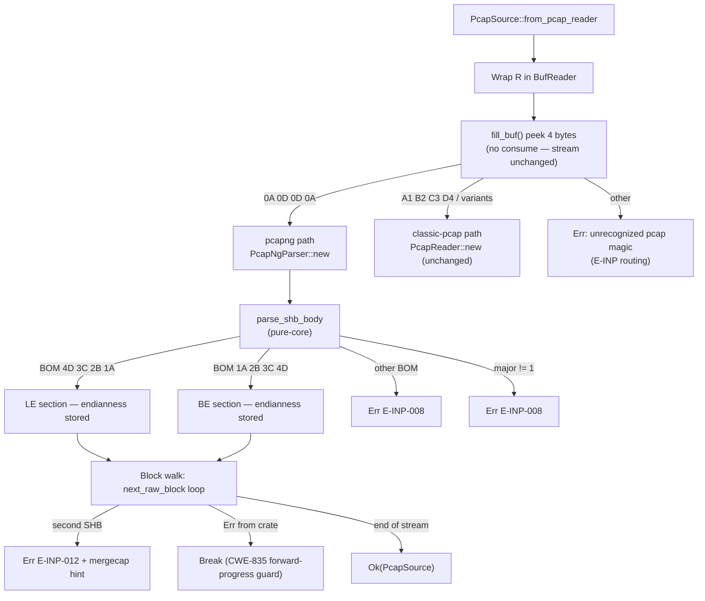
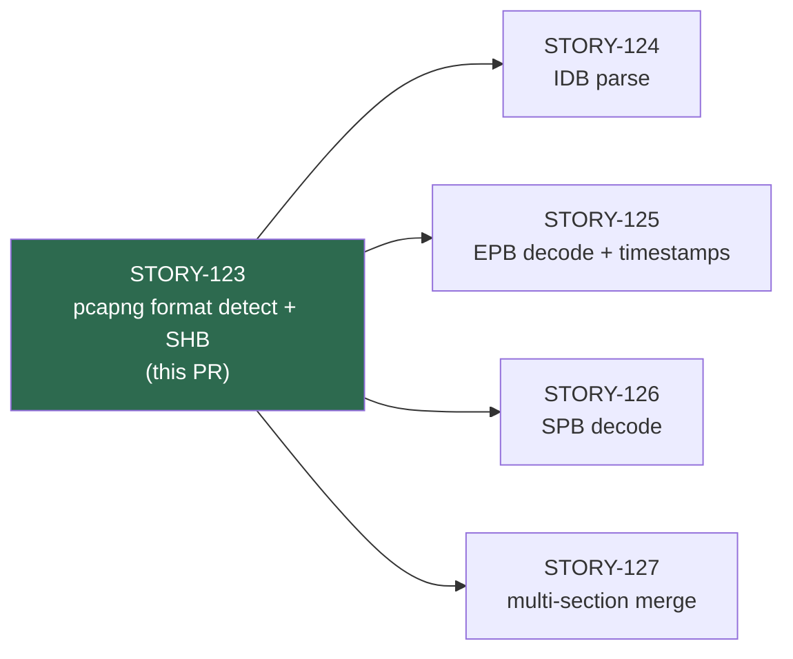
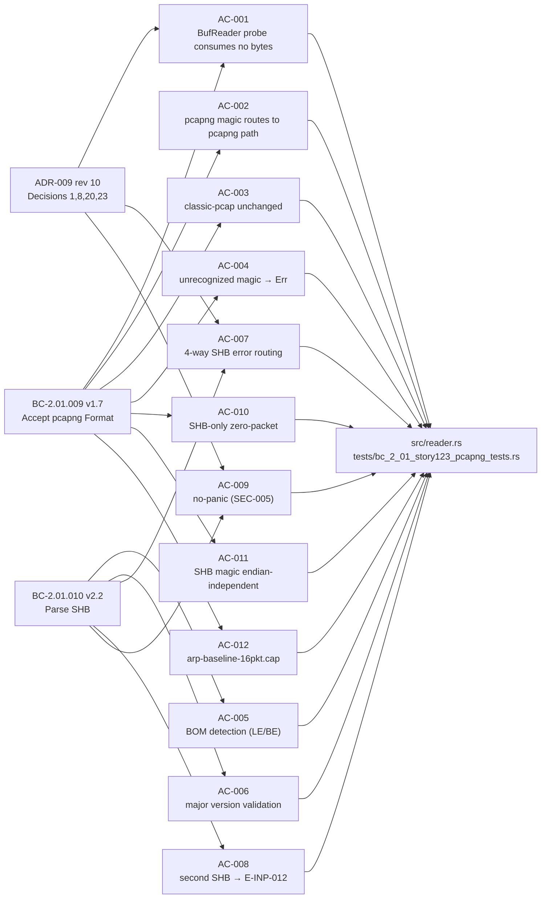

## Summary

Adds pcapng (`.pcapng` / `.cap`) capture-format support to wirerust's packet reader. A non-destructive 4-byte magic-byte probe (`fill_buf()` peek, no `consume()`) routes pcapng vs classic-pcap; the Section Header Block (SHB) is parsed for byte-order (BE/LE) and version. Classic-pcap behavior is fully unchanged and regression-guarded.

This is the foundation story (STORY-123) of Epic E-19, Wave 51 — it must land before STORY-124/125/126/127 (IDB, EPB, SPB, and timestamp-resolution) can be implemented.

**Key facts:**
- 1736 tests pass (`cargo test --all-targets`)
- `cargo clippy --all-targets -- -D warnings` clean
- `cargo fmt --check` clean
- 31/31 pcapng behavioral tests pass (`cargo test --test bc_2_01_story123_pcapng_tests`)
- 3 consecutive CLEAN adversarial passes (BC-5.39.001, D-169)
- +0 new crates (`pcap-file` 2.0.0 was already in Cargo.toml)

---

## Architecture Changes



---

## Story Dependencies



STORY-123 has no `depends_on` — it is the foundation of the pcapng reader stack.

---

## Spec Traceability



---

## Behavioral Contract Coverage

| BC | Version | Clauses Covered |
|----|---------|-----------------|
| BC-2.01.009 | v1.7 | PC1 (pcapng routing), PC2 (classic routing), PC3 (probe consumes no bytes), PC4 (unrecognized magic), PC5 (smb3/arp-baseline.cap fixtures), PC6 (zero-packet notice via main.rs), Inv1 (4-byte peek), Inv3 (probe not duplicated), Inv4 (SHB magic endian-independent), AC-007 (BufReader wrap) |
| BC-2.01.010 | v2.2 | PC1 (canonical BOM table + section-wide endianness), PC2 (major version), PC3 (section_length ignored), PC5 (4-way error routing, Decision 23 btl-degenerate → E-INP-008), AC-002 (second SHB → E-INP-012), Inv4 (section-wide endianness scope) |
| ADR-009 | rev 10 | Decision 1 (raw-block path only, no EnhancedPacketBlock), Decision 8 (forward-progress), Decision 20 (4-way error routing), Decision 23 (first-SHB btl-degenerate → E-INP-008) |

---

## Acceptance Criteria Status

| AC | Description | Test(s) | Status |
|----|-------------|---------|--------|
| AC-001 | BufReader probe consumes no bytes | `test_BC_2_01_009_unbuffered_read_routes_correctly`, `test_BC_2_01_009_pipe_stream_probe_observable` | PASS |
| AC-002 | pcapng magic → pcapng path; smb3.pcapng Ok | `test_BC_2_01_009_smb3_pcapng_accepted`, `test_BC_2_01_009_pcapng_magic_routes_to_pcapng_path` | PASS |
| AC-003 | Classic-pcap path unchanged (regression) | `test_BC_2_01_009_classic_pcap_routing_unchanged`, `test_BC_2_01_009_nanosecond_pcap_routing` | PASS |
| AC-004 | Unrecognized magic → Err | `test_BC_2_01_009_unrecognized_magic`, `test_BC_2_01_009_stream_under_4_bytes` | PASS |
| AC-005 | BOM detection — LE/BE canonical table | `test_BC_2_01_010_bom_little_endian`, `test_BC_2_01_010_bom_big_endian` | PASS |
| AC-006 | Major version != 1 rejected | `test_BC_2_01_010_major_version_not_1_rejected` | PASS |
| AC-007 | 4-way SHB error routing (E-INP-008/010) | `test_BC_2_01_010_shb_body_truncated_e_inp_008`, `test_BC_2_01_010_shb_btl8_maps_to_e_inp_008`, `test_BC_2_01_010_invalid_bom_e_inp_008` | PASS |
| AC-008 | Second SHB → E-INP-012 + mergecap hint | `test_BC_2_01_010_second_shb_rejected_e_inp_012` | PASS |
| AC-009 | No-panic on malformed SHB (SEC-005) | `test_BC_2_01_010_no_panic_fuzz`, `test_BC_2_01_010_no_panic_fuzz_full_pcapng_stream` | PASS |
| AC-010 | SHB-only → Ok with packets.len()==0 | `test_BC_2_01_009_shb_only_zero_packet_notice` | PASS |
| AC-011 | SHB magic endian-independent | Covered by AC-002 + AC-005 BE tests | PASS |
| AC-012 | arp-baseline-16pkt.cap → 16 packets | `test_BC_2_01_009_arp_baseline_cap_accepted` | PASS |

---

## Test Evidence

```
running 31 tests
test test_BC_2_01_009_classic_pcap_skipped_blocks_zero ... ok
test test_BC_2_01_009_shb_only_datalink_null_sentinel ... ok
test test_BC_2_01_004_pcapng_accepted_positive_rewrite ... ok
test test_BC_2_01_009_shb_only_zero_packet_notice ... ok
test test_BC_2_01_009_pipe_stream_probe_observable ... ok
test test_BC_2_01_009_pcapng_magic_endian_independent ... ok
test test_BC_2_01_009_pcapng_magic_routes_to_pcapng_path ... ok
test test_BC_2_01_010_body_empty_returns_err ... ok
test test_BC_2_01_009_stream_under_4_bytes ... ok
test test_BC_2_01_009_unbuffered_read_routes_correctly ... ok
test test_BC_2_01_009_epb_before_idb_e_inp_009 ... ok
test test_BC_2_01_010_body_too_short_15_bytes ... ok
test test_BC_2_01_009_unrecognized_magic ... ok
test test_BC_2_01_010_bom_big_endian ... ok
test test_BC_2_01_009_smb3_pcapng_accepted ... ok
test test_BC_2_01_010_bom_little_endian ... ok
test test_BC_2_01_010_genuine_be_section_end_to_end ... ok
test test_BC_2_01_009_arp_baseline_cap_accepted ... ok
test test_BC_2_01_010_hs103_case_c_e_inp_010 ... ok
test test_BC_2_01_010_invalid_bom_e_inp_008 ... ok
test test_BC_2_01_010_major_version_not_1_rejected ... ok
test test_BC_2_01_010_minor_version_arbitrary_accepted ... ok
test test_BC_2_01_010_second_shb_rejected_e_inp_012 ... ok
test test_BC_2_01_010_section_length_unspecified_accepted ... ok
test test_BC_2_01_010_section_length_zero_accepted ... ok
test test_BC_2_01_010_shb_body_truncated_e_inp_008 ... ok
test test_BC_2_01_010_shb_btl8_maps_to_e_inp_008 ... ok
test test_BC_2_01_009_classic_pcap_routing_unchanged ... ok
test test_BC_2_01_009_nanosecond_pcap_routing ... ok
test test_BC_2_01_010_no_panic_fuzz ... ok
test test_BC_2_01_010_no_panic_fuzz_full_pcapng_stream ... ok

test result: ok. 31 passed; 0 failed; 0 ignored; 0 measured; 0 filtered out; finished in 0.09s

Total suite (cargo test --all-targets): 1736 passed, 0 failed
cargo clippy --all-targets -- -D warnings: CLEAN
cargo fmt --check: CLEAN
```

---

## Demo Evidence

Demo recordings are in `.factory/demo-evidence/STORY-123/` (GIF + WebM + VHS tape source for each):

| Recording | ACs Evidenced | What It Shows |
|-----------|---------------|---------------|
| `AC-001-pcapng-format-detection.gif` | AC-001, AC-002, AC-012 | `wirerust analyze smb3.pcapng` — 54-packet SMB3 real traffic file; previously rejected by magic-byte probe, now routes correctly to pcapng path and produces a full TRIAGE REPORT |
| `AC-002-le-be-endianness.gif` | AC-005, AC-010, AC-011 | Minimal LE and BE pcapng SHB-only files both accepted; BE case is the key correctness story (without the fix, BE btl=28 encoded as `00 00 00 1C` would produce `IncompleteBuffer`) |
| `AC-003-error-path.gif` | AC-004, AC-007 (partial) | Bad-magic input (`DE AD BE EF`) → clean `Err: unrecognized pcap magic` with no panic/crash; same binary immediately accepts valid LE pcapng |

ACs not visually demoed (AC-006, AC-007 full, AC-008, AC-009): these are internal error-taxonomy routing cases where CLI surface presentation is indistinguishable without inspecting the Rust error variant. All 4 are fully covered by the 31-test behavioral suite.

---

## Holdout Evaluation

N/A — evaluated at wave gate (Wave 51).

---

## Adversarial Review

3 consecutive CLEAN passes (BC-5.39.001, D-169, Wave 51). All blocking findings from pass-1 were resolved before this PR was opened:
- F-4: stale ADR-rev references in reader.rs — fixed
- F-6: forward-progress guard (CWE-835 spin protection) in block-walk loop — fixed
- F-8: `saturating_add` for block_seq counter (SEC-005) — fixed
- F-10: invalid-BOM error string formatting + E-INP-008 mapping — fixed

---

## Security Review

This PR adds untrusted-input parsing (capture-file reader). SEC-005 (no panics/OOB/overflow on malformed input) is the relevant policy.

- No `unwrap()`, `expect()`, `panic!()`, or `unreachable!()` in the SHB parse path (AC-009)
- `saturating_add` used for block sequence counter (F-8, SEC-005)
- Forward-progress guard on block-walk loop (F-6, CWE-835)
- Property-test fuzz coverage: `test_BC_2_01_010_no_panic_fuzz` and `test_BC_2_01_010_no_panic_fuzz_full_pcapng_stream` (proptest, arbitrary SHB bytes)
- +0 new crates; only `std::io::BufReader` (stdlib) and `pcap-file` 2.0.0 (already present)

Formal security review findings: see Step 4 output (populated after review).

---

## Risk Assessment

| Dimension | Assessment |
|-----------|------------|
| Blast radius | `src/reader.rs` only (single file, self-contained). No public API surface change (CLI behavior expands: previously-rejected pcapng files now succeed). |
| Classic-pcap regression risk | LOW — classic-pcap path is structurally unchanged; probe branches before any classic-pcap code. Regression-guarded by `test_BC_2_01_009_classic_pcap_routing_unchanged`. |
| Performance impact | Negligible — probe is a 4-byte `BufReader::fill_buf()` peek on first read; no additional allocations on the classic-pcap path. |
| Security | Untrusted input parsing; SEC-005 compliance verified (no panics, bounded iteration, `saturating_add`). Property-test fuzz passes. |

---

## Deferred Findings (tracked, non-blocking)

These are documented deferred findings from the STORY-123 adversarial review (D-169). They are out of scope for this PR and tracked in STATE.md and the story file.

| ID | Description | Owner | Status |
|----|-------------|-------|--------|
| F-2 | EPB padding-overrun check (`captured_len % 4 != 0` → E-INP-008) not implemented — `read_pcapng_crate` only checks `captured_len > available` | STORY-125 / BC-2.01.012 | DEFERRED |
| F-3 | Timestamp decode hardcodes `DEFAULT_TSRESOL=6` (microsecond); does not walk IDB `if_tsresol` options; 1000x error for nanosecond captures | STORY-125 / BC-2.01.014 | DEFERRED |
| F-5 | AC-012 uses SYNTHETIC `arp-baseline-16pkt.cap` fixture (temp_dir); authentic PacketLife capture must replace before Phase-4 | Phase-4 entry gate (DF-VALIDATION-001) | DEFERRED |
| F-7 | `parse_shb_body` (VP-026 Kani target) is NOT on the live decode path — VP-026 may need re-scoping in Phase-6 to cover actual reachable code | Phase-6 formal hardening | OBSERVATION |
| PIPE | `STORY-123-PIPE-FILLBUF-001`: pipe-robustness backlog (non-blocking; no stdin path in CLI) | Backlog | NON-BLOCKING |

---

## AI Pipeline Metadata

| Field | Value |
|-------|-------|
| Pipeline mode | Feature-mode (F3 incremental stories) |
| Story | STORY-123, Epic E-19, Wave 51 |
| Models used | claude-sonnet-4-6 (implementer, test-writer, adversarial review) |
| Adversarial passes | 3x CLEAN (BC-5.39.001) |
| Codebase churn | +2558 lines (+593 src/reader.rs, +1964 tests/bc_2_01_story123_pcapng_tests.rs, -64 tests/bc_2_01_story001_tests.rs) |

---

## Pre-Merge Checklist

- [x] PR description matches actual diff
- [x] All ACs covered by demo evidence or test suite (12/12)
- [x] BC traceability chain complete (BC-2.01.009 v1.7, BC-2.01.010 v2.2, ADR-009 rev 10)
- [x] 31/31 pcapng behavioral tests pass
- [x] 1736 total tests pass (cargo test --all-targets)
- [x] cargo clippy --all-targets -- -D warnings: CLEAN
- [x] cargo fmt --check: CLEAN
- [x] +0 new crates
- [x] No `EnhancedPacketBlock` imports (ADR-009 Decision 1)
- [x] 3x CLEAN adversarial passes (BC-5.39.001)
- [x] No `unwrap()`/`panic!()` in SHB parse path (SEC-005 / AC-009)
- [x] Forward-progress guard (CWE-835, F-6)
- [x] `saturating_add` for block counter (F-8, SEC-005)
- [x] Classic-pcap regression tests pass (AC-003)
- [x] depends_on: [] — no upstream PR dependency
- [ ] AI security review: pending (Step 4)
- [ ] AI PR review: pending (Step 5)
- [ ] CI green: pending (Step 6)
- [ ] Merged: pending (Step 8)
