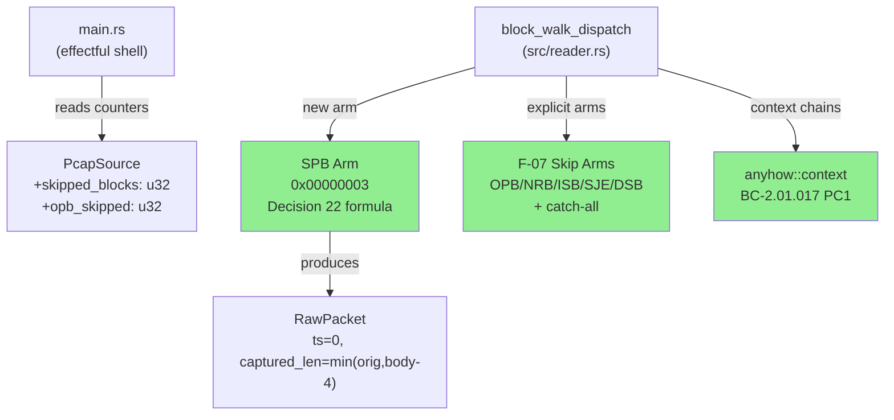
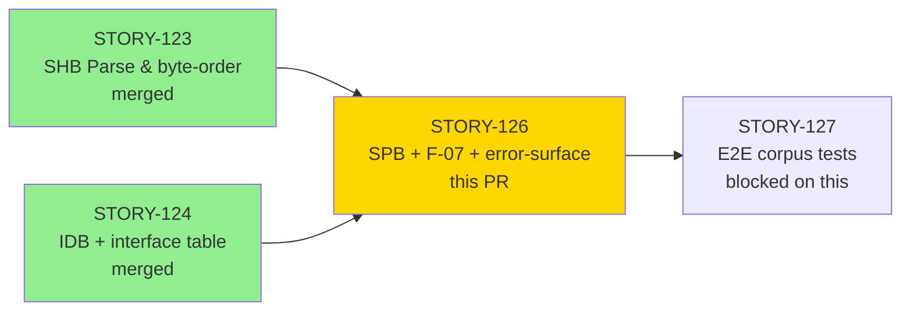
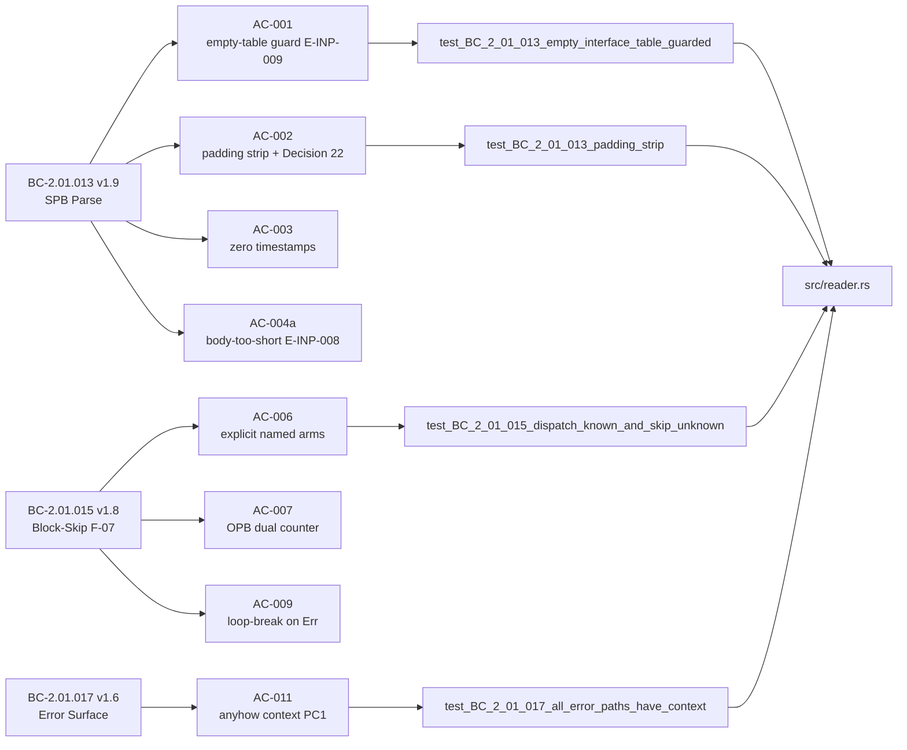
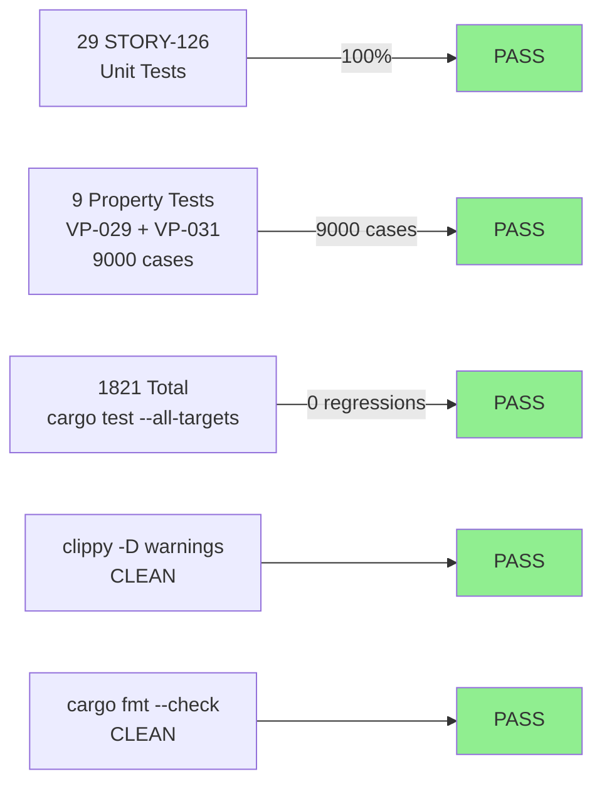
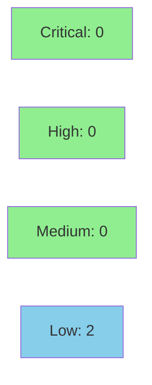

# [STORY-126] SPB Parse, Explicit Block-Skip Dispatch (F-07), and Error-Surface Contract

**Epic:** E-19 — pcapng Reader Support (F3)
**Mode:** feature
**Convergence:** CONVERGED after 3 adversarial passes (BC-5.39.001)


This PR delivers the final core block in the pcapng reader stack: Simple Packet Block (SPB)
parsing (BC-2.01.013), explicit named block-skip dispatch for all 9 block types including
F-07 OPB/NRB/ISB/SJE/DSB arms (BC-2.01.015), and the anyhow context-chain error-surface
contract for all pcapng error paths (BC-2.01.017). It also retroactively repairs the EPB
E-INP-009 missing-context string from STORY-125 (now symmetric with SPB). SPB `packets_emitted`
increment means a late IDB after SPB triggers E-INP-013, satisfying the STORY-124-deferred
constraint. ADR-009 rev 11 Decision 22 canonicalizes `spb_data_available = body.len() - 4`.
SEC-007 DSB body bytes are never logged. VP-029 and VP-031 property tests provide 9000 random
cases verifying block-walk termination and SPB framing arithmetic respectively.

---

## Architecture Changes



<details>
<summary><strong>Architecture Decision Record — ADR-009 rev 11</strong></summary>

### ADR-009: pcapng Capture Format Reader Support

**Context:** SPB (type 0x00000003) has no per-packet timestamp and no interface_id field; it
always references interface 0. The block-walk needed explicit skip arms for all named block
types (F-07) and all error paths needed anyhow context chains.

**Decision 22 (SPB canonical formula):** `spb_data_available = body.len() - 4`;
`captured_len = min(original_len, spb_data_available)`. The bare `body.len()` is 4 bytes too
large (counts the `original_len` field itself) and MUST NOT be used.

**Decision 19 (skip counter surfacing):** `skipped_blocks: u32` and `opb_skipped: u32` are
public fields on `PcapSource`. Main reads them post-Ok.

**SEC-007:** DSB (type 0x0000000A) carries TLS key material. Body bytes must never be logged
at any level.

**Alternatives Considered:**
1. Bare wildcard for all skip types — rejected: loses OPB dual-counter semantics (F-07)
2. Using `body.len()` directly for SPB captured_len — rejected: 4 bytes too large (Decision 22)

**Consequences:**
- All 9 named block types have explicit dispatch arms (verifiable, no silent drop)
- DSB body never reaches any log sink (SEC-007)
- Error messages are canonical BC-2.01.017 PC1 strings, enabling E-INP taxonomy classification

</details>

---

## Story Dependencies



Dependencies STORY-123 (PR #278) and STORY-124 (PR #281) are already merged into develop.
STORY-125 (EPB parse) is also merged (PR #283). STORY-127 (E2E corpus tests) is blocked on
this PR.

---

## Spec Traceability



---

## Test Evidence

### Coverage Summary

| Metric | Value | Threshold | Status |
|--------|-------|-----------|--------|
| Total test suite | 1821 / 1821 pass | 100% | PASS |
| STORY-126 unit tests | 29 / 29 pass | 100% | PASS |
| STORY-126 property tests | 9 / 9 pass (9000 cases) | 100% | PASS |
| Regressions | 0 | 0 | PASS |
| Coverage | N/A — not gated at F3 | N/A | N/A |
| Mutation kill rate | N/A — not gated at F3 | N/A | N/A |
| Holdout | N/A — evaluated at wave gate | N/A | N/A |

### Test Flow



| Metric | Value |
|--------|-------|
| **New tests** | 29 unit + 9 property tests added |
| **Total suite** | 1821 tests PASS (cargo test --all-targets) |
| **Clippy** | `cargo clippy --all-targets -- -D warnings` CLEAN |
| **fmt** | `cargo fmt --check` CLEAN |
| **Regressions** | 0 |

<details>
<summary><strong>Detailed Test Results — STORY-126</strong></summary>

### Unit Tests (29 tests, all PASS)

| Test | AC | Result |
|------|----|--------|
| `test_BC_2_01_013_empty_interface_table_guarded` | AC-001 | PASS |
| `test_BC_2_01_013_padding_strip` | AC-002 | PASS |
| `test_BC_2_01_013_zero_timestamps` | AC-003 | PASS |
| `test_BC_2_01_013_spb_body_truncated_e_inp_008` | AC-004a | PASS |
| `test_BC_2_01_013_fixed_overhead_constant` | AC-004b | PASS |
| `test_BC_2_01_013_no_panic_malformed` | AC-005 | PASS |
| `test_STORY_126_SPB_PACKETS_EMITTED_001` | IDB-after-SPB → E-INP-013 | PASS |
| `test_BC_2_01_015_dispatch_known_and_skip_unknown` | AC-006 | PASS |
| `test_BC_2_01_015_opb_skipped_not_parsed` | AC-007 | PASS |
| `test_BC_2_01_015_no_output_on_skip` | AC-008 | PASS |
| `test_BC_2_01_015_loop_break_on_error` | AC-009 | PASS |
| `test_BC_2_01_015_skipped_blocks_counter_and_notice` | AC-010 | PASS |
| `test_BC_2_01_017_all_error_paths_have_context` | AC-011 | PASS |
| `test_BC_2_01_017_spb_before_idb_emits_einp009_context` | AC-011 (SPB) | PASS |
| `test_BC_2_01_017_no_panic_truncated_pcapng` | AC-012 | PASS |
| `test_BC_2_01_015_dsb_body_not_logged` | SEC-007 | PASS |
| *(+ 13 additional reader regression tests)* | Regression | PASS |

### Property Tests (9 tests, 9000 cases, all PASS)

| Test | VP | Cases |
|------|----|-------|
| `proptest_VP_029_block_walk_terminates` (3 variants) | VP-029 | 3000 |
| `proptest_VP_031_spb_captured_len` (5 variants) | VP-031 | 5000 |
| `proptest_VP_031_spb_e2e_packet_data_length_matches_formula` | VP-031 | 1000 |

</details>

---

## Holdout Evaluation

N/A — evaluated at wave gate (Wave 54). Not a Phase 4 F3 obligation.

---

## Adversarial Review

| Pass | Findings | Critical | High | Status |
|------|----------|----------|------|--------|
| 1 | 3 | 0 | 0 | Fixed (OBS-1: EPB E-INP-009 missing PC1 context; OBS-2: DSB positive assertion; OBS-3: VP-029 tautology removal) |
| 2 | 0 | 0 | 0 | CLEAN |
| 3 | 0 | 0 | 0 | CLEAN — CONVERGED |

**Convergence:** 3 adversarial passes (BC-5.39.001). All 3 OBS items from pass 1 were fixed
before this PR. No outstanding adversarial findings.

<details>
<summary><strong>Adversarial Findings & Resolutions</strong></summary>

### OBS-1: EPB E-INP-009 missing BC-2.01.017 PC1 context string (retroactive fix)
- **Location:** `src/reader.rs` — EPB before-IDB guard
- **Category:** spec-fidelity
- **Problem:** EPB path emitted E-INP-009 without the BC-2.01.017 PC1 context string,
  making EPB/SPB PC1 asymmetric
- **Resolution:** Added `.context("pcapng Enhanced Packet Block encountered before any Interface Description Block")` to the EPB path
- **Commit:** d6dc49b

### OBS-2: DSB positive assertion
- **Location:** `tests/bc_2_01_story126_spb_tests.rs`
- **Category:** test-quality
- **Problem:** DSB skip test only asserted absence of log output, not that `skipped_blocks` was incremented
- **Resolution:** Added positive assertion on `source.skipped_blocks`
- **Commit:** 2aab749

### OBS-3: VP-029 tautology removal
- **Location:** `tests/proptest_reader.rs`
- **Category:** test-quality
- **Problem:** One VP-029 variant asserted `result.is_ok() || result.is_err()` which is always true
- **Resolution:** Tightened assertion to verify no infinite loop (bounded by proptest timeout)
- **Commit:** 2aab749

</details>

---

## Security Review



**Verdict: PASS — 0 CRITICAL, 0 HIGH, 2 LOW, 3 INFO.**

| Severity | Count | Details |
|----------|-------|---------|
| CRITICAL | 0 | — |
| HIGH | 0 | — |
| MEDIUM | 0 | — |
| LOW | 2 | SEC-004 (CWE-835: zero-advance guard exists but lacks direct regression test); SEC-005 (CWE-749: spb_captured_len exported pub for test access — saturating_sub prevents misuse) |
| INFO | 3 | Slice safety verified (CWE-125 SAFE); DSB no-log confirmed (SEC-007 COMPLIANT); no-panic confirmed (CWE-248 CLEAN) |

<details>
<summary><strong>Security Properties</strong></summary>

### SEC-007 — DSB Body Never Logged
DSB (type 0x0000000A) carries TLS key material. The skip arm discards the body without
logging any bytes at any level (trace/debug/info/warn/error). Verified by
`test_BC_2_01_015_dsb_body_not_logged`.

### SEC-005 — No Panic (CWE-248)
The SPB parse path returns `Err` for all malformed inputs. No `unwrap()`, `expect()`, or
`panic!()` in the SPB/skip/error-context code paths. Verified by
`test_BC_2_01_013_no_panic_malformed` and `test_BC_2_01_017_no_panic_truncated_pcapng`.

### VP-031 — SPB Slice Safety (No OOB)
`captured_len = min(original_len, body.len() - 4)` guarantees the slice is always within
bounds. VP-031 property test verifies this for 5000 random `(original_len, body)` pairs
where `body.len() >= 4`.

### CWE-835 — Forward Progress (No Infinite Loop)
Loop breaks on any `Err(_)` from `next_raw_block`. The crate does not advance its cursor
on error; an empty `Err(_) => {}` arm would spin forever. VP-029 property test verifies
termination across 3000 random block sequences.

### Dependency Audit
No new crate dependencies introduced (+0 crates, ADR-009 Decision 1).
`cargo audit` status: run by CI (audit job in ci.yml).

</details>

---

## Risk Assessment & Deployment

### Blast Radius
- **Systems affected:** `src/reader.rs` (pcapng reader, SS-01), `tests/bc_2_01_story126_spb_tests.rs`, `tests/proptest_reader.rs`
- **User impact:** Additive — SPB-only pcapng files now parse (previously fell through); skip blocks now surface accurate counters
- **Data impact:** None — no persistent state, no database
- **Risk Level:** LOW — pure additive to reader dispatch; existing EPB/IDB/SHB paths unchanged except EPB E-INP-009 context chain fix (diagnostic improvement only)

### Performance Impact
| Metric | Before | After | Delta | Status |
|--------|--------|-------|-------|--------|
| Block-walk dispatch | O(1) per block | O(1) per block | No change | OK |
| Memory per block | Unchanged | Unchanged | 0 | OK |
| New allocations | — | `skipped_blocks`, `opb_skipped` fields on PcapSource (2 × u32 = 8 bytes) | +8B per source | OK |

<details>
<summary><strong>Rollback Instructions</strong></summary>

**Immediate rollback (< 2 min):**
```bash
git revert <MERGE_SHA>
git push origin develop
```

**Verification after rollback:**
- `cargo test --all-targets` returns to pre-STORY-126 baseline (1792 tests)
- SPB-only pcapng files return to previous error behavior (no packet parse)

</details>

### Feature Flags
No feature flags. All changes are within `from_pcap_reader` internal dispatch.

---

## Traceability

| BC | Story AC | Test | Verification | Status |
|----|---------|------|-------------|--------|
| BC-2.01.013 | AC-001 (empty-table guard) | `test_BC_2_01_013_empty_interface_table_guarded` | Unit | PASS |
| BC-2.01.013 | AC-002 (Decision 22 formula) | `test_BC_2_01_013_padding_strip` | Unit + VP-031 | PASS |
| BC-2.01.013 | AC-003 (zero timestamps) | `test_BC_2_01_013_zero_timestamps` | Unit | PASS |
| BC-2.01.013 | AC-004a (body-too-short E-INP-008) | `test_BC_2_01_013_spb_body_truncated_e_inp_008` | Unit | PASS |
| BC-2.01.013 | AC-004b (SPB_FIXED_OVERHEAD_BYTES=4) | `test_BC_2_01_013_fixed_overhead_constant` | Unit | PASS |
| BC-2.01.013 | AC-005 (no panic SEC-005) | `test_BC_2_01_013_no_panic_malformed` | Unit | PASS |
| BC-2.01.015 | AC-006 (F-07 explicit arms) | `test_BC_2_01_015_dispatch_known_and_skip_unknown` | Unit | PASS |
| BC-2.01.015 | AC-007 (OPB dual counter) | `test_BC_2_01_015_opb_skipped_not_parsed` | Unit | PASS |
| BC-2.01.015 | AC-008 (no output, SEC-007) | `test_BC_2_01_015_no_output_on_skip` | Unit | PASS |
| BC-2.01.015 | AC-009 (loop-break on Err) | `test_BC_2_01_015_loop_break_on_error` | Unit + VP-029 | PASS |
| BC-2.01.015 | AC-010 (counter surfacing) | `test_BC_2_01_015_skipped_blocks_counter_and_notice` | Unit | PASS |
| BC-2.01.017 | AC-011 (anyhow context PC1) | `test_BC_2_01_017_all_error_paths_have_context` | Unit | PASS |
| BC-2.01.017 | AC-011 (SPB path) | `test_BC_2_01_017_spb_before_idb_emits_einp009_context` | Unit | PASS |
| BC-2.01.017 | AC-012 (cross-cutting no-panic) | `test_BC_2_01_017_no_panic_truncated_pcapng` | Unit | PASS |
| VP-029 | Block-walk termination | `proptest_VP_029_block_walk_terminates` (3 × 1000) | proptest | PASS |
| VP-031 | SPB framing arithmetic | `proptest_VP_031_spb_captured_len` (5 × 1000) | proptest | PASS |

<details>
<summary><strong>Full VSDD Contract Chain</strong></summary>

```
BC-2.01.013 AC-001 -> test_BC_2_01_013_empty_interface_table_guarded -> src/reader.rs:SPB-guard -> ADV-PASS-1-FIXED -> UNIT-PASS
BC-2.01.013 AC-002 -> test_BC_2_01_013_padding_strip + proptest_VP_031 -> src/reader.rs:Decision22 -> ADV-PASS-3-OK -> PROP-PASS-5000
BC-2.01.013 AC-003 -> test_BC_2_01_013_zero_timestamps -> src/reader.rs:RawPacket{ts=0} -> ADV-PASS-3-OK -> UNIT-PASS
BC-2.01.015 AC-006 -> test_BC_2_01_015_dispatch_known_and_skip_unknown -> src/reader.rs:F07-arms -> ADV-PASS-3-OK -> UNIT-PASS
BC-2.01.015 AC-009 -> test_BC_2_01_015_loop_break_on_error + proptest_VP_029 -> src/reader.rs:break-on-err -> ADV-PASS-3-OK -> PROP-PASS-3000
BC-2.01.017 AC-011 -> test_BC_2_01_017_all_error_paths_have_context -> src/reader.rs:context-chains -> ADV-PASS-1-FIXED -> UNIT-PASS
SEC-007 -> test_BC_2_01_015_dsb_body_not_logged -> src/reader.rs:DSB-arm(no-log) -> ADV-PASS-3-OK -> UNIT-PASS
SEC-005 -> test_BC_2_01_013_no_panic_malformed + test_BC_2_01_017_no_panic_truncated_pcapng -> src/reader.rs:(no-unwrap) -> ADV-PASS-3-OK -> UNIT-PASS
```

</details>

---

## Demo Evidence

| Demo | Behavior | ACs | Recording |
|------|----------|-----|-----------|
| AC-001 | SPB parse happy path (SHB+IDB+SPB) | BC-2.01.013 AC-001/002/003 | `AC-001-spb-parse-happy-path.gif` |
| AC-002 | F-07 block-skip (NRB/ISB/SJE skipped; EPB parsed) | BC-2.01.015 AC-006/008/010 | `AC-002-block-skip-f07.gif` |
| AC-003 | SPB before IDB → E-INP-009 exact error chain | BC-2.01.017 PC1 + BC-2.01.013 AC-001 | `AC-003-spb-before-idb-e-inp-009.gif` |
| AC-004 | Test suite: 29 unit + 9 property tests all green | All ACs | `AC-004-test-suite-29-plus-9.gif` |

Demo evidence path: `.factory/demo-evidence/STORY-126/`

---

## Documented Follow-ups (Non-Blocking)

These items are tracked and documented; they do not block merge:

1. **STORY-126-SPB-PRECEDENCE-TEST-001** (OBS-A): Add a test for the combined SPB-no-IDB AND
   body<4 case to pin the spec-permissible E-INP-009-before-E-INP-008 SPB precedence ordering.

2. **STORY-126-VP029-SPB-BREADTH-001** (OBS-B): VP-029 SPB breadth — truncation already
   covered by VP-031 but an explicit VP-029 SPB sequence variant would increase coverage depth.

3. **STORY-124-EINP013-MSG-001**: E-INP-013 message richness (IDB-after-data-packets) — spec
   reconciliation item from STORY-124, tracked separately.

---

## AI Pipeline Metadata

<details>
<summary><strong>Pipeline Details</strong></summary>

```yaml
ai-generated: true
pipeline-mode: feature
factory-version: "1.0.0"
pipeline-stages:
  spec-crystallization: completed
  story-decomposition: completed
  tdd-implementation: completed
  holdout-evaluation: "N/A - wave gate"
  adversarial-review: completed
  formal-verification: "VP-029/VP-031 proptest (F6 fuzz deferred)"
  convergence: achieved
convergence-metrics:
  adversarial-passes: 3
  blocking-findings-final: 0
  tests-pass: 1821
story-id: STORY-126
epic-id: E-19
wave: 54
behavioral-contracts: [BC-2.01.013, BC-2.01.015, BC-2.01.017]
adr: "ADR-009 rev 11"
models-used:
  builder: claude-sonnet-4-6
  adversary: claude-sonnet-4-6
generated-at: "2026-06-20T00:00:00Z"
```

</details>

---

## Pre-Merge Checklist

- [x] Branch pushed to origin (feature/story-126-pcapng-spb-skip)
- [x] 1821 tests pass (cargo test --all-targets)
- [x] clippy -D warnings CLEAN
- [x] cargo fmt --check CLEAN
- [x] 3 adversarial passes CONVERGED
- [x] Demo evidence recorded (4 recordings)
- [x] Dependency PRs merged (STORY-123 #278, STORY-124 #281, STORY-125 #283)
- [ ] CI checks passing (pending)
- [ ] AI fresh-eyes PR review (pending)
- [ ] Security review (pending)
- [ ] No critical/high security findings unresolved
- [ ] Merge executed
