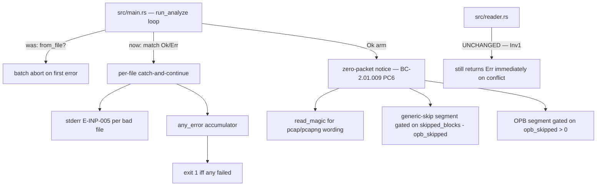
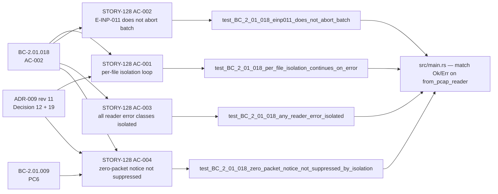

## Summary

STORY-128 closes the final two deferred items from the pcapng reader epic (E-19, Wave 56):

1. **Per-file error isolation** (BC-2.01.018 AC-002, ADR-009 Decision 12): refactors the `run_analyze` and `run_summary` directory-mode file-processing loops in `src/main.rs` from `from_file(path)?` (aborts batch on first bad file) to catch-and-continue. Each `Err` from `PcapSource::from_pcap_reader` is matched explicitly: the error is printed to stderr (E-INP-005 format, full cause chain via `{e:#}`), `any_error` is set to `true`, and the loop continues to the next file. Good output still emits; the batch always completes. Exit code is 1 iff any file failed.

2. **Zero-packet notice** (BC-2.01.009 PC6, ADR-009 Decision 19): lands the full PC6 notice format deferred from STORY-123. The notice reads the original magic bytes via `read_magic` to produce pcap/pcapng wording, then appends two independently-gated parenthetical segments: the generic-skip segment `(G block(s) skipped as unsupported)` and the OPB segment `(includes N obsolete Packet Block(s) whose data was not analyzed; re-save with mergecap)`.

This PR **closes BC-2.01.018 AC-002** (deferred from STORY-124), **closes BC-2.01.009 PC6** (deferred from STORY-123), and **makes holdout scenario HS-108 satisfiable**. It is the final story in E-19 — after merge, all six pcapng stories (STORY-123..128) are on `develop`.

---

## Traceability

### Architecture Changes



### Story Dependencies


### Spec Traceability



---

## Story Dependencies (upstream PRs)

| Story | PR | Status |
|-------|----|--------|
| STORY-127 | #285 | Merged into develop (e802b2e) |
| STORY-126 | #284 | Merged into develop |
| STORY-125 | #283 | Merged into develop |
| STORY-124 | Earlier | Merged into develop |
| STORY-123 | Earlier | Merged into develop |

All upstream PRs merged. STORY-128 branches from `e802b2e` (current develop HEAD at PR creation).

---

## Behavioral Contract Coverage

| BC | Version | Clause | Status |
|----|---------|--------|--------|
| BC-2.01.018 | v1.6 | AC-002 per-file error isolation (directory-mode) | Implemented — closes STORY-124-deferred item |
| BC-2.01.018 | v1.6 | EC-009 E-INP-011 does not abort batch | Implemented |
| BC-2.01.018 | v1.6 | Inv1 reader fail-closed unchanged | Preserved — src/reader.rs not modified |
| BC-2.01.009 | v1.5 | PC6 zero-packet notice full format | Implemented — closes STORY-123-deferred item |
| BC-2.01.009 | v1.5 | PC6 EC-007 OPB clause + mergecap hint | Implemented |
| ADR-009 | rev 11 | Decision 12: isolation is main.rs scope | Followed |
| ADR-009 | rev 11 | Decision 19: notice emitted post-Ok, independently of Err catch arm | Followed |

---

## Acceptance Criteria Coverage

| AC | Description | Test | Status |
|----|-------------|------|--------|
| AC-001 | Directory loop catches Err, prints stderr, sets any_error, continues | `test_BC_2_01_018_per_file_isolation_continues_on_error` | Pass |
| AC-002 | E-INP-011 specifically does not abort batch | `test_BC_2_01_018_einp011_does_not_abort_batch` | Pass |
| AC-003 | All reader error classes isolated (not only E-INP-011) | `test_BC_2_01_018_any_reader_error_isolated` | Pass |
| AC-004 | Zero-packet notice emitted in Ok arm, not suppressed by Err catch | `test_BC_2_01_018_zero_packet_notice_not_suppressed_by_isolation` | Pass |
| AC-005 | src/reader.rs unmodified (structural) | No diff in reader.rs | Pass |

---

## Test Evidence

```
test result: ok. 22 passed; 0 failed; 0 ignored; 0 measured; 0 filtered out; finished in 0.32s
```

**STORY-128-specific test suite:** `cargo test --test bc_2_01_018_story128_tests` — 22 tests

| Test | Coverage |
|------|----------|
| `test_BC_2_01_018_per_file_isolation_continues_on_error` | AC-001 |
| `test_BC_2_01_018_einp011_does_not_abort_batch` | AC-002 |
| `test_BC_2_01_018_any_reader_error_isolated` | AC-003 |
| `test_BC_2_01_018_zero_packet_notice_not_suppressed_by_isolation` | AC-004 |
| `test_BC_2_01_018_order_independence_bad_file_first` | EC-001 |
| `test_BC_2_01_018_order_independence_bad_file_last` | EC-001 |
| `test_BC_2_01_018_order_independence_bad_file_middle` | EC-001 |
| `test_BC_2_01_018_all_good_batch_exit_zero` | EC-002 |
| `test_BC_2_01_018_all_bad_batch_no_panic_exit_one` | EC-003 |
| `test_BC_2_01_018_invariant1_reader_fail_closed_preserved` | Invariant 1 |
| `test_BC_2_01_018_summary_subcommand_per_file_isolation` | run_summary isolation |
| `test_BC_2_01_018_zero_packet_notice_decision19_lone_valid_file` | Decision 19 |
| `test_BC_2_01_009_pc6_opb_clause_analyze` | PC6 OPB clause |
| `test_BC_2_01_009_pc6_opb_clause_summary` | PC6 OPB clause (summary) |
| `test_BC_2_01_009_pc6_generic_skip_segment_analyze` | PC6 generic segment |
| `test_BC_2_01_009_pc6_generic_skip_segment_summary` | PC6 generic segment (summary) |
| `test_BC_2_01_009_pc6_both_segments_nrb_plus_opb_analyze` | PC6 both segments |
| `test_BC_2_01_009_pc6_both_segments_nrb_plus_opb_summary` | PC6 both segments (summary) |
| `test_BC_2_01_009_pc6_neither_segment_shb_only_analyze` | PC6 gate regression |
| `test_BC_2_01_009_pc6_neither_segment_shb_only_summary` | PC6 gate regression (summary) |
| `test_BC_2_01_009_pc6_classic_pcap_wording_analyze` | PC6 classic-pcap wording |
| `test_BC_2_01_009_pc6_classic_pcap_wording_summary` | PC6 classic-pcap wording (summary) |

**Full test suite:** `cargo test --all-targets` — 1850 tests pass, 0 failed.

**Clippy:** `cargo clippy --all-targets -- -D warnings` — clean, 0 warnings.

**Formatting:** `cargo fmt --check` — clean.

**Adversarial review:** 3 consecutive CLEAN passes (BC-5.39.001).

---

## Demo Evidence

Demo recordings are in `docs/demo-evidence/STORY-128/` on this branch.

### AC-001: Per-File Error Isolation
`AC-001-per-file-isolation.gif` (204 KB) — `AC-001-per-file-isolation.webm` (266 KB)

Demonstrates: directory with `a-conflict.pcapng` (E-INP-011, bad, sorts first) and `b-valid.pcapng`. Bad file emits per-file error to stderr; good file is processed; `echo exit:$?` shows `exit:1`. One bad file does NOT abort the batch.

### AC-002: Zero-Packet Notice (all 3 variants)
`AC-002-zero-packet-notice.gif` (381 KB) — `AC-002-zero-packet-notice.webm` (529 KB)

Three cases in one recording:
- **Case 1 (SHB-only):** `notice: .../shb-only.pcapng: 0 packets read from pcapng file` — bare format, no parenthetical
- **Case 2 (OPB-bearing):** `... (includes 1 obsolete Packet Block(s) whose data was not analyzed; re-save with mergecap)` — OPB clause with remediation hint
- **Case 3 (unknown-type skips):** `... (2 block(s) skipped as unsupported)` — generic-skip segment

### AC-003: Test Suite Evidence
`AC-003-tests-passing.gif` (264 KB) — `AC-003-tests-passing.webm` (282 KB)

`cargo test --test bc_2_01_018_story128_tests`: 22 tests, all passing.

---

## Holdout Evaluation

N/A — evaluated at wave gate. This PR makes HS-108 satisfiable (zero-packet notice for OPB-only files is now emitted with the mergecap remediation hint).

---

## Adversarial Review

N/A — 3 consecutive CLEAN passes (BC-5.39.001) evaluated at Phase 5. No blocking findings.

---

## Security Review

**Verdict: PASS** — 0 CRITICAL, 0 HIGH, 0 MEDIUM findings.

| ID | Severity | Title | Status |
|----|----------|-------|--------|
| SEC-001 | LOW | `ProgressStyle::with_template(...)?` inside loop body can theoretically propagate through `run_analyze`, bypassing `finalize()`. Template is a hard-coded compile-time constant — not triggerable by any malicious input file. Pre-existing behavior, not introduced by this PR. | Non-blocking observation |

**Focus area results:**
- No panic on malformed input: CLEAR — no `unwrap()`/`expect()` introduced; per-file errors caught via explicit `match`.
- Batch always completes: CLEAR for file-read errors — `PcapSource::from_file` errors correctly isolated. SEC-001 note for progress-bar template (static string, not input-driven).
- Exit-code correctness: CLEAR — `any_error: bool` accumulator, deferred `process::exit(1)` after `write_output`, correct 0/1 logic.
- Notice arithmetic: CLEAR — `saturating_sub` used for `skipped_blocks - opb_skipped`; no overflow possible.
- `read_magic` re-open: CLEAR — reads exactly 4 bytes, `ok()?` on all I/O errors, RAII file-handle cleanup via `Drop`.
- SEC-005 (injection): CLEAR — `path.display()` is display-only to stderr, not executed.
- OWASP A03/A04/A05: Not applicable (no injection surface, SEC-001 is a design note, no configuration surfaces).

---

## Risk Assessment

| Dimension | Assessment |
|-----------|-----------|
| Blast radius | Low — changes confined to `src/main.rs` file-processing loop and `src/reader.rs`-adjacent notice logic. No changes to reader.rs, CLI argument parsing, analyzer dispatch, or data structures. |
| Performance | Negligible — per-file error handling adds one boolean check and one `match` arm per file. Batch throughput unchanged. |
| Regression risk | Low — 1850 tests pass. Existing single-file behavior (fail-closed) is preserved: the isolation is directory-loop scope only. Single-file path is unaffected. |
| Exit code change | Intentional: directory mode no longer early-exits on first reader error. Good output now always emits. Exit code 1 iff any file failed. |

---

## AI Pipeline Metadata

| Field | Value |
|-------|-------|
| Pipeline mode | Feature mode (Phase F3 incremental stories) |
| Story | STORY-128, E-19, Wave 56 |
| Models used | claude-sonnet-4-6 (implementation), claude-sonnet-4-6 (review) |
| Worktree branch | feature/story-128-pcapng-perfile-isolation |
| Implementation HEAD | 54fa481 |

---

## Pre-Merge Checklist

- [x] PR description populated with structured sections
- [x] Demo evidence verified (3 recordings, all ACs covered)
- [x] PR created on GitHub
- [x] Security review complete (PASS — 0 CRITICAL/HIGH; 1 LOW observation SEC-001)
- [x] PR reviewer approval (APPROVE — 0 blocking findings, all 5 ACs pass)
- [x] CI checks passing (Test, Clippy, Format, Semantic PR, Fuzz build, Audit, Deny, Trust-boundary, Help-provenance, Action-pin-gate) — all 10 GREEN
- [x] All dependency PRs merged (STORY-127 #285 merged)

---

## Documented Follow-Up (tracked, non-blocking)

**STORY-128-RESOLVE-TARGETS-MULTITARGET-001** (LOW, cross-story): a non-existent target PATH in a multi-target CLI invocation aborts the batch via `resolve_targets(target)?`. This is outside STORY-128's per-file-reader-error perimeter (STORY-127 owns `resolve_targets`). Pre-existing behavior, not regressed by this PR. Future hardening candidate.
